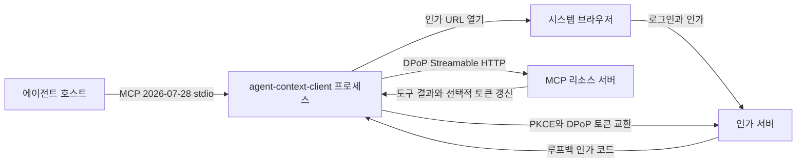
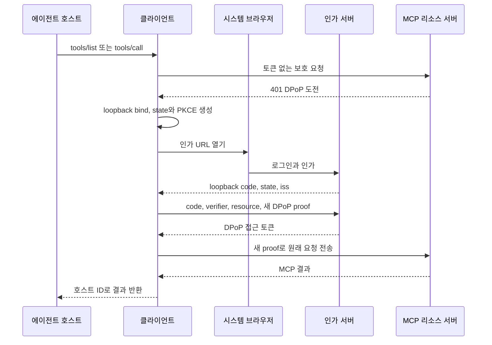

# 에이전트 컨텍스트 MCP 클라이언트 상세 설계서

## 문서 정보

| 항목 | 내용 |
|------|------|
| 문서 상태 | 확정 |
| 최종 수정일 | 2026-09-30 |
| 서비스 식별자 | `AGENT_CONTEXT_CLIENT` |
| 기준 요구사항 | `SRS.md`의 `FR-AGENT_CONTEXT_CLIENT-001`~`035`, `NFR-AGENT_CONTEXT_CLIENT-001`~`016` |
| 정본 연동 계약 | `../agent-context/SRS.md`, `../agent-context/SDD.md` |
| 구현 기준 | Go `1.27.1`, MCP `2026-07-28`을 지원하는 공식 MCP Go SDK |

이 문서는 클라이언트 상세 설계의 정본으로, 확정된 `SRS.md`를 구현 가능한 구조와 처리 흐름으로 구체화한다. 요구사항, 도구 13종의 도메인 의미, 서버 오류와 서비스 전용 DPoP 인증 프로필은 변경하지 않는다. 외부 규약의 근거는 `reference.md`를 따르고, 서버와 중복되는 공개 계약은 서버 SRS와 SDD를 정본으로 참조한다. 구현 단계와 진행 상태는 `DEVELOPMENT_PLAN.md`가 소유한다.

## 설계 목표와 원칙

- 호스트 경계에서는 MCP `2026-07-28` `stdio` 서버로, 원격 경계에서는 같은 revision의 무상태 Streamable HTTP 클라이언트로 동작한다.
- 원격 도구 결과는 해석하거나 재구성하지 않고, 로컬 정책과 `created_by_agent` 주입에 필요한 최소 변환만 수행한다.
- 인증 정보, DPoP 개인 키, PKCE 값과 컨텍스트 본문은 프로세스 수명을 넘기거나 관측 출력에 포함하지 않는다.
- 원격 서버의 권한, 버전 충돌, 검색, 절단과 도메인 오류 판단을 클라이언트가 대신하지 않는다.
- 모든 대기열, 본문과 동시 실행 수에 SRS의 고정 상한을 적용하고 무제한 구성은 제공하지 않는다.
- 호스트 요청 하나를 논리적 호출 하나로 정의하고, 인증 재전송과 전송 재시도 전체에서 상관관계와 쓰기 멱등성 키를 유지한다.

## 시스템 컨텍스트와 실행 형상

다음 다이어그램은 한 클라이언트 프로세스의 신뢰 경계와 데이터 이동을 나타낸다. 웹 관리 기능과 서버 내부 검색·평가 기능은 이 경계에 포함하지 않는다.



### 명령과 배포 단위

| 항목 | 설계 |
|------|------|
| Go 명령 경로 | `client/cmd/client` |
| 배포 실행 파일명 | `agent-context-client` |
| 호스트 실행 명령 | `agent-context-client serve` |
| 진단 명령 | `agent-context-client doctor`, JSON 출력은 `agent-context-client doctor --json` |
| 런타임 상태 | 메모리에만 보관하며 파일이나 데이터베이스를 만들지 않음 |
| 표준 출력 | `serve`에서는 MCP 메시지 전용, `doctor`에서는 선택한 진단 결과 전용 |
| 표준 오류 | 두 명령의 구조화 로그 전용 |

`serve`와 `doctor`를 한 실행 파일에 두되 실행 경로는 완전히 분리한다. `doctor`는 MCP 도구로 등록하지 않고, `serve`는 진단용 텍스트를 표준 출력에 쓰지 않는다. 명령이 없거나 알려지지 않은 명령이면 사용법을 표준 오류에 쓰고 실패한다.

클라이언트 이름은 `agent-context-client`로 고정한다. 개발 빌드는 Go 빌드 정보의 판을 사용하고, 공식 배포본은 릴리스 태그를 링크 시점에 주입한다. 이 두 값으로 호스트 `serverInfo`와 원격 `clientInfo`를 만들며 사용자가 덮어쓰는 구성은 열지 않는다.

### CPU 아키텍처와 배포 산출물

첫 출시의 공식 산출물은 다음 네 가지다.

| 운영체제 | 아키텍처 | 비고 |
|----------|----------|------|
| macOS 14 이상 | `darwin/amd64` | Intel Mac |
| macOS 14 이상 | `darwin/arm64` | Apple Silicon |
| Ubuntu 22.04 이상, Debian 12 이상 | `linux/amd64` | x86-64 Linux와 x86-64 Windows의 WSL2 |
| Ubuntu 22.04 이상, Debian 12 이상 | `linux/arm64` | ARM64 Linux와 ARM64 Windows의 WSL2 |

Windows 네이티브 실행 파일은 만들지 않는다. Windows 지원은 SRS가 확정한 WSL2 Ubuntu 경로이며 Linux 산출물을 사용한다. 32비트 아키텍처와 그 밖의 운영체제는 첫 출시 범위 밖이다.

판 번호가 표의 하한 이상이어도 운영체제 공급자의 보안 지원이 끝난 판은 출시 검증과 공식 지원 대상에서 제외한다.

배포 빌드는 `CGO_ENABLED=0`, `-trimpath`와 고정된 Go 모듈 의존성으로 생성한다. 각 실행 파일과 함께 SHA-256 checksum, SPDX JSON SBOM, 빌드 출처 증명과 서명 검증 자료를 배포한다. 빌드 출처나 checksum 검증에 실패한 파일은 공식 산출물로 취급하지 않는다.

배포 보조 도구 `client/cmd/release`는 실행 파일에 내장된 Go build information에서 실제 링크된 모듈 목록과 빌드 설정을 읽어 네 플랫폼의 후보 산출물·SPDX 2.3 JSON·출처 기록·checksum 목록을 생성한다. 라이선스를 확인하지 않은 모듈은 `NOASSERTION`으로 명시하며 라이선스 승인이나 취약점 검사 완료를 뜻하지 않는다. 출처 기록에는 소스 revision·dirty 상태, Go 판, target·CGO·trimpath 설정과 실행 파일 digest를 담는다. 각 target 빌드 직전에 Git 상태를 읽고 실행 파일의 `vcs.revision`·`vcs.modified`와 대조하며, 누락·불일치 시 출처 기록 생성을 거부한다. 저장소 내부 출력으로 뒤쪽 target만 dirty가 되는 경우에도 실행 파일별 실제 상태를 기록한다. 이는 로컬 빌드 기록이며 신뢰된 CI의 SLSA 인증을 주장하지 않는다.

서명은 사용자가 제공한 Ed25519 PKCS#8 개인 키로 checksum 목록에 적용하며 개인 키는 산출물에 복사하지 않는다. 검증자는 별도 경로로 신뢰한 공개 키로 서명을 검증한 뒤 모든 실행 파일·SBOM·출처 기록의 digest를 대조한다. 동봉된 공개 키만으로 발행자를 신뢰하지 않는다. 서명 키가 없는 빌드는 명시적 후보이고, 서명이 없거나 신뢰 공개 키·checksum이 맞지 않으면 공식 무결성 검증은 실패한다. 새 출력 디렉터리만 만들며 기존 산출물을 덮어쓰지 않는다. dirty 빌드와 플랫폼별 실행 검증 미완료도 출시 판정에 별도로 남긴다.

## 배포 구성

배포 구성은 환경 변수로만 받는다. 값은 기동 시 한 번 읽어 불변 구조체로 만들고, 검증이 끝나기 전에는 브라우저나 원격 네트워크에 접근하지 않는다.

| 환경 변수 | 필수 여부 | 형식과 검증 |
|-----------|-----------|-------------|
| `AGENT_CONTEXT_CLIENT_REMOTE_URL` | 필수 | 절대 HTTPS URL, 경로는 정확히 `/mcp`, 사용자 정보·query·fragment 금지 |
| `AGENT_CONTEXT_CLIENT_ID` | 필수 | 공백이 아닌 사전 등록 공개 클라이언트 식별자 |
| `AGENT_CONTEXT_CLIENT_AGENT_ID` | 필수 | 표준 문자열 형식의 UUIDv7 |
| `AGENT_CONTEXT_CLIENT_AUTH_TIMEOUT` | 필수 | Go 기간 표기의 양수, 브라우저 인가 전체에 적용 |
| `AGENT_CONTEXT_CLIENT_REQUEST_TIMEOUT` | 필수 | Go 기간 표기의 양수, 인가 대기를 제외한 원격 처리 누적 시간에 적용 |
| `AGENT_CONTEXT_CLIENT_TOOL_POLICY` | 선택 | `all`, `read_only`, `allowlist`; 비어 있으면 `all` |
| `AGENT_CONTEXT_CLIENT_TOOL_ALLOWLIST` | 조건부 | `allowlist`일 때 필수인 쉼표 구분 도구명; 중복·빈 값·13종 밖의 이름 거부 |

접근 토큰, 인가 코드, PKCE 검증자, DPoP 키와 비밀번호를 받는 환경 변수나 파일 구성은 만들지 않는다. 재시도 횟수·지연, 메시지 크기와 대기열 상한도 구성으로 열지 않는다.

도구 정책은 원격 13종 계약을 검증한 뒤 적용한다. `read_only`는 `graph_list`, `graph_get`, `node_get`, `context_flow_get`, `relation_list`만 노출한다. allowlist는 원격 목록과의 교집합이 아니라, 기동 시 검증된 13종 중 명시된 도구만 노출한다. 따라서 오타나 알 수 없는 이름이 조용히 사라지지 않는다.

`config.Load`는 환경 변수 문자열을 해석한 뒤 `contract.NewPolicy`로 정책을 한 번 검증해 보관한다. 도구 이름·읽기/쓰기 분류·행위 에이전트 주입 여부는 `contract`의 단일 분류표가 소유하며, 공유 manifest와의 이름 일치는 계약 시험으로 확인한다. `config`는 별도 도구 이름 목록을 두지 않고 이 검증을 재사용한다. 잘못된 모드·allowlist는 `contract.ErrConfiguration`으로 분류하고 호스트 오류 코드는 `client_configuration`, `retryable=false`다. 오류와 기동 진단에는 환경 변수 이름과 고정 조치 문구만 넣는다.

## 패키지 경계

서버는 저장소 루트의 `agent_context_sharing` Go 모듈과 기존 `cmd/`, `internal/`, `migrations/`를 유지한다. 클라이언트는 `client/go.mod`의 `agent_context_sharing/client` Go 모듈로 분리하고 실행 명령과 내부 패키지를 모두 `client/` 아래에 둔다. 각 모듈의 의존성은 자체 `go.mod`와 `go.sum`이 소유하며, 클라이언트는 서버 모듈의 `internal/` 패키지를 import하거나 `replace`로 참조하지 않는다. 서버 공개 계약은 MCP 전송과 도구 스냅샷으로 검증한다.

다음 경로는 저장소 루트 기준이다.

| 경로 | 책임 | 의존 가능 대상 |
|------|------|----------------|
| `client/cmd/client` | 명령 해석, 빌드 정보, 신호 처리와 조립 | 아래 모든 클라이언트 패키지 |
| `client/internal/client` | `serve` 수명주기와 구성 요소 조립 | `config`, `host`, `remote`, `authorize`, `contract` |
| `client/internal/client/config` | 환경 변수 읽기와 기동 전 검증 | `contract`, 표준 라이브러리 |
| `client/internal/client/contract` | 도구 13종 manifest, 읽기·쓰기 분류, 정책, 스키마 비교·변환·입력 선검증 | 표준 라이브러리, MCP SDK 타입 |
| `client/internal/client/host` | MCP `stdio` 서버, 요청 상관관계, 로컬 오류 직렬화와 단일 stdout writer | `contract`, 원격 호출 인터페이스 |
| `client/internal/client/authorize` | 메타데이터 발견, 브라우저 PKCE, 루프백 콜백, DPoP 키·proof와 토큰 상태 | `config`, 표준 HTTP·암호 패키지 |
| `client/internal/client/remote` | Streamable HTTP, lifecycle·도구 캐시, 크기 제한, 재시도와 토큰 갱신 헤더 처리 | `authorize`, `contract`, MCP SDK 타입 |
| `client/internal/client/doctor` | 구성·네트워크·브라우저·인가·원격 계약 진단과 결과 출력 | `config`, `authorize`, `remote`의 진단 인터페이스 |

`host`는 `remote`의 구체 타입이 아니라 `Discover`, `ListTools`, `CallTool` 인터페이스에 의존한다. `authorize`는 원격 도구 호출을 알지 못하고 토큰과 proof만 제공한다. 이 방향으로 인증, 전송과 MCP 호스트 처리를 각각 대역으로 교체할 수 있고 순환 의존을 막는다.

공식 MCP Go SDK는 호스트 `stdio`의 메시지 형식과 lifecycle 타입에 사용한다. 원격 HTTP는 DPoP, 고정 헤더, 본문 상한과 재시도 판정을 삽입해야 하므로 SDK 타입을 사용하되 HTTP 전송 어댑터는 `remote`가 소유한다.

## 런타임 상태와 동시성

### 프로세스 상태

| 상태 | 소유 패키지 | 수명과 동시성 규칙 |
|------|-------------|--------------------|
| 검증된 기동 구성 | `config` | 프로세스 전체에서 불변 |
| ES256 DPoP 키와 JWK thumbprint | `authorize` | 프로세스마다 한 번 생성하고 종료 때 참조 폐기 |
| 현재 접근 토큰과 만료 시각 | `authorize` | mutex로 묶어 읽고 원자적으로 교체 |
| 첫 계정의 issuer·subject 결합 | `authorize` | 첫 검증 뒤 고정, 토큰 무효화에도 유지하며 종료 때 폐기 |
| 검증한 리소스 식별자·인가 서버·JWKS | `authorize` | 인가마다 발견·검증하며 토큰과 함께 게시, 갱신 검증에도 같은 리소스 사용 |
| 진행 중 브라우저 인가 | `authorize` | 프로세스당 최대 하나, 대기자 수와 취소 함수를 함께 보관 |
| 원격 lifecycle 결과 | `remote` | 서버가 준 `ttlMs`까지 메모리 캐시 |
| 원격 도구 목록과 fingerprint | `remote` | `ttlMs`·`cacheScope` 범위 안에서만 메모리 캐시 |
| 호스트 요청 상관 상태 | `host` | 원래 호스트 식별자·내부 상관 식별자를 요청 반환·취소까지 유지 |
| 원격 논리적 호출 상태 | `remote` | 원격 처리 잔여 시간·호스트 context·재시도·인가 예산·slot을 호출 반환·취소까지 공유 |
| 쓰기 멱등성 키 | `remote` | 논리적 쓰기 호출의 모든 전송 시도에서만 유지 |

토큰 교체는 두 갱신 헤더와 JWT 검증이 모두 끝난 뒤 하나의 잠금 구간에서 수행한다. 동시에 정상 수신한 갱신은 현재 토큰보다 만료 시각이 이르지 않을 때만 반영한다. 같은 만료 시각에서는 검증 완료 뒤 토큰 저장소 잠금을 얻어 마지막으로 저장한 값을 이후 요청이 읽는다. 오래된 토큰으로 보낸 요청이 `invalid_token`을 받았을 때는 실패한 토큰이 아직 현재 토큰인 경우에만 비운다. 이 비교로 늦게 도착한 `401`이 더 새 토큰을 지우지 못하게 한다.

### 논리적 호출 상태

논리적 호출은 다음 값을 가진다.

- 원래 호스트 JSON-RPC 식별자와 내부 상관 UUIDv7
- 도구 이름, 읽기·쓰기 분류와 취소 가능한 context
- 호출 시작 시각, 호스트의 명시적 deadline, 원격 처리 잔여 시간과 인가 제한 시간
- 전송 재시도 사용 횟수, 재인증 재전송 사용 여부
- 협상된 쓰기인 경우 호출별 UUIDv7 `Idempotency-Key`
- 각 HTTP 시도마다 새로 만드는 원격 JSON-RPC UUIDv7과 DPoP `jti`

원격 식별자는 시도마다 달라지지만 모든 응답은 내부 상관 식별자를 거쳐 원래 호스트 식별자로 돌아간다. 원격 전송이 완료 결과를 확정하기 전에 취소된 호출의 늦은 응답은 버리고 토큰 갱신 헤더도 적용하지 않는다. 완료 뒤 취소와 호스트의 응답 생략은 「호출 변환과 응답 보존」과 「자원 상한과 입출력」의 경계로 구분한다.

`host`는 원래 요청의 상관 상태와 context를 원격 호출에 연결하고 반환 결과를 호스트 ID로 중계한다. `remote`는 공개 메서드 진입에서 전송 상태를 한 번 만들며 중첩된 발견·목록 조회에 재사용한다. 쓰기 키는 원격 도구 시도 전에 만들고 전송 상태기계만 소유해 호스트에 헤더·키를 노출하지 않는다.

## 호스트 MCP 경계

### lifecycle과 도구 공개

호스트 `server/discover`는 원격 인증 없이 클라이언트 자체의 `supportedVersions=["2026-07-28"]`, `tools` capability와 클라이언트 `serverInfo`를 반환한다. 호스트 경계에 등록하는 RPC는 lifecycle의 `server/discover`와 애플리케이션 primitive의 `tools/list`·`tools/call`뿐이다. `initialize`·`initialized`, `Mcp-Session-Id`, `resources`, `prompts`, SSE와 서버에서 시작하는 요청은 구현하지 않는다. 원격 전송에만 쓰는 `io.github.alpha-gone/write-idempotency` 확장은 호스트 capability에 광고하지 않는다.

첫 `tools/list` 또는 `tools/call`은 다음 순서로 준비 상태를 만든다.

1. 공유 인가 조정자에서 유효한 접근 토큰을 얻는다.
2. 원격 `server/discover`를 호출해 `2026-07-28`, `tools` capability와 `serverInfo`를 검증한다.
3. 쓰기 멱등성 확장과 `retentionMs=86400000`이 함께 있으면 협상 상태를 켠다. 선언이 없거나 값이 다르면 비협상 경로를 사용한다.
4. 원격 `tools/list`를 호출해 13종 이름, 설명과 `inputSchema`를 얻는다.
5. `contract`의 manifest와 스키마 제약을 모두 검증한다. 하나라도 실패하면 아무 도구도 공개하지 않는다.
6. 여섯 변경 도구의 호스트 스키마에서 `created_by_agent` 속성과 `required` 항목을 제거한다.
7. 도구 공개 정책으로 목록을 축소해 호스트에 반환한다.

원격 목록의 13종 이름과 각 스키마의 타입·필수 값·열거형·길이·개수 제약은 `contract`의 기대 manifest와 대조한다. 구현 시 서버 `internal/mcp`의 계약 테스트와 같은 fixture로 두 manifest가 어긋나면 테스트가 실패하게 한다. 알 수 없는 JSON Schema keyword는 무시하지 않고 `client_protocol`로 처리한다.

원격 도구의 설명은 첫 정상 조회값을 그대로 노출한다. 재검증 때 이름, 설명 또는 정규화한 `inputSchema` fingerprint가 처음 값과 다르면 부분 갱신하지 않고 `client_protocol`로 실패한다. `ttlMs`가 없거나 `0`이면 다음 요청마다 다시 조회한다. `private` 캐시는 현재 프로세스와 현재 인증 주체 안에서만 사용하고, `public`이어도 파일이나 다른 프로세스와 공유하지 않는다.

발견·도구 목록 조회의 시작과 응답 수신·캐시 반영 직전에 인증 주체를 대조한다. 주체가 바뀌면 해당 응답을 캐시·공개하거나 지문 변경 판정에 사용하지 않고 `contract.ErrIdentityChanged`로 중단한다. 이 오류의 호스트 코드는 `client_authorization`, `retryable=true`이며 자동 재인가·도구 전송·재시도를 시작하지 않는다. 호출자는 사용할 계정을 확인하고 다시 인가한 뒤 새 요청을 보내며, 새 조회는 현재 인증 주체의 캐시 범위를 다시 검사한다. 취소·제한 시간은 주체 변경보다 우선한다.

첫 출시는 도구 13종을 한 목록으로 검증한다. `nextCursor`는 생략하거나 빈 문자열이어야 하며, 다음 페이지를 가리키는 값·`null`·문자열 이외의 값은 `client_protocol`로 거부한다. 현재 서버가 이 필드를 생략하는 계약과 호환되며, 페이지 조회 지원을 추가하려면 이 검증 경계를 먼저 변경한다.

### 호출 변환과 응답 보존

`tools/call`은 공개 정책과 캐시된 호스트 스키마로 먼저 검증한다. 정책에 없는 도구 호출은 원격에 보내지 않고 `client_protocol`로 반환한다. 여섯 변경 도구에는 검증된 기동 구성의 `created_by_agent`를 새 인자 객체에 주입하며, 호스트가 같은 이름의 필드를 우회해 보낸 경우 `contract.ErrProtocol`로 분류해 `client_protocol`·`retryable=false`로 거부한다. 타입·필수 값·열거형·길이·개수·형식 등 호스트 입력 스키마의 다른 위반도 같은 코드로 처리한다. 새 입력 오류 코드를 만들거나 서버 도메인 오류 `invalid_argument`로 바꾸지 않는다.

원격 응답은 JSON-RPC 외피를 검증한 뒤 도구 결과의 `structuredContent`, `content`, `isError`, 배열 순서, 커서, `version`과 부분 상태를 `json.RawMessage` 기반으로 보존한다. 다음 값만 경계에 맞게 바꾼다.

- 원격 JSON-RPC 식별자를 원래 호스트 식별자로 교체한다.
- 원격 `serverInfo`는 호스트에 전달하지 않고 클라이언트의 `serverInfo`를 사용한다.
- 도구 결과의 `_meta`에서 클라이언트 `serverInfo`만 교체하고 나머지 metadata는 보존한다. 단일 왕복 결과의 `resultType`은 `complete`이며 누락한 대역 결과에도 호스트 외피에서 이 값을 추가한다. 정책을 적용한 호스트 목록은 `ttlMs=0`·`cacheScope=private`로 제공해 다음 요청의 원격 계약 재검증을 막지 않는다.
- 토큰 갱신 HTTP 헤더와 인증 도전은 호스트 결과에 포함하지 않는다.
- 클라이언트에서 생긴 오류만 별도의 클라이언트 오류 구조로 직렬화한다.

`context_flow_get`의 `contexts`, `references`, `relations`, `entry_points`, `budget`, `channels`, `truncated`와 컨텍스트별 검색 메타데이터는 파싱해 재정렬하거나 계산하지 않는다. 커서도 불투명 문자열로 전달하고 `result_truncated`는 성공 결과 안에 유지한다.

원격 전송의 `Source.CallTool`이 오류 없이 반환한 결과는 완료된 응답으로 다룬다. 계약 계층은 JSON 객체 검증과 독립 복사만 수행하며, 그 뒤의 호스트 취소·원격 처리 예산 만료를 다시 검사해 완료 결과를 `client_timeout`이나 `client_indeterminate`로 바꾸지 않는다. 성공 결과와 도메인 오류 결과 모두 원문을 보존하고 잘못된 결과 객체는 `client_protocol`로 거부한다. 완료 결과를 얻기 전에 취소되거나 응답을 잃은 쓰기는 전송 계층이 전달 가능성에 따라 기존 `client_indeterminate`로 분류한다. 이 구분은 쓰기 재전송이나 새 멱등성 키 생성을 유발하지 않는다. 호스트의 명시적 취소 통지는 별개이며 「자원 상한과 입출력」대로 미기록 응답을 생략하고, stdin EOF에서는 이미 접수한 완료 결과를 기록한다.

### 클라이언트 오류 직렬화

도구 호출 중 클라이언트에서 생긴 오류는 MCP `CallToolResult`의 `isError=true`로 반환하고 `structuredContent.client_error`에 다음 형태를 쓴다.

```json
{
  "client_error": {
    "code": "client_protocol",
    "message": "원격 MCP 응답 계약이 일치하지 않습니다.",
    "retryable": false
  }
}
```

`tools/list`의 로컬 실패는 `CallToolResult`로 반환하지 않는다. JSON-RPC 오류 `code=-32603`으로 답하고 `message`에는 같은 고정 문구, `data.client_error`에는 위의 코드·문구·재시도 힌트를 담는다. 목록 결과에 부분 `tools`나 `isError`를 넣지 않으며 SDK의 목록 API에서도 오류로 관찰되어야 한다. 목록의 잘못된 metadata·cursor와 접수 상한 초과에도 이 규칙을 적용한다. 검증된 원격 JSON-RPC 오류는 목록·호출 모두 원격 오류 객체를 유지한다.

`code`는 SRS가 정의한 일곱 클라이언트 오류 중 하나다. `message`는 사용자가 조치할 수 있는 고정 문구이고 내부 오류, URL, 자격 증명과 본문을 넣지 않는다. JSON-RPC 자체가 깨진 호스트 입력도 protocol-level JSON-RPC 오류로 답한다. 원격 서버가 정상 `tools` 결과로 반환한 도메인 오류 8종은 이 구조로 감싸지 않는다.

| 코드 | 생성 조건 | `retryable` |
|------|-----------|-------------|
| `client_configuration` | 기동 환경 변수나 도구 정책이 유효하지 않음 | `false` |
| `client_authorization` | 사용자 거부, loopback 수신기·브라우저 실행 실패, OAuth 교환의 거부 응답 또는 인증 주체 변경 | `true` |
| `client_transport` | 허용된 재시도 뒤에도 DNS·연결·TLS 또는 응답 수신에 실패함 | `true` |
| `client_timeout` | 호출 deadline이나 인증 대기 제한 시간을 넘김 | `true` |
| `client_protocol` | MCP·도구·DPoP 계약, 발견 metadata·issuer·토큰 서명·결합, 완전한 HTTP 응답 또는 크기 계약이 맞지 않음 | `false` |
| `client_indeterminate` | 쓰기가 전달됐을 수 있으나 안전한 완료 결과를 받지 못함 | `false` |
| `client_busy` | 입력 크기, 진행 중 호출 또는 대기열 상한을 넘음 | `true` |

`retryable`은 같은 입력을 즉시 자동 재시도하라는 뜻이 아니라 SRS의 호출자 행동을 기계가 구분하는 힌트다. `client_authorization`은 사용자가 다시 인가할 준비가 된 뒤, `client_transport`·`client_timeout`·`client_busy`는 원인이나 부하를 해소한 뒤에만 다시 시도한다. `client_indeterminate`는 먼저 대상 상태를 조회해야 한다.

원격의 완전한 JSON-RPC 오류 응답은 HTTP 상태와 외피의 일관성을 검증한 뒤 원격 식별자만 호스트 식별자로 바꿔 protocol-level 오류로 전달한다. HTTP `500`에 서버 계약의 `-32603`이 있으면 이 경로를 사용하고 재인증하거나 자동 재시도하지 않는다. 유효한 MCP·JSON-RPC 오류가 없는 완전한 HTTP 실패는 `client_protocol`이다.

## 인증과 DPoP 설계

### 메타데이터 발견과 HTTP 정책

도전에 명시된 `resource_metadata`는 그대로 사용하고 실패 시 다른 위치로 바꾸지 않는다. 도전 위치가 없는 발견·`doctor`에서는 경로가 포함된 보호 리소스 well-known URI를 먼저 조회하고, HTTP `404`인 경우에만 루트 well-known URI를 조회한다. TLS·전송 실패, 다른 HTTP 오류 또는 받아들일 수 없는 문서는 대체 조회로 숨기지 않는다. 두 문서에도 같은 resource·DPoP·scope 검증을 적용한다.

토큰이 없는 첫 보호 요청의 `401`에서 `WWW-Authenticate: DPoP` 도전과 보호 리소스 메타데이터 위치를 읽는다. 위치가 없으면 구성 URL로 RFC 9728 well-known 위치를 계산한다. 보호 리소스 문서의 `resource`는 구성한 원격 URL과 정규화 뒤 같아야 하고, `authorization_servers`는 정확히 하나여야 한다. 이 검증을 통과한 문서의 `resource` 원문을 보관해 인가·토큰 요청의 `resource`와 초기·갱신 JWT의 `aud` 비교에 일관되게 사용한다. 구성 URL은 원격 HTTP 전송 대상으로 유지한다.

보호 리소스와 인가 서버 메타데이터는 인가 시도마다 다시 가져와 다음을 검증한다.

- 모든 URL이 HTTPS이고 사용자 정보와 fragment가 없다.
- 보호 리소스 문서가 `dpop_bound_access_tokens_required=true`와 ES256을 선언한다.
- 인가 서버 문서가 `S256`, ES256, `agent-context`, `none` 클라이언트 인증과 인가 응답 `iss`를 선언한다.
- 메타데이터의 `issuer`가 발견한 인가 서버와 일치하고 인가·토큰·JWKS endpoint가 모두 절대 HTTPS URL이다.

보호 MCP POST와 토큰 교환은 redirect를 한 번도 따르지 않는다. 메타데이터와 JWKS discovery만 최대 3회 redirect를 허용하며, 매 단계에서 HTTPS를 유지한다. origin이 바뀌면 `Authorization`, `DPoP`, `Idempotency-Key`, cookie와 그 밖의 자격 증명 헤더를 제거한다. discovery 요청 자체에는 이 헤더를 싣지 않는다.

### 공유 브라우저 인가

동시에 인증을 요구한 요청은 하나의 인가 실행을 공유한다. 각 대기자는 자기 context로 기다리며 취소되면 대기자 목록에서만 빠진다. 마지막 대기자가 사라지면 인가 context를 취소하고 루프백 수신기를 닫고 일회성 값을 폐기한다. 대기자는 최대 128개이며 초과 요청은 `client_busy`다.



인가 실행은 다음 순서를 지킨다.

1. IPv4 `127.0.0.1`과 IPv6 `[::1]` 순서로 임의 포트 bind를 시도하고 실제 성공 주소를 사용한다. 경로는 등록된 `/callback`으로 고정하며 `localhost`와 외부 인터페이스에는 bind하지 않는다.
2. `crypto/rand`로 독립된 `state`와 43~128자의 PKCE `code_verifier`를 만들고 `S256` challenge를 계산한다.
3. `client_id`, `response_type=code`, `redirect_uri`, `resource`, `scope=agent-context`, `state`, challenge와 `code_challenge_method=S256`을 포함한 URL을 시스템 브라우저로 연다.
4. callback의 주소·포트·경로, `state`와 `iss`를 모두 대조한다. 불일치 요청은 `400`으로 거부하되 정상 callback을 계속 기다린다.
5. 정상 callback 하나만 원자적으로 소비하고 이후 중복 callback은 `410`으로 거부한다.
6. 같은 `redirect_uri`, `resource`, `code_verifier`와 토큰 엔드포인트용 새 DPoP proof로 코드를 한 번 교환한다.
7. 토큰 응답의 `token_type=DPoP`, issuer, audience, 만료와 `cnf.jkt`를 검증한 뒤에만 저장한다.
8. 성공·실패·취소·시간 초과 모두에서 수신기와 일회성 값을 정리한다. 정상 callback은 `Content-Length: 0`인 HTTP 응답을 결과 전달 전에 flush하고, 종료 시 HTTP 서버·접수 연결을 즉시 닫아 헤더 없는 브라우저 사전 연결의 대기 시간이 정리를 지연하지 않게 한다. Serve 실행을 회수하고 callback 잠금 아래에서 새 처리의 일회성 값 접근을 차단한 뒤 해당 참조를 폐기한다.

불일치 callback을 받은 것만으로 인가 전체를 실패시키지 않는다. 정상 callback을 계속 기다리되 전체 제한 시간이 끝나면 `client_timeout`, 호출자 취소가 먼저 오면 취소 결과로 끝낸다. 정상 `state`·`iss`의 거부 callback과 OAuth 토큰 교환의 redirect가 아닌 비성공 응답은 `client_authorization`이며, 발견·JWT·DPoP의 완전한 계약 위반과 토큰 교환 redirect는 `client_protocol`, DNS·TLS·본문 수신 실패는 `client_transport`로 구분한다.

브라우저 실행 어댑터는 macOS의 `open`, Linux의 `xdg-open`, WSL2의 Windows 호스트 URL 열기를 별도 운영체제 파일로 구현한다. WSL2에서는 PATH에서 실행 가능한 `wslview`를 우선하고 찾지 못했을 때만 `powershell.exe`의 `Start-Process`를 사용한다. 조회의 파일 미발견 결과 이외의 오류는 대체 실행하지 않는다. PowerShell 명령문은 고정하고 URL은 표준 입력으로 전달해 명령문에 보간하지 않는다. 선택한 실행 파일의 실행 실패 뒤에는 다른 실행기로 재시도하지 않는다. 실제 WSL2의 실행 파일 가용성과 브라우저 연결 검증은 배포 검증 단계에서 수행한다.

opener는 별도 실행으로 시작하고 callback·opener 오류·인가 context 종료를 함께 기다린다. 정상 callback을 이미 받았다면 opener의 반환을 기다리지 않고 토큰 교환으로 진행한다. 성공·실패·취소 모두에서 opener context를 취소하고 해당 실행을 회수한 뒤 수신기를 정리한다. 주입한 opener도 context 취소 시 반환해야 한다. 기본 실행기의 자식 프로세스와 출력 복사 대기는 유한하게 제한한다. 인가 URL을 로그, 오류, 표준 출력이나 수동 복사용 안내로 내보내지 않는다. 유효한 callback 없이 브라우저 실행 자체가 실패하면 `client_authorization`으로 끝내고 다른 grant로 우회하지 않는다.

### DPoP 키와 proof

프로세스 시작 시 `crypto/rand`로 P-256 ECDSA 키 하나를 만들고 RFC 9449가 사용하는 JWK thumbprint를 계산한다. 개인 키는 `authorize`의 비공개 필드에만 두고 직렬화 메서드를 제공하지 않는다.

모든 proof는 다음 규칙으로 새로 만든다.

| 항목 | 토큰 교환 | 보호 요청 |
|------|-----------|-----------|
| JOSE `typ` | `dpop+jwt` | `dpop+jwt` |
| JOSE `alg` | `ES256` | `ES256` |
| JWK | 프로세스 공개 키 | 프로세스 공개 키 |
| `htm` | `POST` | `POST` |
| `htu` | 정규화한 토큰 엔드포인트 | query·fragment 없는 정규화한 원격 `/mcp` URL |
| `iat` | 생성 시점의 UTC Unix 초 | 생성 시점의 UTC Unix 초 |
| `jti` | 시도별 새 UUIDv7 | 시도별 새 UUIDv7 |
| `ath` | 없음 | 현재 접근 토큰 SHA-256 base64url 값 |

재시도, 재인증 뒤 재전송과 토큰 교환 재시도 모두 proof나 `jti`를 재사용하지 않는다. `DPoP-Nonce`를 저장하거나 보내지 않으며 `use_dpop_nonce` 응답은 `client_protocol`로 한 번만 반환한다.

토큰은 발견한 JWKS로 ES256 서명, `iss`, `aud`, `exp`와 `cnf.jkt`를 검증한다. 허용 알고리즘을 헤더 값에서 선택하지 않고 ES256으로 고정해 알고리즘 혼동을 막는다. 이 검증은 클라이언트 권한 판단에 쓰지 않고, 받은 자격 증명이 발견한 서버와 현재 프로세스 키에 결합됐는지만 확인한다. Bearer 토큰이나 다른 thumbprint의 토큰은 저장하지 않는다.

### 토큰 갱신과 재인증

원격 응답의 `Mcp-Access-Token`과 `Mcp-Access-Token-Expires-At`은 둘 다 있거나 둘 다 없어야 한다. 둘 다 있으면 새 JWT의 서명·issuer·audience·`exp`·`cnf.jkt`를 검증하고, 헤더의 Unix 초가 JWT `exp`와 같은지 확인한다. 저장 잠금 안에서 현재 토큰보다 만료 시각이 이른 갱신은 정상 처리하되 저장하지 않는다. 만료 시각이 같으면 마지막으로 검증·저장한 토큰으로 교체한다. 한쪽만 있거나 검증이 실패하면 현재 토큰을 유지하고 해당 호출은 `client_protocol`로 실패시킨다. 더 오래된 응답도 검증이나 계정 결합 검사를 생략하지 않는다.

보호 요청 전에 남은 유효 시간이 5초 이하이면 토큰을 사용하지 않고 공유 인가를 시작한다. 초기·갱신 토큰도 검증·저장 시점에 유효 시간이 5초보다 많이 남아 있어야 하며 그렇지 않으면 `client_protocol`로 거부한다. 이는 네트워크 왕복 전 만료 위험을 줄이는 고정 여유이며 추가 배포 구성은 열지 않는다. 그 밖에는 서버의 응답 헤더 갱신만 따르며 별도 갱신 요청이나 갱신 토큰을 만들지 않는다.

인증 정보 없는 최초 DPoP 도전과 `invalid_token`만 공유 인가를 시작한다. 성공하면 원래 논리적 호출을 최대 한 번 다시 전송한다. `invalid_dpop_proof`, `use_dpop_nonce`, HTTP `500`, 두 번째 `401`과 사용자의 거부는 반복하지 않는다. 재인증 재전송은 전송 재시도 횟수를 초기화하지 않는다.

현재 토큰 하나가 계정 하나를 대표한다. `authorize`는 첫 검증 토큰의 `iss`·`sub` 조합을 프로세스에 고정하며, 토큰 만료·무효화 뒤에도 이 결합은 유지한다. 갱신·재인가에서 다른 주체의 토큰을 받으면 저장하지 않고 `ErrIdentityChanged`로 중단한다. 계정을 바꾸려면 프로세스를 종료해 토큰·키·주체 결합을 폐기한 뒤 새 프로세스를 시작한다. 이는 `FR-AGENT_CONTEXT_CLIENT-024`의 단일 계정 계약을 구현하며 계정 목록이나 전환 기능을 새로 제공하지 않는다.

`remote.Source.Identity`에 제공할 인증 주체 식별자는 검증된 `iss`·`sub` 조합의 SHA-256 값이며 토큰 원문이나 토큰별 `jti`를 사용하지 않는다. `Identity`는 사용 가능한 현재 토큰의 주체만 조회하며 발견·브라우저 인가를 시작하거나 진행 중 인가를 기다리지 않는다. 토큰이 없거나 만료 여유 안에 있으면 `client_authorization`을 반환한다. 원격 전송 어댑터는 `remote`의 gate 잠금 밖에서 자격 증명을 준비하고, 잠금 안에서는 이 조회로 주체 일치만 확인한다. 같은 계정의 갱신은 캐시 주체를 바꾸지 않는다. 발견·목록 조회 중 인증이 사라지거나 주체 변경을 시도하면 해당 조회를 중단하고, 현재 계정으로 다시 인가하거나 새 프로세스를 시작하도록 한다. 실제 MCP HTTP 전송 어댑터의 연결은 원격 전송 구현 단계에서 수행한다.

인증 패키지는 구성과 교체 가능한 HTTP transport·브라우저 opener·loopback listener·시계를 입력으로 받는다. 표준 라이브러리의 P-256·SHA-256으로 서비스가 허용한 ES256 compact JWT와 공개 EC JWK만 처리하며, 중복 JSON 속성·미지원 JOSE critical 확장·개인 JWK·중복 키 선택을 거부한다. 자격 증명·조정자의 기본 문자열 표현은 비밀을 노출하지 않는다. discovery·토큰 응답은 제한 reader로 32 MiB까지 읽고 초과 또는 JSON이 아닌 응답은 거부한다. 종료는 진행 중 인가의 정리가 끝난 뒤 토큰·키 참조를 폐기한다.

## 원격 MCP 호출과 재시도

### HTTP 요청 구성

`remote.NewHTTP`는 검증된 구성과 인증 조정자로 HTTP `Source`와 발견·도구 캐시를 조립한다. 공개 호출이 호스트 context와 원격 처리 시간 예산을 만들며, 준비·발견·목록·호출이 같은 재시도 횟수와 재인가 사용 여부를 공유한다. 인증 준비와 초기 보호 도전은 캐시 gate 밖에서 수행한다. 초기 도전용 익명 `tools/list`는 인가 성공 뒤 재전송하지 않으며 정상 발견·목록 경로에서 인증된 목록을 한 번 조회·검증한다. gate 안의 발견·목록 요청이 접근 토큰 `401`을 받으면 요청별 자격 증명·도전을 내부 결과로 돌려 gate를 해제한 뒤 공유 재인가를 기다린다. 새 토큰으로 다시 조회한 응답은 주체 확인 후에만 캐시에 반영한다. 주체 변경 오류 자체는 이 재인가 경로를 시작하지 않는다.

토큰 준비 뒤에 논리적 호출의 slot을 얻으며 캐시 gate 대기도 실행·대기 상한에 포함한다. 준비·조회·호출은 같은 slot을 공유해 중첩 점유하지 않는다. slot을 기다리는 동안 토큰이 만료되거나 조회에서 재인가가 필요하면 gate·slot을 먼저 반환하고 인가를 기다린 뒤 FIFO 대기열에 다시 들어간다. `authorize.Apply`는 사용 가능한 현재 토큰과 새 proof만 적용하며 인가를 시작하지 않는다. `Close`는 클라이언트 소유의 호출 context·복제 transport를 정리하고 주입한 인증 조정자의 수명은 조립자가 소유한다.

모든 원격 MCP 요청은 단일 `POST`와 단일 JSON 응답을 사용한다. 다음 값을 정확히 하나씩 보낸다.

- `Authorization: DPoP <token>`
- 현재 HTTP 시도용 `DPoP: <proof>`
- `MCP-Protocol-Version: 2026-07-28`
- JSON-RPC method와 같은 `Mcp-Method`
- `tools/call`이면 도구 이름과 같은 `Mcp-Name`
- 멱등성 확장을 협상한 쓰기이면 Structured Fields String `Idempotency-Key: "<uuidv7>"`

모든 JSON-RPC `params._meta`에는 `io.modelcontextprotocol/protocolVersion`과 `io.modelcontextprotocol/clientCapabilities`를 넣는다. 후자에는 클라이언트가 지원하는 `io.github.alpha-gone/write-idempotency` 확장을 매 요청 선언한다. 서버가 확장을 광고하지 않은 경우에도 capability 선언은 유지하되 `Idempotency-Key`와 자동 불확실 쓰기 재시도는 사용하지 않는다.

### 전송 재시도 상태기계

전송 재시도 횟수는 최초 시도와 별개로 `0..3`을 사용한다. 재시도 전에는 `crypto/rand`에서 균등하게 뽑은 지연을 적용하며 상한은 순서대로 250ms, 500ms, 1초다. 지연 중에도 호출 context를 기다려 취소나 제한 시간이 먼저면 즉시 끝낸다.

| 상황 | 읽기 | 쓰기 |
|------|------|------|
| DNS, dial, TLS처럼 요청 본문을 쓰기 전에 난 일시적 실패 | 남은 횟수 안에서 재시도 | 남은 횟수 안에서 재시도 |
| 요청 본문 일부 또는 전체를 쓴 뒤 응답을 받지 못함 | 남은 횟수 안에서 재시도 | 멱등성 협상과 같은 키가 있을 때만 재시도, 아니면 `client_indeterminate` |
| 완전한 HTTP 응답 수신 | 자동 전송 재시도 안 함 | 자동 전송 재시도 안 함 |
| 도메인 오류·프로토콜 오류·크기 초과 | 재시도 안 함 | 재시도 안 함 |
| `version_conflict` | 그대로 반환 | 그대로 반환하고 자동 병합·재시도 안 함 |

요청 본문을 제한된 counting reader로 감싸 실제로 한 바이트라도 전송했는지를 기록한다. 쓰기에서 전송 여부를 확실히 판정할 수 없으면 전달된 것으로 간주한다. 협상된 쓰기는 최초 시도 전에 UUIDv7 키를 만들고 모든 재시도와 재인증 재전송에서 같은 키를 사용한다. 호출이 반환·취소되면 키 참조를 폐기한다.

본문 reader가 읽힌 것은 전달 가능성의 보수적인 근거이며 실제 서버 수신을 증명하지 않는다. 기본 HTTP transport의 connection trace로 연결 획득 전 실패이고 본문을 읽지 않았음이 확인된 경우만 전달 전으로 판정한다. trace를 제공하지 않는 주입 transport의 전송 여부는 알 수 없는 것으로 취급한다. 본문 replay 함수를 제공하지 않아 표준 transport의 숨은 쓰기 재전송을 막으며 재시도는 이 상태기계만 소유한다. 일시적 연결·본문 수신 실패만 재시도하고 인증서 검증 등의 영구 오류를 반복하지 않는다.

재시도 한도를 소진한 읽기는 원인에 따라 `client_transport` 또는 `client_timeout`이다. 서버가 요청을 받았을 수 있는 협상 쓰기는 같은 키로 한도를 소진해도 결과를 받지 못했으므로 `client_indeterminate`다. 서버가 받지 않았음이 확실한 쓰기는 `client_transport` 또는 `client_timeout`으로 끝난다.

### 취소와 제한 시간

호스트 요청 context의 명시적 deadline·취소와 프로세스 종료는 모든 단계에 적용하며 연장하거나 제거하지 않는다. `AGENT_CONTEXT_CLIENT_REQUEST_TIMEOUT`은 호출별 원격 처리의 누적 시간 예산이며 초기 보호 도전·캐시 gate·호출 대기열·재시도 지연·HTTP 전송에 적용한다. 공유 인가를 기다리는 동안만 이 예산을 멈추고, 인가가 끝나면 남은 시간으로 다시 시작한다. 재인가·중첩 조회·전송 재시도로 시간 예산을 초기화하지 않는다.

공유 인가의 전체 실행과 각 인가 대기에는 `AGENT_CONTEXT_CLIENT_AUTH_TIMEOUT`을 적용하며 호스트 deadline·취소가 더 먼저면 그것을 따른다. 구성의 짧은 원격 처리 제한 시간만으로 로그인 대기를 중단하지 않는다. 호스트 취소·deadline이나 인가 제한 시간으로 빠진 대기자가 마지막이면 기존 공유 인가 규칙대로 실행·listener·일회성 값을 정리한다. 다른 대기자가 남아 있으면 공유 인가는 계속된다. 원격 호출 slot을 얻기 전 취소된 요청은 slot을 소비하지 않는다.

인증을 기다리는 요청은 공유 인가 대기열에만 속한다. 인증이 끝난 뒤에 원격 호출 대기열로 이동하므로 한 요청이 두 대기열의 자리를 동시에 차지하지 않는다.

## 자원 상한과 입출력

| 경계 | 구현 |
|------|------|
| 호스트 `stdio` 입력 256 KiB | 줄 구분 메시지를 최대값+1까지 읽고 초과 시 `client_busy`로 거부 |
| 원격 요청 256 KiB | 메모리에서 직렬화해 길이를 확인하고 초과 시 `client_busy`로 끝낸 뒤 HTTP 전송 시작 |
| 원격 전송 본문 32 MiB | `Content-Length` 사전 검사와 최대값+1 제한 reader를 적용하고 초과 시 `client_protocol` |
| 압축 해제 본문 32 MiB | 압축 해제 스트림에도 별도 최대값+1 제한 reader를 적용하고 초과 시 `client_protocol` |
| 호스트 출력 32 MiB | 전체 한 줄을 버퍼에서 검증하고 초과 시 부분 출력 없이 `client_protocol` |
| 진행 중 원격 호출 8개 | 크기 8 semaphore로 제한 |
| 원격 호출 대기 128개 | 취소 가능한 FIFO 대기열, 초과 시 `client_busy` |
| 공유 인가 대기 128개 | 인가 조정자의 취소 가능한 대기자 목록, 초과 시 `client_busy` |

압축되지 않은 응답도 전송 본문과 해제 뒤 본문 상한을 각각 통과해야 한다. 크기 초과는 연결을 닫고 해당 요청만 실패시킨다. 응답은 stdout에 일부를 쓰기 전에 32 MiB 상한을 확인하므로 중간에 잘린 MCP 메시지가 남지 않는다.

상한을 넘은 `stdio` 입력은 다음 줄바꿈까지 버려 프레이밍을 복구한다. 상한 안에서 JSON-RPC 식별자를 안전하게 읽었으면 그 식별자로 `client_busy`를 반환하고, 식별자를 확정할 수 없으면 `id=null`인 JSON-RPC 오류의 data에 `client_busy`를 담는다. 숫자 식별자는 상한 안에서 뒤따르는 JSON 공백·쉼표·닫는 중괄호까지 확인해야 하며 잘린 접두부의 EOF를 숫자의 끝으로 해석하지 않는다. 문자열 식별자는 닫는 따옴표까지 읽은 경우에만 회수한다.

표준 입력 reader와 표준 출력 writer는 각각 하나만 둔다. reader가 유효한 요청을 dispatcher에 넘기고, 동시 처리된 결과는 하나의 writer goroutine이 줄 단위로 직렬화한다. stdin EOF는 입력 방향의 종료로 처리한다. 새 요청 수락을 멈추고 진행 중인 원격 호출은 취소하되, 이미 접수한 요청의 로컬 결과와 취소 결과를 기록한 뒤 SDK에 EOF를 전달한다. 종료 신호는 모든 호출 context를 취소한다.

호스트 발견은 SDK에 맡기고 도구 요청은 `host.Tools`에 전달하는 전송 어댑터가 처리한다. 어댑터는 요청별 취소를 관리하고 결과와 검증된 원격 오류 객체를 호스트 ID의 JSON-RPC 외피에 넣는다. 줄 프레이밍에 필요한 공백 제거 외에는 필드·숫자·문자열 표현을 다시 직렬화하지 않는다. 도구 요청의 잘못된 metadata·인자도 `client_protocol`로 분류하되 목록·호출의 직렬화 규칙을 구분한다. `notifications/cancelled`를 받은 요청은 원격으로 취소를 전파하고 아직 기록하지 않은 응답을 생략한다. 뒤늦은 성공·실패에도 추가 메시지를 쓰지 않으며, 출력 대기 중 취소도 writer의 기록 직전에 확인한다. 이미 기록을 시작한 응답과 뒤늦은 취소의 경쟁은 완료된 요청으로 처리한다. 명시적 취소와 달리 EOF의 응답 기록 및 내부 제한 시간 오류는 유지하며, 취소된 읽기와 전달 전 호출은 내부적으로 `client_timeout`, 전달됐을 수 있는 쓰기는 `client_indeterminate`로 구분한다. 목록 준비와 도구 전송은 하나의 원격 호출 범위에서 같은 시간·재시도·인가 예산을 공유한다. 원격 호출 slot은 호스트 응답 기록 또는 생략까지 유지하고 호스트의 미기록 도구 요청도 실행·대기를 합쳐 136개까지 접수한다. 초과 요청은 `client_busy`로 답하고 reader에 출력 backpressure를 적용해 대기 결과가 무제한 쌓이지 않게 한다.

## `doctor` 진단 설계

`doctor`는 도메인 데이터를 읽거나 쓰는 도구 호출을 하지 않는다. 다음 검사를 순서대로 수행하고 앞 단계 실패가 뒤 단계의 전제라면 뒤 단계를 `skipped`로 표시한다.

전체 검사 성공은 종료 코드 `0`, 검사 실패는 `1`, 사용법 오류는 `2`, 실패 없이 미구현·건너뛴 검사가 있는 경우는 `3`으로 구분한다. 검사 결과에는 고정된 이름·상태·`duration_ms`와 실패 또는 건너뜀의 안전한 조치 문구 `action`만 포함한다. 구성 실패도 전체 검사 목록을 유지하며 이후 검사는 건너뛴다. 네트워크·메타데이터·원격 검사는 요청 제한 시간, 브라우저·인가 검사는 인증 제한 시간으로 제한하고 상위 context의 취소를 우선한다.

| 검사 | 성공 조건 |
|------|-----------|
| `configuration` | 모든 환경 변수와 도구 정책이 유효함 |
| `dns_tls` | 원격 HTTP transport와 같은 프록시 경로에서 TLS 인증서·호스트 이름 검증이 성공함 |
| `protected_resource_metadata` | 구성 resource, DPoP 필수와 ES256 선언이 일치함 |
| `authorization_server_metadata` | issuer, PKCE S256, ES256, scope와 공개 클라이언트 계약이 일치함 |
| `browser_loopback` | 임시 루프백 진단 URL을 시스템 브라우저가 열고 callback이 제한 시간 안에 도착함 |
| `authorization` | 사용자가 인가를 완료하고 DPoP 결합 토큰 검증이 성공함 |
| `server_discover` | 원격 revision, `tools` capability와 확장 선언을 해석할 수 있음 |
| `tools_list` | 도구 13종과 스키마가 기대 manifest와 일치함 |

`dns_tls`는 원격 HTTP transport를 복제해 자격 증명 없는 `HEAD` 요청을 구성 MCP URL로 보낸다. 기본 transport의 `HTTPS_PROXY`·`NO_PROXY`를 그대로 따르고 리디렉션은 따라가지 않는다. HTTP 상태 자체는 이 단계의 성공 조건이 아니므로 `401`·`405`도 TLS 연결 성공으로 본다. 이 요청은 JSON-RPC나 도메인 도구 호출을 하지 않는다.

사람 읽기 출력은 검사명, `pass`·`fail`·`skipped`, 안전한 조치 문구와 걸린 시간만 표시한다. JSON 출력은 다음 안정된 외피를 사용한다.

```json
{
  "status": "pass",
  "checks": [
    {"name": "configuration", "status": "pass", "duration_ms": 1}
  ]
}
```

진단 결과와 로그에는 원격 전체 URL, 인가 URL, 토큰, 코드, PKCE 값, DPoP proof, 멱등성 키와 컨텍스트 본문을 넣지 않는다. 브라우저·루프백 검사는 무작위 비밀값이 없는 로컬 진단 경로로 실제 왕복을 확인하며, WSL2에서는 Windows 브라우저와 WSL2 listener 사이의 왕복까지 검사한다.

## 관측성, 종료와 복구

### 구조화 로그

`slog` JSON handler를 표준 오류에 연결한다. 각 사건은 `time`, `level`, `event`, `correlation_id`, `tool`, `outcome`, `duration_ms`, `request_bytes`, `response_bytes`, `retry_index` 중 해당 필드만 포함한다.

다음 값은 로그, 오류, 진단과 외부 telemetry에 넣지 않는다.

- 접근 토큰, 인가 코드, 비밀번호, PKCE 값, DPoP 키·proof·`jti`
- 인가 URL, `state`, 멱등성 키와 HTTP 인증 헤더
- `body`, `work_context`, `judgment_input`, 도구 인자와 결과 본문
- 커서, 그래프·컨텍스트·관계 식별자와 원격 요청 원문

외부 telemetry exporter는 구현하거나 기본 구성으로 열지 않는다. 상관 식별자는 클라이언트가 새로 만든 값만 사용하고 호스트 요청 식별자 원문은 로그에 넣지 않는다.

### 종료

`serve`는 stdin EOF, `SIGINT`와 `SIGTERM` 뒤 같은 자원 정리 경로로 종료한다. EOF는 입력 방향 종료이므로 SDK에 곧바로 전달해 응답 쓰기를 막지 않는다.

1. 새 호스트 요청 수락을 멈춘다.
2. EOF에서는 진행 중인 원격 호출을 취소하고 접수한 요청의 응답 기록을 기다린다. 종료 신호에서는 루트 context를 취소해 호출 대기, 재시도 지연과 HTTP 요청을 끝낸다.
3. 진행 중 공유 인가와 루프백 listener를 닫는다.
4. HTTP transport의 idle connection을 닫는다.
5. stdout writer가 처리 완료된 응답을 끝까지 기록한 뒤 닫는다. EOF에서는 이때까지 SDK의 응답 쓰기 경로를 유지한다.
6. 토큰, 일회성 인가 상태와 DPoP 키 참조를 폐기하고 종료한다.

발견 요청은 SDK에 넘기기 전에 도구 요청과 같은 진행 중 ID 충돌 검사를 수행한다. 충돌한 요청은 JSON-RPC `-32600`으로 거절하고 SDK 응답 대기에 추가하지 않는다. SDK 발견 응답은 접수한 ID와 일치할 때만 대기를 해제하며, 단일 writer의 응답 기록 시작 직전에 ID를 해제해 완료 뒤 재사용을 허용한다. SDK 응답 출력 실패는 연결 실패로 처리해 입력과 호출 수명을 끝내고 EOF 대기를 중단한다. SDK가 이후 발견 응답을 쓰지 않아도 남은 대기 수로 종료가 멈추지 않으며, 정상 EOF의 접수 응답 보존은 유지한다.

영속 상태가 없으므로 장애 복구는 새 프로세스 시작이다. 재시작한 프로세스는 새 DPoP 키를 만들고 다시 인증하며 이전 호출, callback, 토큰과 멱등성 키를 복구하지 않는다.

## 테스트 전략

### 테스트 계층

| 계층 | 범위 |
|------|------|
| 단위 테스트 | 구성 검증, 정책, 스키마 변환·검증, URL 정규화, DPoP claim, 토큰 원자 교체, 오류 사상, 재시도 판정 |
| 전송 계약 테스트 | 줄 구분 `stdio`, 요청 직후 EOF의 응답 보존, 요청별 `_meta`, 필수 헤더, JSON-RPC ID 상관, 본문 상한과 부분 stdout 방지 |
| 모의 서버 통합 테스트 | 메타데이터·PKCE·DPoP, 갱신 헤더, 단일 공유 인가, redirect, retry, 13종 도구와 오류 보존 |
| 실제 서버 통합 테스트 | 로컬 agent-context 서버와 도구 13종, 쓰기 멱등성, DPoP 재생·하향 거부, `context_flow_get` 보존 |
| 호스트 종단 간 테스트 | `features.mcp_2026_07_28`을 켠 Codex CLI `0.156.1`의 발견·목록·호출·취소 |
| 운영체제 행렬 | 네 배포 산출물에서 시작, browser-loopback, 대표 읽기·쓰기와 `doctor` |
| 성능·race 테스트 | `go test -race`, 동시 호출 100개, 1 KiB 중계 p95와 대기열·메모리 상한 |

호스트 종료 회귀에는 SDK 발견 처리와 겹치는 숫자·문자열 중복 ID 뒤 EOF, 발견·도구 간 양방향 ID 충돌, 완료 뒤 ID 재사용, 접수하지 않은 ID의 응답이 기존 대기를 해제하지 않는 경우와 SDK 출력 실패·부분 쓰기 뒤 응답 없는 발견의 정리를 포함한다. 정상 EOF 직전 발견·동시 요청·도구 취소 결과와 명시적 취소 통지·종료 신호의 기존 회귀도 유지한다.

모의 서버는 시스템 브라우저를 대체할 수 있는 opener와 loopback callback driver, 인가·리소스 서버 clock, 난수와 HTTP transport를 주입받는다. 실제 서버 통합 테스트는 모의 테스트와 별도 표식으로 실행하고 접속 정보가 없을 때 건너뛴 사실을 통과로 보고하지 않는다.

인증 회귀 시험에는 정상 callback 뒤 opener 미반환·종료 오류와 취소·시간 초과·종료 시 실행 회수, 동시 갱신의 만료 비역행·동일 만료 교체·오래된 응답 검증, 비정규 구성 URL의 검증된 resource 재사용, 비대화형 `Identity`와 5초 만료 경계, WSL 실행기 선택·PowerShell URL 비보간을 포함한다. 실행기 선택 대역 시험과 Linux 교차 빌드는 실제 WSL2 브라우저·callback 검증을 대체하지 않는다.

전송 회귀 시험에는 전달 전·일부/전체 전달 뒤·불명확한 실패와 본문 유실, 협상/비협상 쓰기·보관 시간 종료, 재인가 전후 공통 예산과 키·새 ID/proof, 캐시 gate를 포함한 FIFO 129번째 대기·취소, 전송·압축 해제 경계와 손상 gzip을 포함한다. 실제 로컬 TLS 시험 서버에 인증 조정자를 연결해 PKCE·JWT·DPoP·갱신·100개 동시 응답 상관·계정 전환 거부·정상 계정 복구를 검증한다. 이 시험 서버는 실제 서비스의 데이터베이스·인가·멱등성 저장·재생 방어 구현을 대체하지 않는다.

완료 결과 반환 경계에서 호스트 context를 취소하거나 원격 처리 예산을 만료시켜 읽기·쓰기의 성공·도메인 오류 결과가 보존되고 잘못된 결과 객체는 재시도 불가 `client_protocol`로 거부되는지 확인한다. 전송 전 취소와 완료되지 않은 불확실 쓰기의 기존 분류, 완료된 HTTP 쓰기의 실제 stdio 결과와 전송 횟수, 호스트 명시적 취소의 미기록 응답 생략·EOF 응답 기록도 함께 회귀 검증한다.

인가 대기가 원격 처리 제한 시간보다 길어도 인증 제한 시간 안에서는 성공하며, 호스트 deadline·취소와 인증 제한 시간은 유지되는지 시험한다. 재인가 후 원격 처리 잔여 시간·재시도 예산이 초기화되지 않는지, 초기 도전 뒤 검증 없이 버리는 인증된 목록을 재전송하지 않는지도 확인한다.

서버의 빌드·vet·단위 시험은 저장소 루트에서, 클라이언트의 빌드·vet·단위 시험은 `client/`에서 각각 `go build ./...`, `go vet ./...`, `go test ./...`로 실행한다. 루트 명령은 중첩 모듈을 검증하지 않으므로 두 결과를 별도로 확인한다.

실제 서버 종단 간 검증은 `client/internal/client/test-live.sh`가 서버 모듈의 `client_live` 시험을 먼저 실행한다. 서버 시험은 실제 PostgreSQL·AGE 저장소, 인가 서버와 MCP 처리기를 로컬 TLS에 조립하고 자식 프로세스로 클라이언트 모듈의 `TestClientLive*`를 실행한다. 두 모듈은 HTTP와 시험용 환경 변수로만 연결하며 상대 내부 패키지를 import하지 않는다. 테스트 계정의 세션 판정과 브라우저 실행은 대체하지만 PKCE·루프백 callback·토큰 교환·proof 검증·도구 처리·멱등성 저장은 실제 구현을 사용한다. 이 결과는 시스템 브라우저·사용자 로그인 화면 검증이 아니다.

접속 정보, fixture 또는 실제 시험 함수가 없거나 서버·자식 시험에서 하나라도 건너뛰면 실행기는 실패한다. DB 시험은 운영 데이터베이스가 아닌 전용 시험 데이터베이스에서 실행하며 UUID로 분리한 시험 자료만 생성한다. 쓰기 응답을 처리 후 유실시키는 시험은 같은 멱등성 키와 새 요청 ID·proof로 재전송한 결과 및 도메인 처리 횟수를 확인한다. 동일 proof의 재사용은 같은 DB를 공유하는 별도 인가 서비스 인스턴스에서도 거부되는지 확인한다. 서비스 전용 DPoP 결과를 공식 MCP conformance와 구분한다.

실제 서버의 갱신 시험은 한 시간 대기 대신 실제 교환 결과의 계정·audience·`cnf.jkt`를 유지한 채 DB의 실제 키로 만료 9초 전 토큰 fixture를 서명한다. 갱신 판정·새 토큰 발급·HTTP 갱신 헤더·클라이언트 서명·결합 검증과 저장은 실제 구현을 사용한다. 동시 갱신 100개는 전송 전에 같은 구간의 자격 증명으로 요청을 준비하고 두 인가 인스턴스에 분산한다. 전체 서버 저장소 시험은 비정상 서명 키 fixture도 저장하므로 이 종단 간 시험과 DB를 분리한다.

성능 시험 `TestRelayPerformance1KiB100Concurrent`는 발견·인가·캐시를 준비한 실제 클라이언트 인증 조정자와 HTTP 전송·호스트 stdio를 연결한다. 줄바꿈을 제외한 호스트 요청·응답은 각각 정확히 1 KiB이며 100개를 동시에 시작한다. 대기열·proof 생성·직렬화·출력과 로컬 TLS 왕복을 모두 포함한 지연을 자체 처리의 보수적 상한으로 사용한다. 일반 빌드에서 `CLIENT_PERFORMANCE_REQUIRED=1`로 p95 50ms를 강제하고, race 빌드의 계측 시간은 출시 성능 판정에 사용하지 않는다. 이 값은 시험 실행 전용 환경 변수이며 배포 구성이 아니다.

### 필수 오류 주입

- callback 주소·포트·경로·`state`·`iss` 불일치, 중복 callback과 시간 초과
- 보호 리소스 전환, DPoP 필수·ES256 선언 누락, Bearer 토큰과 잘못된 `cnf.jkt`
- 같은 proof 재사용, 다른 키 proof, `invalid_token`, `invalid_dpop_proof`, `use_dpop_nonce`와 HTTP `500`
- 요청 본문 쓰기 전·도중·후 연결 종료와 읽기·협상/비협상 쓰기의 재시도 차이
- 두 갱신 헤더 중 하나 누락, 겹친 갱신과 오래된 요청의 늦은 `401`
- 도구 누락·추가·스키마 변경, 정책 밖 호출과 `created_by_agent` 우회 입력
- 정책 검증의 `client_configuration` 분류, 발견·목록 조회 중 인증 주체 변경의 `client_authorization` 분류와 응답 폐기·현재 주체의 재조회
- 각 크기 상한의 경계값과 1바이트 초과, 고압축 응답, 대기열 129번째 요청
- 취소된 단일 인가 대기자, 마지막 대기자 취소와 종료 뒤 늦은 callback
- 로그·오류·doctor·파일 시스템의 비밀과 본문 비노출 검사

## 요구사항 추적표

| 요구사항 | 설계 반영 | 주요 검증 |
|----------|-----------|-----------|
| `FR-AGENT_CONTEXT_CLIENT-001` | 「명령과 배포 단위」, 「호스트 MCP 경계」, 「자원 상한과 입출력」 | `stdio` 전송 계약, stdout 오염·요청 직후 EOF 응답 시험 |
| `FR-AGENT_CONTEXT_CLIENT-002` | 「lifecycle과 도구 공개」, 「HTTP 요청 구성」 | 요청별 `_meta`, 구형 handshake 비사용 시험 |
| `FR-AGENT_CONTEXT_CLIENT-003` | 「lifecycle과 도구 공개」 | `server/discover`, 13종 목록과 primitive 회귀 시험 |
| `FR-AGENT_CONTEXT_CLIENT-004` | 「lifecycle과 도구 공개」 | 원격 목록·스키마 누락/추가/불일치 시험 |
| `FR-AGENT_CONTEXT_CLIENT-005` | 「호출 변환과 응답 보존」 | 타입·필수·열거·길이·개수 선검증과 `client_protocol` 분류 시험 |
| `FR-AGENT_CONTEXT_CLIENT-006` | 「호출 변환과 응답 보존」 | 여섯 도구의 스키마 제거·구성값 주입·우회 입력의 `client_protocol` 분류 시험 |
| `FR-AGENT_CONTEXT_CLIENT-007` | 「메타데이터 발견과 HTTP 정책」 | 도전·well-known discovery, resource 전환 거부와 검증된 resource 재사용 시험 |
| `FR-AGENT_CONTEXT_CLIENT-008` | 「공유 브라우저 인가」 | 인가 요청 파라미터, opener 미반환·회수와 시스템 브라우저 시험 |
| `FR-AGENT_CONTEXT_CLIENT-009` | 「공유 브라우저 인가」 | IPv4·IPv6 loopback, callback 변조·중복·완전한 HTTP 응답 시험 |
| `FR-AGENT_CONTEXT_CLIENT-010` | 「공유 브라우저 인가」 | 1회 코드 교환, verifier·redirect·resource·issuer 대조 시험 |
| `FR-AGENT_CONTEXT_CLIENT-011` | 「런타임 상태와 동시성」, 「DPoP 키와 proof」 | 파일·환경·로그 비노출과 재시작 키 변경 시험 |
| `FR-AGENT_CONTEXT_CLIENT-012` | 「프로세스 상태」, 「토큰 갱신과 재인증」 | 헤더 쌍·JWT·thumbprint·동시 갱신·만료 비역행·동일 만료 교체 시험 |
| `FR-AGENT_CONTEXT_CLIENT-013` | 「공유 브라우저 인가」 | 동시 100요청 단일 브라우저 인가 시험 |
| `FR-AGENT_CONTEXT_CLIENT-014` | 「토큰 갱신과 재인증」 | 5초 만료 경계·비대화형 주체 조회, 도전 유형별 0회/1회 재인증·재전송 시험 |
| `FR-AGENT_CONTEXT_CLIENT-015` | 「HTTP 요청 구성」, 「DPoP 키와 proof」 | 필수 헤더 단일성·본문 일치·proof claim 시험 |
| `FR-AGENT_CONTEXT_CLIENT-016` | 「논리적 호출 상태」 | 100개 이상 동시 ID·응답·취소 상관 시험 |
| `FR-AGENT_CONTEXT_CLIENT-017` | 「호출 변환과 응답 보존」 | 13종 결과와 `context_flow_get` raw 구조 회귀 시험 |
| `FR-AGENT_CONTEXT_CLIENT-018` | 「취소와 제한 시간」 | 대기·HTTP·재시도 취소 전파 시험 |
| `FR-AGENT_CONTEXT_CLIENT-019` | 「전송 재시도 상태기계」 | 쓰기 전달 시점·협상·키 유지·불확실 결과 시험 |
| `FR-AGENT_CONTEXT_CLIENT-020` | 「전송 재시도 상태기계」 | 읽기 5종, 3회와 250/500/1000ms jitter 경계 시험 |
| `FR-AGENT_CONTEXT_CLIENT-021` | 「전송 재시도 상태기계」 | `version_conflict` 무재시도·현재 판 보존 시험 |
| `FR-AGENT_CONTEXT_CLIENT-022` | 「호출 변환과 응답 보존」 | 불투명 커서와 `result_truncated` 성공 보존 시험 |
| `FR-AGENT_CONTEXT_CLIENT-023` | 「배포 구성」 | 필수 환경 변수, HTTPS·경로·UUIDv7 기동 전 검증 시험 |
| `FR-AGENT_CONTEXT_CLIENT-024` | 「토큰 갱신과 재인증」 | 첫 계정 고정·다른 계정 저장 거부·갱신 주체 유지와 재시작 전환 시험 |
| `FR-AGENT_CONTEXT_CLIENT-025` | 「공유 브라우저 인가」 | opener 실패, 사전 연결을 포함한 listener 정리와 URL 비노출 시험 |
| `FR-AGENT_CONTEXT_CLIENT-026` | 「종료」 | EOF 직전 로컬·취소 결과 보존, 신호·비정상 입력 뒤 자원 정리 시험 |
| `FR-AGENT_CONTEXT_CLIENT-027` | 「lifecycle과 도구 공개」 | 양쪽 발견, revision·capability·확장 협상 시험 |
| `FR-AGENT_CONTEXT_CLIENT-028` | 「lifecycle과 도구 공개」 | TTL 0·만료·scope·fingerprint 변경, 조회 중 주체 변경의 응답 폐기·`client_authorization` 분류 시험 |
| `FR-AGENT_CONTEXT_CLIENT-029` | 「공유 브라우저 인가」 | 대기자별 취소와 사전 연결·시간 초과·Close에서 마지막 대기자 종료 시험 |
| `FR-AGENT_CONTEXT_CLIENT-030` | 「배포 구성」, 「lifecycle과 도구 공개」 | 구성·계약 공통 검증, 정책 오류의 `client_configuration` 분류, 세 정책의 list/call 일치와 권한 비확대 시험 |
| `FR-AGENT_CONTEXT_CLIENT-031` | 「doctor 진단 설계」 | 사람/JSON 출력, 검사 단계와 비밀 비노출 시험 |
| `FR-AGENT_CONTEXT_CLIENT-032` | 「논리적 호출 상태」, 「전송 재시도 상태기계」 | 8종 UUIDv7 키 생성·재사용·폐기 시험 |
| `FR-AGENT_CONTEXT_CLIENT-033` | 「DPoP 키와 proof」 | 프로세스 단일 키·재시작 thumbprint 변경 시험 |
| `FR-AGENT_CONTEXT_CLIENT-034` | 「메타데이터 발견과 HTTP 정책」, 「DPoP 키와 proof」 | DPoP 선언·토큰 유형·결합 검증과 하향 거부 시험 |
| `FR-AGENT_CONTEXT_CLIENT-035` | 「DPoP 키와 proof」 | 모든 HTTP 시도의 새 proof·`jti`와 nonce 거부 시험 |
| `NFR-AGENT_CONTEXT_CLIENT-001` | 「런타임 상태와 동시성」, 「구조화 로그」 | 메모리 전용·파일/로그 secret scan |
| `NFR-AGENT_CONTEXT_CLIENT-002` | 「공유 브라우저 인가」 | 병렬 state·PKCE·callback 단일 소비 시험 |
| `NFR-AGENT_CONTEXT_CLIENT-003` | 「배포 구성」, 「메타데이터 발견과 HTTP 정책」 | 평문 URL·인증서·호스트 이름 오류 시험 |
| `NFR-AGENT_CONTEXT_CLIENT-004` | 「호출 변환과 응답 보존」, 「구조화 로그」 | 본문 canary와 외부 telemetry 부재 검사 |
| `NFR-AGENT_CONTEXT_CLIENT-005` | 「호스트 MCP 경계」, 「원격 MCP 호출과 재시도」 | 호스트 conformance와 원격 DPoP 계약 분리 보고 |
| `NFR-AGENT_CONTEXT_CLIENT-006` | 「런타임 상태와 동시성」 | 100개 호출·race·갱신·인가 동시성 시험 |
| `NFR-AGENT_CONTEXT_CLIENT-007` | 「패키지 경계」, 「자원 상한과 입출력」 | 1 KiB 100개 중계 자체 처리 p95 50ms 이하 benchmark |
| `NFR-AGENT_CONTEXT_CLIENT-008` | 「논리적 호출 상태」, 「취소와 제한 시간」 | 요청별 오류·취소·잘못된 응답 격리 시험 |
| `NFR-AGENT_CONTEXT_CLIENT-009` | 「CPU 아키텍처와 배포 산출물」 | 지원 운영체제·WSL2 browser-loopback 행렬 |
| `NFR-AGENT_CONTEXT_CLIENT-010` | 「구조화 로그」 | 필수 로그 필드와 금지 필드 검사 |
| `NFR-AGENT_CONTEXT_CLIENT-011` | 「종료」 | 강제 종료·재시작 뒤 새 인증과 상태 비복원 시험 |
| `NFR-AGENT_CONTEXT_CLIENT-012` | 「테스트 전략」 | 모의/실서버 계약 suite 분리와 회귀 검출 |
| `NFR-AGENT_CONTEXT_CLIENT-013` | 「자원 상한과 입출력」 | 각 경계값·1바이트 초과·잘린 ID 회수 거부·동시성·대기열 시험 |
| `NFR-AGENT_CONTEXT_CLIENT-014` | 「메타데이터 발견과 HTTP 정책」 | protected/token 무redirect와 discovery 3회·origin 변경 시험 |
| `NFR-AGENT_CONTEXT_CLIENT-015` | 「CPU 아키텍처와 배포 산출물」 | checksum·SBOM·출처 dirty 누락·불일치·서명 검증 시험 |
| `NFR-AGENT_CONTEXT_CLIENT-016` | 「DPoP 키와 proof」 | 토큰 단독·다른 키·proof 재생·Bearer 거부 종단 간 시험 |

## 변경 영향과 호환성

- 이 설계는 기존 agent-context 서버의 공개 계약을 소비하며 서버 API나 데이터베이스를 변경하지 않는다.
- 새 클라이언트 구현은 독립 `client/` 모듈에 두므로 기존 루트 모듈의 `cmd/server`와 서버 패키지 실행 경로를 바꾸지 않는다.
- 호스트 경계에는 원격 쓰기 멱등성 확장이나 인증 헤더를 노출하지 않아 기존 MCP 도구 스키마가 바뀌지 않는다.
- 원격 서버 계약이 도구 이름·스키마, lifecycle, 인증 또는 오류를 바꾸면 서버 SRS·SDD와 이 SRS를 먼저 갱신하고, 이후 이 설계의 manifest와 계약 테스트를 함께 변경한다.

## 설계 미정 사항

설계 수준의 미정 사항은 없다. 새 미정 사항이 생기면 `TBD-AGENT_CONTEXT_CLIENT-008`부터 부여하고, 요구사항을 바꾸는 항목이면 먼저 `SRS.md`를 수정한다.
