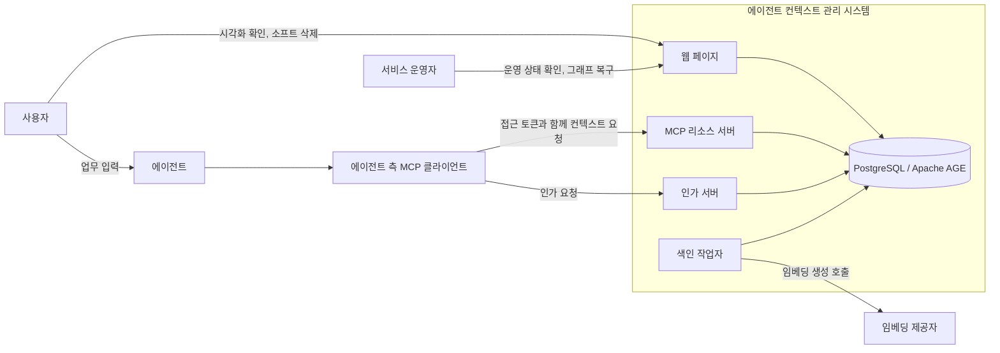
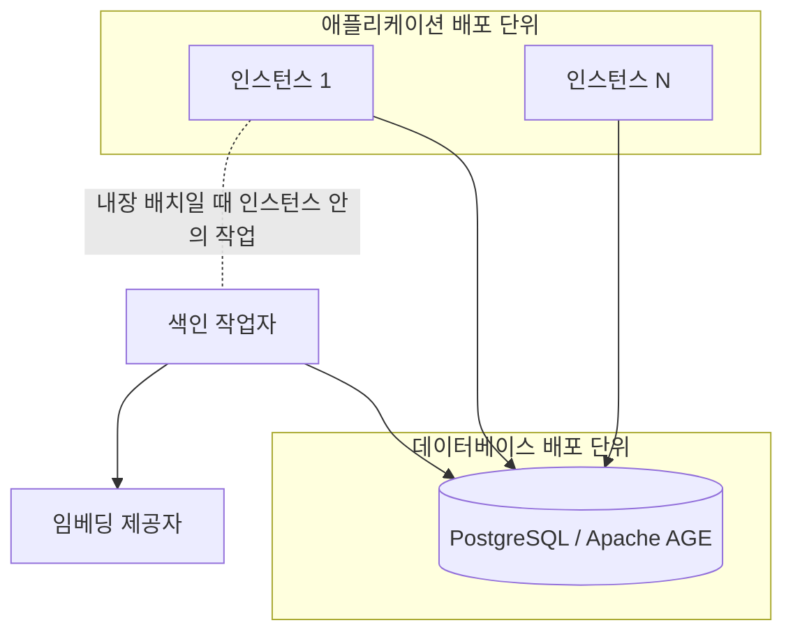
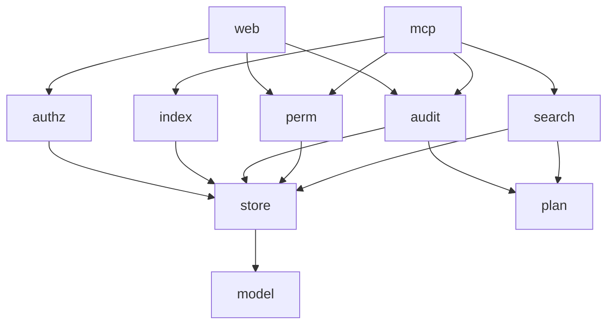
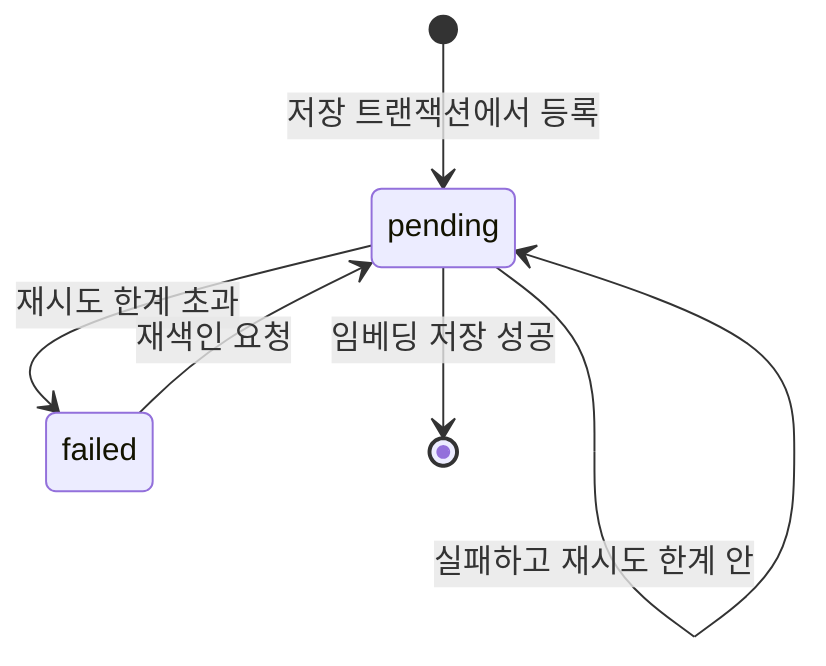
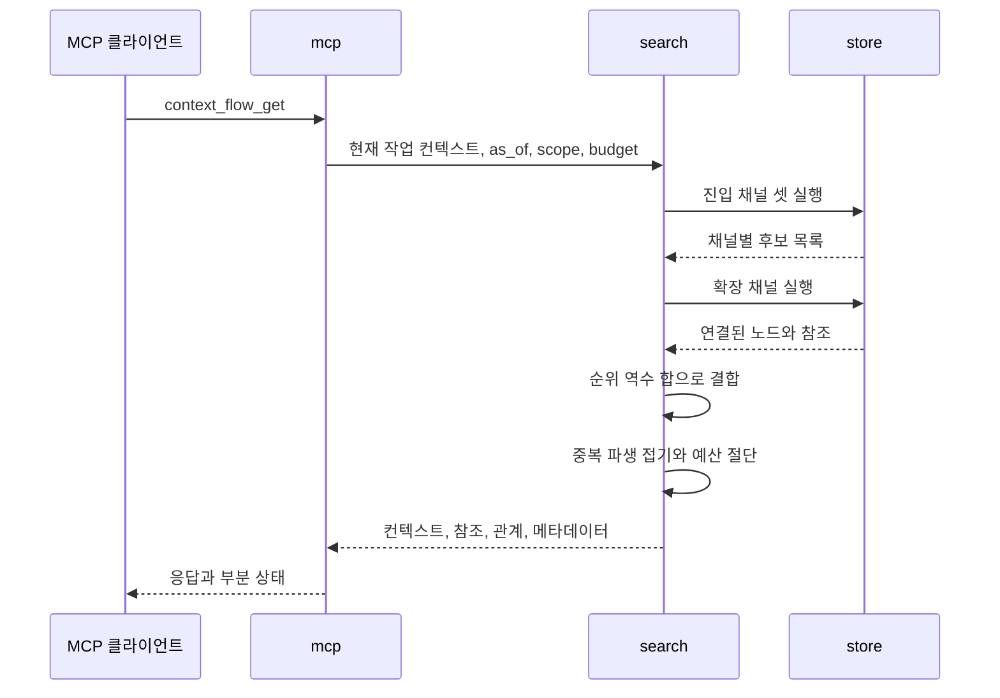
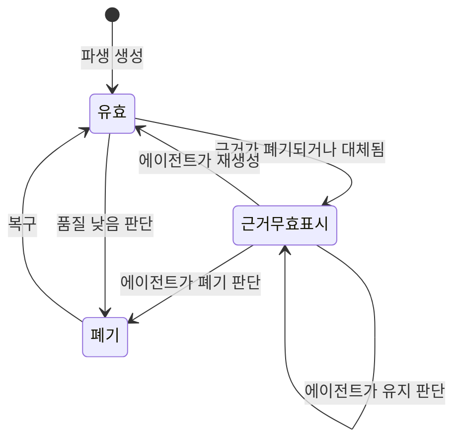
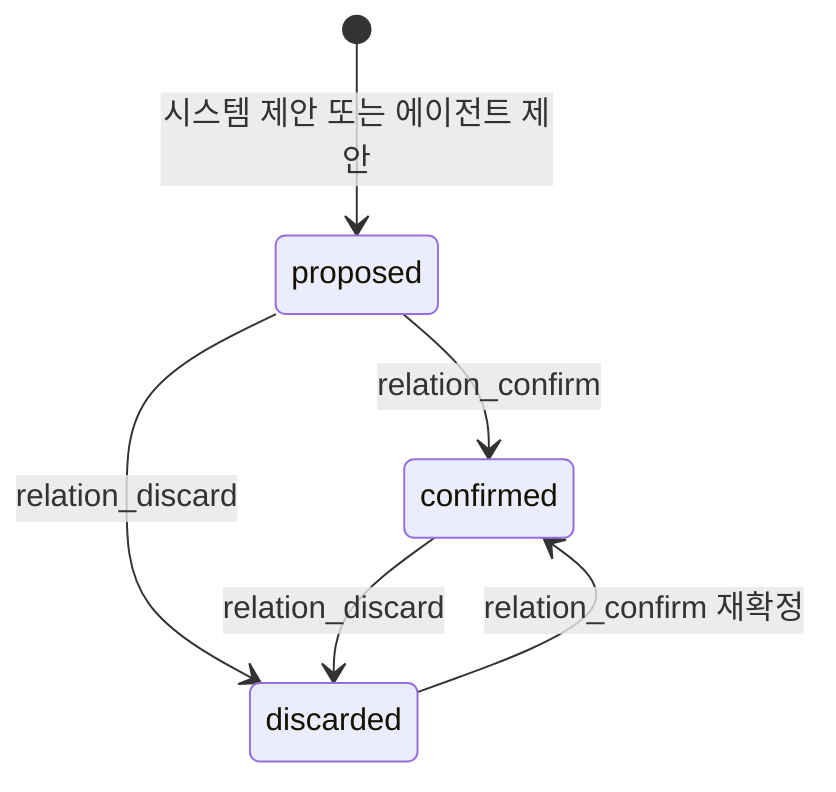
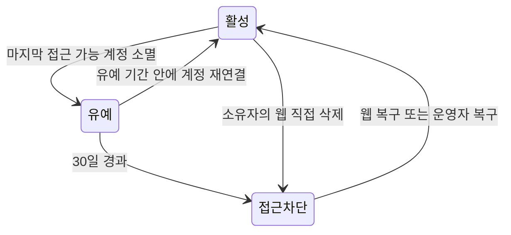
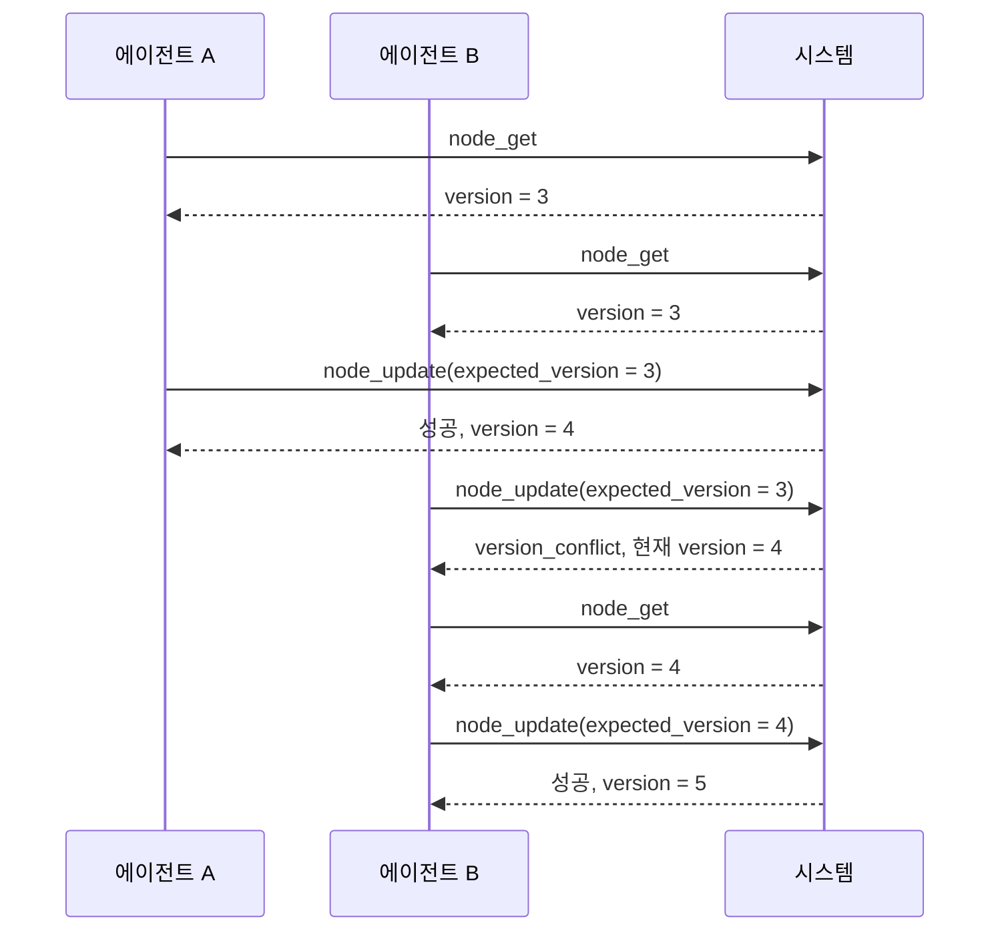

# 에이전트 컨텍스트 관리 시스템 상세 설계서

## 문서 정보

| 항목          | 내용                                                                       |
|---------------|----------------------------------------------------------------------------|
| 문서 상태     | 확정                                                                       |
| 최종 수정일   | 2026-08-31                                                                 |
| 서비스 식별자 | `AGENT_CONTEXT`                                                            |
| 담당 범위     | 확정된 요구사항의 아키텍처, 구성 요소, 인터페이스, 데이터 모델과 처리 흐름 |
| 주요 출처     | `SRS.md`, `reference.md`, 채택된 제안                                      |

## 설계 목적과 범위

이 문서는 `SRS.md`가 확정한 요구사항 134건과 비기능 요구사항 13건을 구현 가능한 설계로 구체화한다. 요구사항이 무엇을 해야 하는지 정했다면 이 문서는 그것을 어떤 구조로 만드는지 정한다.

`SRS.md`의 「목표와 비목표」가 `후속 기획`으로 미뤄 둔 세 항목을 이 문서가 인수한다.

| 인수 항목                                   | 담당 절                                 |
|---------------------------------------------|-----------------------------------------|
| 배포 형상과 운영 자동화의 상세 설계         | 「배포 형상」과 「관측성, 배포와 운영」 |
| Apache AGE 그래프 스키마와 질의의 상세 설계 | 「데이터 모델과 저장 전략」             |
| 화면 배치와 시각 디자인의 상세 설계         | 「인터페이스와 API 계약」               |

다음은 이 문서의 범위가 아니다.

| 제외 항목               | 이유                                                                                                                |
|-------------------------|---------------------------------------------------------------------------------------------------------------------|
| 요구사항의 신설과 변경  | `SRS.md`가 소유한다. 설계 과정에서 요구사항 변경이 필요하면 `SRS.md`를 먼저 고친다                                  |
| 채택되지 않은 제안      | `SUG-AGENT_CONTEXT-14`는 `보류`이며 설계 입력으로 쓰지 않는다                                                       |
| 구현 코드               | 이 문서는 설계까지만 정한다                                                                                         |
| 검증의 지표와 합격 기준 | `SRS.md`의 「검증」이 이미 확정했다. 이 문서는 그 측정을 어디에서 수집하는지와 「테스트 전략」의 실행 계층만 정한다 |
| 성능 목표               | 검색 서비스 수준 목표는 `SRS.md`의 「검색 품질 평가」가 소유한다. 이 문서는 측정 지점만 정한다                      |
| 주석 절                 | 본문 흐름을 방해하는 보충 설명이 없어 두지 않는다. 근거는 각 소절의 문단에 바로 적었다                              |

### 구현 기술 기준

구현 언어는 Go로 확정하고 최소 버전을 1.26으로 둔다. 근거는 저장소 루트 `AGENTS.md`가 이미 Go 작성 기준을 계약으로 두고 있다는 것이다. `Effective Go`를 기준으로 삼고, `gofmt` 적용, 짧은 소문자 패키지 이름, 발생 지점 가까이에서의 오류 처리, 자원 획득 직후 `defer` 해제가 그대로 적용된다.

`Effective Go`가 다루지 않는 최신 관용구는 Modern Go Guidelines를 따른다. 이 도구가 대상 Go 버전에서 쓸 수 있는 표준 라이브러리 관용구를 판마다 제시하므로, 판이 올라가며 생긴 관용구를 문서에 옮겨 적어 두고 낡히는 대신 코드를 쓸 때 도구에서 확인한다. 이 문서가 확정하는 것은 최소 버전과 그 출처이며 개별 관용구 목록이 아니다.

최소 버전을 1.26으로 두는 이유는 두 가지다. 사용자가 정한 하한이고, 「HTTP 진입점」이 표준 라이브러리만 쓰기로 한 근거인 메서드 일치와 경로 와일드카드가 그보다 앞선 1.22에 들어와 이미 포함되기 때문이다.

이 선택은 `SRS.md`가 정한 것이 아니라 이 문서의 설계 결정이다. `SRS.md`는 구현 언어를 정하지 않았으므로 요구사항 변경이 아니며, 언어를 바꾸면 이 문서의 「구성 요소 설계」만 다시 쓰면 된다.

`SRS.md`가 이미 확정해 그대로 쓰는 기술은 다음과 같다. 이 문서가 다시 선택하지 않는다.

| 기술             | 확정 위치                                        |
|------------------|--------------------------------------------------|
| PostgreSQL       | `NFR-AGENT_CONTEXT-001`, 「데이터 저장 제약」    |
| Apache AGE       | `NFR-AGENT_CONTEXT-001`, 「그래프 모델」         |
| pgvector         | 「임베딩 저장」                                  |
| Streamable HTTP  | `FR-AGENT_CONTEXT-095`, 「transport와 프로토콜」 |
| OAuth 2.1 + PKCE | `FR-AGENT_CONTEXT-090`, 「프로토콜 매핑」        |

라이브러리 선택은 근거가 있는 것만 확정한다. HTTP 진입점, 데이터베이스 드라이버와 인가 서버는 「구성 요소 설계」가 기술적 근거를 밝혀 정했고, 남은 선택은 「설계 미정 사항」에 둔다.

## 설계 입력

| 우선순위 | 입력             | 사용 범위                                                        |
|----------|------------------|------------------------------------------------------------------|
| 필수     | `SRS.md`         | 범위, 요구사항, 상태, 정책, 제약과 추적 ID의 기준으로 사용한다   |
| 조건부   | `reference.md`   | 외부 계약과 기술 판단의 근거로만 사용한다. 현재 29건             |
| 조건부   | `suggestion.md`  | `상태`가 정확히 `채택`인 행만 사용한다. 현재 15건                |
| 조건부   | `logs/prompt.md` | 사용자 결정과 변경 맥락을 확인한다. `SRS.md`와 충돌하면 보고한다 |

설계 입력으로 쓰는 채택된 제안은 다음 15건이다.

`SUG-AGENT_CONTEXT-1`, `SUG-AGENT_CONTEXT-2`, `SUG-AGENT_CONTEXT-3`, `SUG-AGENT_CONTEXT-4`, `SUG-AGENT_CONTEXT-5`, `SUG-AGENT_CONTEXT-6`, `SUG-AGENT_CONTEXT-7`, `SUG-AGENT_CONTEXT-8`, `SUG-AGENT_CONTEXT-9`, `SUG-AGENT_CONTEXT-10`, `SUG-AGENT_CONTEXT-11`, `SUG-AGENT_CONTEXT-12`, `SUG-AGENT_CONTEXT-13`, `SUG-AGENT_CONTEXT-15`, `SUG-AGENT_CONTEXT-16`

`SUG-AGENT_CONTEXT-16`은 `SRS.md`에 이미 반영되어 있으므로 설계 입력으로는 `SRS.md`의 확정 문구를 따른다.

## 시스템 컨텍스트와 아키텍처

이 절은 시스템 경계를 정한다. 누가 시스템 밖에서 시스템에 닿는지, 시스템 안에 무엇이 있는지, 그것들이 어떤 배포 단위로 묶이는지를 확정한다. 내부 구성 요소를 Go 패키지로 나누는 일은 「구성 요소 설계」가 맡는다.

### 외부 경계

`SRS.md`의 「대상 사용자와 시스템 경계」가 확정한 대상을 설계 관점에서 다시 나눈다. 식별 단위와 통신 상대를 구분하는 것이 목적이다.

| 대상                       | 구분        | 시스템과의 관계                                                      |
|----------------------------|-------------|----------------------------------------------------------------------|
| 계정                       | 식별 단위   | 통신하지 않는다. 인증 주체이자 보관 정책의 판정 대상이다             |
| 작업자                     | 식별 단위   | 통신하지 않는다. 계정으로 식별하는 협업 단위다                       |
| 사용자                     | 외부 행위자 | 에이전트에 업무를 입력하고 웹 페이지로 시각화 확인과 삭제를 요청한다 |
| 에이전트                   | 외부 행위자 | 직접 통신하지 않고 MCP 클라이언트를 거친다                           |
| 에이전트 측 MCP 클라이언트 | 외부 행위자 | 토큰을 발급받고 보호된 MCP 요청을 보내는 유일한 기계 호출자다        |
| 서비스 운영자              | 외부 행위자 | 웹 페이지로 운영 상태를 보고 자동 소프트 삭제된 그래프를 복구한다    |
| 임베딩 제공자              | 외부 의존   | 색인 작업자만 호출한다. 요청 경로에 들어오지 않는다                  |
| 인가 서버                  | 시스템 내부 | 애플리케이션에 포함하며 필요하면 떼어낼 수 있다                      |

계정과 작업자를 외부 행위자로 두지 않는 이유는 둘이 통신 상대가 아니기 때문이다. 접근 토큰이 계정을 대표하므로 시스템이 실제로 상대하는 것은 토큰을 가진 MCP 클라이언트와 웹 브라우저이며, 계정은 그 요청에서 해석되는 값이다.

인가 서버를 시스템 안에 두는 이유는 `SRS.md`의 「배포 단위」가 애플리케이션에 묶었기 때문이다. 「대상 사용자와 시스템 경계」가 인증 서버를 "시스템 구성 요소"로 적은 것과 같은 판단이다.

경계를 지나는 흐름은 네 갈래다. 사용자와 운영자의 웹 요청, MCP 클라이언트의 인가 요청, MCP 클라이언트의 보호된 컨텍스트 요청, 색인 작업자의 임베딩 호출이다. 앞의 셋은 시스템으로 들어오고 마지막 하나만 시스템에서 나간다.

에이전트가 시스템과 직접 연결되지 않는 것이 중요하다. `SRS.md`가 인증과 요청 주체를 MCP 클라이언트로 확정했으므로 시스템은 에이전트를 알지 못하고 토큰이 대표하는 계정만 안다.

### 배포 형상

`SRS.md`의 「배포 단위」가 확정한 다섯 항목을 배포 경계로 옮긴다.

| 배포 단위    | 포함                                  | 확장 방식                                  |
|--------------|---------------------------------------|--------------------------------------------|
| 애플리케이션 | 웹 페이지, MCP 리소스 서버, 인가 서버 | 인스턴스를 늘린다                          |
| 데이터베이스 | PostgreSQL과 Apache AGE               | 이 문서의 범위 밖이며 운영 구성으로 정한다 |
| 색인 작업자  | 임베딩 생성과 재시도                  | 애플리케이션 안에 두거나 분리해 늘린다     |

색인 작업자를 배포 단위 표에 두면서도 위 그림에서 두 배포 단위 밖에 그린 이유는 배치가 선택이기 때문이다. 애플리케이션 안의 작업으로 두면 애플리케이션 배포 단위에 속하고, 분리하면 독립 배포 단위가 된다. `SRS.md`가 요구한 것은 색인이 요청 경로 밖에서 처리된다는 것뿐이고 두 배치 모두 그것을 만족한다.

### 인스턴스 무상태성

애플리케이션 인스턴스를 늘려 확장할 수 있는 근거는 인스턴스가 요청 사이의 상태를 갖지 않는다는 것이다. 이것이 성립하려면 상태로 보일 수 있는 것들이 전부 인스턴스 밖에 있어야 한다.

| 상태 후보        | 배치         | 근거                                                      |
|------------------|--------------|-----------------------------------------------------------|
| 프로토콜 세션    | 두지 않는다  | 「transport와 프로토콜」이 handshake와 session을 없앴다   |
| 컨텍스트와 관계  | 데이터베이스 | 「그래프 모델」                                           |
| 임베딩           | 데이터베이스 | 「임베딩 저장」                                           |
| 발급 이력        | 두지 않는다  | 「다중 인스턴스」가 비공유로 확정했다                     |
| JWKS와 폐기 목록 | 데이터베이스 | 아래 설계 결정                                            |
| 색인 대기 작업   | 데이터베이스 | 「색인 처리」가 저장과 작업 등록을 한 트랜잭션으로 묶었다 |
| 웹 세션          | 두지 않는다  | 서명된 쿠키가 값을 나르며 서버는 폐기 목록만 본다         |

JWKS와 폐기 목록을 데이터베이스에 두는 것은 이 문서의 설계 결정이다. `SRS.md`는 이 둘을 인스턴스 사이 공유 대상으로만 확정하고 어디에 둘지는 정하지 않았다. 데이터베이스가 이미 공유 대상이므로 여기에 두면 새 공유 지점이 생기지 않는다. 별도의 공유 저장소를 두면 배포 단위가 하나 늘고 그 가용성이 인증 경로에 그대로 붙는데, 그럴 근거가 없다.

발급 이력을 두지 않으므로 토큰 갱신은 인스턴스가 조율하지 않는다. 만료 10초 전 구간에 서로 다른 인스턴스가 각자 새 토큰을 발급해도 둘 다 유효하며, 이는 `SRS.md`가 이미 확정한 동작이다.

### 배치 조합

두 구성 요소의 배치가 선택으로 열려 있고 서로 독립이다.

| 조합                             | 상시 프로세스 | 적합한 상황                          |
|----------------------------------|---------------|--------------------------------------|
| 색인 작업자 내장, 인가 서버 내장 | 1             | 최소 자원 구성. 기본값으로 삼는다    |
| 색인 작업자 분리, 인가 서버 내장 | 2             | 색인 부하가 요청 처리에 영향을 줄 때 |
| 색인 작업자 내장, 인가 서버 분리 | 2             | 인가를 다른 서비스와 공유해야 할 때  |
| 색인 작업자 분리, 인가 서버 분리 | 3             | 위 두 이유가 동시에 성립할 때        |

기본값을 모두 내장으로 두는 이유는 `SUG-AGENT_CONTEXT-12`가 채택된 근거와 같다. 요구는 색인이 요청 경로 밖에서 처리된다는 것이지 별도 프로세스가 아니며, 최소 구성에서 상시 프로세스를 줄이는 편이 낫다. 어느 조합이든 같은 코드로 성립해야 하므로 색인 작업자와 인가 서버는 프로세스 경계가 아니라 호출 경계로 분리한다. 구체적인 경계는 「구성 요소 설계」가 정한다.

### 설계 결정

| 결정                                                                                     | 근거 요구사항                                   |
|------------------------------------------------------------------------------------------|-------------------------------------------------|
| 시스템 경계 안에 웹 페이지, MCP 리소스 서버, 인가 서버, 색인 작업자, 데이터베이스를 둔다 | `FR-AGENT_CONTEXT-001`, `FR-AGENT_CONTEXT-002`  |
| 임베딩 제공자를 외부 의존으로 두고 요청 경로에서 뺀다                                    | `FR-AGENT_CONTEXT-096`, `FR-AGENT_CONTEXT-097`  |
| 애플리케이션과 데이터베이스를 별도 배포 단위로 둔다                                      | `FR-AGENT_CONTEXT-096`                          |
| 인스턴스 사이 공유 지점을 데이터베이스 하나로 제한한다                                   | `FR-AGENT_CONTEXT-094`, `NFR-AGENT_CONTEXT-012` |
| JWKS와 폐기 목록을 데이터베이스에 둔다                                                   | `FR-AGENT_CONTEXT-094`                          |
| 색인 작업자와 인가 서버를 호출 경계로 분리해 네 배치 조합을 모두 지원한다                | `FR-AGENT_CONTEXT-096`, `SUG-AGENT_CONTEXT-12`  |

## 구성 요소 설계

이 절은 애플리케이션 내부를 Go 패키지로 나누고 각 패키지의 책임과 의존 방향을 정한다. 「시스템 컨텍스트와 아키텍처」가 배포 단위를 정했다면 이 절은 그 안의 코드 경계를 정한다.

### 패키지 경계

| 패키지   | 책임                                                                             | 의존            |
|----------|----------------------------------------------------------------------------------|-----------------|
| `model`  | 컨텍스트·관계·그래프의 타입과 계층별 필수 속성 검증                              | 없음            |
| `store`  | 그래프와 테이블에 닿는 모든 질의. `graph_id`를 필수 인자로 받는다                | `model`         |
| `plan`   | 계정 플랜 항목의 기본값과 한도 판정                                              | 없음            |
| `perm`   | 직접 부여와 팀 상속으로 유효 등급을 계산하고 연산별 등급을 검사한다              | `store`         |
| `audit`  | 관리 연산 기록과 웹 감사 기록의 기록·조회·보존 기간 정리                         | `store`, `plan` |
| `search` | 네 채널 실행, 순위 역수 합 결합, 예산 적용                                       | `store`, `plan` |
| `index`  | 색인 작업 등록·소비·재시도와 임베딩 제공자 호출                                  | `store`         |
| `authz`  | 계정 등록과 자격 증명 검증, 인가 코드 흐름, 토큰 발급·검증, JWKS 공개, 폐기 목록 | `store`         |
| `mcp`    | 연산 13종의 파라미터 해석, 오류 사상, 응답 구성                                  | 아래 전부       |
| `web`    | 화면 다섯 종의 처리와 렌더링                                                     | 아래 전부       |
| `config` | 배포 구성 값의 읽기와 검증                                                       | 없음            |

`model`이 아무것에도 의존하지 않는 이유는 「컨텍스트 모델」이 논리 모델을 그래프 구조와 무관하게 정의했기 때문이다. 타입과 검증 규칙이 저장 방식을 몰라야 `TBD-AGENT_CONTEXT-038`의 비그래프 기준선을 같은 타입으로 구성할 수 있다.

패키지 이름을 `context`로 두지 않는 이유는 표준 라이브러리와 겹치기 때문이다. 컨텍스트 타입을 담는 패키지는 `model`로 두고, 표준 `context.Context`는 모든 패키지가 그대로 쓴다.

의존은 한 방향으로만 흐른다. `store`가 위쪽 패키지를 부르지 않으므로 접근 계층이 업무 규칙을 알지 못하고, 그 덕에 「격리 강제의 구현」이 요구한 응답 재검사를 모든 호출자에 대해 같게 적용할 수 있다.

`config`는 그림에 넣지 않는다. 구성 값은 조립 시점에 각 패키지로 주입되며 실행 중 참조되는 의존이 아니다.

### 접근 계층

`store`가 「격리 강제의 구현」이 말한 단일 접근 계층이다. 세 가지를 지킨다.

| 규칙                                   | 구현                                                              |
|----------------------------------------|-------------------------------------------------------------------|
| 모든 그래프 질의가 `graph_id`를 받는다 | 내보내는 함수의 첫 인자를 `graph_id`로 고정한다                   |
| 반환 전 `graph_id`를 대조한다          | 결과를 조립하는 한 지점에서 정점과 간선의 값을 요청 값과 비교한다 |
| 우회 경로를 만들 수 없다               | 데이터베이스 연결과 질의 실행기를 패키지 밖으로 내보내지 않는다   |

연결을 내보내지 않는 것이 핵심이다. `store` 밖의 어떤 패키지도 데이터베이스 핸들을 손에 넣을 수 없으므로, 우회하려면 `store`에 새 함수를 추가해야 하고 그 추가는 리뷰와 격리 위반 테스트를 지나야 한다.

### 데이터베이스 연결

`TBD-AGENT_CONTEXT-041`을 확정한다. 드라이버와 풀은 `pgx`의 `pgxpool`을 쓴다.

근거는 Apache AGE가 연결마다 준비를 요구한다는 것이다. openCypher를 호출하려면 확장을 적재하고 `search_path`에 `ag_catalog`를 넣어야 하며, 이 설정은 연결에 붙는다. 풀에서 꺼낸 연결마다 매번 설정 질의를 보내면 왕복이 두 배가 되므로, 연결이 만들어질 때 한 번만 실행할 자리가 필요하다. `pgxpool.Config`의 `AfterConnect`가 연결이 수립된 뒤 풀에 추가되기 전에 호출되는 자리로 문서에 정의되어 있어 여기에 정확히 대응한다. 원문은 `reference.md`에 있다.

AGE가 돌려주는 `agtype`은 PostgreSQL 기본 타입이 아니다. `store`가 이 값을 문자열로 받아 `model`의 타입으로 해석하며, 해석 코드를 한곳에 두어 탐색 결과를 다루는 지점을 하나로 유지한다.

### HTTP 진입점

`TBD-AGENT_CONTEXT-040`을 확정한다. 표준 라이브러리 `net/http`의 `ServeMux`만 쓰고 외부 라우터를 두지 않는다.

최소 버전 1.26의 `ServeMux`가 메서드 일치와 경로 와일드카드를 지원한다. 두 기능은 1.22에 들어왔고 릴리스 노트가 `"POST /items/create"`처럼 메서드를 붙인 등록이 해당 메서드의 요청으로 호출을 제한하고, `/items/{id}` 같은 와일드카드가 경로 구간에 대응하며 값을 `Request.PathValue`로 읽는다고 정의한다. 이 서비스의 경로 표면은 MCP 단일 엔드포인트, 인가와 discovery 엔드포인트, 화면 다섯 종으로 좁고 고정이라 이 이상이 필요하지 않다.

외부 라우터를 쓸 이유가 없다는 것이 선택의 근거다. 미들웨어 체인, 경로 그룹, 파라미터 바인딩 중 어느 것도 요구사항이 요구하지 않으며, 의존을 하나 늘리면 그 판 관리와 보안 갱신이 따라온다.

### 인가 서버

`TBD-AGENT_CONTEXT-042`를 확정한다. 인가 서버를 직접 구현하고 JWT 서명과 검증만 라이브러리에 맡긴다.

「프로토콜 매핑」이 확정한 범위가 좁다는 것이 근거다. 공개 클라이언트 하나, Authorization Code with PKCE 하나, 갱신 토큰 없음, 클라이언트 비밀 없음, Client Credentials 없음이다. 범용 인가 서버 구현이 제공하는 기능 대부분이 이 범위 밖이며, 붙이면 쓰지 않는 엔드포인트와 흐름이 함께 열린다.

직접 구현하는 부분과 맡기는 부분을 나눈다.

| 대상                                      | 처리                                   |
|-------------------------------------------|----------------------------------------|
| 인가 코드 발급과 교환, PKCE 검증          | 직접 구현한다                          |
| 접근 토큰의 서명과 검증, JWKS 직렬화      | 라이브러리에 맡긴다                    |
| 토큰 수명, 자동 갱신 구간, 최대 연속 사용 | 직접 구현한다                          |
| 폐기 목록 조회                            | 직접 구현하고 `store`를 통해 읽는다    |
| 계정 등록과 자격 증명 검증                | 직접 구현하고 `store`를 통해 읽고 쓴다 |
| 비밀번호 해시 생성과 대조                 | 라이브러리에 맡긴다                    |
| 세션 쿠키 발급과 로그아웃                 | 직접 구현한다                          |

서명과 검증을 맡기는 이유는 암호 구현을 직접 쓰지 않기 위해서다. 나머지는 「인증과 토큰 요구사항」이 확정한 값을 그대로 따르는 분기라 라이브러리가 대신해 줄 것이 없다.

계정 등록이 `authz`에 있는 이유는 `SRS.md`의 「계정」이 생성 채널을 인가 서버로 확정했기 때문이다. 인가 서버는 아직 계정이 없는 사람을 상대하는 유일한 구성 요소이며, 「요청 처리 순서」의 2단계를 지나지 않는 경로도 여기뿐이다.

비밀번호 해시는 `golang.org/x/crypto/bcrypt`를 쓴다. 서명을 라이브러리에 맡긴 것과 같은 근거이며, 이 선택은 저장 형태에서도 나온다. `SRS.md`의 「계정 속성」이 `password_hash` 하나만 두었는데 bcrypt는 소금과 비용 계수를 해시 문자열 안에 함께 담으므로 열을 더하지 않아도 된다. 소금과 매개변수를 따로 저장해야 하는 방식을 고르면 확정된 속성 표를 고쳐야 한다.

비용 계수는 「배포 구성」의 값으로 둔다. 하드웨어에 따라 적정 값이 달라지고 값을 올려도 기존 해시는 그대로 검증되므로, 명세가 숫자를 고정하지 않아도 검증할 수 있는 제약이 남는다.

세션 쿠키 발급을 직접 구현하는 이유는 접근 토큰과 같은 서명 경로를 쓰기 때문이다. `SRS.md`의 「웹 세션」이 세션을 서명된 값으로 확정했으므로 발급은 `aud`만 다른 같은 절차이고, 라이브러리가 대신할 부분은 이미 서명에 들어가 있다. 로그아웃은 그 세션의 `jti`를 폐기 목록에 넣는 것이므로 인가 서버가 이미 읽는 `revoked_token`을 그대로 쓴다.

`authz`가 분리 배포를 지원해야 하므로 `mcp`와 `web`은 `authz`를 함수로 부르지 않고 검증된 계정 식별자만 받는다. 같은 프로세스에 있으면 미들웨어가 채우고, 떼어내면 리소스 서버가 JWKS로 검증해 채운다. 어느 쪽이든 위쪽 패키지의 코드는 같다.

### 계정 플랜 값

`plan`이 「플랜이 정하는 항목」의 11개 항목과 기본값을 갖는다. 배포 구성이 값을 주면 덮어쓰고 주지 않으면 기본값을 쓴다. 목록에 없는 값은 이 패키지가 알지 못하므로 플랜으로 바뀔 수 없다.

한도 검사는 두 단계로 나눈다.

| 검사           | 조건                                       |
|----------------|--------------------------------------------|
| 요청 단위 한도 | 요청 값이 한도를 넘는가                    |
| 누적 단위 한도 | 요청이 값을 늘리고 현재 값이 한도 이상인가 |

누적 한도를 "요청 후 값이 한도를 넘는가"가 아니라 "늘리는 요청인가"로 표현하는 것이 「플랜 변경」의 하향 규칙을 그대로 만족시킨다. 이미 한도를 넘은 상태에서 읽기와 수정은 값을 늘리지 않으므로 통과하고, 새 생성과 확장만 막힌다. 별도의 하향 처리 분기를 두지 않아도 되고, 초과분을 지우는 경로가 애초에 생기지 않는다.

한도를 넘긴 요청은 초과한 한도의 이름과 값을 담아 거부한다. 오류 코드 사상은 「오류, 복구, 보안과 권한」이 정한다. 자동 과금 경로는 두지 않는다.

보관 기간 항목은 판정 시점의 값을 쓴다. 값이 바뀌어도 이미 지난 판정을 다시 계산하지 않으므로 「플랜 변경」의 비소급 규칙이 성립한다.

### 검색 채널 실행기

`search`가 네 채널을 실행하고 결합한다. `FR-AGENT_CONTEXT-128`이 요구한 병렬과 순차는 진입 채널 셋을 실행하는 방식의 차이이며 구성 값으로 고른다.

| 단계 | 동작                                                    |
|------|---------------------------------------------------------|
| 1    | 진입 채널 셋을 구성 값에 따라 병렬 또는 순차로 실행한다 |
| 2    | 진입 채널의 결과를 모아 확장 채널의 시작 노드로 넘긴다  |
| 3    | 네 채널의 후보 목록을 순위 역수 합으로 결합한다         |
| 4    | 예산까지 자르고 흐름 구성에 넘긴다                      |

두 방식이 같은 결과를 내는 근거는 3단계의 입력이 같다는 것이다. 결합은 채널별 순위 목록만 보고 실행 순서를 보지 않으므로, 진입 채널을 어떤 순서로 돌리든 3단계에 들어가는 값이 같다. 실행 방식은 지연과 동시 자원 사용량만 바꾼다.

진입 채널이 모두 실패하면 확장 채널은 시작 노드를 받지 못한다. 이때 `진입점 없음`을 사유로 실패한 채널에 넣는 것은 「채널」이 확정했으며, 실행기가 2단계에서 판정한다.

### 설계 결정

| 결정                                                                                         | 근거 요구사항                                   |
|----------------------------------------------------------------------------------------------|-------------------------------------------------|
| 11개 패키지로 나누고 의존을 한 방향으로 고정한다                                             | `FR-AGENT_CONTEXT-101`                          |
| `model`을 저장 방식에 의존하지 않게 두어 비그래프 기준선을 같은 타입으로 구성할 수 있게 한다 | `NFR-AGENT_CONTEXT-005`                         |
| 데이터베이스 연결을 `store` 밖으로 내보내지 않는다                                           | `FR-AGENT_CONTEXT-101`                          |
| `pgxpool`의 `AfterConnect`에서 AGE 연결 준비를 한 번만 수행한다                              | `FR-AGENT_CONTEXT-104`, `NFR-AGENT_CONTEXT-001` |
| 표준 라이브러리 `ServeMux`만 쓰고 외부 라우터를 두지 않는다                                  | `FR-AGENT_CONTEXT-095`                          |
| 인가 서버를 직접 구현하고 서명·검증만 라이브러리에 맡긴다                                    | `FR-AGENT_CONTEXT-090`, `FR-AGENT_CONTEXT-093`  |
| 위쪽 패키지가 `authz`를 부르지 않고 검증된 계정 식별자만 받는다                              | `FR-AGENT_CONTEXT-096`                          |
| 플랜 항목 11개와 기본값을 `plan`이 소유한다                                                  | `FR-AGENT_CONTEXT-117`                          |
| 누적 한도를 증가 요청 여부로 판정해 하향 규칙을 별도 분기 없이 만족시킨다                    | `FR-AGENT_CONTEXT-118`, `FR-AGENT_CONTEXT-119`  |
| 채널 실행 방식을 구성 값으로 두고 결합 입력을 같게 유지한다                                  | `FR-AGENT_CONTEXT-128`                          |
| 계정 등록과 자격 증명 검증을 `authz`에 두고 해시만 라이브러리에 맡긴다                       | `FR-AGENT_CONTEXT-130`, `FR-AGENT_CONTEXT-131`  |
| bcrypt를 골라 소금과 비용 계수를 해시 문자열 하나에 담는다                                   | `FR-AGENT_CONTEXT-131`                          |
| 세션 쿠키 발급과 로그아웃을 `authz`에 둔다                                                   | `FR-AGENT_CONTEXT-133`                          |

## 주요 처리 흐름과 상태

이 절은 요청이 들어와 응답이 나가기까지의 단계와 그 사이의 상태 전이를 정한다. 「인터페이스와 API 계약」이 연산의 계약을 정했다면 이 절은 그 안에서 무슨 일이 순서대로 일어나는지를 정한다.

### 컨텍스트 저장과 색인

`node_create`와 `body`를 바꾼 `node_update`가 같은 흐름을 지난다.

| 단계 | 동작                                               | 트랜잭션 |
|------|----------------------------------------------------|----------|
| 1    | 계층별 필수 속성과 참조 대상의 존재를 검증한다     | 안       |
| 2    | 정점을 만들거나 갱신하고 참조 간선을 잇는다        | 안       |
| 3    | 색인 작업을 `pending`으로 등록한다                 | 안       |
| 4    | 관리 연산 기록을 남긴다                            | 안       |
| 5    | 커밋하고 응답한다                                  | 경계     |
| 6    | 색인 작업자가 작업을 꺼내 임베딩을 만들고 저장한다 | 밖       |

6단계가 요청 경로 밖이라는 것이 핵심이다. 「색인 처리」가 확정한 대로 임베딩 생성 실패는 컨텍스트 저장을 되돌리지 않으며, 실패한 작업은 재시도하고 한계를 넘기면 `failed`로 남는다.

색인이 끝나지 않은 컨텍스트는 의미 유사도 채널에서만 빠지고 키워드·시간 필터·그래프 경로는 정상 동작한다. 응답에 색인 미완료를 표시하지 않으며 미색인 수는 관측 지표로만 드러난다.

`node_update`가 `body`를 바꾸지 않으면 3단계를 건너뛴다. 임베딩의 입력이 `body`뿐이므로 다른 속성만 바뀌면 벡터가 달라지지 않는다.

### 색인 작업 상태

`failed`에서 작업을 지우지 않는 이유는 「측정」이 미색인 컨텍스트 수를 지표로 요구하기 때문이다. 셀 대상이 남아 있어야 한다.

모델이나 압축을 바꾸면 그래프 전체를 재색인한다. 해당 그래프의 컨텍스트 전부를 `pending`으로 다시 등록하고, 끝날 때까지 `model_id`가 다른 옛 벡터를 의미 유사도 채널에서 제외한다.

### 작업 컨텍스트 흐름 조회

`context_flow_get`의 내부 단계다. 「검색」이 확정한 채널 구성과 「예산 적용과 절단」이 확정한 절차를 순서로 옮긴다.

진입 채널 셋의 실행 방식은 구성 값이 정하며 결합 입력이 같으므로 결과가 같다. 확장 채널은 진입 결과를 받으므로 어느 방식에서든 뒤에 실행된다.

`scope`가 `auto`이면 진입점을 국소로 잡고, `global`이면 `summary_scope`가 `global`인 요약 파생에서 시작해 `derived_from`을 따라 내려간다. 전역 진입점은 속성 필터로 찾으므로 채널을 거치지 않는다.

접기와 절단을 결합 뒤에 두는 이유는 순위를 보존하기 위해서다. 접기를 먼저 하면 어느 파생이 대표가 될지 순위 없이 정해야 하고, 절단을 먼저 하면 접혀서 자리가 생겼을 컨텍스트가 이미 빠진다.

### 파생 생성과 근거 무효화

파생은 에이전트만 만들고 시스템의 주기적 자동 생성은 없다. 시스템이 하는 일은 근거가 사라졌을 때 표시하는 것뿐이다.

`근거무효표시`에서 자동으로 폐기하지 않는 것이 확정된 규칙이다. 근거가 사라졌다고 파생이 틀린 것은 아니므로 시스템은 표시만 하고 판단은 에이전트가 관리 연산으로 한다. 「허용 조건」이 표시만 두고 방치하지 말라고 했으므로 재생성·폐기·유지 중 하나를 골라 기록한다.

`유지`가 상태를 바꾸지 않고 자기 자신으로 돌아오는 이유는 그것이 연산이기 때문이다. 아무것도 하지 않은 것과 유지를 판단한 것은 기록에서 구분된다.

근거 무효 표시는 근거가 폐기·대체될 때 시스템이 전파한다. 폐기 트랜잭션 안에서 그 컨텍스트를 `derived_from`으로 가리키는 파생을 찾아 표시를 켠다. 연쇄로 퍼지지 않으며 한 단계만 간다.

### 사건 재구성

병합과 분할은 새 연산이 아니라 확정된 관리 연산의 조합이다.

| 재구성 | 연산 조합                                                                               |
|--------|-----------------------------------------------------------------------------------------|
| 병합   | 남길 사건의 구성원과 시간 범위를 갱신하고, 흡수된 사건과 그에 붙은 확정 관계를 폐기한다 |
| 분할   | 새 사건을 추가하고 원래 사건의 구성원과 시간 범위를 갱신한다                            |

한 재구성을 이루는 연산들은 같은 판단 입력으로 묶어 기록한다. 기록에서 묶이지 않으면 나중에 어느 갱신과 어느 폐기가 한 판단이었는지 알 수 없어 복구 판정이 성립하지 않는다.

폐기된 사건에 붙어 있던 확정 관계를 함께 폐기하는 것은 같은 트랜잭션에서 한다. 관계만 남으면 폐기된 사건을 끝으로 갖는 관계가 되어 탐색이 사라진 노드를 가리킨다.

필요한 관계는 남은 사건에 다시 확정한다. 관계에는 갱신이 없으므로 양 끝을 바꾸는 것은 폐기 후 새 확정이며, `relation_confirm`이 멱등이라 재확정이 곧 복구다.

### 관계 후보 제안과 확정

시스템 제안은 사건을 만들거나 구성원과 시간 범위를 갱신할 때 일어난다. 같은 트랜잭션에 넣지 않고 저장이 끝난 뒤 별도로 수행한다. 제안이 실패해도 사건 저장을 되돌릴 이유가 없고, `relates_to` 신호가 임베딩 유사도라 색인이 끝나야 계산할 수 있기 때문이다.

`confirmed`만 홉 탐색과 작업 컨텍스트 흐름의 대상이다. `proposed`는 `relation_list`로만 보이고 탐색에 걸리지 않으므로, 잘못된 제안이 쌓여도 검색 결과를 오염시키지 않는다.

이미 `confirmed`이거나 `discarded`인 정체성은 다시 제안하지 않는다. 폐기한 관계가 다음 갱신에서 후보로 되살아나면 에이전트의 판단이 무시된다.

### 소프트 삭제 수명주기

`SRS.md`의 `FR-AGENT_CONTEXT-032`가 유예 기간의 시작 시각과 계정 연결 판정 기준을 상세 설계로 넘겼다. 여기에서 정한다.

| 항목             | 확정                                                                            |
|------------------|---------------------------------------------------------------------------------|
| 판정 단위        | 컨텍스트 그래프                                                                 |
| 접근 가능한 계정 | `graph_grant`의 직접 부여와 `team_member`를 통한 상속으로 유효 등급을 갖는 계정 |
| 유예 시작 시각   | 마지막 접근 가능 계정이 사라진 트랜잭션의 커밋 시각                             |
| 판정 시점        | 접근 가능한 계정을 줄일 수 있는 연산의 트랜잭션 안에서 계산한다                 |
| 대상 연산        | 등급 회수와 팀 구성원 제거                                                      |
| 재연결 판정      | 유예 중인 그래프에 접근 가능한 계정이 하나라도 생기면 즉시 취소한다             |
| 만료 처리        | 주기 작업이 유예 시작 시각에서 30일이 지난 그래프를 찾아 접근을 차단한다        |

유예 시작 시각을 커밋 시각으로 두는 이유는 재현 가능해야 하기 때문이다. 주기 작업이 나중에 훑으며 계산하면 작업이 언제 돌았는지가 시작 시각에 섞여 들어가고, 같은 상태에서 다른 만료 시점이 나온다.

판정을 트랜잭션 안에서 하는 이유는 접근 가능한 계정을 줄이는 연산이 둘뿐이기 때문이다. 그 연산이 끝날 때마다 그 그래프에 남은 계정이 있는지 세면 되며, 별도의 감시 작업이 필요 없다.

대상 연산에 팀 구성원 제거가 들어가는 이유는 `SRS.md`의 「접근 가능한 계정과 소유자 부재」가 판정을 부여된 등급이 아니라 그 등급을 쓸 계정으로 확정했기 때문이다. 소유자 등급을 팀이 가진 그래프에서 구성원을 모두 빼면 `graph_grant`는 그대로인데 접근 가능한 계정이 0이 된다. 등급 회수만 방아쇠로 두면 이 경로를 놓친다.

계정 소멸은 방아쇠가 아니다. 「계정 소멸」이 소멸 경로를 두지 않기로 확정했으므로 계정 행이 사라지는 일이 없다.

재연결에 유예 기간을 다시 시작하는 개념을 두지 않는다. 취소는 유예 상태를 지우는 것이고, 이후 다시 계정이 사라지면 그때의 커밋 시각으로 새 유예가 시작된다.

만료 처리만 주기 작업인 이유는 시간 경과가 방아쇠이기 때문이다. 다른 전이는 모두 어떤 연산이 방아쇠라 그 트랜잭션에서 처리할 수 있다.

보관 기간 값이 바뀌어도 이미 시작된 유예의 만료 시점을 다시 계산하지 않는다. 「플랜 변경」이 소급하지 않기로 확정했다.

### 폐기와 복구의 채널

폐기는 두 채널로 일어나고 복구는 폐기한 채널로 제한된다.

| 폐기 채널 | 복구 채널      | 판정 방법                                  |
|-----------|----------------|--------------------------------------------|
| 연산      | 연산과 웹 모두 | 관리 연산 기록의 실행 계정과 실행 에이전트 |
| 웹        | 웹만           | 같은 기록에 실행 에이전트가 없다           |

판정을 별도 플래그가 아니라 기록으로 하는 이유는 값을 두 곳에 두지 않기 위해서다. 관리 연산 기록이 이미 실행 주체를 담고 있으므로 `deleted_at` 옆에 채널 값을 더하면 같은 사실이 두 곳에 생긴다.

`node_restore`가 웹에서 삭제된 컨텍스트를 대상으로 하면 `not_supported`로 거부하고 웹 페이지를 대체 채널로 알린다. 「그래프와 노드」가 확정한 매핑이다.

### 동시 갱신

버전 비교와 증가는 같은 트랜잭션 안에서 한다. 읽고 비교한 뒤 쓰는 사이에 다른 트랜잭션이 끼어들면 두 갱신이 같은 판 번호를 덮어쓴다.

거부된 요청의 기록은 트랜잭션 밖에서 남긴다. 충돌로 되돌아간 트랜잭션 안에 기록을 넣으면 함께 사라진다.

사건 관계는 이 흐름의 대상이 아니다. 관계에 갱신이 없고 판 번호도 없어 비교할 값이 없으며, 같은 정체성의 재확정은 멱등이라 충돌 개념이 성립하지 않는다.

### 설계 결정

| 결정                                                                    | 근거 요구사항                                                          |
|-------------------------------------------------------------------------|------------------------------------------------------------------------|
| 저장·색인 등록·연산 기록을 한 트랜잭션에 넣고 임베딩 생성만 밖에 둔다   | `FR-AGENT_CONTEXT-081`, `FR-AGENT_CONTEXT-097`                         |
| `body`가 바뀌지 않은 갱신은 색인 작업을 등록하지 않는다                 | `FR-AGENT_CONTEXT-081`                                                 |
| 색인 작업의 `failed` 상태를 지우지 않고 남긴다                          | `FR-AGENT_CONTEXT-097`                                                 |
| 접기와 절단을 결합 뒤에 두어 순위를 보존한다                            | `FR-AGENT_CONTEXT-085`, `FR-AGENT_CONTEXT-086`, `FR-AGENT_CONTEXT-127` |
| 근거 무효 표시를 한 단계만 전파하고 자동 폐기하지 않는다                | `FR-AGENT_CONTEXT-064`                                                 |
| `유지`를 상태를 바꾸지 않는 연산으로 기록한다                           | `FR-AGENT_CONTEXT-046`, `FR-AGENT_CONTEXT-070`                         |
| 사건 재구성의 연산들을 같은 판단 입력으로 묶어 기록한다                 | `FR-AGENT_CONTEXT-060`, `FR-AGENT_CONTEXT-076`                         |
| 관계 후보 제안을 저장 트랜잭션 밖에서 수행한다                          | `FR-AGENT_CONTEXT-059`, `FR-AGENT_CONTEXT-084`                         |
| 유예 시작 시각을 마지막 등급이 사라진 트랜잭션의 커밋 시각으로 둔다     | `FR-AGENT_CONTEXT-032`                                                 |
| 접근 가능 계정 판정을 등급을 줄이는 연산의 트랜잭션 안에서 수행한다     | `FR-AGENT_CONTEXT-032`, `FR-AGENT_CONTEXT-033`                         |
| 만료 처리만 주기 작업으로 두고 나머지 전이는 연산 트랜잭션에서 처리한다 | `FR-AGENT_CONTEXT-031`, `FR-AGENT_CONTEXT-033`                         |
| 폐기 채널을 별도 플래그 없이 관리 연산 기록으로 판정한다                | `FR-AGENT_CONTEXT-010`                                                 |
| 버전 비교와 증가를 같은 트랜잭션에 넣는다                               | `FR-AGENT_CONTEXT-044`, `FR-AGENT_CONTEXT-045`                         |
| 접근 가능 계정 판정의 방아쇠에 팀 구성원 제거를 포함한다                | `FR-AGENT_CONTEXT-132`                                                 |

## 인터페이스와 API 계약

이 절은 MCP 연산 13종과 웹 화면 다섯 종의 계약을 정한다. `SRS.md`의 「MCP 연산 매핑」이 연산 이름과 주요 입력까지 확정했으므로, 이 절은 거기에 책임, 권한, 트랜잭션 경계, 멱등성과 오류를 붙인다. `SRS.md`가 `후속 기획`으로 미룬 화면 배치도 여기에서 정한다.

### 요청 처리 순서

모든 MCP 연산이 같은 순서를 지난다. 순서가 고정이라 각 단계의 오류가 어느 시점에 나오는지도 고정된다. 단계의 내용이 연산마다 갈리는 곳은 6단계 하나이며, 연산이 그래프를 지정하는지에 따라 다르다.

| 단계 | 동작                                                 | 실패 시                              |
|------|------------------------------------------------------|--------------------------------------|
| 1    | protocol version을 확인한다                          | 지원하지 않는 버전이면 거부한다      |
| 2    | 접근 토큰의 서명, 만료, `aud`와 폐기 목록을 검증한다 | `unauthenticated`                    |
| 3    | 토큰에서 계정을 해석한다                             | `unauthenticated`                    |
| 4    | 채널 경계를 확인한다                                 | `not_supported`                      |
| 5    | 파라미터 형식과 값 범위를 검증한다                   | `invalid_argument`                   |
| 6    | 연산의 권한을 확인한다. 갈래는 아래 문단이 정한다    | `not_found` 또는 `permission_denied` |
| 7    | 계정 플랜의 한도를 검사한다                          | `limit_exceeded`                     |
| 8    | 트랜잭션 안에서 연산을 수행한다                      | `version_conflict` 또는 `internal`   |
| 9    | 반환할 정점과 간선의 `graph_id`를 대조한다           | `internal`                           |
| 10   | 응답을 직렬화하고 부분 상태를 표시한다               | -                                    |

4단계를 5단계보다 앞에 두는 이유는 채널 경계가 파라미터와 무관하기 때문이다. 삭제나 권한 관리를 연산으로 요청하면 파라미터가 옳든 그르든 `not_supported`이며, 뒤에 두면 없는 연산의 파라미터를 검증하게 된다.

6단계가 세 갈래인 이유는 연산이 대상 그래프를 지정하는 방식이 다르기 때문이다. `graph_id`를 받는 연산 열한 개는 그 그래프의 유효 등급을 연산 요구 등급과 대조한다. `graph_list`는 대상 그래프가 없고 「그래프 목록 조회」가 "요청 계정이 유효한 등급을 가진 그래프만 반환한다"로 확정했으므로, 대조가 아니라 8단계 질의의 결과 필터로 적용한다. `graph_create`는 「등급별 허용 연산」이 기존 권한을 요구하지 않기로 확정했으므로 인증 사실만 확인하고 대조할 대상이 없다.

`graph_id`를 받는 연산에서 권한 없는 그래프를 `permission_denied`가 아니라 `not_found`로 돌리는 경우가 있다. 「그래프와 노드」가 "권한 없는 그래프의 존재를 노출하지 않는다"고 확정했으므로, 계정이 아무 등급도 갖지 않은 그래프는 존재를 알리지 않고 `not_found`로 답한다. 등급은 있으나 그 연산에 모자란 경우에만 `permission_denied`를 쓴다.

9단계를 트랜잭션 밖에 두는 이유는 이것이 방어 장치이기 때문이다. 대조가 실패하면 이미 커밋된 쓰기를 되돌리는 것이 아니라 응답을 만들지 않고 `internal`로 끝낸다. 「격리 강제의 구현」이 정한 대로 잘못된 데이터를 내보내지 않는 것이 목적이다.

### 웹 요청 처리 순서

위 순서는 MCP 연산의 것이다. 웹 화면은 다른 채널이므로 순서가 다르며, `SRS.md`의 「웹 세션」과 「화면 접근 제어」가 확정한 것을 단계로 옮긴다.

| 단계 | 동작                                                 | 실패 시                        |
|------|------------------------------------------------------|--------------------------------|
| 1    | 세션 쿠키의 서명, 만료, `aud`와 폐기 목록을 검증한다 | 로그인 화면으로 보낸다         |
| 2    | 세션에서 계정을 해석한다                             | 로그인 화면으로 보낸다         |
| 3    | 화면이 요구하는 등급을 확인한다                      | 접근할 수 없음을 화면에 알린다 |
| 4    | 확정된 조회 규칙으로 데이터를 읽는다                 | 화면 메시지로 바꾼다           |
| 5    | 반환할 정점과 간선의 `graph_id`를 대조한다           | 렌더링하지 않는다              |

MCP의 10단계와 다른 곳은 둘이다. protocol version 확인이 없는 이유는 웹이 MCP 규약을 쓰지 않기 때문이고, 채널 경계 검사가 없는 이유는 웹 전용으로 둔 동작을 웹에서 거절할 이유가 없기 때문이다.

계정 플랜의 한도 검사를 단계로 두지 않는 이유는 거절할 입력이 없기 때문이다. 「플랜이 정하는 항목」 중 화면이 닿는 것은 목록 페이지 크기뿐이고, 화면이 그 값을 스스로 고르지 않고 플랜 값을 그대로 쓰므로 한도를 넘는 요청이 만들어지지 않는다.

마지막 단계가 같은 이유는 「격리 강제의 구현」의 응답 재검사가 채널을 가리지 않기 때문이다. 화면도 `store`를 지나므로 같은 대조를 받는다.

실패를 오류 코드가 아니라 화면으로 다루는 이유는 「오류의 생성과 전달」이 코드 사상을 `mcp`에만 두기로 확정했기 때문이다. `web`은 같은 도메인 오류를 화면 메시지로 바꾼다.

### 연산 계약

| 연산               | 필요 등급          | 트랜잭션  | 멱등성 |
|--------------------|--------------------|-----------|--------|
| `graph_list`       | 열람자 (결과 필터) | 읽기 전용 | 멱등   |
| `graph_create`     | 인증된 계정        | 단일 쓰기 | 비멱등 |
| `graph_get`        | 열람자             | 읽기 전용 | 멱등   |
| `graph_update`     | 편집자             | 단일 쓰기 | 조건부 |
| `node_create`      | 편집자             | 단일 쓰기 | 비멱등 |
| `node_get`         | 열람자             | 읽기 전용 | 멱등   |
| `node_update`      | 편집자             | 단일 쓰기 | 조건부 |
| `node_discard`     | 편집자             | 단일 쓰기 | 비멱등 |
| `node_restore`     | 편집자             | 단일 쓰기 | 비멱등 |
| `context_flow_get` | 열람자             | 읽기 전용 | 멱등   |
| `relation_list`    | 열람자             | 읽기 전용 | 멱등   |
| `relation_confirm` | 편집자             | 단일 쓰기 | 멱등   |
| `relation_discard` | 편집자             | 단일 쓰기 | 비멱등 |

등급은 「등급별 허용 연산」이 확정한 값을 그대로 옮긴 것이다. `graph_create`만 기존 권한을 요구하지 않으며 생성한 계정이 소유자가 된다.

`조건부`는 `expected_version`이 있는 수정 연산이다. 같은 요청을 두 번 보내면 첫 번째가 `version`을 올리므로 두 번째는 `version_conflict`로 거부된다. 호출자가 응답을 받지 못한 채 재시도해도 중복 적용이 일어나지 않으므로, 낙관적 잠금이 동시 갱신 제어이면서 동시에 재시도 안전장치 역할을 한다.

`relation_confirm`이 멱등인 근거는 「사건과 관계」가 "같은 정체성의 관계를 다시 확정하는 요청은 오류가 아니다"라고 확정한 것이다. 정체성이 그래프·유형·양 끝의 조합이므로 재확정은 기존 관계의 현재 상태를 반환한다. 관계에는 `version`이 없어 조건부가 될 수 없고, 대신 정체성이 중복을 막는다.

폐기와 복구가 비멱등인 근거는 확정된 오류 매핑이다. 이미 폐기된 컨텍스트와 관계의 재폐기는 `invalid_argument`로 거부한다.

`node_restore`의 대칭 경우인 이미 활성인 컨텍스트의 복구 요청은 `SRS.md`가 매핑하지 않았다. 재폐기와 같게 `invalid_argument`로 처리한다. 대칭으로 두는 이유는 두 연산이 같은 상태 값을 반대로 바꾸기 때문이며, 성공으로 처리하면 호출자가 자기 요청이 실제로 상태를 바꿨는지 알 수 없다. 오류 코드는 기존 9종을 넘지 않는다.

### 트랜잭션 경계

| 연산               | 한 트랜잭션에 묶는 것                                                 |
|--------------------|-----------------------------------------------------------------------|
| `node_create`      | 정점 생성, 참조 간선 생성, 색인 작업 등록, 관리 연산 기록             |
| `node_update`      | 버전 검사, 정점 갱신, `body` 변경 시 색인 작업 등록, 관리 연산 기록   |
| `node_discard`     | 버전 검사 없이 `deleted_at` 표시, 근거 무효 표시 전파, 관리 연산 기록 |
| `node_restore`     | `deleted_at` 해제, 관리 연산 기록                                     |
| `graph_create`     | 그래프 행 생성, 생성 계정에 소유자 등급 부여                          |
| `graph_update`     | 버전 검사, 그래프 행 갱신                                             |
| `relation_confirm` | 정체성 조회, 없으면 간선 생성, 있으면 상태 확인, 관리 연산 기록       |
| `relation_discard` | 상태 확인, `deleted_at` 표시, 관리 연산 기록                          |

관리 연산 기록을 같은 트랜잭션에 넣는 이유는 「그래프와 노드」가 "컨텍스트 관리 연산의 적용 실패 또는 연산 기록 실패"를 함께 `internal`로 매핑하고 "트랜잭션을 되돌려 부분 적용을 남기지 않는다"고 확정했기 때문이다. 적용은 됐는데 기록이 없으면 `NFR-AGENT_CONTEXT-007`의 검증 근거에 구멍이 생긴다.

색인 작업 등록도 같은 트랜잭션이다. 「색인 처리」가 확정했고 「색인 작업 큐」가 그것을 데이터베이스 테이블로 구현한 이유다.

거부된 연산의 기록은 트랜잭션 밖에서 남긴다. 버전 충돌로 거부하면 트랜잭션이 되돌아가므로 안에 넣은 기록도 함께 사라진다. 「감사 범위」가 거부된 연산도 기록 대상으로 확정했으므로 거부가 확정된 뒤 별도로 기록한다.

`graph_create`가 그래프 행 생성과 소유자 등급 부여를 묶는 이유는 둘 중 하나만 남으면 접근할 수 없는 그래프가 생기기 때문이다. 「접근 가능한 계정과 소유자 부재」가 소유자를 최소 하나 유지하라고 확정한 것을 생성 시점에서 지키는 것이다.

### 입력 검증

검증은 `model`과 `mcp`가 나눠 맡는다.

| 검증 대상                                                               | 위치    |
|-------------------------------------------------------------------------|---------|
| 파라미터 존재, 타입, 길이, 열거형 값, 커서 형식, `locator`의 URI scheme | `mcp`   |
| 계층별 필수 속성, 속성 사이의 조건부 필수와 불변                        | `model` |
| 시점 순서, 사건 시간 범위, 관계의 양 끝 유형과 순환                     | `model` |

`model`에 두는 검증은 저장 방식과 무관한 규칙이고, `mcp`에 두는 검증은 연산 표면의 규칙이다. 같은 규칙을 두 곳에 두지 않으므로 한쪽만 고쳐 어긋나는 일이 없다.

`node_create`가 계층에 따라 다른 필수 속성을 요구하므로 파라미터 검증만으로는 부족하다. `mcp`가 `layer` 값이 셋 중 하나인지 보고, `model`이 그 계층의 필수 속성이 다 있는지 본다.

### 페이지 처리

커서 페이지 처리는 `graph_list`에만 있다. 「홉 범위 조회」가 홉 조회에 페이지 처리를 두지 않기로 확정했고, 나머지 연산은 단일 대상이나 부분 그래프를 반환한다.

| 항목      | 확정                                                           |
|-----------|----------------------------------------------------------------|
| 정렬      | `last_activity_at` 내림차순, 같으면 `graph_id` 내림차순        |
| 커서 내용 | 마지막 행의 `last_activity_at`과 `graph_id`                    |
| 인코딩    | 두 값을 이어 붙여 base64url로 감싼다                           |
| 계약      | 호출자에게 불투명하며 받은 값을 그대로 되돌려주도록 요구한다   |
| 유효성    | 해독할 수 없거나 형식이 어긋나면 `invalid_argument`로 거부한다 |

`graph_id`를 정렬 키에 더하는 이유는 `last_activity_at`이 같은 행이 있을 수 있기 때문이다. 두 값의 조합이 유일하므로 커서가 가리키는 위치가 하나로 정해지고, 같은 시각의 행이 건너뛰거나 중복되지 않는다.

커서를 서명하지 않는 이유는 위조가 격리를 깨지 않기 때문이다. 커서는 정렬 위치만 담고 권한 판정은 6단계에서 따로 하므로, 조작된 커서는 다른 위치의 목록을 볼 뿐 권한 없는 그래프를 보여주지 않는다.

### 응답 직렬화

`SRS.md`가 직렬화 형식을 "MCP `tools` 응답 규약을 따르며 세부는 구현에서 정한다"로 남겼다. 이 문서도 규약이 정하는 표현 방식을 다시 정하지 않으며, 대신 규약 위에서 지켜야 할 것을 정한다.

| 항목      | 확정                                                                      |
|-----------|---------------------------------------------------------------------------|
| 필드 이름 | 「응답 구성」과 「컨텍스트 항목」이 정한 이름을 그대로 쓴다               |
| 명명 규칙 | snake_case를 쓰며 「컨텍스트 모델」의 속성명과 같게 한다                  |
| 생략      | 값이 없는 선택 속성은 넣지 않는다. `folded_count`는 접힌 것이 없으면 뺀다 |
| 시각 표기 | UTC 기준의 고정 형식을 쓰고 지역 시간대를 넣지 않는다                     |
| 부분 상태 | 오류가 아닌 표시이므로 성공 응답 안에 담는다                              |

값이 없는 속성을 빼는 이유는 예산 때문이 아니라 의미 때문이다. `deleted_at`이 없는 것과 비어 있는 것을 구분할 필요가 없고, 넣으면 호출자가 둘을 다르게 다룰 여지가 생긴다.

### 웹 화면 계약

화면 다섯 종은 「화면 구성」이 확정한 목적과 접근 등급을 따른다. 화면이 쓰는 데이터는 새로 만들지 않고 확정된 조회 규칙을 그대로 쓴다.

| 화면           | 쓰는 데이터                                    | 접근 등급          |
|----------------|------------------------------------------------|--------------------|
| 그래프 목록    | 「그래프 목록 조회」와 같은 규칙               | 열람자부터         |
| 그래프 상세    | 「홉 범위 조회」와 전역 요약 파생              | 열람자부터         |
| 권한과 팀 관리 | `graph_grant`와 `team_member`의 유효 등급 계산 | 소유자와 팀 관리자 |
| 삭제와 복구    | 연쇄 영향 집계와 `deleted_at`이 있는 대상      | 소유자             |
| 감사 기록      | `operation_log`와 `web_audit_log`              | 소유자             |

화면 다섯 종이 모두 「웹 요청 처리 순서」를 먼저 지난다. 세션으로 계정이 정해진 뒤에야 등급을 판정할 수 있으므로 인증 없이 닿을 수 있는 화면은 없다. 로그인과 계정 등록은 인가 서버가 소유하며 이 다섯에 들어가지 않는다.

화면이 별도 권한 체계를 갖지 않으므로 등급 판정은 `perm`이 한다. MCP 연산과 같은 함수를 쓰며, 「화면 접근 제어」가 확정한 대로 우회 경로를 만들지 않는다.

권한과 팀 관리, 삭제와 복구는 MCP에 없는 동작이다. 「채널 경계」가 확정한 대로 이 동작들은 웹에만 있고, 연산으로 요청하면 4단계에서 `not_supported`로 거부된다.

### 화면 배치

`SRS.md`가 `후속 기획`으로 미룬 항목이다. 화면마다 영역을 정하되 확정된 데이터와 규칙에서 나오는 것만 정한다.

| 화면           | 영역 구성                                                                                      |
|----------------|------------------------------------------------------------------------------------------------|
| 그래프 목록    | 위쪽에 이름 필터와 등급 필터, 아래에 목록과 더 보기. 행마다 이름·설명·마지막 활동 시각·내 등급 |
| 그래프 상세    | 왼쪽에 그래프 속성과 전역 요약, 가운데에 시각화, 오른쪽에 선택한 노드의 속성과 근거 경로       |
| 권한과 팀 관리 | 위쪽에 현재 등급 목록, 아래에 부여 양식. 등급 행마다 직접·상속 구분과 회수 가능 여부           |
| 삭제와 복구    | 위쪽에 삭제 대상과 연쇄 영향 집계, 아래에 확인 입력. 별도 탭에 복구 대상 목록                  |
| 감사 기록      | 위쪽에 기간과 대상 필터, 아래에 두 기록을 시각 내림차순으로 합친 목록                          |

그래프 상세를 세 영역으로 나누는 이유는 「시각화 표시와 상호작용」이 노드를 고르면 속성과 근거 경로를 보여주라고 확정했기 때문이다. 선택이 시각화를 가리지 않으려면 표시 영역이 따로 있어야 한다.

감사 기록에서 두 기록을 합쳐 보여주는 이유는 「감사 기록」이 "두 기록은 감사 화면에서 함께 보여준다"고 확정했기 때문이다. 저장은 나뉘어 있고 표시만 합친다.

권한 행마다 회수 가능 여부를 두는 이유는 「권한과 팀 관리 화면」이 마지막 소유자에게 회수 수단을 제공하지 말라고 확정했기 때문이다. 수단을 감추는 것이 아니라 이유와 함께 비활성으로 보여준다.

### 시각 표현 규칙

색과 표시로 구분할 대상은 「시각화 표시와 상호작용」이 이미 확정했다. 이 절은 그 규칙이 화면에서 어떻게 성립하는지만 정한다.

| 대상                                     | 표현                                            |
|------------------------------------------|-------------------------------------------------|
| 계층                                     | 노드 색으로 구분한다                            |
| `disputed`와 `evidence_invalidated` 파생 | 계층 색을 유지한 채 별도 표식을 덧붙인다        |
| 확정된 참조와 사건 관계                  | 연결선 종류로 구분하고 방향을 화살표로 표시한다 |
| 근거 경로                                | 고른 노드에서 근거 원천까지의 연결선을 강조한다 |
| 삭제된 항목                              | 복구 화면 밖에서는 표시하지 않는다              |

상태를 색이 아니라 표식으로 두는 이유는 계층 색과 겹치지 않게 하기 위해서다. 「시각화 표시와 상호작용」이 색상 그룹을 계층으로 확정했으므로 상태까지 색으로 표현하면 한 노드가 두 색을 요구하게 된다.

구체적인 색상 값, 서체와 간격은 정하지 않는다. 확정된 요구사항에서 도출되지 않고 근거 없이 고르면 이후 판단의 기준이 되므로 「설계 미정 사항」에 남긴다.

### 설계 결정

| 결정                                                                           | 근거 요구사항                                                                                 |
|--------------------------------------------------------------------------------|-----------------------------------------------------------------------------------------------|
| 모든 연산이 같은 10단계 처리 순서를 지난다                                     | `FR-AGENT_CONTEXT-056`, `FR-AGENT_CONTEXT-057`                                                |
| 채널 경계 검사를 파라미터 검증보다 앞에 둔다                                   | `FR-AGENT_CONTEXT-026`                                                                        |
| 등급이 없는 그래프는 `not_found`로, 모자란 등급은 `permission_denied`로 답한다 | `FR-AGENT_CONTEXT-051`                                                                        |
| 연산 13종의 등급·트랜잭션·멱등성을 표로 확정한다                               | `FR-AGENT_CONTEXT-019`~`FR-AGENT_CONTEXT-025`, `FR-AGENT_CONTEXT-069`, `FR-AGENT_CONTEXT-075` |
| 이미 활성인 컨텍스트의 복구를 재폐기와 대칭으로 `invalid_argument`로 처리한다  | `FR-AGENT_CONTEXT-069`                                                                        |
| 관리 연산 기록과 색인 작업 등록을 같은 트랜잭션에 넣는다                       | `FR-AGENT_CONTEXT-055`                                                                        |
| 거부된 연산 기록을 트랜잭션 밖에서 남긴다                                      | `FR-AGENT_CONTEXT-055`                                                                        |
| 파라미터 검증은 `mcp`가, 모델 규칙 검증은 `model`이 맡는다                     | `FR-AGENT_CONTEXT-058`                                                                        |
| 커서에 `last_activity_at`과 `graph_id`를 담고 서명하지 않는다                  | `FR-AGENT_CONTEXT-050`                                                                        |
| 화면 다섯 종의 영역 구성을 확정한다                                            | `FR-AGENT_CONTEXT-105`, `FR-AGENT_CONTEXT-106`, `FR-AGENT_CONTEXT-107`                        |
| 계층은 색으로, 상태는 표식으로 구분한다                                        | `FR-AGENT_CONTEXT-110`, `FR-AGENT_CONTEXT-111`                                                |
| 웹 요청에 MCP와 별도인 5단계 처리 순서를 둔다                                  | `FR-AGENT_CONTEXT-133`                                                                        |

## 데이터 모델과 저장 전략

이 절은 `SRS.md`의 「컨텍스트 모델」이 정한 논리 모델과 「그래프 모델」이 정한 사상을 실제 스키마로 옮긴다. 무엇이 AGE 그래프 안에 있고 무엇이 일반 테이블에 있는지, 각 테이블의 열과 키가 무엇인지, 격리를 어떻게 강제하는지를 정한다.

### 물리 배치

하나의 PostgreSQL 인스턴스 안에 두 종류의 저장소가 있다. AGE 확장이 만든 그래프와 일반 관계형 테이블이다.

| 논리 요소                  | 저장 위치                   | 근거                                           |
|----------------------------|-----------------------------|------------------------------------------------|
| 컨텍스트와 계층별 속성     | AGE 그래프의 `Context` 정점 | 「정점 사상」                                  |
| 참조와 사건 관계           | AGE 그래프의 간선           | 「간선 사상」                                  |
| 컨텍스트 그래프 메타데이터 | 일반 테이블                 | 「그래프 배치」                                |
| 계정                       | 일반 테이블                 | 인증 입력이자 권한과 기여 기록의 참조 대상이다 |
| 권한과 팀                  | 일반 테이블                 | 목록·필터가 SQL이고 그래프 데이터가 아니다     |
| 임베딩                     | 일반 테이블                 | 「임베딩 저장」                                |
| 관리 연산 기록과 감사 기록 | 일반 테이블                 | 아래 설계 결정                                 |
| 색인 대기 작업             | 일반 테이블                 | 아래 설계 결정                                 |
| JWKS와 폐기 목록           | 일반 테이블                 | 「인스턴스 무상태성」                          |

AGE 그래프는 하나만 만든다. 이름은 배포 구성으로 두되 인스턴스 안에서 하나로 고정한다. 컨텍스트 그래프의 구분은 전적으로 `graph_id` 속성이 담당한다.

식별자는 모든 개체가 UUIDv7을 쓴다. `SRS.md`의 「식별 방식」이 컨텍스트에 대해 확정한 것을 그래프, 계정, 관계, 팀, 기록에도 같게 적용한다. 시간 정렬이 되므로 기록 시점 기준 조회와 커서 페이지 처리에서 별도의 정렬 열이 필요 없고, 값 하나로 두 목적을 다 쓴다.

### 관계형 스키마

| 테이블              | 담는 것                          | 기본 키                                  | 비고                                            |
|---------------------|----------------------------------|------------------------------------------|-------------------------------------------------|
| `account`           | 계정과 자격 증명                 | `account_id`                             | 「계정 속성」의 4개 열을 그대로 쓴다            |
| `context_graph`     | 컨텍스트 그래프 메타데이터       | `graph_id`                               | 「컨텍스트 그래프 속성」의 9개 열을 그대로 쓴다 |
| `graph_grant`       | 계정·팀에 부여한 등급            | `graph_id`, `subject_type`, `subject_id` | 직접 부여만 담고 상속은 담지 않는다             |
| `team`              | 팀과 팀 관리자                   | `team_id`                                |                                                 |
| `team_member`       | 팀 구성원                        | `team_id`, `account_id`                  |                                                 |
| `context_embedding` | 컨텍스트 본문의 임베딩           | `context_id`                             | 「임베딩 스키마」가 정의한다                    |
| `index_task`        | 색인 대기 작업과 재시도 상태     | `task_id`                                | 「색인 작업 큐」가 정의한다                     |
| `operation_log`     | 적용·거부된 컨텍스트 관리 연산   | `operation_id`                           | 「기록 항목」의 7개 항목을 열로 쓴다            |
| `web_audit_log`     | 권한·팀·삭제·복구의 웹 감사 기록 | `audit_id`                               | `FR-AGENT_CONTEXT-109`의 다섯 대상을 담는다     |
| `signing_key`       | 토큰 서명 키와 JWKS 공개 자료    | `key_id`                                 | 「인스턴스 무상태성」                           |
| `revoked_token`     | 폐기 목록                        | `token_id`                               | 만료된 항목은 정리한다                          |

각 테이블의 열은 「테이블 열 정의」가 정한다. 이 표는 테이블의 목적과 기본 키까지만 담는다.

`graph_grant`가 직접 부여한 등급만 담는 이유는 상속이 계산 결과이기 때문이다. `SRS.md`의 「상속 규칙」이 "직접 부여받은 등급과 소속 팀에서 상속한 등급 중 더 높은 등급을 적용한다"고 확정했으므로, 유효 등급은 이 테이블과 `team_member`를 조인해 매번 구한다. 상속 결과를 저장하면 팀 구성이 바뀔 때마다 갱신해야 하고 갱신이 빠지면 권한이 어긋난다. `FR-AGENT_CONTEXT-106`이 요구한 "직접 부여한 등급과 팀에서 상속한 등급을 구분해 표시"도 두 출처가 나뉘어 있어야 성립한다.

`subject_type`으로 계정과 팀을 한 테이블에 두는 이유는 등급 판정이 둘을 함께 읽기 때문이다. 테이블을 나누면 유효 등급을 구할 때마다 두 테이블을 각각 읽고 합쳐야 한다.

관리 연산 기록과 감사 기록을 관계형 테이블에 두는 것은 이 문서의 설계 결정이다. `SRS.md`의 「감사 범위」와 「기록 보존」이 저장 형식을 상세 설계로 넘겼다. 두 기록 모두 기간 기준 조회와 보존 기간 경과분의 정리가 필요하고 그래프 탐색 대상이 아니므로, 「질의 경계」가 SQL로 확정한 쪽에 둔다. 그래프에 두면 탐색 질의가 기록까지 지나가게 되어 홉 거리가 어긋난다.

두 기록을 한 테이블로 합치지 않는 이유는 보존 기간이 다르기 때문이다. `SRS.md`가 적용된 연산은 대상 보관 기간 이상, 거부된 연산은 6개월, 웹 감사 기록은 대상 보관 기간으로 확정했다. 정리 주기가 다른 것을 한 테이블에 두면 정리 질의가 매번 종류를 구분해야 한다. `operation_log`는 적용과 거부를 `적용 결과` 열로 구분하되 정리 질의가 그 열을 조건으로 쓴다.

### 테이블 열 정의

「관계형 스키마」의 11개 테이블 중 넷은 다른 소절이 이미 열을 정했다. `account`는 `SRS.md`의 「계정 속성」을, `context_graph`는 「컨텍스트 그래프 속성」을, `context_embedding`은 「임베딩 스키마」를, `index_task`는 「색인 작업 큐」를 그대로 쓴다. 나머지 일곱을 여기에서 정한다.

식별자 열은 「물리 배치」가 확정한 대로 UUIDv7을 쓴다. 열거형 값은 「컨텍스트 모델」이 영문 소문자 식별자를 쓴 것과 같게 두어 접근 계층이 같은 방식으로 검증하게 한다.

`graph_grant`는 계정과 팀에 직접 부여한 등급만 담는다.

| 열             | 타입   | 설명                                      |
|----------------|--------|-------------------------------------------|
| `graph_id`     | UUIDv7 | 대상 그래프. 기본 키의 일부               |
| `subject_type` | 열거형 | `account`, `team` 중 하나. 기본 키의 일부 |
| `subject_id`   | UUIDv7 | 대상 계정 또는 팀. 기본 키의 일부         |
| `grade`        | 열거형 | `owner`, `editor`, `viewer` 중 하나       |

`grade`의 세 값은 「권한 등급」의 소유자·편집자·열람자에 차례로 대응한다. 부여 시점과 수행 계정을 두지 않는 이유는 「감사 기록」이 그 이력을 `web_audit_log`에 남기기 때문이다. 이 테이블은 현재 상태만 갖는다.

`team`과 `team_member`는 권한 그룹을 담는다.

| 테이블        | 열                   | 타입            | 설명                                     |
|---------------|----------------------|-----------------|------------------------------------------|
| `team`        | `team_id`            | UUIDv7          | 기본 키                                  |
| `team`        | `name`               | 텍스트          | 표시용 이름. 빈 문자열을 허용하지 않는다 |
| `team`        | `manager_account_id` | UUIDv7          | 팀 관리자 계정                           |
| `team`        | `created_at`         | 타임스탬프(UTC) | 생성 시점                                |
| `team_member` | `team_id`            | UUIDv7          | 기본 키의 일부                           |
| `team_member` | `account_id`         | UUIDv7          | 기본 키의 일부                           |

`name`을 두는 이유는 「권한과 팀 관리 화면」이 등급 행마다 대상을 보여주기 때문이다. 대상이 팀일 때 식별자만으로는 어느 팀인지 화면에서 구분할 수 없다. `manager_account_id`는 「권한과 팀 관리 절차」가 "생성한 계정이 그 팀의 팀 관리자가 된다"로 확정한 값이며, 구성원 관리 권한을 판정할 때 읽는다.

`operation_log`는 「기록 항목」의 7개 항목을 열로 편다.

| 열                 | 타입            | 대응 항목                                                  |
|--------------------|-----------------|------------------------------------------------------------|
| `operation_id`     | UUIDv7          | 기본 키                                                    |
| `graph_id`         | UUIDv7          | 보존 기간 판정과 그래프 단위 조회에 쓴다                   |
| `operation_kind`   | 열거형          | 연산 종류. `add`, `update`, `supersede`, `discard`, `keep` |
| `context_id`       | UUIDv7          | 대상                                                       |
| `target_version`   | 정수            | 대상의 연산 시점 판 번호                                   |
| `judgment_input`   | 텍스트          | 판단 입력                                                  |
| `actor_account_id` | UUIDv7          | 실행 계정                                                  |
| `actor_agent_id`   | UUIDv7          | 실행 에이전트                                              |
| `applied_at`       | 타임스탬프(UTC) | 적용 시각                                                  |
| `result`           | 열거형          | 적용 결과. `applied`, `rejected`                           |
| `reject_reason`    | 텍스트          | 거부 사유. `result`가 `rejected`일 때만 채운다             |

`operation_kind`의 다섯 값은 「연산 종류」의 추가·갱신·대체·폐기·유지에 차례로 대응한다. `result`를 별도 열로 두는 것은 「관계형 스키마」가 이미 확정했으며, 적용과 거부의 보존 기간이 달라 정리 질의가 이 열을 조건으로 쓴다. `graph_id`를 함께 두는 이유는 보존 기간이 대상 그래프의 계정 플랜을 따르기 때문이다. 정점을 거치지 않고 정리 대상을 고를 수 있어야 한다.

`web_audit_log`는 대상 다섯 종을 한 테이블에 담는다.

| 열                     | 타입            | 채우는 대상                                                                   |
|------------------------|-----------------|-------------------------------------------------------------------------------|
| `audit_id`             | UUIDv7          | 전부. 기본 키                                                                 |
| `target_kind`          | 열거형          | 전부. `grant`, `ownership_transfer`, `team`, `web_delete`, `operator_restore` |
| `action`               | 열거형          | 전부. `grant`, `revoke`, `transfer`, `add`, `remove`, `delete`, `restore`     |
| `actor_account_id`     | UUIDv7          | 전부. 수행 계정                                                               |
| `occurred_at`          | 타임스탬프(UTC) | 전부. 시각                                                                    |
| `graph_id`             | UUIDv7          | `grant`, `ownership_transfer`, `web_delete`, `operator_restore`               |
| `subject_type`         | 열거형          | `grant`, `ownership_transfer`                                                 |
| `subject_id`           | UUIDv7          | `grant`, `ownership_transfer`                                                 |
| `before_grade`         | 열거형          | `grant`, `ownership_transfer`. 이전 등급                                      |
| `after_grade`          | 열거형          | `grant`, `ownership_transfer`. 이후 등급                                      |
| `team_id`              | UUIDv7          | `team`                                                                        |
| `member_account_id`    | UUIDv7          | `team`. 추가하거나 제거한 계정                                                |
| `target_context_id`    | UUIDv7          | `web_delete`. 대상이 노드일 때                                                |
| `requester_account_id` | UUIDv7          | `operator_restore`. 복구를 요청한 소유자였던 계정                             |

대상마다 채우는 열이 다르므로 공통 다섯 열을 빼고는 값이 없을 수 있다. 대상별로 테이블을 나누지 않는 이유는 「감사 기록」이 두 기록을 화면에서 함께 시각 내림차순으로 보여주라고 확정했기 때문이다. 다섯 테이블로 나누면 화면이 매번 다섯을 합쳐 정렬해야 하고 보존 기간 정리도 다섯 번 돈다.

`operator_restore`에 요청자와 처리자를 모두 남기는 것은 「감사 기록」이 확정한 것이다. 처리한 운영자는 `actor_account_id`에, 요청자는 `requester_account_id`에 들어간다. 「복구」가 요청 기록 없이는 처리 경로가 열리지 않는다고 정했으므로 이 열이 비어 있으면 안 되는 대상이 하나 생긴다.

`signing_key`와 `revoked_token`은 인가 서버가 쓴다.

| 테이블          | 열            | 타입            | 설명                         |
|-----------------|---------------|-----------------|------------------------------|
| `signing_key`   | `key_id`      | 텍스트          | JWT 헤더의 `kid`. 기본 키    |
| `signing_key`   | `algorithm`   | 텍스트          | 서명 알고리즘                |
| `signing_key`   | `public_key`  | 텍스트          | JWKS로 공개하는 공개 키      |
| `signing_key`   | `private_key` | 텍스트          | 서명에 쓰는 개인 키          |
| `signing_key`   | `state`       | 열거형          | `active`, `retired` 중 하나  |
| `signing_key`   | `created_at`  | 타임스탬프(UTC) | 생성 시점                    |
| `revoked_token` | `token_id`    | 텍스트          | 폐기한 토큰의 `jti`. 기본 키 |
| `revoked_token` | `expires_at`  | 타임스탬프(UTC) | 원 토큰의 `exp`              |

`state`를 두는 이유는 「토큰 형식과 검증」이 키 회전을 요구하기 때문이다. 회전하면 새 키로만 서명하되 옛 키로 서명된 토큰이 만료될 때까지 검증은 계속해야 하므로, 서명에 쓰는 키와 검증에만 쓰는 키를 구분할 값이 필요하다. `active`가 하나여야 한다는 제약은 인가 서버가 지킨다.

`algorithm`을 값으로 고정하지 않고 열로 두는 이유는 `TBD-AGENT_CONTEXT-044`가 아직 열려 있기 때문이다. 서명 라이브러리를 정하면 알고리즘이 함께 정해지므로 그때 값이 채워진다.

`private_key`는 인가 서버만 읽는다. 「배치 조합」이 인가 서버를 떼어낼 수 있게 두었으므로, 분리 배포하면 리소스 서버는 이 열에 접근하지 않고 JWKS로 공개된 `public_key`만 쓴다.

`revoked_token`에 `expires_at`을 두는 이유는 「토큰 형식과 검증」이 "해당 토큰의 `exp`가 지나면 목록에서 지운다"로 확정했기 때문이다. 만료된 토큰은 이미 만료 검증에서 걸러지므로 목록이 무한히 자라지 않는다.

### 스키마 적용

번호를 붙인 마이그레이션 파일과 적용 이력 테이블로 스키마를 만들고 판올림한다. 운영 중인 데이터베이스의 테이블을 손으로 고치지 않는다.

| 근거                                                          | 확정 위치                |
|---------------------------------------------------------------|--------------------------|
| 비교 실험이 대상 기능만 바꾸고 조건을 함께 기록해야 한다      | `SRS.md`의 「공통 원칙」 |
| 인스턴스를 늘려 확장하므로 모든 인스턴스가 같은 스키마를 본다 | 「배포 형상」            |
| 시점 복구는 복구한 시점의 스키마 판을 알 수 있어야 한다       | 「백업과 복구」          |

손으로 고치면 어떤 스키마에서 잰 값인지 남지 않아 「검색 품질 평가」의 비교가 성립하지 않는다.

파일을 그대로 실행하지 않고 최소 실행기를 두는 이유는 셋이다.

| 이유         | 내용                                                                                                                                |
|--------------|-------------------------------------------------------------------------------------------------------------------------------------|
| 함수 호출    | 그래프와 label 생성이 DDL이 아니라 `ag_catalog`의 함수 호출이고, 그래프 이름이 「물리 배치」의 배포 구성 값이라 파일에 박을 수 없다 |
| 구성 값 치환 | `context_embedding`의 벡터 열 타입과 차원이 「임베딩 스키마」의 배포 구성 값이라 정적 `CREATE TABLE`을 쓸 수 없다                   |
| 연결 준비    | 그래프와 label을 만들려면 마이그레이션 연결도 「데이터베이스 연결」과 같은 AGE 준비를 거쳐야 한다                                   |

적용 순서가 강제된다.

| 단계 | 대상                                      |
|------|-------------------------------------------|
| 1    | `age`와 `vector` 확장                     |
| 2    | AGE 그래프                                |
| 3    | 정점 label `Context`와 간선 label 일곱 종 |
| 4    | 관계형 테이블                             |
| 5    | 「인덱스」의 인덱스                       |

3단계가 4단계보다 앞서는 이유는 「인덱스」가 `Context` 정점에 거는 두 인덱스 때문이다. AGE의 label 테이블은 label이 만들어질 때 생기므로 인덱스를 걸려면 label이 먼저 있어야 한다. 정점을 넣을 때 자동으로 만들어지기를 기다리지 않고 명시적으로 만든다.

실행기는 「패키지 경계」의 11개 패키지 밖에 두고 `store`를 거치지 않는다. `store`가 데이터베이스 핸들을 밖으로 내보내지 않기로 한 계약을 지키기 위해서다. 「격리 강제의 구현」이 정한 접근 계층은 `graph_id`로 요청 경로를 가르는 장치이고, 스키마를 만드는 일은 그 경로가 아니라 그 경로가 성립하기 위한 선행 조건이다. 실행기는 AGE 준비 세 문장만 같은 방식으로 갖고 나머지는 공유하지 않는다.

관계형 테이블과 인덱스는 스키마를 `public`으로 명시해 만든다. 「데이터베이스 연결」이 정한 `search_path`의 첫 항목이 `ag_catalog`이므로, 명시하지 않으면 AGE의 카탈로그 스키마에 테이블이 만들어진다. 읽기는 `public`이 `search_path`에 남아 있어 이름만으로 찾을 수 있으므로 이 명시는 생성 시점에만 필요하다.

구성 값을 파일에 넣기 전에 검증한다. 그래프 이름과 벡터 타입은 식별자 자리에 들어가 매개변수로 묶을 수 없으므로, 허용된 형식과 값 집합을 통과한 값만 치환한다. 통과하지 못하면 아무것도 실행하지 않는다.

### 그래프 스키마

정점은 `Context` label 하나뿐이다. 「컨텍스트 모델」의 공통 속성 9개와 계층별 속성을 정점 property로 둔다.

| property 집합 | 적용 계층 | 내용                                                                                                                       |
|---------------|-----------|----------------------------------------------------------------------------------------------------------------------------|
| 공통          | 전부      | `context_id`, `graph_id`, `layer`, `body`, `recorded_at`, `created_by`, `created_by_agent`, `version`, `deleted_at`        |
| 원천          | `source`  | `source_ref_channel`, `source_ref_locator`, `occurred_at`, `origin_kind`                                                   |
| 파생          | `derived` | `derivation_kind`, `summary_scope`, `evidence_state`, `confidence_state`, `valid_from`, `valid_to`, `evidence_invalidated` |
| 사건          | `event`   | `event_start`, `event_end`                                                                                                 |

`derived_from`, `supersedes`, `member_refs`는 property로 두지 않는다. 「정점 사상」이 확정한 대로 간선으로만 표현한다.

`source_ref`는 두 property로 나눈다. 「출처 참조」가 정한 수집 경로와 원본 위치를 `source_ref_channel`과 `source_ref_locator`에 각각 담고 중첩한 agtype map으로 두지 않는다. 「데이터베이스 연결」이 `agtype` 해석을 `store` 한곳에 모으기로 했는데 map을 쓰면 그 안의 값을 꺼내는 단계가 하나 더 생긴다. 경로별 집계가 필요해지면 「인덱스」가 이미 쓰는 property 표현식 인덱스를 걸 수 있다는 점도 같다.

MCP 입력과 응답에서는 `source_ref` 하나로 유지한다. 「응답 직렬화」가 필드 이름을 「컨텍스트 모델」의 속성명과 같게 하기로 확정했으므로 저장 형태를 밖으로 드러내지 않으며, 두 표현 사이의 변환은 `store`가 맡는다.

AGE의 label은 스키마 검증을 제공하지 않으므로 계층별 필수 속성과 열거형 값 집합은 접근 계층이 강제한다. 정점을 만들거나 고치는 경로가 하나뿐이므로 검증 지점도 하나다. 구체적인 검증 규칙은 「인터페이스와 API 계약」이 연산별로 정한다.

| 간선 label     | 방향                      | property                  |
|----------------|---------------------------|---------------------------|
| `DERIVED_FROM` | 파생 → 근거               | `graph_id`                |
| `SUPERSEDES`   | 새 판 → 이전 판           | `graph_id`                |
| `HAS_MEMBER`   | 사건 → 구성원             | `graph_id`                |
| `PRECEDES`     | 앞선 사건 → 뒤따르는 사건 | 「관계 속성」의 12개 항목 |
| `CAUSES`       | 원인 사건 → 결과 사건     | 「관계 속성」의 12개 항목 |
| `PART_OF`      | 부분 사건 → 전체 사건     | 「관계 속성」의 12개 항목 |
| `RELATES_TO`   | 정규화한 순서의 앞 → 뒤   | 「관계 속성」의 12개 항목 |

앞의 세 간선이 `graph_id`만 갖는 이유는 참조가 컨텍스트의 속성이기 때문이다. 참조에는 상태도 확정 절차도 없으므로 「관계 속성」이 정한 값들이 적용되지 않는다. `graph_id`를 두는 것은 「간선 사상」이 확정한 탐색 중 대조 때문이다.

뒤의 네 간선은 사건 관계이고 `relation_type`이 label과 중복된다. 두 값을 모두 두는 이유는 질의 방향이 다르기 때문이다. 탐색은 label로 거르는 편이 빠르고, 관계 목록 조회와 상태 필터는 property를 읽는다. 접근 계층이 간선을 만들 때 둘을 함께 채우므로 어긋날 여지가 없다.

원천의 불변성은 접근 계층이 강제한다. `layer`가 `source`인 정점에 대한 수정 요청은 `deleted_at` 표시를 제외하고 거부하며, `version`은 1에서 바뀌지 않는다. 데이터베이스 제약으로 걸지 않는 이유는 AGE의 property가 스키마를 갖지 않아 열 단위 제약을 쓸 수 없기 때문이다.

시간 유효성은 파생의 `valid_from`과 `valid_to` property로만 표현한다. 「관계의 버전과 시간 유효성」이 확정한 대로 간선에는 두지 않으며, 만료 조회는 이 두 property를 비교하는 조건으로 처리한다.

### 임베딩 스키마

| 열           | 타입            | 설명                                |
|--------------|-----------------|-------------------------------------|
| `context_id` | UUIDv7          | 대상 컨텍스트. 기본 키다            |
| `graph_id`   | UUIDv7          | 그래프 단위 필터와 재색인에 쓴다    |
| `embedding`  | 벡터            | 저장 타입은 배포 구성이 정한다      |
| `model_id`   | 텍스트          | 생성에 쓴 모델과 압축 방식의 식별자 |
| `indexed_at` | 타임스탬프(UTC) | 생성 시점                           |

컨텍스트 하나에 임베딩 하나를 두고 `context_id`를 기본 키로 삼는다. 「임베딩」이 `body`가 갱신되면 다시 생성한다고 확정했으므로 판별 이력이 아니라 현재 값만 필요하다. 판마다 벡터를 쌓으면 검색이 옛 판을 함께 잡는다.

`model_id`를 함께 두는 이유는 재색인 판정 때문이다. 「임베딩 모델」이 모델이나 압축을 바꾸면 그래프 전체를 재색인하고 그때까지 이전 벡터를 쓰지 않는다고 확정했다. 행마다 어느 모델로 만들어졌는지 알아야 재색인 진행 중에 옛 벡터를 걸러낼 수 있고, 「임베딩 모델」이 요구한 재색인 중 관측 지표도 이 열로 센다.

저장 타입을 고정하지 않는 이유는 「임베딩 모델」이 저장 정밀도와 차원 축소를 배포 구성 값으로 확정했기 때문이다. `SUG-AGENT_CONTEXT-9`가 채택한 대로 pgvector의 `vector`, `halfvec`, `bit` 중에서 고르며 차원당 각각 4바이트, 2바이트, 8분의 1바이트를 쓴다. 이진 양자화를 고르면 원본 벡터로 재순위화해 재현율을 회복한다.

### 색인 작업 큐

색인 대기 작업을 데이터베이스 테이블에 둔다. 이것으로 `TBD-AGENT_CONTEXT-043`을 확정한다.

| 열            | 설명                        |
|---------------|-----------------------------|
| `task_id`     | UUIDv7. 기본 키다           |
| `context_id`  | 색인 대상                   |
| `graph_id`    | 그래프 단위 재색인에 쓴다   |
| `attempts`    | 시도 횟수                   |
| `state`       | `pending`, `failed` 중 하나 |
| `last_error`  | 마지막 실패 사유            |
| `enqueued_at` | 등록 시점                   |

외부 큐를 쓰지 않는 이유는 트랜잭션 경계 때문이다. 「색인 처리」가 컨텍스트 저장과 색인 작업 등록을 하나의 트랜잭션으로 처리한다고 확정했는데, 외부 큐는 데이터베이스 트랜잭션에 참여할 수 없다. 큐에 먼저 넣으면 저장이 실패해도 작업이 남고, 나중에 넣으면 저장 후 큐 전송이 실패해 색인이 누락된다. 같은 데이터베이스의 테이블이면 이 문제가 생기지 않는다.

재시도 한계를 넘긴 작업은 지우지 않고 `failed`로 남긴다. 「색인 처리」가 실패 상태로 남기기로 확정했고, 미색인 컨텍스트 수는 「측정」의 지표이므로 셀 대상이 남아 있어야 한다.

### 인덱스

| 대상                        | 인덱스                                               | 쓰임                                       |
|-----------------------------|------------------------------------------------------|--------------------------------------------|
| `account`                   | `login_id` 유일 인덱스                               | 로그인 조회와 중복 등록 거부               |
| `context_graph`             | `deleted_at`이 없는 행의 `last_activity_at` 내림차순 | 그래프 목록의 기본 정렬과 커서 페이지 처리 |
| `graph_grant`               | `subject_id`                                         | 계정이 접근 가능한 그래프 목록             |
| `team_member`               | `account_id`                                         | 유효 등급 계산                             |
| `context_embedding`         | `graph_id`와 벡터 인덱스                             | 의미 유사도 채널                           |
| `Context` 정점의 `body`     | 전문 검색 인덱스                                     | 키워드 채널                                |
| `Context` 정점의 `graph_id` | 속성 인덱스                                          | 격리 필터와 탐색 시작점 탐색               |
| `index_task`                | `state`와 `enqueued_at`                              | 색인 작업자의 대기 작업 조회               |
| `operation_log`             | `context_id`, `적용 시각`                            | 복구 판정과 보존 기간 정리                 |

`account`의 인덱스를 유일 제약으로 두는 이유는 `SRS.md`의 「로그인 아이디의 유일성」이 유일성을 기능의 전제로 확정했기 때문이다. 접근 계층의 검사만으로는 같은 아이디를 동시에 등록하는 두 요청을 막지 못한다. 데이터베이스가 거절하면 그 실패를 「예외와 오류 처리」가 정한 `invalid_argument`로 사상한다.

벡터 인덱스 방식은 배포 구성이 정한다. 「임베딩 저장」이 미확정으로 남긴 항목이며 이 문서도 정하지 않는다. 어느 방식을 고르든 재현율과 지연의 균형은 「검색 품질 평가」가 판정한다.

`Context` 정점에 거는 두 인덱스는 AGE가 만든 label 테이블에 건다. AGE의 label이 일반 PostgreSQL 테이블이므로 property를 꺼내는 표현식에 인덱스를 걸 수 있다. 다만 가변 길이 탐색이 이 인덱스를 쓰는지는 확인이 필요하며, 「격리 강제의 구현」이 두는 응답 재검사는 인덱스 사용 여부와 무관하게 동작한다.

### 격리 강제의 구현

「격리 강제」가 확정한 세 장치를 구조로 옮긴다.

| 장치             | 구현 위치                                                                                    |
|------------------|----------------------------------------------------------------------------------------------|
| 단일 접근 계층   | 그래프 데이터에 닿는 모든 질의를 저장소 패키지 하나로 모으고 `graph_id`를 필수 인자로 받는다 |
| 응답 재검사      | 저장소 패키지가 결과를 반환하기 전에 모든 정점과 간선의 `graph_id`를 요청 값과 대조한다      |
| 격리 위반 테스트 | 서로 다른 그래프의 데이터를 넣고 모든 연산이 상대 그래프의 것을 반환하지 않는지 확인한다     |

접근 계층을 우회할 수 없게 하는 것은 Go의 패키지 경계로 강제한다. 그래프에 닿는 질의 함수를 한 패키지에 두고 그 패키지 밖으로는 `graph_id`를 받는 함수만 내보낸다. 데이터베이스 연결 자체를 다른 패키지에 노출하지 않으므로 우회 경로가 생기려면 패키지를 고쳐야 하고, 그러면 리뷰에 걸린다. 구체적인 패키지 이름과 경계는 「구성 요소 설계」가 정한다.

응답 재검사가 탐색 결과에만 필요한 것이 아니다. 관계 목록과 홉 조회처럼 간선을 반환하는 연산도 대상이며, 간선에 `graph_id`를 둔 것이 여기에 쓰인다.

Row Level Security는 채택하지 않은 채로 둔다. `SRS.md`가 읽기 경로 검증 후 판단하기로 미확정으로 남겼고 이 문서도 그 판단을 바꿀 근거를 갖고 있지 않다. 채택하면 위 세 장치를 대체하는 것이 아니라 네 번째 층으로 더해진다.

### 저장 계층화

「저장 계층화」가 확정한 대상 둘을 서로 다르게 다룬다.

| 대상                               | 이동 조건                           | 되읽기 요구                          |
|------------------------------------|-------------------------------------|--------------------------------------|
| 소프트 삭제된 컨텍스트와 임베딩    | `deleted_at`이 있고 유예가 지난 것  | 복구 화면과 운영자 복구에서만 읽는다 |
| 쓰이지 않은 활성 컨텍스트와 임베딩 | 「계정 플랜」의 기준 기간을 넘긴 것 | 조회 시 즉시 되읽을 수 있어야 한다   |

두 대상의 되읽기 요구가 다르므로 쓸 수 있는 계층도 다르다. 삭제된 쪽은 지연을 감당할 수 있어 어떤 계층이든 쓸 수 있고, 활성인 쪽은 검색 대상에 남아 있으므로 사용자에게 드러나지 않을 만큼 빠르게 되읽을 수 있는 계층만 쓸 수 있다. 어느 계층까지 허용할지는 운영 구성으로 두며, 「관측성, 배포와 운영」이 되읽기 지연을 관측 지표에 넣는다.

임베딩 테이블은 `graph_id`와 이동 조건으로 파티셔닝해 파티션 단위로 옮긴다. AGE 그래프 밖의 일반 테이블이므로 제약이 없다.

`Context` 정점은 AGE가 만든 label 테이블에 있어 파티셔닝 가능 여부가 확인되지 않았다. `SRS.md`가 검증 후 판단으로 남긴 항목이며 이 문서도 열어 둔다. 불가능하면 임베딩만 계층화하고 정점은 그대로 두며, 임베딩이 컨텍스트보다 훨씬 크므로 절감의 대부분은 그래도 얻는다.

### 버전 요구

`SRS.md`의 「데이터 저장 제약」이 PostgreSQL과 Apache AGE 버전을 상세 설계로 넘겼다. 두 확장의 공식 호환 범위를 확인해 정하고, 「구현 기술 기준」이 정한 Go 하한을 함께 적는다.

| 구성 요소  | 요구            | 근거                                                                     |
|------------|-----------------|--------------------------------------------------------------------------|
| Go         | 1.26 이상       | 사용자가 정한 하한이며 「HTTP 진입점」이 요구하는 기능을 포함한다        |
| PostgreSQL | 13 이상 18 이하 | 아래 두 확장 제약의 교집합                                               |
| Apache AGE | 1.8.0 이상      | PostgreSQL 11~18을 지원한다                                              |
| pgvector   | 0.7.0 이상      | PostgreSQL 13 이상을 요구하며 `halfvec`와 이진 양자화가 0.7.0에 들어왔다 |

하한이 13인 이유는 pgvector가 그 아래를 지원하지 않기 때문이다. 상한이 18인 이유는 Apache AGE가 그 위를 지원하지 않기 때문이다. pgvector 0.7.0 이상을 요구하는 것은 `SUG-AGENT_CONTEXT-9`가 채택한 압축 선택지가 그 판에서 들어왔기 때문이며, 압축을 쓰지 않아도 선택지를 열어 두려면 필요하다.

정확한 버전을 명세에 박지 않고 범위로 두는 이유는 「임베딩 모델」이 모델명을 고정하지 않은 것과 같다. 하나를 고르면 근거 없이 고정되고, 범위만 정하면 검증할 수 있는 제약이 남는다. 운영에 쓸 버전은 배포 구성으로 고정하며, 「검증」의 통제 조건이 비교 사이에 환경을 바꾸지 말라고 이미 요구하므로 재현성은 그쪽에서 지켜진다.

### 설계 결정

| 결정                                                                      | 근거 요구사항                                                                                   |
|---------------------------------------------------------------------------|-------------------------------------------------------------------------------------------------|
| 컨텍스트와 참조·관계를 AGE 그래프에, 나머지를 일반 테이블에 둔다          | `FR-AGENT_CONTEXT-100`, `FR-AGENT_CONTEXT-102`, `FR-AGENT_CONTEXT-104`, `NFR-AGENT_CONTEXT-001` |
| 모든 개체의 식별자를 UUIDv7로 통일한다                                    | `FR-AGENT_CONTEXT-035`, `FR-AGENT_CONTEXT-049`                                                  |
| `graph_grant`에 직접 부여만 담고 유효 등급은 조인으로 계산한다            | `FR-AGENT_CONTEXT-039`, `FR-AGENT_CONTEXT-040`                                                  |
| 관리 연산 기록과 웹 감사 기록을 관계형 테이블 세 개로 나눈다              | `FR-AGENT_CONTEXT-071`, `FR-AGENT_CONTEXT-120`                                                  |
| 참조 간선에는 `graph_id`만, 관계 간선에는 「관계 속성」 전체를 둔다       | `FR-AGENT_CONTEXT-003`, `FR-AGENT_CONTEXT-073`, `FR-AGENT_CONTEXT-102`, `FR-AGENT_CONTEXT-103`  |
| 계층별 필수 속성과 원천 불변성을 접근 계층이 강제한다                     | `FR-AGENT_CONTEXT-034`, `FR-AGENT_CONTEXT-036`                                                  |
| `source_ref`를 두 property로 평탄화하고 입력과 응답에서는 하나로 유지한다 | `FR-AGENT_CONTEXT-023`, `NFR-AGENT_CONTEXT-002`                                                 |
| 임베딩을 컨텍스트당 한 행으로 두고 `model_id`로 재색인을 판정한다         | `FR-AGENT_CONTEXT-098`, `FR-AGENT_CONTEXT-104`, `FR-AGENT_CONTEXT-121`                          |
| 색인 대기 작업을 데이터베이스 테이블에 둔다                               | `FR-AGENT_CONTEXT-097`                                                                          |
| 접근 계층을 Go 패키지 경계로 강제하고 응답 재검사를 저장소에 둔다         | `FR-AGENT_CONTEXT-101`                                                                          |
| 임베딩만 파티셔닝으로 계층화하고 정점 계층화는 검증에 남긴다              | `FR-AGENT_CONTEXT-123`, `SUG-AGENT_CONTEXT-11`, `SUG-AGENT_CONTEXT-13`                          |
| PostgreSQL 13~18, Apache AGE 1.8.0 이상, pgvector 0.7.0 이상을 요구한다   | `NFR-AGENT_CONTEXT-001`                                                                         |
| 남은 일곱 테이블의 열을 확정하고 열거형 값을 영문 식별자로 통일한다       | `FR-AGENT_CONTEXT-039`, `FR-AGENT_CONTEXT-071`, `FR-AGENT_CONTEXT-109`, `FR-AGENT_CONTEXT-093`  |
| 웹 감사 기록 다섯 대상을 한 테이블에 담고 대상별 열을 선택적으로 채운다   | `FR-AGENT_CONTEXT-109`, `FR-AGENT_CONTEXT-120`                                                  |
| 서명 키에 상태 열을 두어 서명용 키와 검증 전용 키를 구분한다              | `FR-AGENT_CONTEXT-093`                                                                          |
| 번호를 붙인 마이그레이션과 적용 이력 테이블로 스키마를 적용한다           | `NFR-AGENT_CONTEXT-005`, `NFR-AGENT_CONTEXT-012`                                                |
| 마이그레이션 실행기를 11개 패키지 밖에 두고 `store`를 거치지 않는다       | `FR-AGENT_CONTEXT-101`                                                                          |
| 식별자 자리에 들어가는 구성 값을 검증한 뒤에만 치환한다                   | `FR-AGENT_CONTEXT-104`, `NFR-AGENT_CONTEXT-013`                                                 |
| `account` 테이블을 두고 `login_id`에 유일 제약을 건다                     | `FR-AGENT_CONTEXT-130`                                                                          |

## 오류, 복구, 보안과 권한

이 절은 오류 코드 9종이 어느 계층에서 만들어지고 어떻게 전달되는지, 토큰 검증과 등급 검사가 어디에서 일어나는지, 기억 오염 방어의 세 계층이 코드에서 어떻게 성립하는지를 정한다.

### 오류의 생성과 전달

오류는 만들어지는 곳과 코드로 바뀌는 곳을 나눈다.

| 계층    | 만드는 것                                 | 코드 사상       |
|---------|-------------------------------------------|-----------------|
| `model` | 규칙 위반을 담은 도메인 오류              | 하지 않는다     |
| `store` | 없는 대상, 버전 불일치, 데이터베이스 실패 | 하지 않는다     |
| `plan`  | 한도 초과와 초과한 항목·값                | 하지 않는다     |
| `perm`  | 등급 부족과 필요한 등급                   | 하지 않는다     |
| `authz` | 토큰 검증 실패의 사유                     | 하지 않는다     |
| `mcp`   | 위 오류를 오류 코드 9종으로 사상한다      | 여기에서만 한다 |
| `web`   | 위 오류를 화면 메시지로 바꾼다            | 여기에서만 한다 |

코드 사상을 진입점에만 두는 이유는 채널이 둘이기 때문이다. 같은 도메인 오류가 MCP에서는 `invalid_argument`가 되고 웹에서는 화면 메시지가 된다. 아래 계층이 코드를 만들면 웹이 쓰지 않는 값을 만들어 내려보내게 되고, 코드 9종이 MCP 규약이라는 사실도 흐려진다.

아래 계층은 대신 판별 가능한 오류 타입을 반환한다. Go의 오류 래핑으로 원인을 감싸 올리고 `mcp`가 타입을 확인해 코드를 정한다. 중간 계층이 원인을 삼키지 않으므로 사상 지점에서 필요한 부가 정보를 그대로 꺼낼 수 있다.

`internal`로 사상하는 오류는 원인을 응답에 담지 않고 로그에만 남긴다. 데이터베이스 오류 문구가 응답에 실리면 내부 구조가 노출된다.

### 부가 정보의 출처

「MCP 연산 매핑」이 코드마다 함께 반환할 부가 정보를 확정했다. 그 값을 어디에서 얻는지 정한다.

| 코드                | 부가 정보        | 출처                                          |
|---------------------|------------------|-----------------------------------------------|
| `permission_denied` | 필요한 등급      | `perm`이 연산에 요구되는 등급을 담아 반환한다 |
| `invalid_argument`  | 위반한 필드      | `model` 또는 `mcp`의 검증이 필드명을 담는다   |
| `version_conflict`  | 현재 `version`   | `store`가 비교 시점의 값을 담는다             |
| `limit_exceeded`    | 초과한 한도와 값 | `plan`이 항목 이름과 두 값을 담는다           |
| `result_truncated`  | 잘린 홉 경계     | `store`의 홉 탐색이 절단 지점을 담는다        |
| `not_supported`     | 대체 채널        | `mcp`가 고정 값으로 채운다                    |

부가 정보를 오류에 실어 올리는 이유는 사상 시점에 다시 계산할 수 없기 때문이다. 필요한 등급은 등급 검사를 한 곳에만 있고, 현재 `version`은 트랜잭션 안에서 읽은 값이다.

### 토큰 검증

검증은 리소스 서버가 단독으로 수행한다. 인가 서버 조회가 필요한 것은 JWKS와 폐기 목록뿐이고 둘 다 요청마다 가져오지 않는다.

| 항목        | 설계                                                                      |
|-------------|---------------------------------------------------------------------------|
| 서명 검증   | JWKS의 공개 키로 검증하며 키를 `kid`로 고른다                             |
| JWKS 캐시   | 데이터베이스에서 읽어 메모리에 두고 모르는 `kid`를 만나면 다시 읽는다     |
| 필수 클레임 | `iss`, `sub`, `aud`, `exp`, `iat`, `jti`가 모두 있어야 한다               |
| 값 검증     | `iss`가 이 인가 서버, `aud`가 이 리소스 서버, `exp`가 서버 시계 기준 미래 |
| 폐기 확인   | `jti`가 폐기 목록에 있으면 거부한다                                       |
| 실패 처리   | 어느 항목이 실패했는지 구분하지 않고 모두 `unauthenticated`로 답한다      |
| 원문 취급   | 검증이 끝나면 요청 범위 밖으로 넘기지 않고 로그에 남기지 않는다           |

키 회전을 `kid` 기반 재조회로 처리하는 이유는 주기 갱신보다 정확하기 때문이다. 새 키로 서명된 토큰이 처음 도착한 시점이 곧 갱신이 필요한 시점이며, 주기를 두면 그 사이에 발급된 토큰이 거부된다.

실패 사유를 구분하지 않는 이유는 검증 실패가 공격자에게 정보를 주기 때문이다. 만료와 서명 불일치를 구분해 알리면 어느 부분을 고쳐야 하는지 알려주는 셈이 된다. 호출자에게 필요한 것은 재인증이 필요하다는 사실 하나다.

### 세션 쿠키 검증

세션 쿠키는 접근 토큰과 같은 경로로 검증한다. `SRS.md`의 「웹 세션」이 세션을 인가 서버가 서명한 값으로 확정했으므로 위 표의 항목이 그대로 적용되고, 다른 것은 두 가지뿐이다.

| 항목  | 접근 토큰              | 세션 쿠키              |
|-------|------------------------|------------------------|
| 전달  | `Authorization` 헤더   | 쿠키                   |
| `aud` | 리소스 서버            | 웹 화면                |
| 수명  | 1시간과 갱신           | 12시간과 갱신 없음     |
| 실패  | `unauthenticated` 응답 | 로그인 화면으로 보낸다 |

`aud`만 다르게 두고 나머지 검증을 공유하는 것이 「채널 분리」의 구현이다. 검증기가 받아들일 `aud`를 채널마다 고정하므로, 웹 세션을 MCP에 제시하면 `aud` 검사에서 걸리고 그 반대도 같다. 별도의 값이나 표시를 더하지 않아도 경계가 성립한다.

로그아웃은 그 세션의 `jti`를 폐기 목록에 넣고 쿠키를 지운다. 목록은 접근 토큰이 쓰는 것과 같은 테이블이며, 「토큰 형식과 검증」이 확정한 대로 해당 값의 `exp`가 지나면 정리된다. 세션 수명이 12시간이므로 항목이 남는 기간도 거기까지다.

### 토큰 갱신

갱신은 요청 처리와 독립적으로 일어난다.

| 조건                             | 동작                                 |
|----------------------------------|--------------------------------------|
| 남은 수명이 10초 이하이고 미만료 | 새 토큰을 발급해 응답 헤더에 담는다  |
| 최초 인증에서 12시간 초과        | 갱신하지 않는다                      |
| 발급 실패                        | 요청은 정상 처리하고 갱신만 건너뛴다 |

최초 인증 시각은 새 토큰의 클레임에 원래 값을 그대로 옮겨 담아 이어간다. 발급 이력을 저장하지 않기로 확정했으므로 서버가 기억할 곳이 없고, 토큰 자체가 그 값을 나르는 것이 무상태 처리와 맞는다.

갱신을 응답 헤더로 내보내므로 `mcp`가 아니라 HTTP 계층에서 처리한다. 「토큰 갱신」이 응답 본문에 담지 않기로 확정한 것을 코드 배치로 지키는 것이다.

겹쳐 발급된 토큰을 모두 유효로 두므로 발급 시점의 잠금이 필요 없다. 인스턴스가 조율하지 않는다는 확정이 여기에서 구현 단순화로 돌아온다.

### 등급 검사

`perm`이 유효 등급을 계산하고 연산에 요구되는 등급과 비교한다.

| 단계 | 동작                                                                                                       |
|------|------------------------------------------------------------------------------------------------------------|
| 1    | `graph_grant`에서 계정에 직접 부여된 등급을 읽는다                                                         |
| 2    | `team_member`로 계정이 속한 팀을 찾고 그 팀에 부여된 등급을 읽는다                                         |
| 3    | 둘 중 더 높은 등급을 유효 등급으로 정한다                                                                  |
| 4    | 유효 등급이 없으면 `not_found`, 모자라면 `permission_denied`. 대상 그래프가 없는 연산은 아래 문단을 따른다 |

세 단계를 한 질의로 합친다. 두 번 나눠 읽으면 사이에 권한이 바뀔 수 있고, 「계정 매핑과 인가 범위」가 인가를 요청 시점 판정으로 확정한 이유가 그것이다.

대상 그래프가 없는 연산은 두 가지다. `graph_list`는 1~3단계를 계정이 등급을 가진 모든 그래프에 대해 수행해 결과를 거르고, `graph_create`는 등급 계산 자체를 하지 않는다. 두 연산 모두 4단계의 대조가 성립하지 않으므로 `permission_denied`를 내지 않는다.

에이전트는 별도 등급을 갖지 않는다. 토큰의 `sub`가 계정이고 `created_by_agent`는 감사 값이므로 등급 계산에 들어가지 않는다.

마지막 소유자 판정은 등급을 줄이는 연산의 트랜잭션 안에서 한다. 회수 후 남는 소유자 수를 세어 0이면 거부하며, 같은 트랜잭션에서 세지 않으면 두 회수가 동시에 통과해 소유자가 사라진다.

### 기억 오염 방어

「방어 계층」이 확정한 다섯 계층 중 셋은 이미 다른 절에서 구현된다. 남은 둘을 여기에서 정한다.

| 계층      | 구현 위치                                                           |
|-----------|---------------------------------------------------------------------|
| 출처 기록 | 「그래프 스키마」의 정점 property와 「관계형 스키마」의 기록 테이블 |
| 격리      | 「격리 강제의 구현」의 세 장치                                      |
| 출처 구분 | 원천의 `origin_kind` property와 아래 전파 규칙                      |
| 응답 표시 | 흐름 응답의 컨텍스트 항목                                           |
| 사후 탐지 | 아래 되짚기 질의                                                    |

파생과 사건의 출처 구분은 저장하지 않고 응답을 만들 때 계산한다. 「검색과 응답에서의 취급」이 "파생의 출처 구분은 근거가 된 원천에서 따라간다"고 확정했으므로, 저장하면 근거가 바뀔 때 같이 갱신해야 하고 빠지면 어긋난다. `DERIVED_FROM`을 따라 원천에 닿아 그 값을 모으는 것이 항상 맞다.

여러 원천에 닿으면 값이 여럿이 된다. 하나로 줄이지 않고 모두 전달한다. 외부 내용과 사용자 발화를 함께 근거로 삼은 파생은 둘 다 알려야 받는 에이전트가 판단할 수 있고, 줄이는 규칙을 정할 근거도 없다.

출처 구분은 순위에 쓰지 않는다. `search`가 이 값을 읽지 않으며 응답 구성 단계에서만 채운다. 「검색과 응답에서의 취급」이 순위를 바꾸지 않기로 확정한 것을 계층 분리로 지키는 것이다.

### 사후 탐지

되짚기는 두 방향의 질의다.

| 방향   | 질의                                                                          | 재료                                      |
|--------|-------------------------------------------------------------------------------|-------------------------------------------|
| 거슬러 | 대상 컨텍스트를 만든 연산 기록을 찾고 그 판단 입력에 담긴 컨텍스트로 이동한다 | `operation_log`                           |
| 따라서 | 대상을 `derived_from`으로 가리키는 파생과 구성원으로 갖는 사건을 넓힌다       | `DERIVED_FROM`, `HAS_MEMBER`, 확정된 관계 |

거슬러 가는 쪽이 관계형 질의이고 따라가는 쪽이 그래프 탐색이다. 「질의 경계」가 확정한 분담을 그대로 따르며 새 규칙을 두지 않는다.

따라가는 탐색은 홉 범위 조회와 같은 규칙을 쓰되 최대 홉 수 제한을 적용하지 않는다. 오염의 전파 범위를 재는 것이 목적이므로 중간에서 끊으면 답이 되지 않는다. 이 질의는 운영자와 소유자의 감사 화면에서만 쓰이고 MCP에 노출하지 않으므로 플랜 한도의 대상이 아니다.

확인된 오염은 폐기로 정리하며 연쇄 폐기를 하지 않는다. 탐색으로 범위를 보여주고 무엇을 폐기할지는 사람이 고른다. 「연쇄 영향 안내」가 삭제 화면에서 영향만 보여주고 함께 지우지 않는 것과 같은 판단이다.

자동 탐지 규칙은 두지 않는다. `SRS.md`가 「검증」의 측정 결과를 보고 판단하기로 미확정으로 남겼고 이 문서도 그것을 바꿀 근거가 없다.

### 복구

복구 경로는 셋이며 대상과 주체가 다르다.

| 경로        | 대상                                              | 주체          | 판정                                |
|-------------|---------------------------------------------------|---------------|-------------------------------------|
| 연산 복구   | 연산으로 폐기된 컨텍스트 노드                     | 편집자 이상   | 관리 연산 기록의 실행 에이전트 존재 |
| 웹 복구     | 웹에서 삭제된 그래프와 노드, 연산으로 폐기된 노드 | 소유자        | 소유자 등급                         |
| 운영자 복구 | 유예 만료로 자동 삭제된 그래프                    | 서비스 운영자 | 소유자였던 계정의 명시적 요청       |

운영자 복구가 다른 둘과 다른 점은 요청자와 처리자가 나뉜다는 것이다. 감사 기록에 둘을 모두 남기며, 운영자가 단독으로 시작할 수 없게 요청 기록이 없으면 처리 경로가 열리지 않는다.

운영자는 컨텍스트를 읽지 않는다. 복구는 `deleted_at`을 지우는 것이고 그래프 식별자만 있으면 되므로, 운영자 화면은 그래프 메타데이터와 삭제 이력만 보여준다. 컨텍스트 조회는 「격리 강제의 구현」의 접근 계층을 지나야 하고 운영자는 그 그래프에 등급이 없다.

### 장애 시의 동작

| 장애 대상         | 동작                                                           |
|-------------------|----------------------------------------------------------------|
| 데이터베이스      | 모든 연산이 `internal`로 실패한다. 트랜잭션을 되돌린다         |
| 임베딩 제공자     | 색인 작업이 재시도 대상으로 남고 요청 처리는 영향받지 않는다   |
| 인가 서버 분리 시 | 발급은 실패하나 이미 발급된 토큰의 검증은 JWKS 캐시로 계속된다 |
| 일부 검색 채널    | 부분 상태로 알리고 나머지 채널로 응답한다                      |
| 모든 검색 채널    | `internal`로 실패한다                                          |

임베딩 제공자 장애가 요청 처리에 영향을 주지 않는 것이 「색인 처리」를 비동기로 분리한 이유다. 그 구간에 저장된 컨텍스트는 미색인 상태로 남아 의미 유사도 채널에서만 빠진다.

인가 서버가 분리 배포되고 멈춰도 진행 중인 작업은 이어진다. JWKS를 캐시하고 검증을 리소스 서버가 단독 수행하므로, 새 인가와 갱신만 막히고 유효한 토큰을 가진 요청은 만료까지 정상 처리된다.

### 설계 결정

| 결정                                                                  | 근거 요구사항                                                          |
|-----------------------------------------------------------------------|------------------------------------------------------------------------|
| 오류 코드 사상을 `mcp`와 `web` 진입점에만 둔다                        | `FR-AGENT_CONTEXT-057`, `FR-AGENT_CONTEXT-065`                         |
| 아래 계층은 판별 가능한 오류 타입과 부가 정보를 실어 올린다           | `FR-AGENT_CONTEXT-057`                                                 |
| `internal` 오류의 원인을 응답에 담지 않고 로그에만 남긴다             | `FR-AGENT_CONTEXT-065`                                                 |
| 토큰 검증 실패의 사유를 구분하지 않고 모두 `unauthenticated`로 답한다 | `FR-AGENT_CONTEXT-028`, `NFR-AGENT_CONTEXT-013`                        |
| JWKS를 `kid` 기반으로 재조회해 키 회전을 처리한다                     | `FR-AGENT_CONTEXT-093`                                                 |
| 최초 인증 시각을 새 토큰의 클레임으로 이어 간다                       | `FR-AGENT_CONTEXT-029`, `FR-AGENT_CONTEXT-030`, `FR-AGENT_CONTEXT-092` |
| 토큰 갱신을 HTTP 계층에서 처리해 응답 본문과 분리한다                 | `FR-AGENT_CONTEXT-092`                                                 |
| 유효 등급 계산을 한 질의로 합쳐 요청 시점 판정을 보장한다             | `FR-AGENT_CONTEXT-039`, `FR-AGENT_CONTEXT-040`, `FR-AGENT_CONTEXT-091` |
| 마지막 소유자 판정을 등급 회수 트랜잭션 안에서 수행한다               | `FR-AGENT_CONTEXT-041`, `FR-AGENT_CONTEXT-042`                         |
| 파생·사건의 출처 구분을 저장하지 않고 응답 구성 시 근거에서 계산한다  | `FR-AGENT_CONTEXT-124`, `FR-AGENT_CONTEXT-125`                         |
| 여러 원천에 닿으면 출처 구분을 모두 전달하고 하나로 줄이지 않는다     | `FR-AGENT_CONTEXT-125`                                                 |
| 사후 탐지 탐색에 최대 홉 수를 적용하지 않고 MCP에 노출하지 않는다     | `FR-AGENT_CONTEXT-126`                                                 |
| 운영자 복구를 요청 기록 없이는 시작할 수 없게 한다                    | `FR-AGENT_CONTEXT-016`, `FR-AGENT_CONTEXT-017`                         |
| 인가 서버 장애 시 JWKS 캐시로 검증을 계속한다                         | `FR-AGENT_CONTEXT-015`, `FR-AGENT_CONTEXT-093`                         |
| 일부 채널 실패는 부분 상태로, 전체 실패는 `internal`로 다룬다         | `FR-AGENT_CONTEXT-066`                                                 |
| 세션 쿠키를 접근 토큰과 같은 경로로 검증하고 `aud`만 다르게 둔다      | `FR-AGENT_CONTEXT-133`, `FR-AGENT_CONTEXT-134`                         |

## 관측성, 배포와 운영

이 절은 「측정」과 「관측성」이 정한 지표를 어디에서 수집하는지, 배포 구성으로 여는 값이 무엇인지, 재색인과 복구를 어떤 절차로 수행하는지를 정한다.

### 지표 수집 지점

지표는 이미 코드가 지나는 자리에서 얻는다. 별도 계측 계층을 두지 않는다.

| 지표군    | 수집 지점                                 | 내용                                                  |
|-----------|-------------------------------------------|-------------------------------------------------------|
| 요청      | `mcp`와 `web`의 진입점                    | 연산 이름, 계정, 그래프, 지연, 결과 코드, 상관 식별자 |
| 검색      | `search`의 채널 실행과 결합 단계          | 「측정」이 정한 일곱 지표                             |
| 색인      | `index`의 작업 소비와 `store`의 상태 집계 | 미색인 수, 색인 지연, `failed` 작업 수                |
| 관리 연산 | `operation_log`                           | 「기록 항목」이 정한 일곱 항목                        |
| 저장      | `store`의 계층 이동과 되읽기              | 계층별 행 수와 되읽기 지연                            |

상관 식별자를 요청 진입점에서 만들어 아래 계층으로 넘긴다. 색인 작업에도 등록 시점의 상관 식별자를 남겨, 요청 경로 밖에서 처리된 색인을 그것을 만든 요청과 이을 수 있게 한다. 이 연결이 없으면 색인 지연이 어느 요청에서 시작됐는지 알 수 없다.

검색 지표를 `search` 안에서 얻는 이유는 채널별 값이 결합 뒤에 사라지기 때문이다. 순위 역수 합이 채널 경계를 지우므로 결합 전에 채널별 후보 수와 지연을 기록해야 한다. 기여 채널만 결과에 남아 응답과 지표 양쪽에 쓰인다.

저장 계층의 되읽기 지연을 지표에 넣는 이유는 「저장 계층화」가 활성 컨텍스트에 대해 "조회 시 즉시 되읽을 수 있어야 하며 이동은 사용자에게 드러나지 않는다"로 확정했기 때문이다. 드러나는지를 판정할 값이 없으면 그 확정을 검증할 수 없다.

### 로그에서 제외하는 것

| 대상             | 처리                                                                          |
|------------------|-------------------------------------------------------------------------------|
| 접근 토큰 원문   | 검증 후 요청 범위 밖으로 넘기지 않고 어떤 로그에도 남기지 않는다              |
| 비밀번호와 해시  | 어떤 로그와 지표에도 남기지 않으며 인가 서버의 요청 범위 밖으로 넘기지 않는다 |
| 컨텍스트 `body`  | 로그와 지표 어디에도 넣지 않으며 길이만 기록한다                              |
| 판단 입력의 내용 | `operation_log`에만 두고 운영 로그로 복제하지 않는다                          |
| 오류 원인        | `internal`의 원인은 로그에만 남기고 응답에는 담지 않는다                      |
| 세션 쿠키 값     | 접근 토큰 원문과 같게 다루며 어떤 로그에도 남기지 않는다                      |

비밀번호를 해시까지 함께 빼는 이유는 토큰 원문과 같다. 해시는 평문이 아니지만 유출되면 오프라인 대입의 입력이 되므로 저장된 자리 밖으로 나가지 않아야 한다. `SRS.md`의 「비밀번호 취급」이 로그를 접근 토큰 원문과 같게 다루기로 확정한 것을 그대로 옮긴 것이다.

`body`를 로그에서 빼는 것은 권한 경계 문제다. 로그는 그래프 등급 검사를 지나지 않으므로 본문이 로그로 새면 격리가 운영 경로로 우회된다. 예산 지표에 필요한 것은 문자 수뿐이라 길이만 남기면 충분하다.

판단 입력을 복제하지 않는 이유도 같다. 판단 입력에는 컨텍스트 내용이 담기므로 `operation_log` 밖으로 나가면 같은 우회가 생긴다. 그 테이블은 감사 화면이 소유자 등급으로 접근을 제한한다.

### 감사 기록의 조회

두 기록을 나눠 저장하고 화면에서 합쳐 보여준다.

| 항목 | 설계                                                 |
|------|------------------------------------------------------|
| 저장 | `operation_log`와 `web_audit_log`로 나눈다           |
| 조회 | 그래프와 기간으로 거른 뒤 시각 내림차순으로 합친다   |
| 접근 | 소유자 등급으로 제한하며 `perm`의 같은 검사를 지난다 |
| 정리 | 종류별 보존 기간에 따라 주기 작업이 지운다           |

합치는 일을 질의가 아니라 조회 계층에서 하는 이유는 두 테이블의 열이 다르기 때문이다. 하나로 합치는 뷰를 만들면 공통 열만 남거나 빈 열이 생기고, 어느 쪽이든 화면이 다시 종류를 구분해야 한다.

정리 주기 작업은 세 기준을 각각 적용한다. 적용된 연산은 대상 보관 기간 이상, 거부된 연산은 6개월, 웹 감사 기록은 대상 보관 기간이다. 대상이 무기한 보관이면 적용된 연산과 웹 감사 기록은 지우지 않는다.

### 색인 재시도

`SRS.md`의 「복구」가 재시도 한계를 상세 설계로 넘겼다. 여기에서 정한다.

| 항목        | 확정                                                         |
|-------------|--------------------------------------------------------------|
| 한계        | 5회                                                          |
| 간격        | 지수 백오프를 쓰고 상한을 둔다                               |
| 한계 초과   | `failed`로 남기고 지우지 않는다                              |
| 재시도 대상 | 임베딩 제공자 호출 실패와 저장 실패                          |
| 즉시 실패   | 차원이 구성 값과 다르면 재시도하지 않고 바로 `failed`로 둔다 |

한계의 목적은 결국 성공시키는 것이 아니라 일시적 실패와 지속적 실패를 갈라내는 것이다. 제공자의 시간 초과나 요청량 제한은 몇 초에서 몇 분 안에 풀리므로 지수 백오프 몇 번이면 지나가고, 그것으로 풀리지 않는 실패는 더 시도해도 같다. `failed`가 관측 지표로 드러나고 재색인 요청으로 다시 `pending`이 되므로 한계를 넘겨도 잃는 것이 없다.

차원 불일치를 재시도하지 않는 이유는 입력을 바꾸지 않으면 결과가 같기 때문이다. 이것은 구성이 잘못된 상태이며 재시도가 아니라 운영자의 개입이 필요하다.

5회와 백오프 상한은 시작값이며 측정 근거는 아직 없다. 「검색 품질 평가」가 정할 색인 지연 목표를 보고 다시 검토한다.

### 배포 구성

배포 구성으로 여는 값을 한곳에 모은다. 여기 없는 값은 구성으로 바꾸지 않는다.

| 값                         | 정하는 곳             |
|----------------------------|-----------------------|
| 데이터베이스 접속 정보     | 「데이터베이스 연결」 |
| AGE 그래프 이름            | 「물리 배치」         |
| 임베딩 모델과 차원         | 「임베딩 모델」       |
| 벡터 저장 타입과 압축 방식 | 「임베딩 스키마」     |
| 벡터 인덱스 방식           | 「인덱스」            |
| 검색 채널 실행 방식        | 「검색 채널 실행기」  |
| 색인 작업자 배치           | 「배치 조합」         |
| 인가 서버 배치             | 「배치 조합」         |
| 저장 계층과 이동 기준      | 「저장 계층화」       |
| 계정 플랜 항목의 값        | 「계정 플랜 값」      |
| 비밀번호 해시 비용 계수    | 「인가 서버」         |

접속 정보를 표에 두는 이유는 「인스턴스 무상태성」이 상태를 전부 데이터베이스에 두었기 때문이다. 인스턴스는 접속할 곳을 스스로 알 수 없고 배포마다 다르므로 구성으로 받아야 한다. 자격 증명은 구성 값이지 이 문서가 정하는 값이 아니다.

플랜 항목의 값과 그 밖의 구성 값을 한 표에 두되 성격을 구분한다. 플랜 값은 계정마다 다를 수 있고 나머지는 배포 단위로 하나다.

구성 값이 그래프의 표현을 바꾸는 경우가 있다. 임베딩 모델, 차원, 저장 타입, 압축이 그렇고 바꾸면 그래프 전체를 재색인해야 한다. 나머지는 재색인 없이 적용된다.

### 재색인

| 단계 | 동작                                                                   |
|------|------------------------------------------------------------------------|
| 1    | 새 구성 값을 적용하고 대상 그래프를 재색인 대상으로 표시한다           |
| 2    | 그 그래프의 컨텍스트 전부를 `pending`으로 등록한다                     |
| 3    | 작업자가 소비하며 새 `model_id`로 임베딩을 덮어쓴다                    |
| 4    | 옛 `model_id`를 가진 행이 남아 있는 동안 의미 유사도 채널에서 제외한다 |
| 5    | 남은 행이 없으면 재색인 표시를 지운다                                  |

4단계가 「임베딩 모델」이 확정한 "재색인이 끝날 때까지 이전 벡터를 사용하지 않는다"의 구현이다. 그래프 단위로 판정하므로 재색인 중인 그래프만 영향을 받고 다른 그래프의 검색은 그대로다.

재색인 중에는 의미 유사도 채널이 불완전하다. 이를 실패 채널이 아니라 관측 지표로 드러내는 것이 확정된 규칙이며, 남은 행 수가 진행률이 된다.

### 백업과 복구

| 대상                   | 방식                                                          |
|------------------------|---------------------------------------------------------------|
| 그래프와 관계형 데이터 | PostgreSQL의 백업과 시점 복구를 쓴다                          |
| 임베딩                 | 백업 대상이지만 유실 시 `body`에서 다시 생성할 수 있다        |
| 인가 서버 키           | 유실 시 새 키로 교체하며 기존 토큰은 최대 1시간 안에 만료된다 |
| 색인 대기 작업         | 유실 시 해당 그래프를 재색인해 복원한다                       |

임베딩을 복구 우선순위에서 낮게 두는 이유는 그것이 원본이 아니라 색인이기 때문이다. 「복구」가 확정한 대로 `body`에서 다시 만들 수 있으므로, 복구 시간을 줄여야 하면 임베딩 없이 먼저 열고 재색인을 뒤에 돌린다. 그동안 세 채널은 정상 동작한다.

키 유실이 재인증만 요구하고 데이터에 영향을 주지 않는 이유는 서버가 토큰 원문을 저장하지 않기 때문이다. 새 키로 교체하면 옛 키로 서명된 토큰은 검증에 실패하고, 최대 1시간이면 모두 만료된다.

### 설계 결정

| 결정                                                                    | 근거 요구사항                                                          |
|-------------------------------------------------------------------------|------------------------------------------------------------------------|
| 지표를 별도 계측 계층 없이 코드가 지나는 자리에서 수집한다              | `FR-AGENT_CONTEXT-099`                                                 |
| 상관 식별자를 색인 작업에도 남겨 요청과 잇는다                          | `FR-AGENT_CONTEXT-099`                                                 |
| 채널별 지표를 결합 전에 기록한다                                        | `FR-AGENT_CONTEXT-087`                                                 |
| 저장 계층의 되읽기 지연을 지표에 넣는다                                 | `FR-AGENT_CONTEXT-099`                                                 |
| `body`와 판단 입력을 로그와 지표에서 제외하고 길이만 남긴다             | `FR-AGENT_CONTEXT-099`                                                 |
| 두 감사 기록을 나눠 저장하고 조회 계층에서 합친다                       | `FR-AGENT_CONTEXT-047`, `FR-AGENT_CONTEXT-109`, `SUG-AGENT_CONTEXT-15` |
| 색인 재시도 한계를 5회 지수 백오프로 두고 차원 불일치는 즉시 실패시킨다 | `FR-AGENT_CONTEXT-097`                                                 |
| 배포 구성 값을 한 표에 모으고 재색인이 필요한 값을 구분한다             | `FR-AGENT_CONTEXT-098`, `FR-AGENT_CONTEXT-121`                         |
| 재색인 판정을 그래프 단위로 두어 다른 그래프에 영향을 주지 않는다       | `FR-AGENT_CONTEXT-098`                                                 |
| 임베딩을 복구 우선순위에서 낮추고 `body`에서 재생성한다                 | `FR-AGENT_CONTEXT-108`                                                 |
| 비밀번호와 해시를 로그와 지표에서 제외한다                              | `FR-AGENT_CONTEXT-131`                                                 |
| 세션 쿠키 값을 로그에서 제외한다                                        | `FR-AGENT_CONTEXT-133`                                                 |

## 비기능 요구사항 설계

이 절은 비기능 요구사항 13건을 설계 요소에 연결한다. 「검증」이 데이터셋·지표·합격 기준을 이미 확정했으므로, 여기에서 정할 것은 그 판정을 실제로 수행할 수 있는 구조가 설계에 있는지다.

### 비기능 요구사항의 성립 근거

| 요구사항                | 성립시키는 설계 요소                                                            |
|-------------------------|---------------------------------------------------------------------------------|
| `NFR-AGENT_CONTEXT-001` | 「버전 요구」의 네 구성 요소 범위                                               |
| `NFR-AGENT_CONTEXT-002` | 원천의 `source_ref`, 파생의 `valid_from`·`valid_to`, `version`과 `SUPERSEDES`   |
| `NFR-AGENT_CONTEXT-003` | 노드와 참조를 평평하게 반환하는 응답 구성, `entry_distance`, `matched_channels` |
| `NFR-AGENT_CONTEXT-004` | 사용 사례별로 나눠 재는 검색 지표와 채널별 기여 기록                            |
| `NFR-AGENT_CONTEXT-005` | 저장 방식에 의존하지 않는 `model`과 채널 단위로 끌 수 있는 `search`             |
| `NFR-AGENT_CONTEXT-006` | 「예산」의 문자 수 산정과 결합 전에 기록하는 채널별 지표                        |
| `NFR-AGENT_CONTEXT-007` | 적용·거부를 모두 남기는 `operation_log`와 보존 기간 하한                        |
| `NFR-AGENT_CONTEXT-008` | 상태 전이를 갖는 파생·관계·수명주기와 그 전이를 남기는 기록                     |
| `NFR-AGENT_CONTEXT-009` | 본문과 개인 식별 정보를 뺀 집계 지표                                            |
| `NFR-AGENT_CONTEXT-010` | 모든 컨텍스트의 `created_by`·`created_by_agent`와 관계의 확정 주체              |
| `NFR-AGENT_CONTEXT-011` | 트랜잭션 안의 버전 비교와 자동 병합 없는 충돌 거부                              |
| `NFR-AGENT_CONTEXT-012` | 인스턴스 밖에 둔 상태와 프로토콜 세션 부재                                      |
| `NFR-AGENT_CONTEXT-013` | 토큰 원문 미저장과 로그 배제                                                    |

### 검증을 가능하게 하는 설계

「검증」이 판정 방법을 정했지만 그 판정에 필요한 값이 설계에서 나와야 한다. 어디에서 나오는지 정한다.

| 판정             | 필요한 것                                | 나오는 곳                               |
|------------------|------------------------------------------|-----------------------------------------|
| 검색 품질 평가   | 사용 사례별 재현율, 순위 품질, 예산 효율 | 응답의 `rank`, `budget`과 채널별 지표   |
| 채널 기여        | 각 채널이 후보로 올린 비율               | 응답의 `matched_channels`               |
| 그래프 효과 비교 | 채널을 단계별로 더한 구성                | 「검색 채널 실행기」의 채널 단위 구성   |
| 색인 대상 비교   | 원천 포함과 제외 두 색인 구성            | 「색인 작업 큐」의 계층별 등록 조건     |
| 지속 평가        | 시나리오 반복 후의 품질 변화             | 같은 지표를 반복 측정한 값              |
| 업무 효과 평가   | 컨텍스트 조회가 있는 조건과 없는 조건    | 조회 없이도 동작하는 에이전트 경로      |
| 반복 강화 검증   | 어떤 판단이 무엇을 만들었는지            | `operation_log`의 판단 입력과 적용 결과 |

「그래프 효과 비교」의 단계별 구성이 성립하는 근거는 채널이 서로 독립적으로 채점되고 결합이 채널 수에 의존하지 않는다는 것이다. 순위 역수 합은 한 채널이 빠져도 계산이 성립하므로, 기준선에서 그래프 경로를 빼고 단계마다 더하는 일이 코드 변경 없이 구성으로 된다.

「색인 대상 비교」가 성립하는 근거는 색인 작업 등록이 저장 흐름의 한 단계라는 것이다. 등록 조건에 계층을 넣으면 원천을 색인에서 뺀 구성이 되고, 나머지 조건은 그대로다. `derived_from` 간선이 남아 있으므로 원천을 색인하지 않아도 근거 추적은 유지된다.

「업무 효과 평가」가 컨텍스트 본문과 개인 식별 정보를 수집하지 않는 것은 「로그에서 제외하는 것」이 이미 강제한다. 효과 측정이 쓰는 값은 요청 지표와 집계된 사용량뿐이며 본문에 닿는 경로가 없다.

### 비그래프 기준선

`NFR-AGENT_CONTEXT-005`가 요구하는 비교 대상이다. 별도 시스템을 만들지 않고 같은 코드에서 구성한다.

| 구성 요소 | 기준선에서의 상태                                   |
|-----------|-----------------------------------------------------|
| `model`   | 그대로 쓴다. 저장 방식에 의존하지 않는다            |
| `store`   | 그대로 쓴다. 정점과 간선은 여전히 저장한다          |
| `search`  | 그래프 경로 채널을 끄고 진입 채널 셋만 실행한다     |
| 응답 구성 | 그대로 쓴다. `references`와 `relations`가 비게 된다 |

`model`이 아무것에도 의존하지 않게 둔 「패키지 경계」의 결정이 여기에서 쓰인다. 논리 모델이 그래프 구조를 모르므로 기준선과 그래프 구성이 같은 타입을 공유하고, 「공통 원칙」이 통제 조건으로 요구한 동일한 입력과 표현이 코드 수준에서 보장된다.

간선을 저장한 채로 탐색만 끄는 이유는 표현을 바꾸지 않기 위해서다. 저장까지 빼면 입력이 달라져 통제 조건이 깨진다. 기준선은 같은 데이터에서 그래프 확장만 쓰지 않는 구성이다.

### 설명 가능성

`NFR-AGENT_CONTEXT-003`이 요구하는 것은 저장된 근거 범위에서의 추적이며 에이전트의 내부 추론이 아니다. 설계가 제공하는 것은 셋이다.

| 질문                         | 답하는 값                                         |
|------------------------------|---------------------------------------------------|
| 이 컨텍스트가 왜 실렸는가    | `matched_channels`와 `rank`                       |
| 진입점에서 얼마나 떨어졌는가 | `entry_distance`                                  |
| 근거가 무엇인가              | 함께 반환한 `references`를 따라 원천까지 복원한다 |

경로를 미리 펼치지 않고 노드와 참조를 평평하게 주는 것이 복원을 가능하게 한다. 「예산 적용과 절단」이 담긴 컨텍스트를 잇는 참조만 남기므로 응답 안의 참조는 항상 양 끝이 응답에 있고, 끊긴 참조를 만나지 않는다.

근거 무효 표시도 함께 실린다. 근거가 폐기된 파생이 검색에 나와도 호출자가 그 사실을 알 수 있다.

### 감사 가능성

`NFR-AGENT_CONTEXT-010`이 요구하는 주체와 시점 추적은 세 곳에서 성립한다.

| 대상      | 주체                                   | 시점           |
|-----------|----------------------------------------|----------------|
| 컨텍스트  | `created_by`, `created_by_agent`       | `recorded_at`  |
| 사건 관계 | `confirmed_by`, `confirmed_by_agent`   | `confirmed_at` |
| 관리 연산 | `operation_log`의 실행 계정과 에이전트 | 적용 시각      |

관계가 컨텍스트와 다른 점은 값이 확정 시점에 채워진다는 것이다. 시스템이 제안한 후보에는 주체가 없으며, 제안만으로는 아무도 그것을 자기 판단으로 만들지 않았다는 뜻이다.

### 설계 결정

| 결정                                                                              | 근거 요구사항                                                                                     |
|-----------------------------------------------------------------------------------|---------------------------------------------------------------------------------------------------|
| 비그래프 기준선을 별도 시스템이 아니라 채널 구성으로 만든다                       | `NFR-AGENT_CONTEXT-005`, `FR-AGENT_CONTEXT-114`, `SUG-AGENT_CONTEXT-1`                            |
| 기준선에서도 간선을 저장한 채 탐색만 끈다                                         | `NFR-AGENT_CONTEXT-005`, `FR-AGENT_CONTEXT-112`                                                   |
| 색인 대상 비교를 색인 작업 등록 조건으로 구성한다                                 | `FR-AGENT_CONTEXT-122`, `SUG-AGENT_CONTEXT-10`                                                    |
| 설명 가능성을 `matched_channels`·`rank`·`entry_distance`와 참조 복원으로 제공한다 | `NFR-AGENT_CONTEXT-003`                                                                           |
| 지속 평가의 반복 강화 판정을 `operation_log`의 판단 입력으로 수행한다             | `NFR-AGENT_CONTEXT-007`, `FR-AGENT_CONTEXT-115`                                                   |
| 업무 효과 지표를 본문에 닿지 않는 요청 지표로만 구성한다                          | `NFR-AGENT_CONTEXT-009`, `FR-AGENT_CONTEXT-116`                                                   |
| 관계의 주체를 확정 시점에 채워 제안과 판단을 구분한다                             | `NFR-AGENT_CONTEXT-010`                                                                           |
| 검증 판정에 필요한 값을 응답과 기록에서 그대로 얻는다                             | `NFR-AGENT_CONTEXT-004`, `NFR-AGENT_CONTEXT-006`, `NFR-AGENT_CONTEXT-008`, `FR-AGENT_CONTEXT-113` |

## 테스트 전략

이 절은 「요구사항 추적표」의 검증 방법 열을 무엇이 실행하는지 정한다. 추적표는 요구사항마다 무엇을 확인할지 적었지만 그 확인을 사람이 매번 손으로 하면 반복되지 않는다.

`SRS.md`의 「검증」이 정한 검색 품질 평가, 색인 대상 비교, 그래프 효과 비교, 지속 평가, 업무 효과 평가와 비전 충족 판정은 이 절이 다루지 않는다. 그것들은 지표를 재고 기준선과 비교해 판정하는 절차이며 통과와 실패로 갈리는 테스트가 아니다. 이 절이 정하는 것은 설계한 동작이 실제로 그렇게 도는지 확인하는 층이다.

### 테스트 계층

| 계층      | 대상                                                                                                                                                 | 데이터베이스 |
|-----------|------------------------------------------------------------------------------------------------------------------------------------------------------|--------------|
| 단위      | `model`의 계층별 필수 속성과 불변, `plan`의 두 단계 한도 판정, `search`의 순위 역수 합 결합과 예산 절단, `mcp`의 파라미터·커서 검증과 오류 코드 사상 | 필요 없음    |
| 통합      | `store`의 질의와 `agtype` 해석, `perm`의 유효 등급 계산, `index`의 작업 소비와 재시도, `authz`의 발급과 검증                                         | 필요         |
| 연산      | 연산 13종의 「요청 처리 순서」 10단계, 「트랜잭션 경계」, 「연산 계약」의 멱등성                                                                     | 필요         |
| 격리 위반 | 연산 13종 전부                                                                                                                                       | 필요         |

계층을 이렇게 나누는 근거는 「패키지 경계」의 단방향 의존이다. `model`과 `plan`이 아무것에도 의존하지 않으므로 데이터베이스 없이 검증되고, `store`부터는 AGE가 실제로 어떻게 도는지가 결과를 바꾸므로 실물이 필요하다.

`mcp`가 두 계층에 걸치는 이유는 「입력 검증」이 검증을 나눠 맡겼기 때문이다. 파라미터 형식과 오류 코드 사상은 데이터베이스를 보지 않으므로 단위로 검증하고, 처리 순서와 트랜잭션 경계는 실제 연산이므로 연산 계층에서 검증한다.

### 데이터베이스가 필요한 테스트

| 항목      | 확정                                                                            |
|-----------|---------------------------------------------------------------------------------|
| 접속 정보 | `TEST_DATABASE_URL`로 받는다                                                    |
| 미설정 시 | 해당 테스트를 건너뛴다                                                          |
| 강제 실행 | `TEST_DATABASE_REQUIRED`가 설정되면 건너뛰지 않고 실패시킨다                    |
| 스키마    | 「스키마 적용」의 마이그레이션이 적용한 것을 그대로 쓰고 테스트가 만들지 않는다 |
| 연결 준비 | 「데이터베이스 연결」과 같은 AGE 준비를 거친 연결을 쓴다                        |

건너뛰기를 두는 이유는 문서만 고치는 작업에서도 `go test ./...`가 돌아야 하기 때문이다. 데이터베이스가 없다고 실패하면 진입 장벽이 되고, 실패를 피하려고 테스트를 지우는 압력이 생긴다.

건너뛰기만 두면 조용한 통과가 생긴다. 변수를 깜빡한 실행이 통합 테스트를 하나도 돌리지 않고 통과로 끝날 수 있다. `TEST_DATABASE_REQUIRED`가 그 구멍을 막는다. 지속 통합 환경은 이 값을 설정하며, 설정한 곳에서는 건너뛴 테스트가 곧 실패다.

스키마를 테스트가 만들지 않는 이유는 마이그레이션이 유일한 스키마 출처이기 때문이다. 테스트가 자기 방식으로 테이블을 만들면 그 스키마가 실제 배포와 어긋나도 테스트는 통과한다.

### 테스트 사이의 격리

각 테스트가 자기 `graph_id`를 만들어 쓴다. 별도의 정리 장치나 데이터베이스 재생성을 두지 않는다.

이것이 성립하는 근거는 「격리 강제의 구현」이다. 모든 그래프 질의가 `graph_id`를 필수 인자로 받고 반환 전에 대조하므로, 서로 다른 `graph_id`를 쓰는 테스트는 상대의 데이터를 볼 수 없다. 제품의 격리 설계가 그대로 테스트 격리가 되며, 격리가 깨지면 테스트가 서로 간섭해 그 사실이 드러난다.

그래프에 속하지 않는 `team`, `signing_key`, `revoked_token`은 이 방식이 적용되지 않는다. 테스트마다 자기 식별자만 쓰고 다른 테스트가 넣은 행을 세거나 지우지 않는다.

### 격리 위반 테스트

`FR-AGENT_CONTEXT-101`의 검증 방법이 "격리 위반 테스트가 모든 연산을 덮는지 확인"이다. 덮었는지를 사람이 세지 않게 만든다.

| 단계 | 동작                                                                        |
|------|-----------------------------------------------------------------------------|
| 1    | 서로 다른 두 그래프를 만들고 양쪽에 컨텍스트와 관계를 넣는다                |
| 2    | 한쪽 그래프에만 등급을 가진 계정으로 연산 13종을 모두 호출한다              |
| 3    | 응답에 담긴 정점과 간선의 `graph_id`가 모두 요청한 그래프의 것인지 확인한다 |
| 4    | 연산 목록에 있는데 이 테스트에 없는 연산이 있으면 실패시킨다                |

4단계가 핵심이다. 연산 목록을 「MCP 연산 매핑」과 같은 한 곳에서 가져와 테이블 주도로 돌면, 연산을 새로 만들고 격리 테스트를 빠뜨렸을 때 테스트가 스스로 알린다. 목록과 테스트를 따로 두면 둘이 어긋나는 것을 아무도 보지 못한다.

권한 없는 그래프를 `not_found`로 답하는 처리도 여기에서 함께 본다. 「요청 처리 순서」가 등급이 아예 없는 그래프의 존재를 노출하지 않기로 했으므로, 상대 그래프를 지정한 요청이 `permission_denied`가 아니라 `not_found`로 돌아오는지 확인한다.

### 대역

임베딩 제공자만 대역으로 바꾼다. 「외부 경계」가 이것을 유일한 외부 의존으로 확정했으므로 대역이 필요한 곳도 하나다.

| 대역이 만드는 상황 | 확인할 동작                                            |
|--------------------|--------------------------------------------------------|
| 정상 응답          | 색인 작업이 완료로 바뀌고 벡터가 저장된다              |
| 연속 실패          | 「색인 재시도」의 5회 지수 백오프 뒤 `failed`로 남는다 |
| 차원 불일치        | 재시도하지 않고 즉시 실패한다                          |
| 응답 지연          | 요청 경로가 영향을 받지 않는다                         |

마지막 항목이 「색인 처리」를 비동기로 분리한 이유를 검증한다. 대역이 응답을 늦춰도 컨텍스트 저장과 조회의 지연이 늘지 않아야 한다.

### 설계 결정

| 결정                                                                 | 근거 요구사항                                   |
|----------------------------------------------------------------------|-------------------------------------------------|
| 테스트를 단위·통합·연산·격리 위반 네 계층으로 나눈다                 | `FR-AGENT_CONTEXT-101`, `NFR-AGENT_CONTEXT-005` |
| 데이터베이스가 필요한 테스트를 환경 변수로 받고 없으면 건너뛴다      | `NFR-AGENT_CONTEXT-005`                         |
| 건너뛰기를 강제로 끄는 변수를 두어 조용한 통과를 막는다              | `NFR-AGENT_CONTEXT-005`                         |
| 테스트가 스키마를 만들지 않고 마이그레이션이 적용한 것을 쓴다        | `FR-AGENT_CONTEXT-104`                          |
| 테스트 격리를 `graph_id`로 두어 제품의 격리 설계를 그대로 쓴다       | `FR-AGENT_CONTEXT-101`                          |
| 격리 위반 테스트가 연산 목록을 읽어 빠진 연산을 스스로 실패로 알린다 | `FR-AGENT_CONTEXT-101`                          |
| 임베딩 제공자만 대역으로 두고 다른 외부 의존을 만들지 않는다         | `FR-AGENT_CONTEXT-097`, `FR-AGENT_CONTEXT-096`  |

## 요구사항 추적표

`SRS.md`의 설계 대상 요구사항 147건을 모두 담는다. 반영 위치는 그 요구사항을 다룬 소절이며, 검증 방법은 설계가 요구사항을 만족하는지 확인하는 방법이다. 147건이 모두 `반영`이다.

| 요구사항 ID             | 요구사항명       | 설계 반영 위치                           | 설계 요소                                                  | 검증 방법                                                                | 상태 |
|-------------------------|------------------|------------------------------------------|------------------------------------------------------------|--------------------------------------------------------------------------|------|
| `FR-AGENT_CONTEXT-001`  | 핵심 기능        | 「외부 경계」                            | 컨텍스트 관리 책임을 시스템 경계 안에 둔 구성              | 경계 표와 컨텍스트 다이어그램에 관리 책임이 빠짐없이 들어갔는지 검토     | 반영 |
| `FR-AGENT_CONTEXT-002`  | 외부 연동        | 「외부 경계」                            | MCP 리소스 서버와 보호된 요청 경로                         | 경계를 지나는 네 흐름 중 MCP 요청이 리소스 서버로만 들어오는지 검토      | 반영 |
| `FR-AGENT_CONTEXT-003`  | 관계 관리        | 「그래프 스키마」                        | 참조 세 간선과 사건 관계 네 간선                           | 간선 label과 방향이 「간선 사상」과 같은지 대조                          | 반영 |
| `FR-AGENT_CONTEXT-004`  | 정보 계층        | 「그래프 스키마」                        | `Context` 단일 label과 `layer` property                    | 세 계층이 한 label로 저장되고 탐색이 계층을 가리지 않는지 확인           | 반영 |
| `FR-AGENT_CONTEXT-005`  | 관계 관리        | 「그래프 스키마」                        | 관계 간선의 label과 `relation_type` 이중 표기              | 간선 생성 시 두 값이 항상 일치하는지 확인                                | 반영 |
| `FR-AGENT_CONTEXT-006`  | 수명주기         | 「파생 생성과 근거 무효화」              | 파생의 상태 전이와 판 번호 이력                            | 갱신이 이전 판을 `supersedes`로 남기는지 확인                            | 반영 |
| `FR-AGENT_CONTEXT-007`  | 검색             | 「작업 컨텍스트 흐름 조회」              | 진입 채널과 확장 채널의 순차 실행                          | 직접 검색과 그래프 확장이 한 응답에 결합되는지 확인                      | 반영 |
| `FR-AGENT_CONTEXT-008`  | 검색             | 「작업 컨텍스트 흐름 조회」              | 네 채널의 결합 단계                                        | 채널별 후보가 순위 역수 합으로 합쳐지는지 확인                           | 반영 |
| `FR-AGENT_CONTEXT-009`  | 관계 관리        | 「그래프 스키마」                        | `HAS_MEMBER` 간선과 사건 시간 property                     | 구성원 갱신이 간선 추가·제거로만 이뤄지는지 확인                         | 반영 |
| `FR-AGENT_CONTEXT-010`  | 수명주기         | 「폐기와 복구의 채널」                   | 관리 연산 기록 기반 채널 판정                              | 웹 삭제분이 연산으로 복구되지 않는지 확인                                | 반영 |
| `FR-AGENT_CONTEXT-011`  | 정보 계층        | 「그래프 스키마」                        | 계층별 property 집합                                       | 계층마다 필수 property가 접근 계층에서 검증되는지 확인                   | 반영 |
| `FR-AGENT_CONTEXT-012`  | 컨텍스트 조회    | 「연산 계약」                            | `context_flow_get`의 열람자 등급과 읽기 전용 트랜잭션      | 열람자 계정으로 호출해 성공하는지 확인                                   | 반영 |
| `FR-AGENT_CONTEXT-013`  | 업무 연속성      | 「작업 컨텍스트 흐름 조회」              | 흐름 응답의 구성과 메타데이터                              | 에이전트가 후속 작업에 쓸 근거 경로가 담기는지 확인                      | 반영 |
| `FR-AGENT_CONTEXT-014`  | 시각화           | 「화면 배치」                            | 그래프 상세의 시각화 영역                                  | 선택한 노드의 속성과 근거 경로가 시각화를 가리지 않는지 확인             | 반영 |
| `FR-AGENT_CONTEXT-015`  | 공동 접근        | 「장애 시의 동작」                       | 인가 서버 분리 시의 JWKS 캐시 검증                         | 인가 서버를 멈추고 유효 토큰 요청이 처리되는지 확인                      | 반영 |
| `FR-AGENT_CONTEXT-016`  | 컨텍스트 공유    | 「복구」                                 | 복구 경로 세 종의 대상과 주체                              | 다른 작업자의 기여가 격리 밖으로 새지 않는지 확인                        | 반영 |
| `FR-AGENT_CONTEXT-017`  | 협업             | 「복구」                                 | 운영자 복구의 요청·처리 분리                               | 요청 기록 없이 처리 경로가 열리지 않는지 확인                            | 반영 |
| `FR-AGENT_CONTEXT-018`  | 컨텍스트 흐름    | 「작업 컨텍스트 흐름 조회」              | `scope`에 따른 진입점 선택                                 | `global`이 속성 필터로 전역 요약을 찾는지 확인                           | 반영 |
| `FR-AGENT_CONTEXT-019`  | 그래프 목록      | 「페이지 처리」                          | `graph_list`의 커서와 정렬 키                              | 같은 `last_activity_at` 행이 건너뛰거나 중복되지 않는지 확인             | 반영 |
| `FR-AGENT_CONTEXT-020`  | 그래프 생성      | 「트랜잭션 경계」                        | `graph_create`의 행 생성과 소유자 부여 묶음                | 생성 실패 시 접근할 수 없는 그래프가 남지 않는지 확인                    | 반영 |
| `FR-AGENT_CONTEXT-021`  | 그래프 조회      | 「연산 계약」                            | `graph_get`의 열람자 등급                                  | 등급 없는 계정에 `not_found`가 반환되는지 확인                           | 반영 |
| `FR-AGENT_CONTEXT-022`  | 그래프 수정      | 「연산 계약」                            | `graph_update`의 조건부 멱등성                             | 같은 요청 재전송이 `version_conflict`로 거부되는지 확인                  | 반영 |
| `FR-AGENT_CONTEXT-023`  | 노드 생성        | 「트랜잭션 경계」                        | `node_create`의 정점·간선·색인·기록 묶음                   | 어느 단계가 실패해도 부분 적용이 남지 않는지 확인                        | 반영 |
| `FR-AGENT_CONTEXT-024`  | 노드 조회        | 「연산 계약」                            | `node_get`의 열람자 등급과 읽기 전용                       | `hops`가 0일 때 시작 노드만 반환되는지 확인                              | 반영 |
| `FR-AGENT_CONTEXT-025`  | 노드 수정        | 「트랜잭션 경계」                        | `node_update`의 버전 검사와 조건부 색인 등록               | `body`가 바뀌지 않으면 색인 작업이 등록되지 않는지 확인                  | 반영 |
| `FR-AGENT_CONTEXT-026`  | 삭제 경계        | 「요청 처리 순서」                       | 4단계의 채널 경계 검사                                     | 삭제·권한 요청이 파라미터와 무관하게 `not_supported`인지 확인            | 반영 |
| `FR-AGENT_CONTEXT-027`  | 토큰 발급        | 「토큰 갱신」                            | 갱신 조건과 발급 실패 처리                                 | 최초 인증에서 12시간 초과 시 갱신되지 않는지 확인                        | 반영 |
| `FR-AGENT_CONTEXT-028`  | 요청 인증        | 「토큰 검증」                            | 검증 항목과 단일 실패 응답                                 | 실패 사유가 구분되어 노출되지 않는지 확인                                | 반영 |
| `FR-AGENT_CONTEXT-029`  | 토큰 만료        | 「토큰 갱신」                            | `exp` 기준 만료 판정                                       | 서버 시계로 만료가 판정되는지 확인                                       | 반영 |
| `FR-AGENT_CONTEXT-030`  | 토큰 자동 갱신   | 「토큰 갱신」                            | 10초 구간의 자동 갱신과 헤더 전달                          | 갱신 토큰이 응답 본문에 담기지 않는지 확인                               | 반영 |
| `FR-AGENT_CONTEXT-031`  | 기본 보관        | 「소프트 삭제 수명주기」                 | 활성 상태의 무기한 보관                                    | 접근 가능 계정이 있는 동안 상태가 바뀌지 않는지 확인                     | 반영 |
| `FR-AGENT_CONTEXT-032`  | 보관 유예        | 「소프트 삭제 수명주기」                 | 유예 시작 시각과 재연결 취소 판정                          | 같은 상태에서 항상 같은 만료 시점이 나오는지 확인                        | 반영 |
| `FR-AGENT_CONTEXT-033`  | 소프트 삭제      | 「소프트 삭제 수명주기」                 | 30일 경과 후 접근 차단 주기 작업                           | 차단 후에도 데이터가 남고 복구 가능한지 확인                             | 반영 |
| `FR-AGENT_CONTEXT-034`  | 정보 계층        | 「그래프 스키마」                        | 접근 계층의 계층별 필수 속성 검증                          | 필수 property 누락 요청이 거부되는지 확인                                | 반영 |
| `FR-AGENT_CONTEXT-035`  | 식별             | 「물리 배치」                            | 전 개체 UUIDv7 식별자                                      | 생성한 식별자가 시간 정렬되고 그래프를 넘어 고유한지 확인                | 반영 |
| `FR-AGENT_CONTEXT-036`  | 불변성           | 「그래프 스키마」                        | 원천 정점의 수정 거부와 `version` 고정                     | 원천 수정 요청이 `deleted_at` 외에 모두 거부되는지 확인                  | 반영 |
| `FR-AGENT_CONTEXT-037`  | 작업자 식별      | 「등급 검사」                            | 토큰 `sub`의 계정 해석과 감사 값 분리                      | 에이전트가 등급 계산에 들어가지 않는지 확인                              | 반영 |
| `FR-AGENT_CONTEXT-038`  | 격리             | 「등급 검사」                            | 유효 등급 없음의 `not_found` 처리                          | 다른 그래프의 존재가 노출되지 않는지 확인                                | 반영 |
| `FR-AGENT_CONTEXT-039`  | 권한 등급        | 「등급 검사」, 「테이블 열 정의」        | 연산별 요구 등급과의 비교와 `grade`의 세 값                | 등급별 허용 연산과 결과가 일치하는지 확인                                | 반영 |
| `FR-AGENT_CONTEXT-040`  | 권한 상속        | 「등급 검사」                            | 직접 부여와 팀 상속의 단일 질의 계산                       | 상속 등급이 더 높을 때 적용되는지 확인                                   | 반영 |
| `FR-AGENT_CONTEXT-041`  | 권한 관리        | 「등급 검사」                            | 등급 회수 트랜잭션 안의 소유자 수 판정                     | 동시 회수로 소유자가 사라지지 않는지 확인                                | 반영 |
| `FR-AGENT_CONTEXT-042`  | 소유권 이전      | 「등급 검사」                            | 소유권 이전의 등급 부여 경로                               | 이전 후에도 소유자가 유지되는지 확인                                     | 반영 |
| `FR-AGENT_CONTEXT-043`  | 팀 관리          | 「등급 검사」                            | `team_member` 기반 상속 계산                               | 팀 구성 변경이 즉시 반영되는지 확인                                      | 반영 |
| `FR-AGENT_CONTEXT-044`  | 동시 갱신        | 「동시 갱신」                            | 트랜잭션 안의 버전 비교와 증가                             | 동시 갱신 시 한쪽만 성공하는지 확인                                      | 반영 |
| `FR-AGENT_CONTEXT-045`  | 버전 관리        | 「동시 갱신」                            | 판 번호 증가와 충돌 응답                                   | 충돌 응답에 현재 `version`이 담기는지 확인                               | 반영 |
| `FR-AGENT_CONTEXT-046`  | 수명주기         | 「사건 재구성」                          | 다섯 연산의 조합과 판단 입력 묶음                          | 한 재구성의 연산들이 기록에서 묶이는지 확인                              | 반영 |
| `FR-AGENT_CONTEXT-047`  | 감사             | 「감사 기록의 조회」                     | 두 기록의 분리 저장과 종류별 정리                          | 거부된 연산이 남고 종류별 보존 기간이 적용되는지 확인                    | 반영 |
| `FR-AGENT_CONTEXT-048`  | 검색             | 「작업 컨텍스트 흐름 조회」              | 채널 실행과 결합 순서                                      | 채널별 기여가 결과에 남는지 확인                                         | 반영 |
| `FR-AGENT_CONTEXT-049`  | 그래프 속성      | 「관계형 스키마」                        | `context_graph` 테이블                                     | 「컨텍스트 그래프 속성」의 9개 열이 모두 있는지 대조                     | 반영 |
| `FR-AGENT_CONTEXT-050`  | 목록 조회        | 「페이지 처리」                          | 불투명 커서의 내용과 인코딩                                | 조작된 커서가 권한 없는 그래프를 노출하지 않는지 확인                    | 반영 |
| `FR-AGENT_CONTEXT-051`  | 그래프 검증      | 「요청 처리 순서」                       | 6단계의 `not_found`와 `permission_denied` 구분             | 등급 없는 그래프의 존재가 노출되지 않는지 확인                           | 반영 |
| `FR-AGENT_CONTEXT-052`  | 홉 조회          | 「연산 계약」                            | `node_get`의 홉 조회 파라미터                              | 방향과 관계 유형 필터가 적용되는지 확인                                  | 반영 |
| `FR-AGENT_CONTEXT-053`  | 순환 처리        | 「연산 계약」                            | `node_get`의 최단 홉 거리 반환                             | 순환 그래프에서 각 노드가 한 번만 나오는지 확인                          | 반영 |
| `FR-AGENT_CONTEXT-054`  | 결과 상한        | 「응답 직렬화」                          | 성공 응답 안의 부분 상태 표시                              | 절단 시 `result_truncated`가 성공 응답에 실리는지 확인                   | 반영 |
| `FR-AGENT_CONTEXT-055`  | 이용 한도        | 「요청 처리 순서」                       | 7단계의 한도 검사                                          | 한도 초과가 트랜잭션 시작 전에 거부되는지 확인                           | 반영 |
| `FR-AGENT_CONTEXT-056`  | 연산 매핑        | 「연산 계약」                            | 연산 13종의 계약 표                                        | 목록에 없는 연산이 노출되지 않는지 확인                                  | 반영 |
| `FR-AGENT_CONTEXT-057`  | 오류 응답        | 「오류의 생성과 전달」                   | 계층별 오류 생성과 진입점 사상                             | 같은 상황이 항상 같은 코드로 나오는지 확인                               | 반영 |
| `FR-AGENT_CONTEXT-058`  | 입력 검증        | 「입력 검증」                            | `mcp`와 `model`의 검증 분담                                | 같은 규칙이 두 곳에 중복되지 않는지 확인                                 | 반영 |
| `FR-AGENT_CONTEXT-059`  | 연결 생성        | 「관계 후보 제안과 확정」                | 제안과 확정의 상태 전이                                    | 제안과 확정이 모두 기록되는지 확인                                       | 반영 |
| `FR-AGENT_CONTEXT-060`  | 재구성           | 「사건 재구성」                          | 재생성과 병합의 연산 조합                                  | 재구성이 새 연산 없이 수행되는지 확인                                    | 반영 |
| `FR-AGENT_CONTEXT-061`  | 충족 기준        | 「검증을 가능하게 하는 설계」            | 세 판정에 필요한 값의 산출 위치                            | 세 기준의 판정 값이 응답과 기록에서 모두 나오는지 확인                   | 반영 |
| `FR-AGENT_CONTEXT-062`  | 파생 생성        | 「파생 생성과 근거 무효화」              | 에이전트 전용 생성 경로                                    | 시스템 자동 생성 경로가 없는지 확인                                      | 반영 |
| `FR-AGENT_CONTEXT-063`  | 요약 범위        | 「작업 컨텍스트 흐름 조회」              | `summary_scope`에 따른 진입점 분기                         | 전역 요약이 채널을 거치지 않고 조회되는지 확인                           | 반영 |
| `FR-AGENT_CONTEXT-064`  | 근거 무효화      | 「파생 생성과 근거 무효화」              | 한 단계 전파와 자동 폐기 금지                              | 근거 폐기가 파생을 자동으로 지우지 않는지 확인                           | 반영 |
| `FR-AGENT_CONTEXT-065`  | 오류 매핑        | 「부가 정보의 출처」                     | 코드별 부가 정보의 생성 지점                               | 부가 정보가 사상 시점에 온전히 전달되는지 확인                           | 반영 |
| `FR-AGENT_CONTEXT-066`  | 부분 상태        | 「장애 시의 동작」                       | 채널 실패의 부분 상태와 전체 실패 구분                     | 일부 실패가 오류로 처리되지 않는지 확인                                  | 반영 |
| `FR-AGENT_CONTEXT-067`  | 시간 유효성      | 「그래프 스키마」                        | 파생의 `valid_from`·`valid_to` property                    | 두 값이 파생에만 있고 간선에 없는지 확인                                 | 반영 |
| `FR-AGENT_CONTEXT-068`  | 만료 취급        | 「그래프 스키마」                        | 만료 조회의 property 비교 조건                             | `as_of` 지정이 두 property만으로 처리되는지 확인                         | 반영 |
| `FR-AGENT_CONTEXT-069`  | 폐기와 복구      | 「연산 계약」                            | 폐기·복구의 비멱등성과 대칭 오류 처리                      | 재폐기와 재복구가 모두 `invalid_argument`인지 확인                       | 반영 |
| `FR-AGENT_CONTEXT-070`  | 자동화 범위      | 「파생 생성과 근거 무효화」              | `유지`를 포함한 다섯 연산의 기록                           | 상태를 바꾸지 않은 판단도 기록되는지 확인                                | 반영 |
| `FR-AGENT_CONTEXT-071`  | 기록 보존        | 「관계형 스키마」, 「테이블 열 정의」    | `operation_log` 테이블과 종류별 정리 조건                  | 대상이 삭제되어도 기록이 남는지 확인                                     | 반영 |
| `FR-AGENT_CONTEXT-072`  | 사건 경계        | 「그래프 스키마」                        | 사건 정점의 `event_start`·`event_end` property             | 시간 범위 검증이 접근 계층에서 이뤄지는지 확인                           | 반영 |
| `FR-AGENT_CONTEXT-073`  | 사건 관계        | 「그래프 스키마」                        | 사건 관계 네 간선 label                                    | 네 label의 방향이 「사건 관계」와 같은지 대조                            | 반영 |
| `FR-AGENT_CONTEXT-074`  | 관계 상태        | 「그래프 스키마」                        | 간선의 `state` property                                    | 확정된 관계만 탐색 대상이 되는지 확인                                    | 반영 |
| `FR-AGENT_CONTEXT-075`  | 관계 연산        | 「연산 계약」                            | 관계 연산 세 종의 등급과 멱등성                            | 같은 정체성의 재확정이 기존 상태를 반환하는지 확인                       | 반영 |
| `FR-AGENT_CONTEXT-076`  | 사건 재구성      | 「사건 재구성」                          | 병합·분할의 연산 조합과 관계 동시 폐기                     | 폐기된 사건을 끝으로 갖는 관계가 남지 않는지 확인                        | 반영 |
| `FR-AGENT_CONTEXT-077`  | 근거 상태        | 「그래프 스키마」                        | 파생의 `evidence_state` property                           | 생성 후 변경 요청이 거부되는지 확인                                      | 반영 |
| `FR-AGENT_CONTEXT-078`  | 신뢰 상태        | 「그래프 스키마」                        | 파생의 `confidence_state` property                         | `opinion`일 때만 필수로 강제되는지 확인                                  | 반영 |
| `FR-AGENT_CONTEXT-079`  | 상충 처리        | 「그래프 스키마」                        | `confidence_state`의 `disputed` 값                         | 상충 표시가 검색에서 자동 제외되지 않는지 확인                           | 반영 |
| `FR-AGENT_CONTEXT-080`  | 검색 결합        | 「작업 컨텍스트 흐름 조회」              | 결합 단계의 순위 역수 합                                   | 실행 방식과 무관하게 결합 입력이 같은지 확인                             | 반영 |
| `FR-AGENT_CONTEXT-081`  | 검색 색인        | 「컨텍스트 저장과 색인」                 | 저장 트랜잭션의 색인 작업 등록                             | `body` 갱신 시에만 작업이 등록되는지 확인                                | 반영 |
| `FR-AGENT_CONTEXT-082`  | 만료 조회        | 「연산 계약」                            | `context_flow_get`의 `as_of` 파라미터                      | 만료 조회가 시간 필터 채널에만 적용되는지 확인                           | 반영 |
| `FR-AGENT_CONTEXT-083`  | 국소와 전역      | 「작업 컨텍스트 흐름 조회」              | 국소와 전역 진입점 분기                                    | `auto`와 `global`의 진입점이 다른지 확인                                 | 반영 |
| `FR-AGENT_CONTEXT-084`  | 관계 제안 신호   | 「관계 후보 제안과 확정」                | 저장 트랜잭션 밖의 제안 수행                               | 제안 실패가 사건 저장을 되돌리지 않는지 확인                             | 반영 |
| `FR-AGENT_CONTEXT-085`  | 검색 예산        | 「작업 컨텍스트 흐름 조회」              | 결합 뒤의 예산 절단                                        | 예산이 결합 결과에 적용되는지 확인                                       | 반영 |
| `FR-AGENT_CONTEXT-086`  | 예산 배분        | 「작업 컨텍스트 흐름 조회」              | 채널 배분 없는 통합 절단                                   | 채널별로 예산이 나뉘지 않는지 확인                                       | 반영 |
| `FR-AGENT_CONTEXT-087`  | 검색 측정        | 「지표 수집 지점」                       | 결합 전 채널별 지표 기록                                   | 채널 경계가 지워지기 전에 값이 남는지 확인                               | 반영 |
| `FR-AGENT_CONTEXT-088`  | 흐름 응답        | 「응답 직렬화」                          | 「응답 구성」의 필드 이름 유지                             | 응답 필드가 확정된 이름과 같은지 대조                                    | 반영 |
| `FR-AGENT_CONTEXT-089`  | 흐름 절단        | 「응답 직렬화」                          | 성공 응답 안의 `truncated` 표시                            | 예산 절단 시 사유와 제외 수가 담기는지 확인                              | 반영 |
| `FR-AGENT_CONTEXT-090`  | 인증 흐름        | 「토큰 검증」, 「인가 서버」             | 인가 서버 단독 발급과 리소스 서버 단독 검증                | 검증에 인가 서버 조회가 필요 없는지 확인                                 | 반영 |
| `FR-AGENT_CONTEXT-091`  | 계정 매핑        | 「등급 검사」                            | 요청 시점 인가 판정                                        | 권한 회수가 남은 토큰에 즉시 반영되는지 확인                             | 반영 |
| `FR-AGENT_CONTEXT-092`  | 갱신 정책        | 「토큰 갱신」                            | 최초 인증 시각의 클레임 승계                               | 발급 이력 없이 12시간 한도가 유지되는지 확인                             | 반영 |
| `FR-AGENT_CONTEXT-093`  | 토큰 검증        | 「토큰 검증」, 「테이블 열 정의」        | `kid` 기반 JWKS 재조회와 `signing_key`의 상태 열           | 키 회전 직후 발급된 토큰이 거부되지 않는지 확인                          | 반영 |
| `FR-AGENT_CONTEXT-094`  | 다중 인스턴스    | 「인스턴스 무상태성」                    | 상태 후보 배치 표, JWKS와 폐기 목록의 데이터베이스 배치    | 두 인스턴스에 교차로 요청해 결과가 같고 발급 이력을 공유하지 않는지 확인 | 반영 |
| `FR-AGENT_CONTEXT-095`  | transport        | 「요청 처리 순서」, 「HTTP 진입점」      | 1단계의 protocol version 확인                              | 지원하지 않는 버전이 거부되는지 확인                                     | 반영 |
| `FR-AGENT_CONTEXT-096`  | 배포 단위        | 「배포 형상」                            | 애플리케이션·데이터베이스 분리와 네 배치 조합              | 네 조합을 각각 기동해 색인이 요청 경로 밖에서 처리되는지 확인            | 반영 |
| `FR-AGENT_CONTEXT-097`  | 색인 처리        | 「색인 작업 상태」                       | 작업 상태 전이와 재시도 한계                               | 한계 초과 작업이 `failed`로 남는지 확인                                  | 반영 |
| `FR-AGENT_CONTEXT-098`  | 임베딩 모델      | 「임베딩 스키마」                        | `model_id` 열과 재색인 판정                                | 모델을 바꾼 뒤 옛 벡터가 검색에서 빠지는지 확인                          | 반영 |
| `FR-AGENT_CONTEXT-099`  | 관측성           | 「로그에서 제외하는 것」                 | 토큰 원문과 `body`의 로그 배제                             | 로그와 지표에 본문이 없고 길이만 있는지 확인                             | 반영 |
| `FR-AGENT_CONTEXT-100`  | 그래프 배치      | 「물리 배치」                            | 단일 AGE 그래프와 일반 테이블 분리                         | 그래프 메타데이터가 AGE 밖에 있는지 확인                                 | 반영 |
| `FR-AGENT_CONTEXT-101`  | 격리 강제        | 「격리 강제의 구현」                     | 저장소 패키지 경계와 응답 재검사                           | 격리 위반 테스트가 모든 연산을 덮는지 확인                               | 반영 |
| `FR-AGENT_CONTEXT-102`  | 정점과 간선 사상 | 「그래프 스키마」                        | 정점 property 집합과 간선 label 표                         | 참조가 property로 중복 저장되지 않는지 확인                              | 반영 |
| `FR-AGENT_CONTEXT-103`  | 관계의 시간      | 「그래프 스키마」                        | 간선에 버전과 시간 유효성을 두지 않음                      | 간선 property에 판 번호와 유효 기간이 없는지 대조                        | 반영 |
| `FR-AGENT_CONTEXT-104`  | 색인 저장과 질의 | 「임베딩 스키마」                        | `context_embedding` 테이블과 `context_id` 연결             | 탐색만 openCypher로, 벡터 검색이 SQL로 처리되는지 확인                   | 반영 |
| `FR-AGENT_CONTEXT-105`  | 웹 화면 구성     | 「화면 배치」                            | 화면 다섯 종의 영역 구성                                   | 각 화면이 확정된 접근 등급으로 제한되는지 확인                           | 반영 |
| `FR-AGENT_CONTEXT-106`  | 권한 화면        | 「화면 배치」                            | 등급 행의 직접·상속 구분과 회수 가능 여부                  | 마지막 소유자에게 회수 수단이 제공되지 않는지 확인                       | 반영 |
| `FR-AGENT_CONTEXT-107`  | 삭제 확인        | 「화면 배치」                            | 삭제 화면의 연쇄 영향 집계와 확인 입력                     | 그래프 삭제에만 이름 입력이 요구되는지 확인                              | 반영 |
| `FR-AGENT_CONTEXT-108`  | 운영자 복구      | 「백업과 복구」                          | 임베딩의 재생성 가능 복구 순서                             | 임베딩 없이 열어도 세 채널이 동작하는지 확인                             | 반영 |
| `FR-AGENT_CONTEXT-109`  | 웹 감사 기록     | 「감사 기록의 조회」, 「테이블 열 정의」 | `web_audit_log`의 다섯 대상과 합친 조회                    | 다섯 대상이 모두 기록되고 화면에서 함께 보이는지 확인                    | 반영 |
| `FR-AGENT_CONTEXT-110`  | 시각화 제공      | 「시각 표현 규칙」                       | 계층 색과 연결선 종류                                      | 전체 보기와 국소 보기가 같은 규칙을 쓰는지 확인                          | 반영 |
| `FR-AGENT_CONTEXT-111`  | 시각화 표시      | 「시각 표현 규칙」                       | 상태 표식과 근거 경로 강조                                 | `disputed`가 색이 아닌 표식으로 구분되는지 확인                          | 반영 |
| `FR-AGENT_CONTEXT-112`  | 검증 원칙        | 「비그래프 기준선」                      | 같은 코드에서 구성하는 통제 조건                           | 단계 사이에 입력과 표현이 바뀌지 않는지 확인                             | 반영 |
| `FR-AGENT_CONTEXT-113`  | 검색 품질 평가   | 「검증을 가능하게 하는 설계」            | 응답의 `rank`·`budget`과 채널별 지표                       | 사용 사례별로 네 지표가 산출되는지 확인                                  | 반영 |
| `FR-AGENT_CONTEXT-114`  | 그래프 효과 비교 | 「비그래프 기준선」                      | 채널 단위 구성으로 만드는 단계별 비교                      | 코드 변경 없이 단계 구성이 되는지 확인                                   | 반영 |
| `FR-AGENT_CONTEXT-115`  | 지속 평가        | 「검증을 가능하게 하는 설계」            | 반복 측정값과 `operation_log`의 판단 입력                  | 반복 후 품질 변화와 강화 여부가 판정되는지 확인                          | 반영 |
| `FR-AGENT_CONTEXT-116`  | 업무 효과 평가   | 「검증을 가능하게 하는 설계」            | 본문에 닿지 않는 집계 지표                                 | 효과 측정 경로에 본문 접근이 없는지 확인                                 | 반영 |
| `FR-AGENT_CONTEXT-117`  | 플랜 항목        | 「계정 플랜 값」                         | `plan` 패키지가 소유하는 11개 항목과 기본값                | 목록에 없는 값이 배포 구성으로 바뀌지 않는지 확인                        | 반영 |
| `FR-AGENT_CONTEXT-118`  | 플랜 변경        | 「계정 플랜 값」                         | 증가 요청 여부로 판정하는 누적 한도 검사                   | 하향 후 초과 상태에서 읽기·수정은 통과하고 새 생성만 거부되는지 확인     | 반영 |
| `FR-AGENT_CONTEXT-119`  | 한도 초과        | 「계정 플랜 값」                         | 초과한 한도 이름과 값을 담은 거부                          | 한도 초과 응답에 두 값이 담기고 과금 경로가 없는지 확인                  | 반영 |
| `FR-AGENT_CONTEXT-120`  | 기록 보존 하한   | 「관계형 스키마」, 「테이블 열 정의」    | 기록 세 테이블의 보존 기간 분리                            | 종류별 정리 질의가 다른 기간을 적용하는지 확인                           | 반영 |
| `FR-AGENT_CONTEXT-121`  | 벡터 압축        | 「임베딩 스키마」                        | 배포 구성으로 정하는 벡터 저장 타입                        | 한 그래프 안에서 같은 타입이 쓰이는지 확인                               | 반영 |
| `FR-AGENT_CONTEXT-122`  | 색인 대상 비교   | 「검증을 가능하게 하는 설계」            | 색인 작업 등록 조건의 계층 분기                            | 원천 제외 구성에서 근거 추적이 유지되는지 확인                           | 반영 |
| `FR-AGENT_CONTEXT-123`  | 저장 계층화      | 「저장 계층화」                          | 임베딩 테이블 파티셔닝과 대상별 되읽기 요구                | 활성 컨텍스트의 되읽기가 사용자에게 드러나지 않는지 확인                 | 반영 |
| `FR-AGENT_CONTEXT-124`  | 출처 구분        | 「기억 오염 방어」                       | 원천의 `origin_kind`와 불변 강제                           | 생성 후 변경 요청이 거부되는지 확인                                      | 반영 |
| `FR-AGENT_CONTEXT-125`  | 출처 전달        | 「기억 오염 방어」                       | 응답 구성 시 근거에서 계산하는 출처 전파                   | 여러 원천의 값이 모두 전달되는지 확인                                    | 반영 |
| `FR-AGENT_CONTEXT-126`  | 오염 사후 탐지   | 「사후 탐지」                            | 거슬러 가는 기록 질의와 따라가는 그래프 탐색               | 전파 범위가 홉 제한 없이 산출되는지 확인                                 | 반영 |
| `FR-AGENT_CONTEXT-127`  | 중복 파생 접기   | 「작업 컨텍스트 흐름 조회」              | 결합 뒤 접기 단계                                          | 접기가 순위를 뒤집지 않는지 확인                                         | 반영 |
| `FR-AGENT_CONTEXT-128`  | 채널 실행 방식   | 「검색 채널 실행기」                     | 구성 값으로 고르는 진입 채널 실행 방식                     | 두 방식의 결합 입력과 최종 결과가 같은지 확인                            | 반영 |
| `FR-AGENT_CONTEXT-129`  | 검색 채널 의존   | 「작업 컨텍스트 흐름 조회」              | 진입점 부재 시 확장 채널 판정                              | 진입 채널 전부 실패 시 그래프 경로가 실패 채널에 들어가는지 확인         | 반영 |
| `FR-AGENT_CONTEXT-130`  | 계정 등록        | 「인가 서버」, 「관계형 스키마」         | 인가 서버의 계정 등록 책임과 `account` 테이블              | 등록 경로가 토큰 검증을 지나지 않고 `login_id` 유일 제약이 걸리는지 확인 | 반영 |
| `FR-AGENT_CONTEXT-131`  | 자격 증명 보호   | 「인가 서버」, 「로그에서 제외하는 것」  | bcrypt 해시와 비밀번호·해시의 로그 배제                    | 평문이 저장되지 않고 해시가 로그와 지표에 없는지 확인                    | 반영 |
| `FR-AGENT_CONTEXT-132`  | 계정 소멸 부재   | 「소프트 삭제 수명주기」                 | 접근 가능 계정 판정의 대상 연산 두 종                      | 팀 구성원 제거로 유예가 시작되고 계정 행이 사라지는 경로가 없는지 확인   | 반영 |
| `FR-AGENT_CONTEXT-133`  | 웹 세션          | 「웹 요청 처리 순서」                    | 세션 쿠키 검증으로 시작하는 화면 처리 5단계                | 인증 없이 닿을 수 있는 화면이 없고 만료 후 로그인으로 가는지 확인        | 반영 |
| `FR-AGENT_CONTEXT-134`  | 채널 분리        | 「세션 쿠키 검증」                       | 채널마다 고정한 `aud`와 검증기의 대조                      | 웹 세션을 MCP에, 접근 토큰을 화면에 제시하면 거부되는지 확인             | 반영 |
| `NFR-AGENT_CONTEXT-001` | 데이터 저장      | 「버전 요구」                            | PostgreSQL 13~18, AGE 1.8.0 이상, pgvector 0.7.0 이상      | 선언한 범위의 조합에서 모든 연산이 동작하는지 확인                       | 반영 |
| `NFR-AGENT_CONTEXT-002` | 추적성           | 「비기능 요구사항의 성립 근거」          | `source_ref`, 유효 기간 property, `version`과 `SUPERSEDES` | 출처·시간·이력 셋이 모두 추적되는지 확인                                 | 반영 |
| `NFR-AGENT_CONTEXT-003` | 설명 가능성      | 「설명 가능성」                          | `matched_channels`·`rank`·`entry_distance`와 참조 복원     | 응답만으로 근거 경로가 복원되는지 확인                                   | 반영 |
| `NFR-AGENT_CONTEXT-004` | 검증 가능성      | 「검증을 가능하게 하는 설계」            | 사용 사례별 지표 산출                                      | 세 사용 사례가 구분되어 측정되는지 확인                                  | 반영 |
| `NFR-AGENT_CONTEXT-005` | 검증 가능성      | 「비그래프 기준선」, 「스키마 적용」     | 같은 타입을 공유하는 기준선 구성과 재현 가능한 스키마 적용 | 기준선과 그래프 구성의 입력·표현이 같은지 확인                           | 반영 |
| `NFR-AGENT_CONTEXT-006` | 효율성           | 「비기능 요구사항의 성립 근거」          | 문자 수 예산 산정과 결합 전 채널 지표                      | 사용량·지연·품질이 함께 측정되는지 확인                                  | 반영 |
| `NFR-AGENT_CONTEXT-007` | 신뢰성           | 「검증을 가능하게 하는 설계」            | 적용·거부를 모두 남기는 연산 기록                          | 반복 강화 판정에 필요한 기록이 보존 기간 안에 남는지 확인                | 반영 |
| `NFR-AGENT_CONTEXT-008` | 검증 가능성      | 「검증을 가능하게 하는 설계」            | 상태 전이와 그 전이를 남기는 기록                          | 여섯 시나리오의 전이가 모두 기록되는지 확인                              | 반영 |
| `NFR-AGENT_CONTEXT-009` | 효과성           | 「검증을 가능하게 하는 설계」            | 본문과 개인 식별 정보를 뺀 집계 지표                       | 조회 유무 두 조건이 비교 가능한지 확인                                   | 반영 |
| `NFR-AGENT_CONTEXT-010` | 감사 가능성      | 「감사 가능성」                          | 컨텍스트·관계·연산 세 곳의 주체와 시점                     | 제안과 확정이 주체 유무로 구분되는지 확인                                | 반영 |
| `NFR-AGENT_CONTEXT-011` | 일관성           | 「비기능 요구사항의 성립 근거」          | 트랜잭션 안의 버전 비교와 충돌 거부                        | 동시 갱신에서 확정 내용이 유실되지 않는지 확인                           | 반영 |
| `NFR-AGENT_CONTEXT-012` | 연결 독립성      | 「인스턴스 무상태성」                    | 프로토콜 세션 부재와 인스턴스 밖 상태 배치                 | 인스턴스를 재시작한 뒤 같은 요청이 같은 결과를 주는지 확인               | 반영 |
| `NFR-AGENT_CONTEXT-013` | 토큰 기밀성      | 「토큰 검증」                            | 원문 미저장과 로그 배제                                    | 토큰 원문이 저장소와 로그에 남지 않는지 확인                             | 반영 |

## 설계 미정 사항

근거가 부족해 이 문서가 확정하지 않은 항목이다. 어느 쪽을 골라도 `SRS.md`의 요구사항을 충족하는 설계 선택이며, 요구사항 수준의 미정 사항은 `SRS.md`의 「미정 사항」이 소유한다. 식별자는 두 문서가 하나의 순서를 공유한다. 이 문서가 `040`~`046`을, `SRS.md`가 `001`~`039`와 `047`~`049`를 썼으므로 다음 번호는 `050`이며, 확정한 항목은 해당 절로 옮기고 이 표에서 뺀다.

| ID                      | 항목                           | 선택지와 영향                                                                                                                                                                                                                                                        | 정하는 시점                 |
|-------------------------|--------------------------------|----------------------------------------------------------------------------------------------------------------------------------------------------------------------------------------------------------------------------------------------------------------------|-----------------------------|
| `TBD-AGENT_CONTEXT-044` | JWT 서명과 검증 라이브러리     | 「인가 서버」가 암호 구현을 직접 쓰지 않기로 했으나 어느 구현을 쓸지는 정하지 않았다. 서명 알고리즘과 JWKS 직렬화 방식이 함께 걸린다                                                                                                                                 | 「오류, 복구, 보안과 권한」 |
| `TBD-AGENT_CONTEXT-045` | 색상 값, 서체와 간격           | 「시각 표현 규칙」이 무엇을 색과 표식으로 구분할지 정했으나 구체 값은 확정된 요구사항에서 도출되지 않는다. 근거 없이 고르면 이후 판단의 기준이 된다                                                                                                                  | 화면 구현 시                |
| `TBD-AGENT_CONTEXT-046` | 화면 렌더링 방식과 시각화 구현 | 「패키지 경계」가 `web`에 화면 다섯 종의 처리와 렌더링을 맡겼으나 서버 렌더링인지 클라이언트 렌더링인지, 그래프 시각화를 무엇으로 그리는지는 정하지 않았다. 「화면 배치」와 「시각 표현 규칙」이 무엇을 보여줄지는 확정했으므로 어느 쪽을 골라도 요구사항은 충족한다 | 화면 구현 시                |

이미 확정해 표에서 뺀 항목은 다음과 같다.

| ID                      | 항목                              | 확정 위치             |
|-------------------------|-----------------------------------|-----------------------|
| `TBD-AGENT_CONTEXT-040` | HTTP 서버와 라우팅 라이브러리     | 「HTTP 진입점」       |
| `TBD-AGENT_CONTEXT-041` | 데이터베이스 드라이버와 커넥션 풀 | 「데이터베이스 연결」 |
| `TBD-AGENT_CONTEXT-042` | 인가 서버의 구현 방식             | 「인가 서버」         |
| `TBD-AGENT_CONTEXT-043` | 색인 작업 큐의 구현 방식          | 「색인 작업 큐」      |

`SRS.md`가 미확정으로 남긴 항목은 이 문서가 다시 열지 않는다. 벡터 인덱스 방식과 저장 계층의 허용 범위는 배포 구성이 정하고, Row Level Security 채택과 AGE 정점의 파티셔닝 가능 여부는 검증 후 판단한다. 인증 고도화(`TBD-AGENT_CONTEXT-048`)와 계정 소멸 경로(`TBD-AGENT_CONTEXT-049`)는 요구사항 수준이라 `SRS.md`의 「미정 사항」이 소유한다.
