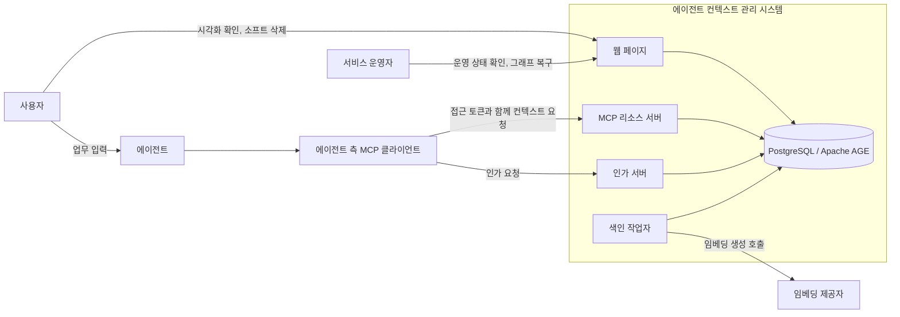
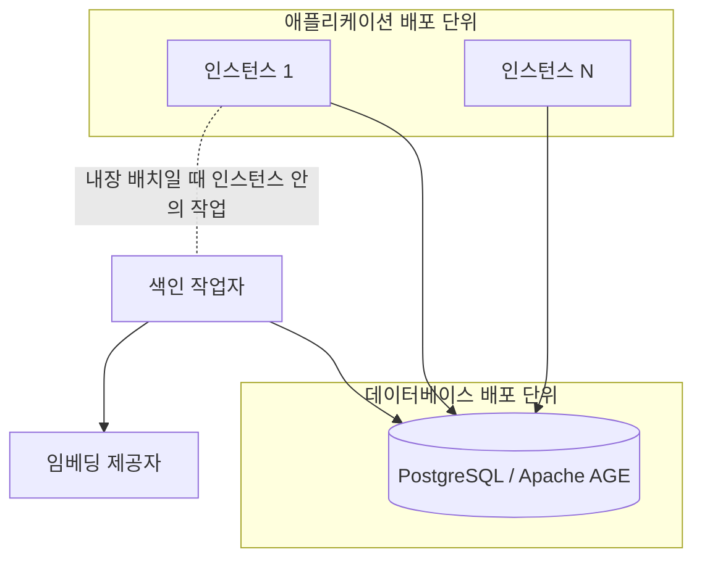

# 에이전트 컨텍스트 관리 시스템 상세 설계서

## 문서 정보

| 항목          | 내용                                                                       |
|---------------|----------------------------------------------------------------------------|
| 문서 상태     | 초안                                                                       |
| 최종 수정일   | 2026-08-25                                                                 |
| 서비스 식별자 | `AGENT_CONTEXT`                                                            |
| 담당 범위     | 확정된 요구사항의 아키텍처, 구성 요소, 인터페이스, 데이터 모델과 처리 흐름 |
| 주요 출처     | `SRS.md`, `reference.md`, 채택된 제안                                      |

## 설계 목적과 범위

이 문서는 `SRS.md`가 확정한 요구사항 129건과 비기능 요구사항 13건을 구현 가능한 설계로 구체화한다. 요구사항이 무엇을 해야 하는지 정했다면 이 문서는 그것을 어떤 구조로 만드는지 정한다.

`SRS.md`의 「목표와 비목표」가 `후속 기획`으로 미뤄 둔 세 항목을 이 문서가 인수한다.

| 인수 항목                                      | 담당 절                     |
|------------------------------------------------|-----------------------------|
| 배포 형상, 성능 목표와 운영 자동화의 상세 설계 | 「관측성, 배포와 운영」     |
| Apache AGE 그래프 스키마와 질의의 상세 설계    | 「데이터 모델과 저장 전략」 |
| 화면 배치와 시각 디자인의 상세 설계            | 「인터페이스와 API 계약」   |

다음은 이 문서의 범위가 아니다.

| 제외 항목               | 이유                                                                                  |
|-------------------------|---------------------------------------------------------------------------------------|
| 요구사항의 신설과 변경  | `SRS.md`가 소유한다. 설계 과정에서 요구사항 변경이 필요하면 `SRS.md`를 먼저 고친다    |
| 채택되지 않은 제안      | `SUG-AGENT_CONTEXT-14`는 `보류`이며 설계 입력으로 쓰지 않는다                         |
| 구현 코드               | 이 문서는 설계까지만 정한다                                                           |
| 검증의 지표와 합격 기준 | `SRS.md`의 「검증」이 이미 확정했다. 이 문서는 그 측정을 어디에서 수집하는지만 정한다 |

### 구현 기술 기준

구현 언어는 Go로 확정한다. 근거는 저장소 루트 `AGENTS.md`가 이미 Go 작성 기준을 계약으로 두고 있다는 것이다. `Effective Go`를 기준으로 삼고, `gofmt` 적용, 짧은 소문자 패키지 이름, 발생 지점 가까이에서의 오류 처리, 자원 획득 직후 `defer` 해제가 그대로 적용된다.

이 선택은 `SRS.md`가 정한 것이 아니라 이 문서의 설계 결정이다. `SRS.md`는 구현 언어를 정하지 않았으므로 요구사항 변경이 아니며, 언어를 바꾸면 이 문서의 「구성 요소 설계」만 다시 쓰면 된다.

`SRS.md`가 이미 확정해 그대로 쓰는 기술은 다음과 같다. 이 문서가 다시 선택하지 않는다.

| 기술             | 확정 위치                                        |
|------------------|--------------------------------------------------|
| PostgreSQL       | `NFR-AGENT_CONTEXT-001`, 「데이터 저장 제약」    |
| Apache AGE       | `NFR-AGENT_CONTEXT-001`, 「그래프 모델」         |
| pgvector         | 「임베딩 저장」                                  |
| Streamable HTTP  | `FR-AGENT_CONTEXT-095`, 「transport와 프로토콜」 |
| OAuth 2.1 + PKCE | `FR-AGENT_CONTEXT-090`, 「프로토콜 매핑」        |

웹 프레임워크, 데이터베이스 드라이버와 그 밖의 라이브러리는 이 문서에서 정하지 않고 「설계 미정 사항」에 남긴다. 근거가 되는 측정이나 제약이 아직 없기 때문이다.

## 설계 입력

| 우선순위 | 입력             | 사용 범위                                                        |
|----------|------------------|------------------------------------------------------------------|
| 필수     | `SRS.md`         | 범위, 요구사항, 상태, 정책, 제약과 추적 ID의 기준으로 사용한다   |
| 조건부   | `reference.md`   | 외부 계약과 기술 판단의 근거로만 사용한다. 현재 24건             |
| 조건부   | `suggestion.md`  | `상태`가 정확히 `채택`인 행만 사용한다. 현재 15건                |
| 조건부   | `logs/prompt.md` | 사용자 결정과 변경 맥락을 확인한다. `SRS.md`와 충돌하면 보고한다 |

설계 입력으로 쓰는 채택된 제안은 다음 15건이다.

`SUG-AGENT_CONTEXT-1`, `SUG-AGENT_CONTEXT-2`, `SUG-AGENT_CONTEXT-3`, `SUG-AGENT_CONTEXT-4`, `SUG-AGENT_CONTEXT-5`, `SUG-AGENT_CONTEXT-6`, `SUG-AGENT_CONTEXT-7`, `SUG-AGENT_CONTEXT-8`, `SUG-AGENT_CONTEXT-9`, `SUG-AGENT_CONTEXT-10`, `SUG-AGENT_CONTEXT-11`, `SUG-AGENT_CONTEXT-12`, `SUG-AGENT_CONTEXT-13`, `SUG-AGENT_CONTEXT-15`, `SUG-AGENT_CONTEXT-16`

`SUG-AGENT_CONTEXT-16`은 `SRS.md`에 이미 반영되어 있으므로 설계 입력으로는 `SRS.md`의 확정 문구를 따른다.

## 시스템 컨텍스트와 아키텍처

이 절은 시스템 경계를 정한다. 누가 시스템 밖에서 시스템에 닿는지, 시스템 안에 무엇이 있는지, 그것들이 어떤 배포 단위로 묶이는지를 확정한다. 내부 구성 요소를 Go 패키지로 나누는 일은 「구성 요소 설계」가 맡는다.

### 외부 경계

`SRS.md`의 「대상 사용자와 시스템 경계」가 확정한 대상을 설계 관점에서 다시 나눈다. 식별 단위와 통신 상대를 구분하는 것이 목적이다.

| 대상                       | 구분        | 시스템과의 관계                                                      |
|----------------------------|-------------|----------------------------------------------------------------------|
| 계정                       | 식별 단위   | 통신하지 않는다. 인증 주체이자 보관 정책의 판정 대상이다             |
| 작업자                     | 식별 단위   | 통신하지 않는다. 계정으로 식별하는 협업 단위다                       |
| 사용자                     | 외부 행위자 | 에이전트에 업무를 입력하고 웹 페이지로 시각화 확인과 삭제를 요청한다 |
| 에이전트                   | 외부 행위자 | 직접 통신하지 않고 MCP 클라이언트를 거친다                           |
| 에이전트 측 MCP 클라이언트 | 외부 행위자 | 토큰을 발급받고 보호된 MCP 요청을 보내는 유일한 기계 호출자다        |
| 서비스 운영자              | 외부 행위자 | 웹 페이지로 운영 상태를 보고 자동 소프트 삭제된 그래프를 복구한다    |
| 임베딩 제공자              | 외부 의존   | 색인 작업자만 호출한다. 요청 경로에 들어오지 않는다                  |
| 인가 서버                  | 시스템 내부 | 애플리케이션에 포함하며 필요하면 떼어낼 수 있다                      |

계정과 작업자를 외부 행위자로 두지 않는 이유는 둘이 통신 상대가 아니기 때문이다. 접근 토큰이 계정을 대표하므로 시스템이 실제로 상대하는 것은 토큰을 가진 MCP 클라이언트와 웹 브라우저이며, 계정은 그 요청에서 해석되는 값이다.

인가 서버를 시스템 안에 두는 이유는 `SRS.md`의 「배포 단위」가 애플리케이션에 묶었기 때문이다. 「대상 사용자와 시스템 경계」가 인증 서버를 "시스템 구성 요소"로 적은 것과 같은 판단이다.

경계를 지나는 흐름은 네 갈래다. 사용자와 운영자의 웹 요청, MCP 클라이언트의 인가 요청, MCP 클라이언트의 보호된 컨텍스트 요청, 색인 작업자의 임베딩 호출이다. 앞의 셋은 시스템으로 들어오고 마지막 하나만 시스템에서 나간다.

에이전트가 시스템과 직접 연결되지 않는 것이 중요하다. `SRS.md`가 인증과 요청 주체를 MCP 클라이언트로 확정했으므로 시스템은 에이전트를 알지 못하고 토큰이 대표하는 계정만 안다.

### 배포 형상

`SRS.md`의 「배포 단위」가 확정한 다섯 항목을 배포 경계로 옮긴다.

| 배포 단위     | 포함                                     | 확장 방식                                  |
|---------------|------------------------------------------|--------------------------------------------|
| 애플리케이션  | 웹 페이지, MCP 리소스 서버, 인가 서버    | 인스턴스를 늘린다                          |
| 데이터베이스  | PostgreSQL과 Apache AGE                  | 이 문서의 범위 밖이며 운영 구성으로 정한다 |
| 색인 작업자   | 임베딩 생성과 재시도                     | 애플리케이션 안에 두거나 분리해 늘린다     |

색인 작업자를 배포 단위 표에 두면서도 위 그림에서 두 배포 단위 밖에 그린 이유는 배치가 선택이기 때문이다. 애플리케이션 안의 작업으로 두면 애플리케이션 배포 단위에 속하고, 분리하면 독립 배포 단위가 된다. `SRS.md`가 요구한 것은 색인이 요청 경로 밖에서 처리된다는 것뿐이고 두 배치 모두 그것을 만족한다.

### 인스턴스 무상태성

애플리케이션 인스턴스를 늘려 확장할 수 있는 근거는 인스턴스가 요청 사이의 상태를 갖지 않는다는 것이다. 이것이 성립하려면 상태로 보일 수 있는 것들이 전부 인스턴스 밖에 있어야 한다.

| 상태 후보           | 배치                                    | 근거                                                       |
|---------------------|-----------------------------------------|------------------------------------------------------------|
| 프로토콜 세션       | 두지 않는다                             | 「transport와 프로토콜」이 handshake와 session을 없앴다    |
| 컨텍스트와 관계     | 데이터베이스                            | 「그래프 모델」                                            |
| 임베딩              | 데이터베이스                            | 「임베딩 저장」                                            |
| 발급 이력           | 두지 않는다                             | 「다중 인스턴스」가 비공유로 확정했다                      |
| JWKS와 폐기 목록    | 데이터베이스                            | 아래 설계 결정                                             |
| 색인 대기 작업      | 데이터베이스                            | 「색인 처리」가 저장과 작업 등록을 한 트랜잭션으로 묶었다  |

JWKS와 폐기 목록을 데이터베이스에 두는 것은 이 문서의 설계 결정이다. `SRS.md`는 이 둘을 인스턴스 사이 공유 대상으로만 확정하고 어디에 둘지는 정하지 않았다. 데이터베이스가 이미 공유 대상이므로 여기에 두면 새 공유 지점이 생기지 않는다. 별도의 공유 저장소를 두면 배포 단위가 하나 늘고 그 가용성이 인증 경로에 그대로 붙는데, 그럴 근거가 없다.

발급 이력을 두지 않으므로 토큰 갱신은 인스턴스가 조율하지 않는다. 만료 10초 전 구간에 서로 다른 인스턴스가 각자 새 토큰을 발급해도 둘 다 유효하며, 이는 `SRS.md`가 이미 확정한 동작이다.

### 배치 조합

두 구성 요소의 배치가 선택으로 열려 있고 서로 독립이다.

| 조합                             | 상시 프로세스 | 적합한 상황                          |
|----------------------------------|---------------|--------------------------------------|
| 색인 작업자 내장, 인가 서버 내장 | 1             | 최소 자원 구성. 기본값으로 삼는다    |
| 색인 작업자 분리, 인가 서버 내장 | 2             | 색인 부하가 요청 처리에 영향을 줄 때 |
| 색인 작업자 내장, 인가 서버 분리 | 2             | 인가를 다른 서비스와 공유해야 할 때  |
| 색인 작업자 분리, 인가 서버 분리 | 3             | 위 두 이유가 동시에 성립할 때        |

기본값을 모두 내장으로 두는 이유는 `SUG-AGENT_CONTEXT-12`가 채택된 근거와 같다. 요구는 색인이 요청 경로 밖에서 처리된다는 것이지 별도 프로세스가 아니며, 최소 구성에서 상시 프로세스를 줄이는 편이 낫다. 어느 조합이든 같은 코드로 성립해야 하므로 색인 작업자와 인가 서버는 프로세스 경계가 아니라 호출 경계로 분리한다. 구체적인 경계는 「구성 요소 설계」가 정한다.

### 설계 결정

| 결정                                                                                     | 근거 요구사항                                   |
|------------------------------------------------------------------------------------------|-------------------------------------------------|
| 시스템 경계 안에 웹 페이지, MCP 리소스 서버, 인가 서버, 색인 작업자, 데이터베이스를 둔다 | `FR-AGENT_CONTEXT-001`, `FR-AGENT_CONTEXT-002`  |
| 임베딩 제공자를 외부 의존으로 두고 요청 경로에서 뺀다                                    | `FR-AGENT_CONTEXT-096`, `FR-AGENT_CONTEXT-097`  |
| 애플리케이션과 데이터베이스를 별도 배포 단위로 둔다                                      | `FR-AGENT_CONTEXT-096`                          |
| 인스턴스 사이 공유 지점을 데이터베이스 하나로 제한한다                                   | `FR-AGENT_CONTEXT-094`, `NFR-AGENT_CONTEXT-012` |
| JWKS와 폐기 목록을 데이터베이스에 둔다                                                   | `FR-AGENT_CONTEXT-094`                          |
| 색인 작업자와 인가 서버를 호출 경계로 분리해 네 배치 조합을 모두 지원한다                | `FR-AGENT_CONTEXT-096`, `SUG-AGENT_CONTEXT-12`  |

## 구성 요소 설계

이 절은 애플리케이션 내부를 Go 패키지 경계로 나누고 각 패키지의 책임과 의존 방향을 정한다. `SRS.md`가 하나의 배포 단위로 묶은 웹 페이지, MCP 리소스 서버와 인가 서버가 한 프로세스 안에서 어떻게 분리되는지, 색인 작업자를 같은 프로세스에 두는 구성과 떼어내는 구성이 같은 코드로 성립하는지를 다룬다. 계정 플랜의 값을 읽는 지점도 여기에서 정한다.

## 주요 처리 흐름과 상태

이 절은 요청이 들어와 응답이 나가기까지의 단계와 그 사이의 상태 전이를 정한다. 컨텍스트 저장과 색인 등록, 작업 컨텍스트 흐름 조회의 네 채널 실행과 결합, 파생 생성과 근거 무효화, 사건 재구성, 소프트 삭제 수명주기가 대상이다. 상태 전이가 있는 흐름은 다이어그램을 함께 둔다.

## 인터페이스와 API 계약

이 절은 MCP 연산 13종과 웹 화면의 계약을 정한다. 각 연산의 책임, 입력, 출력, 오류, 필요한 권한 등급, 멱등성과 트랜잭션 경계를 명시한다. `SRS.md`의 「MCP 연산 매핑」이 정한 연산 이름과 파라미터를 그대로 쓰고 여기에 계약을 붙인다. 웹 화면은 배치와 시각 디자인까지 다룬다.

## 데이터 모델과 저장 전략

이 절은 `SRS.md`의 「컨텍스트 모델」이 정한 논리 모델을 실제 스키마로 옮긴다. 단일 Apache AGE 그래프의 vertex label과 edge label, `graph_id` 속성에 의한 격리, AGE 그래프 밖의 임베딩 테이블과 메타데이터 테이블, 인덱스 설계, 저장 계층화가 대상이다. openCypher로 처리하는 탐색과 SQL로 처리하는 나머지 질의의 경계도 여기에서 정한다.

## 오류, 복구, 보안과 권한

이 절은 오류 코드 9종이 어느 계층에서 만들어지고 어떻게 전달되는지, 낙관적 잠금의 검사 지점과 실패 처리, 토큰 검증과 등급 검사의 위치, 기억 오염 방어의 세 지점을 정한다. `SRS.md`의 「예외와 오류 처리」가 상황과 코드의 대응을 이미 확정했으므로 이 절은 그 대응이 코드 경로 어디에서 성립하는지를 다룬다.

## 관측성, 배포와 운영

이 절은 「측정」이 정한 지표를 어디에서 수집하고 어떻게 내보내는지, 감사 기록의 저장 형식, 배포 형상과 확장 방식, 재색인 절차, 백업과 복구를 정한다. `SRS.md`가 `후속 기획`으로 미뤄 둔 배포 형상과 운영 자동화를 여기에서 확정한다.

## 비기능 요구사항 설계

이 절은 비기능 요구사항 13건을 검증 가능한 설계 요소에 연결한다. 「검증」이 데이터셋과 지표, 합격 기준을 이미 확정했으므로 이 절은 그 판정을 실제로 수행할 수 있는 구조가 설계에 있는지를 보인다.

## 요구사항 추적표

`SRS.md`의 설계 대상 요구사항 142건을 모두 담는다. 반영 위치는 해당 요구사항을 다룰 절이며, 절을 작성하면 설계 요소와 검증 방법을 채우고 상태를 `반영`으로 바꾼다.

| 요구사항 ID             | 요구사항명       | 설계 반영 위치              | 설계 요소                                               | 검증 방법                                                                | 상태   |
|-------------------------|------------------|-----------------------------|---------------------------------------------------------|--------------------------------------------------------------------------|--------|
| `FR-AGENT_CONTEXT-001`  | 핵심 기능        | 「외부 경계」               | 컨텍스트 관리 책임을 시스템 경계 안에 둔 구성           | 경계 표와 컨텍스트 다이어그램에 관리 책임이 빠짐없이 들어갔는지 검토     | 반영   |
| `FR-AGENT_CONTEXT-002`  | 외부 연동        | 「외부 경계」               | MCP 리소스 서버와 보호된 요청 경로                      | 경계를 지나는 네 흐름 중 MCP 요청이 리소스 서버로만 들어오는지 검토      | 반영   |
| `FR-AGENT_CONTEXT-003`  | 관계 관리        | 「데이터 모델과 저장 전략」 | -                                                       | -                                                                        | 미작성 |
| `FR-AGENT_CONTEXT-004`  | 정보 계층        | 「데이터 모델과 저장 전략」 | -                                                       | -                                                                        | 미작성 |
| `FR-AGENT_CONTEXT-005`  | 관계 관리        | 「데이터 모델과 저장 전략」 | -                                                       | -                                                                        | 미작성 |
| `FR-AGENT_CONTEXT-006`  | 수명주기         | 「주요 처리 흐름과 상태」   | -                                                       | -                                                                        | 미작성 |
| `FR-AGENT_CONTEXT-007`  | 검색             | 「주요 처리 흐름과 상태」   | -                                                       | -                                                                        | 미작성 |
| `FR-AGENT_CONTEXT-008`  | 검색             | 「주요 처리 흐름과 상태」   | -                                                       | -                                                                        | 미작성 |
| `FR-AGENT_CONTEXT-009`  | 관계 관리        | 「데이터 모델과 저장 전략」 | -                                                       | -                                                                        | 미작성 |
| `FR-AGENT_CONTEXT-010`  | 수명주기         | 「주요 처리 흐름과 상태」   | -                                                       | -                                                                        | 미작성 |
| `FR-AGENT_CONTEXT-011`  | 정보 계층        | 「데이터 모델과 저장 전략」 | -                                                       | -                                                                        | 미작성 |
| `FR-AGENT_CONTEXT-012`  | 컨텍스트 조회    | 「인터페이스와 API 계약」   | -                                                       | -                                                                        | 미작성 |
| `FR-AGENT_CONTEXT-013`  | 업무 연속성      | 「주요 처리 흐름과 상태」   | -                                                       | -                                                                        | 미작성 |
| `FR-AGENT_CONTEXT-014`  | 시각화           | 「인터페이스와 API 계약」   | -                                                       | -                                                                        | 미작성 |
| `FR-AGENT_CONTEXT-015`  | 공동 접근        | 「오류, 복구, 보안과 권한」 | -                                                       | -                                                                        | 미작성 |
| `FR-AGENT_CONTEXT-016`  | 컨텍스트 공유    | 「오류, 복구, 보안과 권한」 | -                                                       | -                                                                        | 미작성 |
| `FR-AGENT_CONTEXT-017`  | 협업             | 「오류, 복구, 보안과 권한」 | -                                                       | -                                                                        | 미작성 |
| `FR-AGENT_CONTEXT-018`  | 컨텍스트 흐름    | 「주요 처리 흐름과 상태」   | -                                                       | -                                                                        | 미작성 |
| `FR-AGENT_CONTEXT-019`  | 그래프 목록      | 「인터페이스와 API 계약」   | -                                                       | -                                                                        | 미작성 |
| `FR-AGENT_CONTEXT-020`  | 그래프 생성      | 「인터페이스와 API 계약」   | -                                                       | -                                                                        | 미작성 |
| `FR-AGENT_CONTEXT-021`  | 그래프 조회      | 「인터페이스와 API 계약」   | -                                                       | -                                                                        | 미작성 |
| `FR-AGENT_CONTEXT-022`  | 그래프 수정      | 「인터페이스와 API 계약」   | -                                                       | -                                                                        | 미작성 |
| `FR-AGENT_CONTEXT-023`  | 노드 생성        | 「인터페이스와 API 계약」   | -                                                       | -                                                                        | 미작성 |
| `FR-AGENT_CONTEXT-024`  | 노드 조회        | 「인터페이스와 API 계약」   | -                                                       | -                                                                        | 미작성 |
| `FR-AGENT_CONTEXT-025`  | 노드 수정        | 「인터페이스와 API 계약」   | -                                                       | -                                                                        | 미작성 |
| `FR-AGENT_CONTEXT-026`  | 삭제 경계        | 「인터페이스와 API 계약」   | -                                                       | -                                                                        | 미작성 |
| `FR-AGENT_CONTEXT-027`  | 토큰 발급        | 「오류, 복구, 보안과 권한」 | -                                                       | -                                                                        | 미작성 |
| `FR-AGENT_CONTEXT-028`  | 요청 인증        | 「오류, 복구, 보안과 권한」 | -                                                       | -                                                                        | 미작성 |
| `FR-AGENT_CONTEXT-029`  | 토큰 만료        | 「오류, 복구, 보안과 권한」 | -                                                       | -                                                                        | 미작성 |
| `FR-AGENT_CONTEXT-030`  | 토큰 자동 갱신   | 「오류, 복구, 보안과 권한」 | -                                                       | -                                                                        | 미작성 |
| `FR-AGENT_CONTEXT-031`  | 기본 보관        | 「주요 처리 흐름과 상태」   | -                                                       | -                                                                        | 미작성 |
| `FR-AGENT_CONTEXT-032`  | 보관 유예        | 「주요 처리 흐름과 상태」   | -                                                       | -                                                                        | 미작성 |
| `FR-AGENT_CONTEXT-033`  | 소프트 삭제      | 「주요 처리 흐름과 상태」   | -                                                       | -                                                                        | 미작성 |
| `FR-AGENT_CONTEXT-034`  | 정보 계층        | 「데이터 모델과 저장 전략」 | -                                                       | -                                                                        | 미작성 |
| `FR-AGENT_CONTEXT-035`  | 식별             | 「데이터 모델과 저장 전략」 | -                                                       | -                                                                        | 미작성 |
| `FR-AGENT_CONTEXT-036`  | 불변성           | 「데이터 모델과 저장 전략」 | -                                                       | -                                                                        | 미작성 |
| `FR-AGENT_CONTEXT-037`  | 작업자 식별      | 「오류, 복구, 보안과 권한」 | -                                                       | -                                                                        | 미작성 |
| `FR-AGENT_CONTEXT-038`  | 격리             | 「오류, 복구, 보안과 권한」 | -                                                       | -                                                                        | 미작성 |
| `FR-AGENT_CONTEXT-039`  | 권한 등급        | 「오류, 복구, 보안과 권한」 | -                                                       | -                                                                        | 미작성 |
| `FR-AGENT_CONTEXT-040`  | 권한 상속        | 「오류, 복구, 보안과 권한」 | -                                                       | -                                                                        | 미작성 |
| `FR-AGENT_CONTEXT-041`  | 권한 관리        | 「오류, 복구, 보안과 권한」 | -                                                       | -                                                                        | 미작성 |
| `FR-AGENT_CONTEXT-042`  | 소유권 이전      | 「오류, 복구, 보안과 권한」 | -                                                       | -                                                                        | 미작성 |
| `FR-AGENT_CONTEXT-043`  | 팀 관리          | 「오류, 복구, 보안과 권한」 | -                                                       | -                                                                        | 미작성 |
| `FR-AGENT_CONTEXT-044`  | 동시 갱신        | 「주요 처리 흐름과 상태」   | -                                                       | -                                                                        | 미작성 |
| `FR-AGENT_CONTEXT-045`  | 버전 관리        | 「주요 처리 흐름과 상태」   | -                                                       | -                                                                        | 미작성 |
| `FR-AGENT_CONTEXT-046`  | 수명주기         | 「주요 처리 흐름과 상태」   | -                                                       | -                                                                        | 미작성 |
| `FR-AGENT_CONTEXT-047`  | 감사             | 「관측성, 배포와 운영」     | -                                                       | -                                                                        | 미작성 |
| `FR-AGENT_CONTEXT-048`  | 검색             | 「주요 처리 흐름과 상태」   | -                                                       | -                                                                        | 미작성 |
| `FR-AGENT_CONTEXT-049`  | 그래프 속성      | 「데이터 모델과 저장 전략」 | -                                                       | -                                                                        | 미작성 |
| `FR-AGENT_CONTEXT-050`  | 목록 조회        | 「인터페이스와 API 계약」   | -                                                       | -                                                                        | 미작성 |
| `FR-AGENT_CONTEXT-051`  | 그래프 검증      | 「인터페이스와 API 계약」   | -                                                       | -                                                                        | 미작성 |
| `FR-AGENT_CONTEXT-052`  | 홉 조회          | 「인터페이스와 API 계약」   | -                                                       | -                                                                        | 미작성 |
| `FR-AGENT_CONTEXT-053`  | 순환 처리        | 「인터페이스와 API 계약」   | -                                                       | -                                                                        | 미작성 |
| `FR-AGENT_CONTEXT-054`  | 결과 상한        | 「인터페이스와 API 계약」   | -                                                       | -                                                                        | 미작성 |
| `FR-AGENT_CONTEXT-055`  | 이용 한도        | 「인터페이스와 API 계약」   | -                                                       | -                                                                        | 미작성 |
| `FR-AGENT_CONTEXT-056`  | 연산 매핑        | 「인터페이스와 API 계약」   | -                                                       | -                                                                        | 미작성 |
| `FR-AGENT_CONTEXT-057`  | 오류 응답        | 「오류, 복구, 보안과 권한」 | -                                                       | -                                                                        | 미작성 |
| `FR-AGENT_CONTEXT-058`  | 입력 검증        | 「인터페이스와 API 계약」   | -                                                       | -                                                                        | 미작성 |
| `FR-AGENT_CONTEXT-059`  | 연결 생성        | 「주요 처리 흐름과 상태」   | -                                                       | -                                                                        | 미작성 |
| `FR-AGENT_CONTEXT-060`  | 재구성           | 「주요 처리 흐름과 상태」   | -                                                       | -                                                                        | 미작성 |
| `FR-AGENT_CONTEXT-061`  | 충족 기준        | 「비기능 요구사항 설계」    | -                                                       | -                                                                        | 미작성 |
| `FR-AGENT_CONTEXT-062`  | 파생 생성        | 「주요 처리 흐름과 상태」   | -                                                       | -                                                                        | 미작성 |
| `FR-AGENT_CONTEXT-063`  | 요약 범위        | 「주요 처리 흐름과 상태」   | -                                                       | -                                                                        | 미작성 |
| `FR-AGENT_CONTEXT-064`  | 근거 무효화      | 「주요 처리 흐름과 상태」   | -                                                       | -                                                                        | 미작성 |
| `FR-AGENT_CONTEXT-065`  | 오류 매핑        | 「오류, 복구, 보안과 권한」 | -                                                       | -                                                                        | 미작성 |
| `FR-AGENT_CONTEXT-066`  | 부분 상태        | 「오류, 복구, 보안과 권한」 | -                                                       | -                                                                        | 미작성 |
| `FR-AGENT_CONTEXT-067`  | 시간 유효성      | 「데이터 모델과 저장 전략」 | -                                                       | -                                                                        | 미작성 |
| `FR-AGENT_CONTEXT-068`  | 만료 취급        | 「데이터 모델과 저장 전략」 | -                                                       | -                                                                        | 미작성 |
| `FR-AGENT_CONTEXT-069`  | 폐기와 복구      | 「인터페이스와 API 계약」   | -                                                       | -                                                                        | 미작성 |
| `FR-AGENT_CONTEXT-070`  | 자동화 범위      | 「주요 처리 흐름과 상태」   | -                                                       | -                                                                        | 미작성 |
| `FR-AGENT_CONTEXT-071`  | 기록 보존        | 「데이터 모델과 저장 전략」 | -                                                       | -                                                                        | 미작성 |
| `FR-AGENT_CONTEXT-072`  | 사건 경계        | 「데이터 모델과 저장 전략」 | -                                                       | -                                                                        | 미작성 |
| `FR-AGENT_CONTEXT-073`  | 사건 관계        | 「데이터 모델과 저장 전략」 | -                                                       | -                                                                        | 미작성 |
| `FR-AGENT_CONTEXT-074`  | 관계 상태        | 「데이터 모델과 저장 전략」 | -                                                       | -                                                                        | 미작성 |
| `FR-AGENT_CONTEXT-075`  | 관계 연산        | 「인터페이스와 API 계약」   | -                                                       | -                                                                        | 미작성 |
| `FR-AGENT_CONTEXT-076`  | 사건 재구성      | 「주요 처리 흐름과 상태」   | -                                                       | -                                                                        | 미작성 |
| `FR-AGENT_CONTEXT-077`  | 근거 상태        | 「데이터 모델과 저장 전략」 | -                                                       | -                                                                        | 미작성 |
| `FR-AGENT_CONTEXT-078`  | 신뢰 상태        | 「데이터 모델과 저장 전략」 | -                                                       | -                                                                        | 미작성 |
| `FR-AGENT_CONTEXT-079`  | 상충 처리        | 「데이터 모델과 저장 전략」 | -                                                       | -                                                                        | 미작성 |
| `FR-AGENT_CONTEXT-080`  | 검색 결합        | 「주요 처리 흐름과 상태」   | -                                                       | -                                                                        | 미작성 |
| `FR-AGENT_CONTEXT-081`  | 검색 색인        | 「주요 처리 흐름과 상태」   | -                                                       | -                                                                        | 미작성 |
| `FR-AGENT_CONTEXT-082`  | 만료 조회        | 「인터페이스와 API 계약」   | -                                                       | -                                                                        | 미작성 |
| `FR-AGENT_CONTEXT-083`  | 국소와 전역      | 「주요 처리 흐름과 상태」   | -                                                       | -                                                                        | 미작성 |
| `FR-AGENT_CONTEXT-084`  | 관계 제안 신호   | 「주요 처리 흐름과 상태」   | -                                                       | -                                                                        | 미작성 |
| `FR-AGENT_CONTEXT-085`  | 검색 예산        | 「주요 처리 흐름과 상태」   | -                                                       | -                                                                        | 미작성 |
| `FR-AGENT_CONTEXT-086`  | 예산 배분        | 「주요 처리 흐름과 상태」   | -                                                       | -                                                                        | 미작성 |
| `FR-AGENT_CONTEXT-087`  | 검색 측정        | 「관측성, 배포와 운영」     | -                                                       | -                                                                        | 미작성 |
| `FR-AGENT_CONTEXT-088`  | 흐름 응답        | 「인터페이스와 API 계약」   | -                                                       | -                                                                        | 미작성 |
| `FR-AGENT_CONTEXT-089`  | 흐름 절단        | 「인터페이스와 API 계약」   | -                                                       | -                                                                        | 미작성 |
| `FR-AGENT_CONTEXT-090`  | 인증 흐름        | 「오류, 복구, 보안과 권한」 | -                                                       | -                                                                        | 미작성 |
| `FR-AGENT_CONTEXT-091`  | 계정 매핑        | 「오류, 복구, 보안과 권한」 | -                                                       | -                                                                        | 미작성 |
| `FR-AGENT_CONTEXT-092`  | 갱신 정책        | 「오류, 복구, 보안과 권한」 | -                                                       | -                                                                        | 미작성 |
| `FR-AGENT_CONTEXT-093`  | 토큰 검증        | 「오류, 복구, 보안과 권한」 | -                                                       | -                                                                        | 미작성 |
| `FR-AGENT_CONTEXT-094`  | 다중 인스턴스    | 「인스턴스 무상태성」       | 상태 후보 배치 표, JWKS와 폐기 목록의 데이터베이스 배치 | 두 인스턴스에 교차로 요청해 결과가 같고 발급 이력을 공유하지 않는지 확인 | 반영   |
| `FR-AGENT_CONTEXT-095`  | transport        | 「인터페이스와 API 계약」   | -                                                       | -                                                                        | 미작성 |
| `FR-AGENT_CONTEXT-096`  | 배포 단위        | 「배포 형상」               | 애플리케이션·데이터베이스 분리와 네 배치 조합           | 네 조합을 각각 기동해 색인이 요청 경로 밖에서 처리되는지 확인            | 반영   |
| `FR-AGENT_CONTEXT-097`  | 색인 처리        | 「주요 처리 흐름과 상태」   | -                                                       | -                                                                        | 미작성 |
| `FR-AGENT_CONTEXT-098`  | 임베딩 모델      | 「데이터 모델과 저장 전략」 | -                                                       | -                                                                        | 미작성 |
| `FR-AGENT_CONTEXT-099`  | 관측성           | 「관측성, 배포와 운영」     | -                                                       | -                                                                        | 미작성 |
| `FR-AGENT_CONTEXT-100`  | 그래프 배치      | 「데이터 모델과 저장 전략」 | -                                                       | -                                                                        | 미작성 |
| `FR-AGENT_CONTEXT-101`  | 격리 강제        | 「데이터 모델과 저장 전략」 | -                                                       | -                                                                        | 미작성 |
| `FR-AGENT_CONTEXT-102`  | 정점과 간선 사상 | 「데이터 모델과 저장 전략」 | -                                                       | -                                                                        | 미작성 |
| `FR-AGENT_CONTEXT-103`  | 관계의 시간      | 「데이터 모델과 저장 전략」 | -                                                       | -                                                                        | 미작성 |
| `FR-AGENT_CONTEXT-104`  | 색인 저장과 질의 | 「데이터 모델과 저장 전략」 | -                                                       | -                                                                        | 미작성 |
| `FR-AGENT_CONTEXT-105`  | 웹 화면 구성     | 「인터페이스와 API 계약」   | -                                                       | -                                                                        | 미작성 |
| `FR-AGENT_CONTEXT-106`  | 권한 화면        | 「인터페이스와 API 계약」   | -                                                       | -                                                                        | 미작성 |
| `FR-AGENT_CONTEXT-107`  | 삭제 확인        | 「인터페이스와 API 계약」   | -                                                       | -                                                                        | 미작성 |
| `FR-AGENT_CONTEXT-108`  | 운영자 복구      | 「관측성, 배포와 운영」     | -                                                       | -                                                                        | 미작성 |
| `FR-AGENT_CONTEXT-109`  | 웹 감사 기록     | 「관측성, 배포와 운영」     | -                                                       | -                                                                        | 미작성 |
| `FR-AGENT_CONTEXT-110`  | 시각화 제공      | 「인터페이스와 API 계약」   | -                                                       | -                                                                        | 미작성 |
| `FR-AGENT_CONTEXT-111`  | 시각화 표시      | 「인터페이스와 API 계약」   | -                                                       | -                                                                        | 미작성 |
| `FR-AGENT_CONTEXT-112`  | 검증 원칙        | 「비기능 요구사항 설계」    | -                                                       | -                                                                        | 미작성 |
| `FR-AGENT_CONTEXT-113`  | 검색 품질 평가   | 「비기능 요구사항 설계」    | -                                                       | -                                                                        | 미작성 |
| `FR-AGENT_CONTEXT-114`  | 그래프 효과 비교 | 「비기능 요구사항 설계」    | -                                                       | -                                                                        | 미작성 |
| `FR-AGENT_CONTEXT-115`  | 지속 평가        | 「비기능 요구사항 설계」    | -                                                       | -                                                                        | 미작성 |
| `FR-AGENT_CONTEXT-116`  | 업무 효과 평가   | 「비기능 요구사항 설계」    | -                                                       | -                                                                        | 미작성 |
| `FR-AGENT_CONTEXT-117`  | 플랜 항목        | 「구성 요소 설계」          | -                                                       | -                                                                        | 미작성 |
| `FR-AGENT_CONTEXT-118`  | 플랜 변경        | 「구성 요소 설계」          | -                                                       | -                                                                        | 미작성 |
| `FR-AGENT_CONTEXT-119`  | 한도 초과        | 「구성 요소 설계」          | -                                                       | -                                                                        | 미작성 |
| `FR-AGENT_CONTEXT-120`  | 기록 보존 하한   | 「데이터 모델과 저장 전략」 | -                                                       | -                                                                        | 미작성 |
| `FR-AGENT_CONTEXT-121`  | 벡터 압축        | 「데이터 모델과 저장 전략」 | -                                                       | -                                                                        | 미작성 |
| `FR-AGENT_CONTEXT-122`  | 색인 대상 비교   | 「비기능 요구사항 설계」    | -                                                       | -                                                                        | 미작성 |
| `FR-AGENT_CONTEXT-123`  | 저장 계층화      | 「데이터 모델과 저장 전략」 | -                                                       | -                                                                        | 미작성 |
| `FR-AGENT_CONTEXT-124`  | 출처 구분        | 「오류, 복구, 보안과 권한」 | -                                                       | -                                                                        | 미작성 |
| `FR-AGENT_CONTEXT-125`  | 출처 전달        | 「오류, 복구, 보안과 권한」 | -                                                       | -                                                                        | 미작성 |
| `FR-AGENT_CONTEXT-126`  | 오염 사후 탐지   | 「오류, 복구, 보안과 권한」 | -                                                       | -                                                                        | 미작성 |
| `FR-AGENT_CONTEXT-127`  | 중복 파생 접기   | 「주요 처리 흐름과 상태」   | -                                                       | -                                                                        | 미작성 |
| `FR-AGENT_CONTEXT-128`  | 채널 실행 방식   | 「구성 요소 설계」          | -                                                       | -                                                                        | 미작성 |
| `FR-AGENT_CONTEXT-129`  | 검색 채널 의존   | 「주요 처리 흐름과 상태」   | -                                                       | -                                                                        | 미작성 |
| `NFR-AGENT_CONTEXT-001` | 데이터 저장      | 「데이터 모델과 저장 전략」 | -                                                       | -                                                                        | 미작성 |
| `NFR-AGENT_CONTEXT-002` | 추적성           | 「비기능 요구사항 설계」    | -                                                       | -                                                                        | 미작성 |
| `NFR-AGENT_CONTEXT-003` | 설명 가능성      | 「비기능 요구사항 설계」    | -                                                       | -                                                                        | 미작성 |
| `NFR-AGENT_CONTEXT-004` | 검증 가능성      | 「비기능 요구사항 설계」    | -                                                       | -                                                                        | 미작성 |
| `NFR-AGENT_CONTEXT-005` | 검증 가능성      | 「비기능 요구사항 설계」    | -                                                       | -                                                                        | 미작성 |
| `NFR-AGENT_CONTEXT-006` | 효율성           | 「비기능 요구사항 설계」    | -                                                       | -                                                                        | 미작성 |
| `NFR-AGENT_CONTEXT-007` | 신뢰성           | 「비기능 요구사항 설계」    | -                                                       | -                                                                        | 미작성 |
| `NFR-AGENT_CONTEXT-008` | 검증 가능성      | 「비기능 요구사항 설계」    | -                                                       | -                                                                        | 미작성 |
| `NFR-AGENT_CONTEXT-009` | 효과성           | 「비기능 요구사항 설계」    | -                                                       | -                                                                        | 미작성 |
| `NFR-AGENT_CONTEXT-010` | 감사 가능성      | 「비기능 요구사항 설계」    | -                                                       | -                                                                        | 미작성 |
| `NFR-AGENT_CONTEXT-011` | 일관성           | 「비기능 요구사항 설계」    | -                                                       | -                                                                        | 미작성 |
| `NFR-AGENT_CONTEXT-012` | 연결 독립성      | 「인스턴스 무상태성」       | 프로토콜 세션 부재와 인스턴스 밖 상태 배치              | 인스턴스를 재시작한 뒤 같은 요청이 같은 결과를 주는지 확인               | 반영   |
| `NFR-AGENT_CONTEXT-013` | 토큰 기밀성      | 「오류, 복구, 보안과 권한」 | -                                                       | -                                                                        | 미작성 |

## 설계 미정 사항

근거가 부족해 이 문서가 확정하지 않은 항목이다. 식별자는 `SRS.md`가 쓴 `TBD-AGENT_CONTEXT-001`~`039`에 이어 `040`부터 부여한다.

| ID                      | 항목                              | 선택지와 영향                                                                                                            | 정하는 시점               |
|-------------------------|-----------------------------------|--------------------------------------------------------------------------------------------------------------------------|---------------------------|
| `TBD-AGENT_CONTEXT-040` | HTTP 서버와 라우팅 라이브러리     | 표준 라이브러리만 쓰거나 외부 라우터를 쓴다. Streamable HTTP는 요청당 단일 응답이라 어느 쪽이든 성립하므로 근거가 약하다 | 「구성 요소 설계」        |
| `TBD-AGENT_CONTEXT-041` | 데이터베이스 드라이버와 커넥션 풀 | openCypher 질의를 AGE 확장으로 보내는 방식과 커넥션 수명 관리 방식이 함께 걸린다                                         | 「구성 요소 설계」        |
| `TBD-AGENT_CONTEXT-042` | 인가 서버의 구현 방식             | OAuth 2.1 인가 서버를 직접 구현하거나 기존 구현을 붙인다. 「프로토콜 매핑」이 분리 가능성을 열어 두었다                  | 「구성 요소 설계」        |
| `TBD-AGENT_CONTEXT-043` | 색인 작업 큐의 구현 방식          | 데이터베이스 테이블을 큐로 쓰거나 외부 큐를 둔다. 저장과 작업 등록을 한 트랜잭션으로 묶는 확정이 선택을 제약한다         | 「주요 처리 흐름과 상태」 |

이 목록은 절을 작성하며 늘어날 수 있다. 확정되면 해당 절로 옮기고 이 표에서 뺀다.
