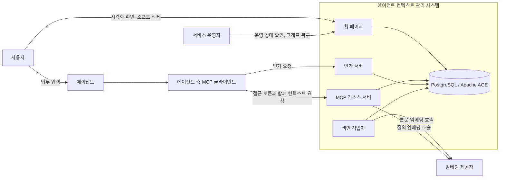
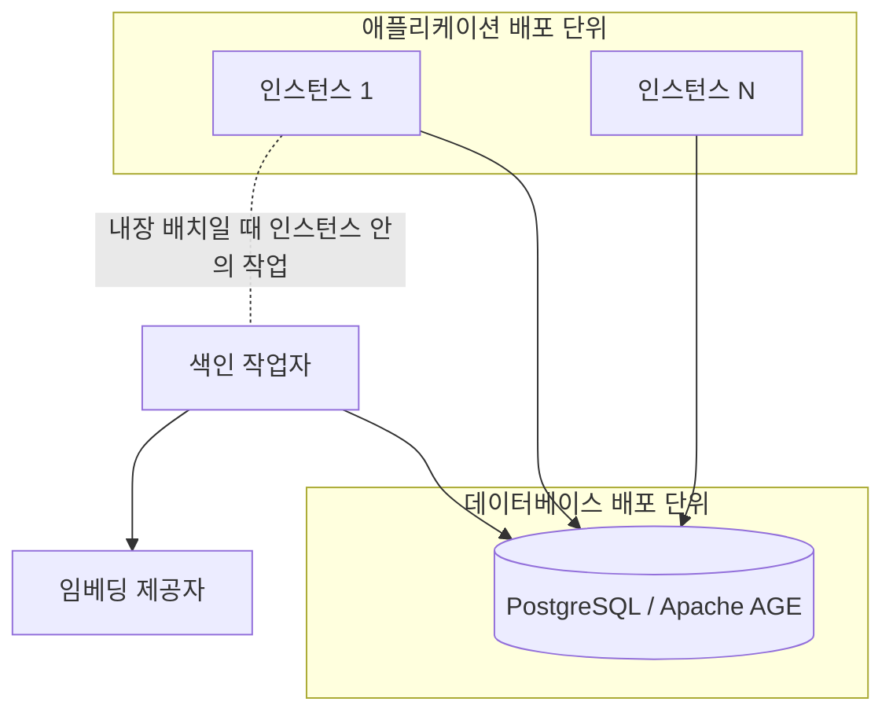
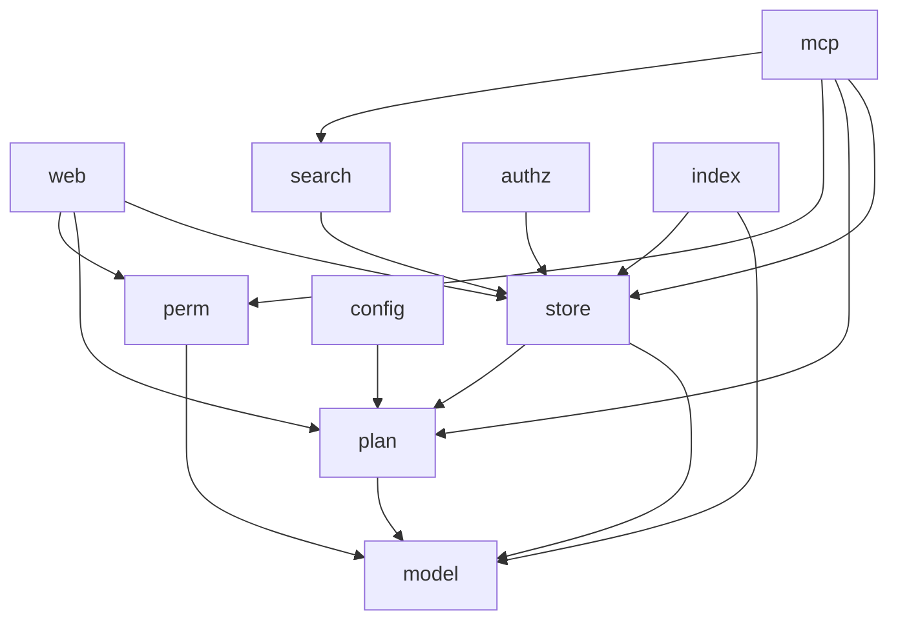
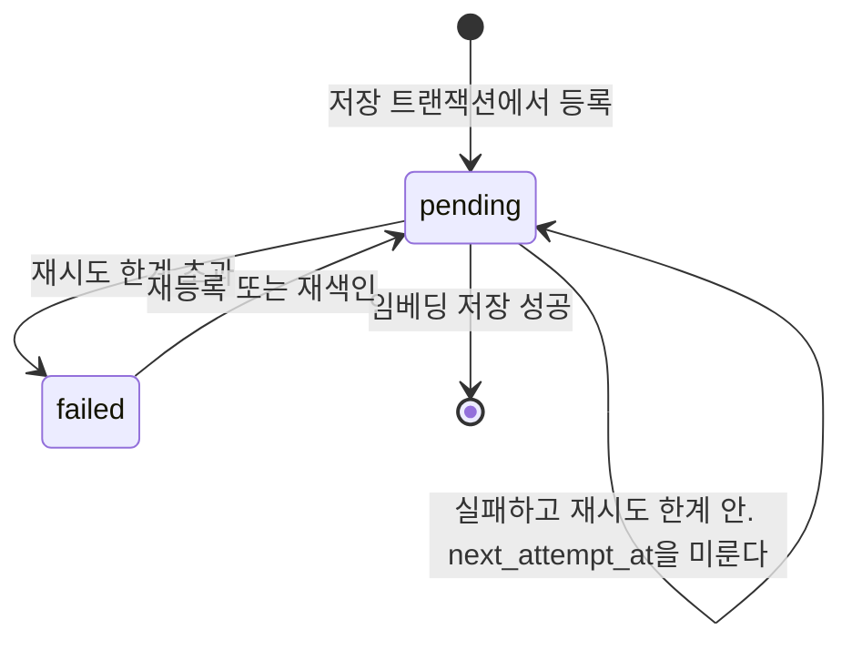
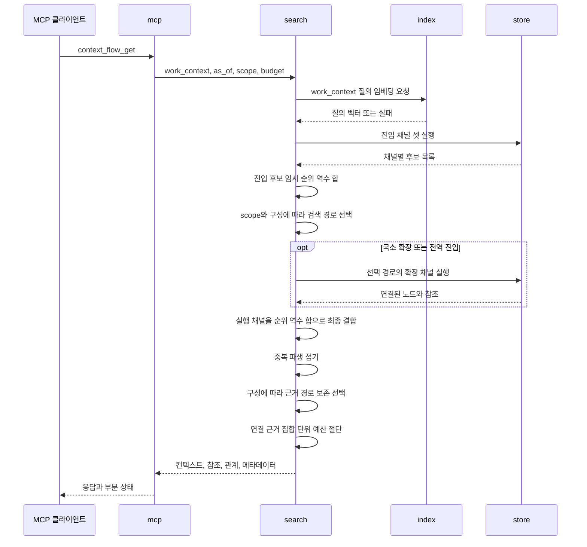
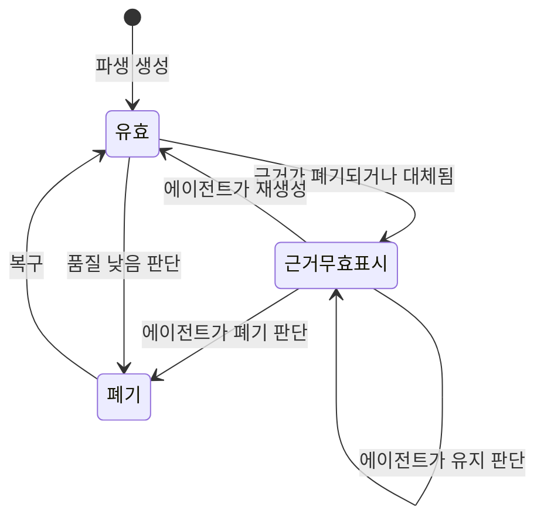
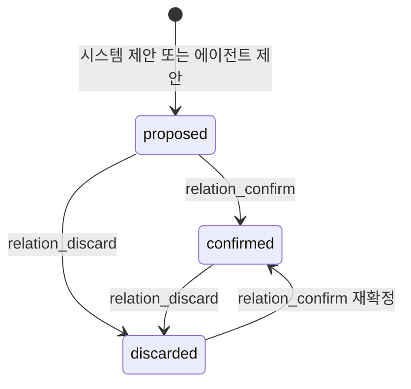
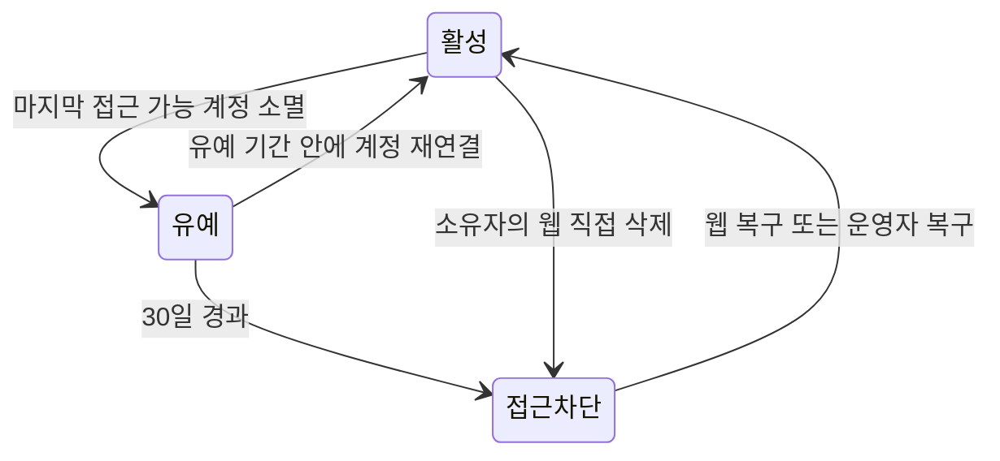
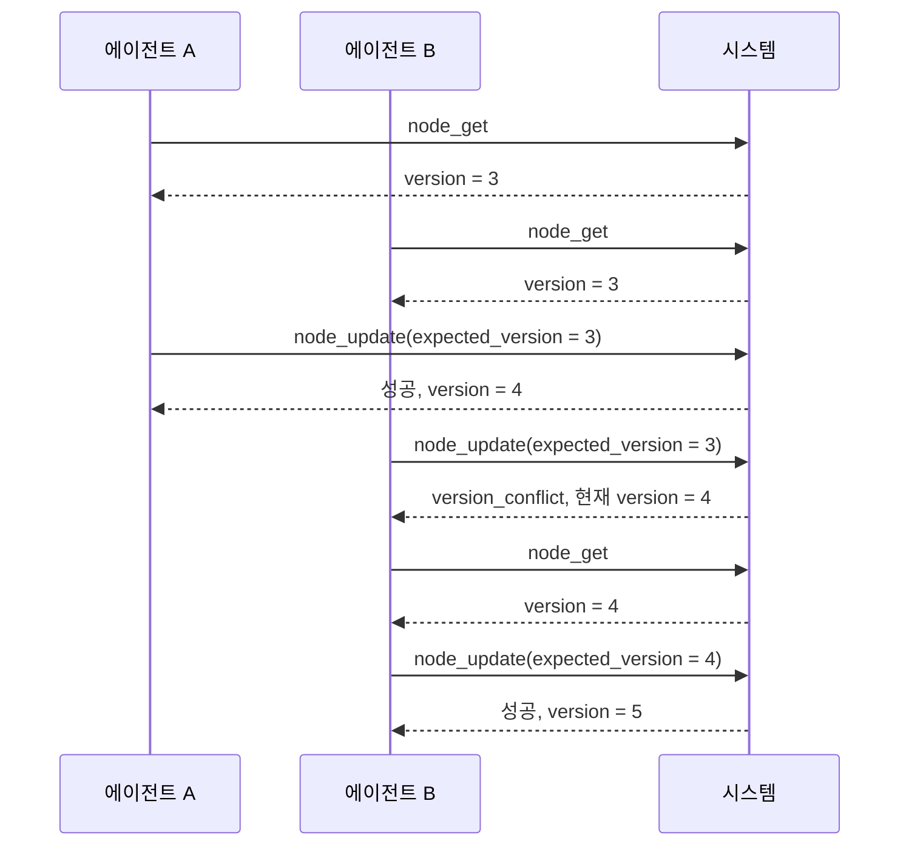

# 에이전트 컨텍스트 관리 시스템 상세 설계서

## 문서 정보

| 항목          | 내용                                                                       |
|---------------|----------------------------------------------------------------------------|
| 문서 상태     | 확정                                                                       |
| 최종 수정일   | 2026-10-04                                                                 |
| 서비스 식별자 | `AGENT_CONTEXT`                                                            |
| 담당 범위     | 확정된 요구사항의 아키텍처, 구성 요소, 인터페이스, 데이터 모델과 처리 흐름 |
| 주요 출처     | `SRS.md`, `reference.md`, 채택된 제안                                      |

## 설계 목적과 범위

이 문서는 `SRS.md`가 확정한 요구사항 159건과 비기능 요구사항 13건을 구현 가능한 설계로 구체화한다. 요구사항이 무엇을 해야 하는지 정했다면 이 문서는 그것을 어떤 구조로 만드는지 정한다.

`SRS.md`의 「목표와 비목표」가 `후속 기획`으로 미뤄 둔 세 항목을 이 문서가 인수한다.

| 인수 항목                                   | 담당 절                                 |
|---------------------------------------------|-----------------------------------------|
| 배포 형상과 운영 자동화의 상세 설계         | 「배포 형상」과 「관측성, 배포와 운영」 |
| Apache AGE 그래프 스키마와 질의의 상세 설계 | 「데이터 모델과 저장 전략」             |
| 화면 배치와 시각 디자인의 상세 설계         | 「인터페이스와 API 계약」               |

다음은 이 문서의 범위가 아니다.

| 제외 항목               | 이유                                                                                                                |
|-------------------------|---------------------------------------------------------------------------------------------------------------------|
| 요구사항의 신설과 변경  | `SRS.md`가 소유한다. 설계 과정에서 요구사항 변경이 필요하면 `SRS.md`를 먼저 고친다                                  |
| 채택되지 않은 제안      | `SUG-AGENT_CONTEXT-14`, `SUG-AGENT_CONTEXT-20`은 `보류`이며 설계 입력으로 쓰지 않는다 |
| 구현 코드               | 이 문서는 설계까지만 정한다                                                                                         |
| 검증의 지표와 합격 기준 | `SRS.md`의 「검증」이 이미 확정했다. 이 문서는 그 측정을 어디에서 수집하는지와 「테스트 전략」의 실행 계층만 정한다 |
| 성능 목표               | 검색 서비스 수준 목표는 `SRS.md`의 「검색 품질 평가」가 소유한다. 이 문서는 측정 지점만 정한다                      |
| 주석 절                 | 본문 흐름을 방해하는 보충 설명이 없어 두지 않는다. 근거는 각 소절의 문단에 바로 적었다                              |

### 구현 기술 기준

구현 언어는 Go로 확정하고 기준 버전을 1.27.1로 둔다. `go.mod`의 `go 1.27.1` 지시문과 저장소 루트 `AGENTS.md`가 이 기준을 계약으로 둔다. 개발·CI·검증에는 Go 1.27.1 도구 체인을 사용한다. `Effective Go`를 기준으로 삼고, `gofmt` 적용, 짧은 소문자 패키지 이름, 발생 지점 가까이에서의 오류 처리, 자원 획득 직후 `defer` 해제가 그대로 적용된다.

`Effective Go`가 다루지 않는 최신 관용구는 Modern Go Guidelines를 따른다. 이 도구가 대상 Go 버전에서 쓸 수 있는 표준 라이브러리 관용구를 판마다 제시하므로, 판이 올라가며 생긴 관용구를 문서에 옮겨 적어 두고 낡히는 대신 코드를 쓸 때 도구에서 확인한다. 이 문서가 확정하는 것은 기준 버전과 그 출처이며 개별 관용구 목록이 아니다.

기준 버전을 1.27.1로 두는 이유는 사용자가 프로젝트 언어 기준으로 확정했기 때문이다. 「HTTP 진입점」이 표준 라이브러리만 쓰기로 한 근거인 메서드 일치와 경로 와일드카드는 1.22에 들어와 1.27.1에 포함된다.

이 선택은 `SRS.md`가 정한 것이 아니라 이 문서의 설계 결정이다. `SRS.md`는 구현 언어를 정하지 않았으므로 요구사항 변경이 아니며, 언어를 바꾸면 이 문서의 「구성 요소 설계」만 다시 쓰면 된다.

`SRS.md`가 이미 확정해 그대로 쓰는 기술은 다음과 같다. 이 문서가 다시 선택하지 않는다.

| 기술             | 확정 위치                                        |
|------------------|--------------------------------------------------|
| PostgreSQL       | `NFR-AGENT_CONTEXT-001`, 「데이터 저장 제약」    |
| Apache AGE       | `NFR-AGENT_CONTEXT-001`, 「그래프 모델」         |
| pgvector         | 「임베딩 저장」                                  |
| Streamable HTTP  | `FR-AGENT_CONTEXT-095`, 「transport와 프로토콜」 |
| OAuth 2.1 + PKCE | `FR-AGENT_CONTEXT-090`, 「프로토콜 매핑」        |

라이브러리 선택은 근거가 있는 것만 확정한다. HTTP 진입점, 데이터베이스 드라이버와 인가 서버는 「구성 요소 설계」가 기술적 근거를 밝혀 정했고, 남은 선택은 「설계 미정 사항」에 둔다.

## 설계 입력

| 우선순위 | 입력             | 사용 범위                                                        |
|----------|------------------|------------------------------------------------------------------|
| 필수     | `SRS.md`         | 범위, 요구사항, 상태, 정책, 제약과 추적 ID의 기준으로 사용한다   |
| 조건부   | `reference.md`   | 외부 계약과 기술 판단의 근거로만 사용한다. 현재 58건             |
| 조건부   | `suggestion.md`  | `상태`가 정확히 `채택`인 행만 사용한다. 현재 22건                |
| 조건부   | `logs/prompt.md` | 사용자 결정과 변경 맥락을 확인한다. `SRS.md`와 충돌하면 보고한다 |

설계 입력으로 쓰는 채택된 제안은 다음 22건이다.

`SUG-AGENT_CONTEXT-1`, `SUG-AGENT_CONTEXT-2`, `SUG-AGENT_CONTEXT-3`, `SUG-AGENT_CONTEXT-4`, `SUG-AGENT_CONTEXT-5`, `SUG-AGENT_CONTEXT-6`, `SUG-AGENT_CONTEXT-7`, `SUG-AGENT_CONTEXT-8`, `SUG-AGENT_CONTEXT-9`, `SUG-AGENT_CONTEXT-10`, `SUG-AGENT_CONTEXT-11`, `SUG-AGENT_CONTEXT-12`, `SUG-AGENT_CONTEXT-13`, `SUG-AGENT_CONTEXT-15`, `SUG-AGENT_CONTEXT-16`, `SUG-AGENT_CONTEXT-17`, `SUG-AGENT_CONTEXT-18`, `SUG-AGENT_CONTEXT-19`, `SUG-AGENT_CONTEXT-21`, `SUG-AGENT_CONTEXT-22`, `SUG-AGENT_CONTEXT-23`, `SUG-AGENT_CONTEXT-24`

`SUG-AGENT_CONTEXT-16`~`SUG-AGENT_CONTEXT-19`, `SUG-AGENT_CONTEXT-22`~`SUG-AGENT_CONTEXT-24`는 `SRS.md`에 이미 반영되어 있으므로 설계 입력으로는 `SRS.md`의 확정 문구를 따른다.

## 시스템 컨텍스트와 아키텍처

이 절은 시스템 경계를 정한다. 누가 시스템 밖에서 시스템에 닿는지, 시스템 안에 무엇이 있는지, 그것들이 어떤 배포 단위로 묶이는지를 확정한다. 내부 구성 요소를 Go 패키지로 나누는 일은 「구성 요소 설계」가 맡는다.

### 외부 경계

`SRS.md`의 「대상 사용자와 시스템 경계」가 확정한 대상을 설계 관점에서 다시 나눈다. 식별 단위와 통신 상대를 구분하는 것이 목적이다.

| 대상                       | 구분        | 시스템과의 관계                                                      |
|----------------------------|-------------|----------------------------------------------------------------------|
| 계정                       | 식별 단위   | 통신하지 않는다. 인증 주체이자 보관 정책의 판정 대상이다             |
| 작업자                     | 식별 단위   | 통신하지 않는다. 계정으로 식별하는 협업 단위다                       |
| 사용자                     | 외부 행위자 | 에이전트에 업무를 입력하고 웹 페이지로 시각화 확인과 삭제를 요청한다 |
| 에이전트                   | 외부 행위자 | 직접 통신하지 않고 MCP 클라이언트를 거친다                           |
| 에이전트 측 MCP 클라이언트 | 외부 행위자 | 토큰을 발급받고 보호된 MCP 요청을 보내는 유일한 기계 호출자다        |
| 서비스 운영자              | 외부 행위자 | 웹 페이지로 운영 상태를 보고 자동 소프트 삭제된 그래프를 복구한다    |
| 임베딩 제공자              | 외부 의존   | 색인 작업자가 본문을, 검색이 질의 텍스트를 임베딩한다                |
| 인가 서버                  | 시스템 내부 | 애플리케이션에 포함하며 필요하면 떼어낼 수 있다                      |

계정과 작업자를 외부 행위자로 두지 않는 이유는 둘이 통신 상대가 아니기 때문이다. 접근 토큰이 계정을 대표하므로 시스템이 실제로 상대하는 것은 토큰을 가진 MCP 클라이언트와 웹 브라우저이며, 계정은 그 요청에서 해석되는 값이다.

인가 서버를 시스템 안에 두는 이유는 `SRS.md`의 「배포 단위」가 애플리케이션에 묶었기 때문이다. 「대상 사용자와 시스템 경계」가 인증 서버를 "시스템 구성 요소"로 적은 것과 같은 판단이다.



경계를 지나는 흐름은 다섯 갈래다. 사용자와 운영자의 웹 요청, MCP 클라이언트의 인가 요청, MCP 클라이언트의 보호된 컨텍스트 요청, 색인 작업자의 본문 임베딩 호출, 검색의 질의 임베딩 호출이다. 앞의 셋은 시스템으로 들어오고 뒤의 둘이 시스템에서 나간다.

임베딩 제공자를 부르는 곳이 둘인 이유는 벡터 검색이 질의도 같은 공간에 놓아야 성립하기 때문이다. `SRS.md`의 「검색」이 의미 유사도 채널의 입력을 `work_context` 텍스트로, 동작을 임베딩 벡터의 근접 이웃으로 확정했으므로 저장된 본문뿐 아니라 그 텍스트도 벡터로 바꿔야 한다. 서로 다른 모델의 벡터는 좌표계가 달라 거리 비교가 성립하지 않으므로 질의도 같은 제공자와 같은 모델을 거친다.

두 호출의 성격은 다르다. 색인 호출은 「색인 처리」가 요청 경로 밖으로 뺐고, 질의 호출은 요청 경로 안에 있다. 이 차이가 「장애 시의 동작」에서 두 갈래로 갈린다.

에이전트가 시스템과 직접 연결되지 않는 것이 중요하다. `SRS.md`가 인증과 요청 주체를 MCP 클라이언트로 확정했으므로 시스템은 에이전트를 알지 못하고 토큰이 대표하는 계정만 안다.

### 배포 형상

`SRS.md`의 「배포 단위」가 확정한 다섯 항목을 배포 경계로 옮긴다.

| 배포 단위    | 포함                                  | 확장 방식                                  |
|--------------|---------------------------------------|--------------------------------------------|
| 애플리케이션 | 웹 페이지, MCP 리소스 서버, 인가 서버 | 인스턴스를 늘린다                          |
| 데이터베이스 | PostgreSQL과 Apache AGE               | 이 문서의 범위 밖이며 운영 구성으로 정한다 |
| 색인 작업자  | 임베딩 생성과 재시도                  | 애플리케이션 안에 두거나 분리해 늘린다     |



색인 작업자를 배포 단위 표에 두면서도 위 그림에서 두 배포 단위 밖에 그린 이유는 배치가 선택이기 때문이다. 애플리케이션 안의 작업으로 두면 애플리케이션 배포 단위에 속하고, 분리하면 독립 배포 단위가 된다. `SRS.md`가 요구한 것은 색인이 요청 경로 밖에서 처리된다는 것뿐이고 두 배치 모두 그것을 만족한다.

### 인스턴스 무상태성

애플리케이션 인스턴스를 늘려 확장할 수 있는 근거는 인스턴스가 요청 사이의 상태를 갖지 않는다는 것이다. 이것이 성립하려면 상태로 보일 수 있는 것들이 전부 인스턴스 밖에 있어야 한다.

| 상태 후보        | 배치         | 근거                                                      |
|------------------|--------------|-----------------------------------------------------------|
| 프로토콜 세션    | 두지 않는다  | 「transport와 프로토콜」이 handshake와 session을 없앴다   |
| 컨텍스트와 관계  | 데이터베이스 | 「그래프 모델」                                           |
| 임베딩           | 데이터베이스 | 「임베딩 저장」                                           |
| 발급 이력        | 두지 않는다  | 「다중 인스턴스」가 비공유로 확정했다                     |
| 인가 코드        | 데이터베이스 | 아래 설계 결정                                            |
| 주기 작업 실행권 | 데이터베이스 | 「주기 작업」의 자문 잠금                                 |
| 요청 빈도 카운터 | 데이터베이스 | 「계정 플랜 값」의 누적 한도                              |
| JWKS와 폐기 목록 | 데이터베이스 | 아래 설계 결정                                            |
| DPoP proof 재생 기록 | 데이터베이스 | 모든 인스턴스에서 `(jkt, jti)` 단일 사용을 보장한다       |
| 색인 대기 작업   | 데이터베이스 | 「색인 처리」가 저장과 작업 등록을 한 트랜잭션으로 묶었다 |
| 웹 세션          | 두지 않는다  | 서명된 쿠키가 값을 나르며 서버는 폐기 목록만 본다         |

JWKS, 폐기 목록과 DPoP proof 재생 기록을 데이터베이스에 두는 것은 이 문서의 설계 결정이다. `SRS.md`는 이 셋을 인스턴스 사이 공유 대상으로만 확정하고 어디에 둘지는 정하지 않았다. 데이터베이스가 이미 공유 대상이므로 여기에 두면 새 공유 지점이 생기지 않는다. 별도의 공유 저장소를 두면 배포 단위가 하나 늘고 그 가용성이 인증 경로에 그대로 붙는데, 그럴 근거가 없다.

DPoP 재생 기록은 요청 사이의 세션이 아니라 60초 허용 창 안의 단일 사용을 보장하는 보안 상태다. 인스턴스 메모리에 두면 같은 proof를 다른 인스턴스에 동시에 보내 모두 통과시킬 수 있으므로 `(jkt, SHA-256(jti))`를 원자적으로 예약한다. 원문 `jti`를 저장하지 않는 이유는 로그와 저장소에 재사용 가능한 proof 식별자를 남기지 않기 위해서다.

인가 코드를 같은 자리에 두는 근거도 같다. 인가 코드는 발급과 교환이 서로 다른 요청이고 그 사이에 사용자의 브라우저 이동이 끼므로, 두 요청이 같은 인스턴스에 도달한다고 가정할 수 없다. 인스턴스 메모리에 두면 발급한 인스턴스로 교환 요청이 가야만 성립하는데 그런 고정을 둘 수단이 없고, 두면 무상태성이 깨진다. 코드의 수명이 짧다는 것은 저장 기간의 문제일 뿐 공유 여부와 무관하다.

발급 이력과 달리 인가 코드를 공유하는 이유는 요구되는 성질이 반대이기 때문이다. 갱신된 토큰은 여러 개가 동시에 유효해도 되지만, 인가 코드는 한 번만 교환되어야 하므로 어느 인스턴스가 이미 썼는지 모두가 알아야 한다.

발급 이력을 두지 않으므로 토큰 갱신은 인스턴스가 조율하지 않는다. 만료 10초 전 구간에 서로 다른 인스턴스가 각자 새 토큰을 발급해도 둘 다 유효하며, 이는 `SRS.md`가 이미 확정한 동작이다.

### 배치 조합

두 구성 요소의 배치가 선택으로 열려 있고 서로 독립이다.

| 조합                             | 상시 프로세스 | 적합한 상황                          |
|----------------------------------|---------------|--------------------------------------|
| 색인 작업자 내장, 인가 서버 내장 | 1             | 최소 자원 구성. 기본값으로 삼는다    |
| 색인 작업자 분리, 인가 서버 내장 | 2             | 색인 부하가 요청 처리에 영향을 줄 때 |
| 색인 작업자 내장, 인가 서버 분리 | 2             | 인가를 다른 서비스와 공유해야 할 때  |
| 색인 작업자 분리, 인가 서버 분리 | 3             | 위 두 이유가 동시에 성립할 때        |

기본값을 모두 내장으로 두는 이유는 `SUG-AGENT_CONTEXT-12`가 채택된 근거와 같다. 요구는 색인이 요청 경로 밖에서 처리된다는 것이지 별도 프로세스가 아니며, 최소 구성에서 상시 프로세스를 줄이는 편이 낫다. 어느 조합이든 같은 코드로 성립해야 하므로 색인 작업자와 인가 서버는 프로세스 경계가 아니라 호출 경계로 분리한다. 구체적인 경계는 「구성 요소 설계」가 정한다.

「주기 작업」의 아홉 작업은 이 표에 없다. 배치가 선택이 아니라 애플리케이션 인스턴스 내장으로 고정이며, 어느 조합에서든 같은 자리에서 돈다. 근거는 그 소절에 있다.

### 설계 결정

| 결정                                                                                     | 근거 요구사항                                   |
|------------------------------------------------------------------------------------------|-------------------------------------------------|
| 시스템 경계 안에 웹 페이지, MCP 리소스 서버, 인가 서버, 색인 작업자, 데이터베이스를 둔다 | `FR-AGENT_CONTEXT-001`, `FR-AGENT_CONTEXT-002`  |
| 임베딩 제공자를 외부 의존으로 두고 요청 경로에서 뺀다                                    | `FR-AGENT_CONTEXT-096`, `FR-AGENT_CONTEXT-097`  |
| 애플리케이션과 데이터베이스를 별도 배포 단위로 둔다                                      | `FR-AGENT_CONTEXT-096`                          |
| 인스턴스 사이 공유 지점을 데이터베이스 하나로 제한한다                                   | `FR-AGENT_CONTEXT-094`, `NFR-AGENT_CONTEXT-012` |
| JWKS, 폐기 목록과 DPoP proof 재생 기록을 데이터베이스에 둔다                              | `FR-AGENT_CONTEXT-094`, `FR-AGENT_CONTEXT-158`  |
| 색인 작업자와 인가 서버를 호출 경계로 분리해 네 배치 조합을 모두 지원한다                | `FR-AGENT_CONTEXT-096`, `SUG-AGENT_CONTEXT-12`  |

## 구성 요소 설계

이 절은 애플리케이션 내부를 Go 패키지로 나누고 각 패키지의 책임과 의존 방향을 정한다. 「시스템 컨텍스트와 아키텍처」가 배포 단위를 정했다면 이 절은 그 안의 코드 경계를 정한다.

### 패키지 경계

| 패키지   | 책임                                                                                       | 의존                                       |
|----------|--------------------------------------------------------------------------------------------|--------------------------------------------|
| `model`  | 컨텍스트·관계·그래프의 타입과 계층별 필수 속성 검증                                        | 없음                                       |
| `plan`   | 계정 플랜 항목의 기본값과 한도 판정                                                        | `model`                                    |
| `store`  | 그래프와 테이블에 닿는 모든 질의와 기록, 그래프 불변식 규칙 실행. `graph_id`를 필수 인자로 받는다 | `model`, `plan`                         |
| `perm`   | 직접 부여와 팀 상속으로 계산한 유효 등급으로 연산별 등급을 검사한다                        | `model`                                    |
| `index`  | 색인 작업 소비·재시도와 본문·질의의 임베딩 제공자 호출                                     | `model`, `store`                           |
| `authz`  | 계정 등록과 자격 증명 검증, 인가 코드·DPoP 흐름, 토큰 발급·검증, JWKS 공개, 폐기·proof 재생 검사 | `model`, `store`                       |
| `search` | 네 채널 실행, 질의 적응형 라우팅, 순위 역수 합 결합, 근거 경로 보존 선택, 예산 적용        | `model`, `store`                           |
| `mcp`    | 연산 13종의 파라미터 해석, 오류 사상, 응답 구성                                            | `model`, `perm`, `plan`, `search`, `store` |
| `web`    | 화면 여섯 종의 처리와 렌더링                                                               | `model`, `perm`, `plan`, `store`           |
| `config` | 배포 구성 값의 읽기와 검증                                                                 | `plan`                                     |

열 개다. 의존은 이 표가 전부이며 「설계 경계 검증」의 테스트가 표와 실제 import를 양방향으로 대조한다. 표에 없는 의존이 생기거나 표에 적은 의존이 사라지면 그 테스트가 실패한다.

기록 전용 패키지를 따로 두지 않는다. 관리 연산 기록과 웹 감사 기록은 그것을 만든 쓰기와 같은 트랜잭션 안에서 남아야 하고, 그 트랜잭션은 `store`가 연다. 기록을 다른 패키지에 두면 그 패키지가 트랜잭션을 넘겨받아야 하는데 그것은 「접근 계층」이 막은 우회 경로다. 보존 기간 정리도 같은 이유로 「주기 작업」과 함께 `store`에 둔다.

`store`가 `plan`에 의존하는 이유는 누적 한도의 판정 시점 때문이다. 「계정 플랜 값」의 누적 단위 한도는 값을 늘리는 쓰기와 같은 트랜잭션에서 판정해야 하며, 접근 계층 밖에서 읽은 값으로 판정하면 한도 직전의 그래프에 동시 요청이 둘 다 통과한다. 그래서 한도 항목의 정의와 판정 함수를 소유한 `plan`을 `store`가 부른다. `plan`은 어떤 패키지도 부르지 않으므로 방향은 한쪽으로 남는다.

`perm`과 `search`가 `store`를 타입으로 의존하지 않는 것은 둘이 필요한 기능을 인터페이스로 받기 때문이다. `perm`은 유효 등급 조회를, `search`는 채널 질의와 질의 임베딩을 인터페이스로 선언하고 조립 지점이 구현을 넣는다. 실행 시점의 호출 방향은 표와 같고, 덕분에 두 패키지의 단위 테스트가 데이터베이스와 임베딩 제공자 없이 돈다. `search`가 `index`를 부르지 않는 것도 같은 이유이며, 임베딩 제공자 호출의 소유는 여전히 `index` 하나다.

`index`가 `model`에 의존하는 이유는 작업 확보 범위를 그래프로 좁힐 수 있어야 하기 때문이다. 「검증」의 측정은 잰 그래프의 색인이 끝난 상태에서 시작해야 하는데, 가리지 않고 확보하면 공유 데이터베이스에 남은 다른 그래프의 대기 작업까지 처리하게 되어 측정 시작 상태가 회차마다 달라진다. 범위를 지정하려면 그래프 식별자 타입이 필요하고 그 타입은 `model`이 소유한다. 운영 경로의 색인 작업자는 여전히 그래프를 가리지 않는다.

`model`이 아무것에도 의존하지 않는 이유는 「컨텍스트 모델」이 논리 모델을 그래프 구조와 무관하게 정의했기 때문이다. 타입과 검증 규칙이 저장 방식을 몰라야 `TBD-AGENT_CONTEXT-038`의 비그래프 기준선을 같은 타입으로 구성할 수 있다.

패키지 이름을 `context`로 두지 않는 이유는 표준 라이브러리와 겹치기 때문이다. 컨텍스트 타입을 담는 패키지는 `model`로 두고, 표준 `context.Context`는 모든 패키지가 그대로 쓴다.



의존은 한 방향으로만 흐른다. `store`가 위쪽 패키지를 부르지 않으므로 접근 계층이 업무 규칙을 알지 못하고, 그 덕에 「격리 강제의 구현」이 요구한 응답 재검사를 모든 호출자에 대해 같게 적용할 수 있다.

`config`가 `plan`만 가리키는 이유는 구성 값이 조립 시점에 각 패키지로 주입되고 실행 중에는 참조되지 않기 때문이다. `plan`만 예외인 것은 `ACCOUNT_PLAN_LIMITS`를 기동 전에 해석하려면 항목 정의가 필요해서다.

`model`로 들어가는 간선은 타입 의존이다. 계층별 검증과 식별자 형식을 쓰는 패키지가 그것을 부른다.

임베딩 제공자 호출의 소유를 `index` 하나로 두는 근거는 다음과 같다. 의미 유사도 채널은 `work_context` 텍스트의 벡터가 있어야 하고 그 벡터는 저장된 본문과 같은 모델로 만들어져야 하는데, 제공자를 두 패키지가 각자 부르면 접속 정보와 모델 구성을 두 곳에서 주입받고 「임베딩 모델」이 요구한 "같은 모델과 같은 차원"을 지키는 책임도 나뉜다. `index`는 `search`를 부르지 않으므로 이 간선이 순환을 만들지 않는다.

### 접근 계층

`store`가 「격리 강제의 구현」이 말한 단일 접근 계층이다. 세 가지를 지킨다.

| 규칙                                   | 구현                                                              |
|----------------------------------------|-------------------------------------------------------------------|
| 모든 그래프 질의가 `graph_id`를 받는다 | 내보내는 함수의 첫 인자를 `graph_id`로 고정한다                   |
| 반환 전 `graph_id`를 대조한다          | 결과를 조립하는 한 지점에서 정점과 간선의 값을 요청 값과 비교한다 |
| 우회 경로를 만들 수 없다               | 데이터베이스 연결과 질의 실행기를 패키지 밖으로 내보내지 않는다   |

연결을 내보내지 않는 것이 핵심이다. `store` 밖의 어떤 패키지도 데이터베이스 핸들을 손에 넣을 수 없으므로, 우회하려면 `store`에 새 함수를 추가해야 하고 그 추가는 리뷰와 격리 위반 테스트를 지나야 한다.

### 데이터베이스 연결

`TBD-AGENT_CONTEXT-041`을 확정한다. 드라이버와 풀은 `pgx`의 `pgxpool`을 쓴다.

근거는 Apache AGE가 연결마다 준비를 요구한다는 것이다. openCypher를 호출하려면 확장을 적재하고 `search_path`에 `ag_catalog`를 넣어야 하며, 이 설정은 연결에 붙는다. 풀에서 꺼낸 연결마다 매번 설정 질의를 보내면 왕복이 두 배가 되므로, 연결이 만들어질 때 한 번만 실행할 자리가 필요하다. `pgxpool.Config`의 `AfterConnect`가 연결이 수립된 뒤 풀에 추가되기 전에 호출되는 자리로 문서에 정의되어 있어 여기에 정확히 대응한다. 원문은 `reference.md`에 있다.

풀의 연결 수 하한은 코드에서 정하고 접속 문자열이 `pool_max_conns`를 주면 그 값을 따른다. `pgxpool`의 기본값은 CPU 수와 4 중 큰 값인데, 웹·MCP·색인 작업자·「주기 작업」이 이 풀 하나를 나눠 쓰고 홉 확장이나 후보 조립처럼 한 요청이 연결을 겹쳐 잡는 경로가 있어 코어가 적은 배포에서 서로를 기다린다. 나머지 풀 값은 `pgxpool`의 기본값을 쓴다.

연결 하나를 쥔 채 같은 풀에서 연결을 더 기다리는 경계는 시작하기 전에 자기가 동시에 쥘 최대 연결 수를 저장소에서 예약한다. 요청 단위 일관 읽기의 동기화 스냅숏은 조정 연결 하나와 경계 안의 읽기 트랜잭션 셋으로 4개를, 쓰기 멱등성의 예약 트랜잭션은 그 트랜잭션과 도메인 연산이 한 번에 하나씩 실행하는 풀 읽기로 2개를 예약한다. 컨텍스트 생성·갱신·폐기·복구도 충돌 재조회가 쓰기 트랜잭션과 풀 읽기를 겹쳐 쓰므로 시작 전에 2개를 예약한다. 멱등성 트랜잭션 안의 저장점은 바깥 예약을 공유하며 중복 예약하지 않는다. 예약 없이 두면 풀 상한만큼의 요청이 첫 연결을 쥔 채 서로의 두 번째 연결을 기다린다. 서버는 요청 단위 제한 시간을 두지 않으므로 클라이언트가 끊을 때까지 멈추고, 같은 풀을 쓰는 웹·색인 작업자·「주기 작업」도 함께 멈춘다.

예약 총량은 풀 상한에서 스냅숏 한 요청의 점유 4를 뺀 값이고, 4보다 작으면 4로 둔다. 연결을 기다리는 경계는 예약보다 적게 쥐고 있으므로, 예약한 경계들이 실제로 쥔 연결의 합은 풀 상한보다 작다. 따라서 기다리는 연결은 비어 있거나 연결 하나만 쓰고 돌려주는 요청이 쥐고 있어 대기가 끝난다. 예약하지 않는 요청의 몫으로 연결 4개를 남긴다. 예약을 기다리는 동안에는 연결을 쥐지 않으며, 요청 컨텍스트가 끝나면 대기를 멈추고 그 원인을 오류로 돌려준다. 동기화 스냅숏은 경계 안에서 동시에 여는 읽기 트랜잭션을 3개로 제한한다. 그보다 많은 읽기는 같은 요청의 앞선 읽기가 끝나기를 기다리므로 예약보다 많은 연결을 쥐지 않는다. 스냅숏 한 요청이 예약 총량 안에 들어야 하므로 `pool_max_conns`는 4 이상이어야 하고, 저장소는 그보다 작은 값으로 준비하지 않는다.

동기화 스냅숏의 읽기 안에서 발생한 임베딩 접근 기록은 해당 읽기에 모으고, 그 읽기 전용 트랜잭션을 종료해 연결을 반환한 뒤 풀 연결 하나로 처리한다. 접근 기록이 끝날 때까지 읽기 자리는 반납하지 않으므로 새 읽기가 반환한 연결의 몫을 먼저 차지하지 않는다. 각 자리는 읽기 연결 또는 접근 기록 연결 하나만 사용하고, 조정 연결과 세 자리의 실제 최대 점유는 예약한 4개를 넘지 않는다. 접근 기록의 실패와 취소는 해당 읽기 호출의 오류로 전달하며, 오류 경로에서도 연결과 자리를 반환한다. 중첩 읽기는 바깥 읽기에 기록을 모아 같은 종료 경계를 사용한다.

AGE가 돌려주는 `agtype`은 PostgreSQL 기본 타입이 아니다. `store`가 이 값을 문자열로 받아 `model`의 타입으로 해석하며, 해석 코드를 한곳에 두어 탐색 결과를 다루는 지점을 하나로 유지한다.

### HTTP 진입점

`TBD-AGENT_CONTEXT-040`을 확정한다. 표준 라이브러리 `net/http`의 `ServeMux`만 쓰고 외부 라우터를 두지 않는다.

Go 1.27.1의 `ServeMux`가 메서드 일치와 경로 와일드카드를 지원한다. 두 기능은 1.22에 들어왔고 릴리스 노트가 `"POST /items/create"`처럼 메서드를 붙인 등록이 해당 메서드의 요청으로 호출을 제한하고, `/items/{id}` 같은 와일드카드가 경로 구간에 대응하며 값을 `Request.PathValue`로 읽는다고 정의한다. 이 서비스의 경로 표면은 MCP 단일 엔드포인트, 인가와 discovery 엔드포인트, 화면과 상태 점검으로 좁고 고정이라 이 이상이 필요하지 않다.

외부 라우터를 쓸 이유가 없다는 것이 선택의 근거다. 미들웨어 체인, 경로 그룹, 파라미터 바인딩 중 어느 것도 요구사항이 요구하지 않으며, 의존을 하나 늘리면 그 판 관리와 보안 갱신이 따라온다.

경로 표면을 여기에서 확정한다. 규약이 값을 정한 것은 그대로 쓰고 나머지만 고른다.

| 경로                                      | 메서드    | 소유         | 근거                                     |
|-------------------------------------------|-----------|--------------|------------------------------------------|
| `/mcp`                                    | POST      | 리소스 서버  | 규약이 요구하는 단일 엔드포인트          |
| `/.well-known/oauth-protected-resource`   | GET       | 리소스 서버  | RFC 9728                                 |
| `/.well-known/oauth-authorization-server` | GET       | 인가 서버    | RFC 8414                                 |
| `/authorize`                              | GET       | 인가 서버    | 인가 코드 흐름의 1~8단계                 |
| `/token`                                  | POST      | 인가 서버    | 인가 코드 흐름의 9~11단계                |
| `/jwks.json`                              | GET       | 인가 서버    | 「토큰 검증」의 공개 키                  |
| `/login`, `/register`, `/logout`          | GET, POST | 인가 서버    | 「계정」과 「웹 세션」                   |
| `/graphs`                                 | GET       | 웹           | 그래프 목록 화면                         |
| `/graphs/{graph_id}`                      | GET       | 웹           | 그래프 상세 화면                         |
| `/graphs/{graph_id}/access`               | GET, POST | 웹           | 권한과 팀 관리 화면                      |
| `/graphs/{graph_id}/deletion`             | GET, POST | 웹           | 삭제와 복구 화면                         |
| `/graphs/{graph_id}/audit`                | GET       | 웹           | 감사 기록 화면                           |
| `/operator/restores`                      | GET, POST | 웹           | 운영자 복구 화면                         |
| `/healthz`                                | GET       | 애플리케이션 | 「기동과 종료」의 생존 확인. TLS 판정 밖 |
| `/readyz`                                 | GET       | 애플리케이션 | 「기동과 종료」의 준비 확인. TLS 판정 밖 |

`/mcp`가 POST만 받는 이유는 규약이 이 판에서 GET 스트림과 세션을 없앴기 때문이다. GET과 DELETE로 오는 요청은 옛 판을 쓰는 클라이언트이므로 `405`로 답하고, `Mcp-Session-Id`와 `Last-Event-ID` 헤더는 무시한다.

discovery 문서를 루트에 두는 이유는 MCP 엔드포인트가 `/mcp` 한 자리로 고정이기 때문이다. 규약은 엔드포인트 경로를 끼워 넣은 `/.well-known/oauth-protected-resource/mcp`도 허용하지만, 서버가 하나뿐이라 두 자리를 둘 이유가 없다. 클라이언트는 401의 `WWW-Authenticate`에서 위치를 받으므로 경로를 추측하지 않는다.

로그인·등록·로그아웃이 인가 서버에 있는 이유는 「인가 서버」가 계정 등록과 자격 증명 검증을 그 패키지에 두었기 때문이다. 「웹 화면 계약」의 여섯 종에 이 셋이 들어가지 않는 것과 같은 이유이며, 세 경로는 인증 없이 닿을 수 있는 유일한 자리다.

### 인가 서버

`TBD-AGENT_CONTEXT-042`를 확정한다. 인가 서버를 직접 구현하고 JWT 서명과 검증만 라이브러리에 맡긴다.

「프로토콜 매핑」이 확정한 범위가 좁다는 것이 근거다. 사전 등록한 공개 클라이언트, Authorization Code with PKCE 하나, 갱신 토큰 없음, 클라이언트 비밀 없음, Client Credentials 없음이다. 범용 인가 서버 구현이 제공하는 기능 대부분이 이 범위 밖이며, 붙이면 쓰지 않는 엔드포인트와 흐름이 함께 열린다.

직접 구현하는 부분과 맡기는 부분을 나눈다.

| 대상                                      | 처리                                   |
|-------------------------------------------|----------------------------------------|
| 인가 코드 발급과 교환, PKCE 검증          | 직접 구현한다                          |
| 접근 토큰의 서명과 검증, JWKS 직렬화      | 라이브러리에 맡긴다                    |
| DPoP JWK·서명 검증과 thumbprint 계산      | 라이브러리에 맡긴다                    |
| DPoP 요청 결합·재생 검사                  | 직접 구현하고 `store`로 단일 사용을 기록한다 |
| 토큰 수명, 자동 갱신 구간, 최대 연속 사용 | 직접 구현한다                          |
| 폐기 목록 조회                            | 직접 구현하고 `store`를 통해 읽는다    |
| 계정 등록과 자격 증명 검증                | 직접 구현하고 `store`를 통해 읽고 쓴다 |
| 비밀번호 해시 생성과 대조                 | 라이브러리에 맡긴다                    |
| 세션 쿠키 발급과 로그아웃                 | 직접 구현한다                          |

서명과 검증을 맡기는 이유는 암호 구현을 직접 쓰지 않기 위해서다. 나머지는 「인증과 토큰 요구사항」이 확정한 값을 그대로 따르는 분기라 라이브러리가 대신해 줄 것이 없다.

계정 등록이 `authz`에 있는 이유는 `SRS.md`의 「계정」이 생성 채널을 인가 서버로 확정했기 때문이다. 인가 서버는 아직 계정이 없는 사람을 상대하는 유일한 구성 요소이며, 「요청 처리 순서」의 2단계를 지나지 않는 경로도 여기뿐이다.

`TBD-AGENT_CONTEXT-044`를 확정한다. 서명과 검증은 `github.com/go-jose/go-jose/v4`를 쓰고 서명 알고리즘은 ES256으로 둔다.

이 라이브러리를 고르는 이유는 JWT 서명·검증, JWKS 직렬화와 DPoP proof의 공개 JWK·서명·thumbprint 처리를 한 모듈이 덮기 때문이다. JWT만 다루는 구현을 고르면 JWK를 처리할 의존을 하나 더 붙여야 하고 같은 일을 하는 라이브러리가 둘이 된다. 「HTTP 진입점」이 외부 라우터를 두지 않은 것과 같은 판단이다.

ES256을 고르는 이유는 공개하는 JWKS 때문이다. `/jwks.json`이 공개 키를 내보내고 「배치 조합」이 리소스 서버를 떼어낼 수 있게 두었으므로 이 서버가 아닌 구현이 토큰을 검증할 여지가 있는데, ES256은 JOSE 구현이 예외 없이 지원하는 알고리즘이다. EdDSA가 키와 서명이 더 작지만 그 이점이 이 서비스의 토큰 크기에서 문제가 된 적이 없고, RS256은 같은 안전성에 키와 서명이 더 크다.

이 선택이 「토큰 검증」의 `kid` 기반 키 회전을 바꾸지 않는다. 알고리즘은 `signing_key.algorithm`이 행마다 담으므로 나중에 다른 알고리즘으로 회전해도 옛 키로 서명된 토큰의 검증이 이어진다.

비밀번호 해시는 `golang.org/x/crypto/bcrypt`를 쓴다. 서명을 라이브러리에 맡긴 것과 같은 근거이며, 이 선택은 저장 형태에서도 나온다. `SRS.md`의 「계정 속성」이 `password_hash` 하나만 두었는데 bcrypt는 소금과 비용 계수를 해시 문자열 안에 함께 담으므로 열을 더하지 않아도 된다. 소금과 매개변수를 따로 저장해야 하는 방식을 고르면 확정된 속성 표를 고쳐야 한다.

비용 계수는 「배포 구성」의 값으로 둔다. 하드웨어에 따라 적정 값이 달라지고 값을 올려도 기존 해시는 그대로 검증되므로, 명세가 숫자를 고정하지 않아도 검증할 수 있는 제약이 남는다.

비밀번호 길이는 「입력 검증 세부」와 같이 유니코드 문자 8자 이상 128자 이하로 판정한다. bcrypt 입력은 72바이트로 제한되므로 새 해시는 비밀번호의 SHA-256 결과 32바이트를 패딩 없는 표준 Base64(`base64.RawStdEncoding`) 43바이트로 인코딩한 뒤 bcrypt에 넣고 `bcrypt-sha256-b64-v2:` 접두사와 함께 보관한다. 원시 다이제스트의 NUL 바이트가 다른 bcrypt 구현에서 문자열 종료로 해석되는 것을 피하기 위한 형식이다. 접두사 뒤 bcrypt 문자열에는 기존처럼 소금과 비용 계수가 남는다. 기존 `bcrypt-sha256-v1:` 행은 원시 SHA-256 다이제스트로, 접두사가 없는 행은 직접 bcrypt로 대조하여 로그인을 유지한다. 두 구형 형식 모두 대조가 성공하면 읽은 계정 식별자와 기존 해시가 일치하는 조건부 갱신으로 v2 형식을 보관한다. 동시에 성공한 로그인에서 다른 요청이 먼저 갱신했다면 뒤 요청은 해시를 덮어쓰지 않고 로그인만 완료한다.

세션 쿠키 발급을 직접 구현하는 이유는 접근 토큰과 같은 서명 경로를 쓰기 때문이다. `SRS.md`의 「웹 세션」이 세션을 서명된 값으로 확정했으므로 발급은 `aud`만 다른 같은 절차이고, 라이브러리가 대신할 부분은 이미 서명에 들어가 있다. 로그아웃은 그 세션의 `jti`를 폐기 목록에 넣는 것이므로 인가 서버가 이미 읽는 `revoked_token`을 그대로 쓴다.

`authz`가 분리 배포를 지원해야 하므로 `mcp`와 `web`은 `authz`를 함수로 부르지 않고 검증된 계정 식별자만 받는다. 같은 프로세스에 있으면 미들웨어가 채우고, 떼어내면 리소스 서버가 JWKS로 검증해 채운다. 어느 쪽이든 위쪽 패키지의 코드는 같다.

### 인가 코드 흐름

`SRS.md`의 「프로토콜 매핑」이 사전 등록과 인가 코드의 1회 사용을 확정했고 저장 형식을 이 문서로 넘겼다. 여기에서 정한다.

| 단계 | 동작                                                                     | 실패 시                              |
|------|--------------------------------------------------------------------------|--------------------------------------|
| 1    | `client_id`가 등록된 값인지 본다                                         | 리다이렉트하지 않고 화면으로 알린다  |
| 2    | `redirect_uri`가 그 클라이언트의 허용 목록과 일치하는지 본다             | 리다이렉트하지 않고 화면으로 알린다  |
| 3    | `response_type`이 `code`인지 본다                                        | `unsupported_response_type`으로 리다이렉트한다 |
| 4    | `scope`를 지정했다면 `agent-context`인지 본다                            | `invalid_scope`로 리다이렉트한다     |
| 5    | `code_challenge_method`가 `S256`인지, `code_challenge`가 있는지 본다     | `invalid_request`로 리다이렉트한다   |
| 6    | `resource`가 이 리소스 서버의 식별자인지 본다                            | `invalid_target`으로 리다이렉트한다  |
| 7    | 사용자가 로그인 아이디와 비밀번호로 인가한다                             | 로그인 화면에 머문다                 |
| 8    | 코드를 만들어 해시와 `resource`를 저장하고 원문을 `iss`와 함께 `redirect_uri`로 돌려보낸다 | -                   |
| 9    | 토큰 엔드포인트용 DPoP proof를 검증하고 `(jkt, jti)`를 단일 사용으로 예약한다 | `invalid_dpop_proof`로 거부한다    |
| 10   | 토큰 요청의 `code_verifier` 형식을 본다                                  | `invalid_grant`로 거부한다           |
| 11   | 코드를 소비하고 `code_verifier`, `redirect_uri`, `resource`를 대조한다   | `invalid_grant`로 거부한다           |

1단계와 2단계의 실패만 리다이렉트하지 않는 이유는 돌려보낼 곳을 아직 믿을 수 없기 때문이다. 검증되지 않은 `redirect_uri`로 오류를 실어 보내면 그 자체가 열린 리다이렉션이 된다.

`redirect_uri`를 완전 일치로 대조하는 근거는 OAuth 2.1이다. 등록된 값과 정확히 일치하지 않는 요청을 거부하도록 요구하며, 루프백 주소만 포트를 제외하고 일치시키는 예외를 둔다. 이 예외를 함께 구현하는 이유는 MCP 클라이언트가 사용자 기기에서 실행되어 콜백을 임의의 빈 포트로 여는 것이 정상 동작이기 때문이다. 예외를 빼면 사전 등록이 성립하지 않는다.

완전 일치는 URL 정규화나 호스트 대소문자 변환 없이 문자열로 대조한다. 사용자 정보, 경로의 이스케이프 표기와 빈 질의 구분도 그대로 비교하며 루프백 예외는 같은 IP 주소의 포트만 제외한다. `/token` 본문은 폼 해석 전에 64 KiB로 제한하고, 선언 길이 또는 실제 읽은 길이가 초과하면 HTTP `413`, `invalid_request`로 거부한다. 제한을 넘는 요청에서는 코드 조회·소비와 proof 예약을 수행하지 않는다.

`code_challenge_method`를 `S256`으로 제한하는 근거도 같다. OAuth 2.1은 `S256`을 서버의 필수 구현으로 두고 클라이언트가 쓸 수 있으면 반드시 쓰게 하며, `plain`은 기술적으로 `S256`을 지원할 수 없는 경우로 한정한다. 이 서비스의 클라이언트는 그 제약을 갖지 않으므로 `plain`을 받지 않는다.

3단계와 4단계를 두는 이유는 받지 않기로 한 값이 조용히 통과하지 않게 하기 위해서다. 「프로토콜 매핑」이 `response_type`을 `code`로, scope를 `agent-context` 하나로 확정했는데 읽지 않으면 다른 값을 보낸 클라이언트가 자기 요청이 그대로 처리된 줄로 안다. `scope`는 생략할 수 있다. 값이 하나뿐이라 생략은 그 하나를 요청한 것과 같고, 「프로토콜 매핑」이 클라이언트에 지정을 요구하지 않았다.

7단계에서 기존 웹 세션을 사용하면 서명·만료·폐기를 검증한 세션의 `auth_time`을 최초 인증 시각으로 받는다. 요청 파라미터나 코드 발급·교환 시각으로 대신하지 않는다. 최초 인증 시각이 없거나 미래이거나 최초 인증부터 12시간이 지났으면 로그인 화면으로 보내 비밀번호 인증을 다시 요구한다. 8단계는 그 시각을 코드의 `authenticated_at`에 저장하고, 11단계는 교환 시점에도 같은 12시간 한도를 확인한 뒤 접근 토큰의 `auth_time`으로 그대로 옮긴다. 코드의 60초 수명이 남았더라도 최초 인증 한도가 지났으면 `invalid_grant`로 거부한다. 이는 `FR-AGENT_CONTEXT-092`의 한도가 재인가로 초기화되지 않게 하는 경계다.

9단계는 proof의 `typ=dpop+jwt`, `alg=ES256`, 공개 JWK와 서명, `htm=POST`, 정규화한 토큰 엔드포인트 `htu`, 서버 시각 ±60초의 `iat`, 비어 있지 않은 `jti`를 확인한다. 토큰이 아직 발급되지 않았으므로 `ath`는 요구하지 않는다. 검증을 통과한 뒤에만 `(jkt, SHA-256(jti))`를 기록하며 충돌하면 재생으로 거부한다.

10단계를 11단계에서 떼어 두는 이유는 검증하는 것이 다르기 때문이다. 11단계는 제시한 검증기가 저장된 challenge와 맞는지 보는 대조이고, 10단계는 그 값이 애초에 PKCE 검증기의 형식인지 보는 검사다. 형식을 보지 않으면 43자보다 짧거나 엔트로피가 모자란 검증기도 해시만 맞으면 통과해, RFC 7636이 길이와 문자 집합으로 보장하려던 것이 사라진다. 두 실패를 같은 `invalid_grant`로 답하는 이유는 「토큰 검증」이 같은 오류 범주 안의 세부 실패 사유를 나누지 않는 것과 같다.

11단계에서 `resource`를 함께 대조하는 이유는 결속이 두 요청에 걸쳐 있기 때문이다. 6단계가 인가 요청의 값을 확인하고 8단계가 그 값을 코드 행에 남기므로, 토큰 요청이 같은 값을 제시하는지 확인해야 인가 단계에서 고른 대상 리소스와 실제 발급 대상이 같다는 것이 성립한다. 토큰 요청에서 `resource`가 빠지면 거부한다. 클라이언트가 이 값을 반드시 보내도록 규약이 요구하므로 생략을 허용하면 결속 자체가 선택이 된다.

교환에 성공하면 토큰 응답의 `token_type`을 `DPoP`로 하고 JWT `cnf.jkt`에 9단계에서 계산한 thumbprint를 담는다. proof가 없거나 잘못되었을 때 Bearer 토큰을 대신 발급하지 않는다.

토큰 요청에서 존재하지 않거나 만료·소비된 코드와 PKCE·클라이언트·리소스 결속 불일치는 HTTP `400`, `invalid_grant`로 답한다. 코드 조회·소비, 서명 키 준비·토큰 발급, 재사용 토큰 폐기의 내부 장애는 `ErrUnavailable`로 구분하여 HTTP `500`, `server_error`로 답한다. 내부 원인은 응답에 포함하지 않는다. 재시도하는 클라이언트는 같은 코드를 쓰더라도 새 DPoP proof를 만들어야 한다. 소비된 코드가 확인되면 기존처럼 발급 토큰을 폐기하며, 이 인스턴스의 검증 캐시도 즉시 무효화한다.

8단계와 오류 리다이렉트에 `iss`를 싣는 이유는 「메타데이터 문서」가 지원을 선언하기 때문이다. 클라이언트는 성공 응답뿐 아니라 오류 응답에서도 발신자를 확인한 뒤에야 `error`를 신뢰할 수 있으므로, 1~2단계를 지나 리다이렉트하는 모든 응답에 함께 싣는다.

코드는 원문을 저장하지 않고 해시를 기본 키로 둔다. 접근 토큰 원문을 저장하지 않는 것과 같은 근거이며, 코드도 소지만으로 토큰을 받아내는 값이므로 저장된 코드는 그 자체가 접근 수단이다. 교환 요청이 가져온 원문을 같은 방식으로 해시해 행을 찾는다.

1회 사용은 조건부 갱신으로 강제한다. 교환은 `consumed_at`이 비어 있는 행만 갱신하는 한 문장으로 코드를 소비하고, 갱신된 행이 없으면 거부한다. 조회한 뒤 갱신하면 두 요청이 같은 코드를 함께 통과할 수 있으므로 판정과 소비를 한 문장에 둔다.

재사용을 만나면 그 코드로 이미 발급한 접근 토큰을 폐기한다. OAuth 2.1이 코드가 두 번 이상 쓰이면 요청을 거부하고 그 코드로 발급한 토큰을 폐기하도록 요구하기 때문이다. 폐기할 대상을 알아야 하므로 발급 시점에 토큰의 `jti`를 코드 행에 남기고, 재사용을 감지하면 그 값을 「인스턴스 무상태성」이 이미 두고 있는 폐기 목록에 넣는다. 새 장치를 만들지 않고 로그아웃이 쓰는 경로를 그대로 쓴다.

코드의 수명은 60초로 둔다. 코드는 브라우저가 리다이렉트를 따라간 직후 교환되므로 사람의 판단이 끼는 구간이 없고, 인가 화면에서 보내는 시간은 코드가 만들어지기 전이다. 이 값은 시작값이며 측정 근거는 아직 없다. 만료된 코드의 정리는 「주기 작업」이 맡는다.

소비하지 않은 코드는 코드 만료 시각까지, 소비한 코드는 발급 토큰 만료 시각까지 보존한다. 코드의 60초 수명이 지난 뒤에도 소비 여부를 먼저 확인하여 재사용 토큰 폐기를 유지한다. 발급 토큰 만료 시각이 없는 기존 소비 행은 `issued_at + 61분`을 보수적인 정리 기준으로 사용한다.

### 계정 플랜 값

`plan`이 「플랜이 정하는 항목」의 14개 항목과 기본값을 갖는다. 배포 구성이 값을 주면 덮어쓰고 주지 않으면 기본값을 쓴다. 목록에 없는 값은 이 패키지가 알지 못하므로 플랜으로 바뀔 수 없다.

계정 키는 `model.ID`로 해석한 식별자를 기준으로 유일해야 한다. 대소문자나 하이픈 유무만 다른 키가 같은 계정을 가리키면 값이 같아도 구성을 거부하며, JSON 멤버 순서나 맵 반복 순서로 적용 값을 선택하지 않는다.

배포 구성 `ACCOUNT_PLAN_LIMITS`는 계정 UUIDv7를 키로 하고 플랜 값을 값으로 하는 JSON 객체다. 계정 값은 아래 구성 키의 부분 객체이며, 없는 키는 `Default()`의 값을 유지한다. `0`은 한도가 없거나 기간을 적용하지 않음을 명시하는 값으로 쓸 수 있다. 페이지 크기 기본값은 양수여야 하고, 상한이 `0`이 아닐 때 기본값보다 작을 수 없다. 계정 식별자는 `model`의 UUIDv7 판정을 그대로 쓴다. 「플랜이 정하는 항목」이 기록 보존을 대상 보관 기간 이상으로 정했으므로 `audit_retention_days`는 `retention_days`보다 작을 수 없고, 대상 보관이 무기한이면 기록 보존도 무기한이어야 한다. `config`가 이 값을 읽어 `plan`의 계정별 값 집합으로 해석하므로 잘못된 UUID, JSON, 음수 값, 잘못된 페이지 크기, 기록 보존 하한 위반과 목록 밖 키는 기동 전에 거부한다.

| 구성 키                      | `Limits` 필드                   |
|------------------------------|---------------------------------|
| `max_hops`                   | `MaxHops`                       |
| `max_hop_nodes`              | `MaxHopNodes`                   |
| `graph_page`                 | `GraphPage`                     |
| `context_budget`             | `ContextBudget`                 |
| `graphs_per_account`         | `GraphsPerAccount`              |
| `stored_characters_per_graph`| `StoredCharactersPerGraph`      |
| `retention_days`             | `RetentionDays`                 |
| `grace_days`                 | `GraceDays`                     |
| `audit_retention_days`       | `AuditRetentionDays`            |
| `tier_move_after_days`       | `TierMoveAfterDays`             |
| `rejected_operation_days`    | `RejectedOperationDays`         |
| `writes_per_minute`          | `WritesPerMinute`               |
| `proposal_retention_days`    | `ProposalRetentionDays`         |
| `relation_page`              | `RelationPage`                  |

한도 검사는 두 단계로 나눈다.

| 검사           | 조건                                       |
|----------------|--------------------------------------------|
| 요청 단위 한도 | 요청 값이 한도를 넘는가                    |
| 누적 단위 한도 | 요청이 값을 늘리고 요청 뒤 값이 한도를 넘는가 |

누적 한도는 값을 늘린 요청 뒤의 값이 한도를 넘을 때만 거부한다. 이미 한도를 넘은 상태에서는 읽기와 축소가 값을 더 늘리지 않으므로 통과하고, 새 생성과 확장은 거부한다. 별도의 하향 처리 분기를 두지 않아도 되고, 초과분을 지우는 경로가 애초에 생기지 않는다.

컨텍스트 복구로 증가하는 활성 본문 저장량에도 생성·수정과 같은 플랜 한도를 적용한다. 웹 복구도 요청 계정 플랜의 저장량 한도를 저장소에 전달한다.

누적 한도는 현재 값을 어디에서 얻는지 정해야 판정할 수 있다. 세 항목의 출처를 정한다.

| 항목                      | 현재 값                                                          |
|---------------------------|------------------------------------------------------------------|
| 계정당 컨텍스트 그래프 수 | `graph_grant`에서 그 계정이 소유자 등급을 가진 활성 그래프의 수 |
| 그래프당 저장량           | `context_graph.stored_chars`                                     |
| 계정당 요청 빈도          | `request_rate`의 현재 창 카운트                                  |

셋 다 판정 시점에 집계하지 않는다. 그래프 수는 `subject_id` 인덱스로 세는 값이라 싸고, 나머지 둘은 미리 누적해 둔 값을 읽는다. 저장량을 판정 시점에 집계하면 `Context` 정점을 전부 훑어야 해서 한도를 켠 그래프의 쓰기가 그래프 크기에 비례해 느려진다.

소유자 등급을 기준으로 그래프 수를 세는 이유는 「플랜이 정하는 항목」이 이 한도의 적용 대상을 그래프 생성으로 두었기 때문이다. 생성한 계정이 소유자가 되므로 그 계정이 만든 그래프가 곧 소유자 등급을 가진 그래프이며, 열람자로 초대받은 그래프까지 세면 남이 부여한 등급이 내 한도를 깎는다.

요청 빈도는 1분 고정 창으로 센다. 슬라이딩 창을 쓰면 창마다 요청 시각을 남겨야 해서 행이 요청 수만큼 늘고 그 정리가 또 주기 작업이 된다. 고정 창은 계정마다 창당 한 행이면 되고 경계에서 최대 두 배까지 통과할 수 있으나, 이 항목의 목적이 외부 임베딩 호출의 폭주를 막는 것이라 그 정도의 느슨함이 문제가 되지 않는다.

한도가 설정되지 않은 계정은 카운터를 만들지도 갱신하지도 않는다. 기본값이 「플랜이 정하는 항목」에서 `제한하지 않는다`이므로 기본 배포에서는 이 테이블이 비어 있고 쓰기 경로에 아무 비용도 더하지 않는다. 값을 준 계정에만 갱신이 생기며, 그 갱신은 이미 열려 있는 저장 트랜잭션 안에서 일어나 왕복이 늘지 않는다.

한도를 넘긴 요청은 초과한 한도의 이름과 값을 담아 거부한다. 오류 코드 사상은 「오류, 복구, 보안과 권한」이 정한다. 자동 과금 경로는 두지 않는다.

보관 기간 항목은 판정 시점의 값을 쓴다. 값이 바뀌어도 이미 지난 판정을 다시 계산하지 않으므로 「플랜 변경」의 비소급 규칙이 성립한다.

### 검색 채널 실행기

`search`가 네 채널을 실행하고 결합한다. `FR-AGENT_CONTEXT-128`이 요구한 병렬과 순차는 진입 채널 셋을 실행하는 방식의 차이이며 구성 값으로 고른다.

| 단계 | 동작                                                                 |
|------|----------------------------------------------------------------------|
| 1    | 진입 채널 셋을 구성 값에 따라 병렬 또는 순차로 실행한다              |
| 2    | 진입 채널 후보를 순위 역수 합으로 임시 결합해 초기 순위를 만든다       |
| 3    | 명시적 `scope` 또는 질의 적응형 정책으로 직접·국소 확장·전역 진입을 고른다 |
| 4    | 선택한 경로가 요구할 때만 확장 채널을 실행한다                       |
| 5    | 실행한 채널의 후보 목록을 순위 역수 합으로 최종 결합한다              |
| 6    | 중복 파생을 접고 구성에 따라 근거 경로를 선택한다                    |
| 7    | 선택 단위 전체를 예산까지 자르고 흐름 구성에 넘긴다                  |

두 방식이 같은 결과를 내는 근거는 2단계의 입력이 같다는 것이다. 임시 결합, 라우팅과 최종 결합은 채널별 순위 목록만 보고 실행 순서를 보지 않으므로, 진입 채널을 어떤 순서로 돌리든 같은 검색 경로와 결합 결과를 만든다. 실행 방식은 지연과 동시 자원 사용량만 바꾼다.

진입 채널이 모두 실패하면 확장 채널은 시작 노드를 받지 못한다. 이때 `진입점 없음`을 사유로 실패한 채널에 넣는 것은 「채널」이 확정했으며, 실행기가 3단계에서 판정한다.

### 요청 단위 일관 읽기 구현 비교

현행 실행기는 PostgreSQL `Read Committed`에서 채널과 후속 조립 질의를 각각 짧게 실행한다. 운영 기본값은 유지하고, 다음 두 구현을 `cmd/eval`의 동시 쓰기 시나리오에서만 선택해 비교한다. 공개 MCP 입력과 운영 배포 구성은 비교 결과가 나오기 전에는 추가하지 않는다.

| 후보 | 구현 |
|------|------|
| 동기화 스냅숏 | 조정 연결이 읽기 전용 `REPEATABLE READ` 트랜잭션을 열고 `pg_export_snapshot()`으로 식별자를 만든다. 각 병렬 채널과 후속 홉 확장·출처 조립은 첫 질의 전에 자기 읽기 전용 `REPEATABLE READ` 트랜잭션에서 `SET TRANSACTION SNAPSHOT`을 실행한다. 조정 트랜잭션은 모든 읽기가 끝날 때까지 열린 상태를 유지한다. |
| 내용 판 재시도 | `context_graph`에 낙관적 잠금용 `version`과 별도인 `content_revision`을 둔다. 컨텍스트 상태, 참조·사건 관계 상태 또는 임베딩이 검색에 공개되는 트랜잭션이 이 값을 증가시킨다. 검색은 시작 판과 조립 완료 뒤 판을 대조하고 다르면 응답을 버린 뒤 전체 흐름을 다시 실행한다. |

두 후보 모두 의미 후보 식별자와 본문 조회를 같은 요청 읽기 경계 안에 둔다. 동기화 스냅숏은 채널 수만큼 연결을 동시에 점유하고 조정 연결도 유지하므로 연결 수와 보유 시간을 측정한다. 내용 판 방식은 읽기 연결을 오래 잡지 않는 대신 동시 쓰기에서 검색 전체를 반복하므로 재시도율과 연속 재시도 횟수를 측정한다. 비교 실행기는 정해진 시간 안에 결과를 만들지 못한 요청을 지연 상한 위반으로 기록하며 무한 재시도하지 않는다.

두 후보는 마이그레이션을 포함한 실험 구현으로 만들되 운영 경로를 바꾸지 않는다. 동시 쓰기가 없을 때 현행 병렬·순차 실행과 컨텍스트·관계·출처·정렬·부분 상태가 같고, 동시 쓰기 중 결과 전체가 한 커밋 상태로 설명되며, 검색 서비스 수준 목표를 지키는 후보만 운영 승격 대상으로 삼는다. 조건을 만족한 후보가 여럿이면 연결 점유와 재시도 비용이 더 작은 것을 고른다.

2026-09-27 비교에서 두 후보는 동시 쓰기가 없을 때 현행과 같은 결과를 냈다. 현행 검색은 동시 쓰기 중 요청의 최대 35%가 두 커밋 상태를 섞어 읽었다. 동기화 스냅숏은 불일치 없이 현행과 같은 수준의 지연을 냈다. 내용 판 재시도는 초당 10회 이상의 쓰기에서 요청 대부분이 재시도 상한 안에 결과를 얻지 못했다. 그래서 서버는 동기화 스냅숏을 쓰고 배포 구성으로 열지 않는다. 검색이 부르는 여섯 읽기는 요청 컨텍스트에 실린 스냅숏을 자기 읽기 전용 트랜잭션에서 가져오고, 접근 시각 갱신 같은 쓰기 부작용은 각 읽기 트랜잭션을 닫은 뒤, 그 읽기 자리를 유지한 채 경계 밖 연결 하나로 실행한다. 조정 연결을 열기 전에 「데이터베이스 연결」이 정한 대로 연결 4개를 예약하고, 경계 안의 읽기 트랜잭션은 동시에 3개까지만 연다. 내용 판 열과 증가 지점은 「테이블 열 정의」의 계약이라 유지하지만, 운영 검색은 읽지 않고 채택하지 않은 재시도 구현은 제거했다. 측정 조건과 값은 `reviews/2026-09-27-consistent-read.md`에 있다.

### 채널 구현

「채널」이 각 채널의 입력과 동작을 확정했지만, 순위 역수 합은 채널마다 순위가 매겨진 목록을 요구한다. 무엇으로 순위를 매기고 몇 개까지 넘기는지를 정한다.

| 채널        | 질의                                        | 순위 기준             | 상한             |
|-------------|---------------------------------------------|-----------------------|------------------|
| 의미 유사도 | 임베딩 벡터의 근접 이웃                     | 거리 오름차순         | 채널별 후보 상한 |
| 키워드      | `websearch_to_tsquery('simple', work_context)` | `ts_rank_cd` 내림차순 | 채널별 후보 상한 |
| 시간 필터   | `as_of` 시점에 유효한 활성 컨텍스트         | `recorded_at` 내림차순 | 채널별 후보 상한 |
| 그래프 경로 | 「홉 범위 조회」 규칙                       | 최단 홉 거리 오름차순 | 홉 조회 결과 상한 |

시간 필터의 순위를 `recorded_at` 내림차순으로 두는 근거는 「결합과 재순위화」가 동점 처리에 이미 같은 기준을 쓰는 것이다. 이 채널은 조건을 만족하는 것을 전부 고르므로 다른 세 채널과 달리 순위가 자연히 나오지 않고, 최근 것을 앞에 두는 것이 다른 기준을 새로 만들지 않는 선택이다.

채널별 후보 상한이 특히 이 채널에 필요하다. `FR-AGENT_CONTEXT-086`이 상한을 확정한 이유가 결합 단계의 계산량 제한인데, 시간 필터는 조건이 넓어 그래프의 활성 컨텍스트 대부분이 걸릴 수 있다. 상한과 정렬이 함께 있어야 "`as_of` 시점에 유효한 가장 최근 N개"로 정해진다.

상한 값은 「배포 구성」이 정하고 플랜 항목으로 두지 않는다. 이 값이 계정의 이용 조건이 아니라 결합 단계의 계산량 제한이고, `FR-AGENT_CONTEXT-113`이 이 값을 「검색 품질 평가」에서 정하기로 이미 확정했기 때문이다.

의미 유사도 하한도 배포 구성으로 두고 「검색 품질 평가」에서 정한다. 하한은 의미 후보를 검색 결과에서 제거하지 않고 `scope=auto`의 전역 전환 여부만 판정한다. 최상위 의미 후보가 하한을 넘거나 키워드 후보가 있으면 관련 국소 결과가 있다고 본다. 이 방식은 낮은 점수의 의미 후보도 결합에는 보존하면서, 그것만으로 전역 전환을 막지는 않는다. 전역 요약은 의미 유사도·키워드·시간 필터의 국소 후보에서 제외한다. 시간 필터도 최종 결합 후보로 남지만 질의 관련성이 없으므로 전환 판정에는 쓰지 않는다. 전역 전환이 일어나면 전역 요약이 존재하는 경우 그 요약만 그래프 확장의 시작점으로 삼아, 광범위한 시간 후보가 홉 결과 상한을 먼저 채우지 않게 한다.

그래프 경로 채널만 다른 상한을 쓴다. 이 채널은 「홉 범위 조회」 규칙을 그대로 따르기로 확정했고 그 규칙이 이미 결과 상한과 절단을 갖고 있으므로, 상한을 두 개 겹쳐 두면 어느 것이 잘랐는지 알 수 없게 된다.

통합 점수는 순위 역수의 정확한 유리수 합으로 비교한다. 수학적으로 같은 합은 채널의 누적 순서나 부동소수 반올림과 무관하게 동점으로 처리하고, `recorded_at` 내림차순과 식별자 오름차순을 차례로 적용한다. 이 순서는 초기 라우팅 신호와 최종 접기·예산 절단에도 동일하게 적용한다. 근사 오차 허용값으로 서로 다른 점수를 동점 취급하지 않는다.

### 홉 탐색 구현 비교

현재 기본 구현은 깊이별 frontier를 만들고 관계 label마다 AGE 질의를 실행한 뒤 애플리케이션에서 방문 집합과 최단 홉 거리를 구성하는 너비 우선 탐색이다. 마지막 깊이에 도달한 정점의 인접 간선도 읽되 새 정점을 추가하지 않아, 방문한 정점 사이의 간선을 빠짐없이 반환한다. 비교 후보는 AGE의 가변 길이 간선 질의 한 번으로 시작점에서 `k`홉 안의 정점을 모으고 그 정점들의 인접 간선을 함께 가져온 뒤, 기준선과 같은 너비 우선 규칙을 애플리케이션 메모리에서 재현하는 구현이다. 재현하는 규칙은 label 순서, 방향, 확정 관계, 삭제 노드 제외와 결과 상한이다. 확장에 드는 왕복이 깊이와 label 수의 곱에서 한 번으로 줄어드는 대신, 가변 길이 간선이 경로를 나열하는 비용과 전송량이 늘어난다. 두 구현은 공개 계약이 아니라 저장소 내부 전략만 다르므로 별도의 MCP 입력이나 배포 구성은 열지 않는다.

처음 계획한 `shortest_path`와 `all_shortest_paths`는 고정한 `apache/age:release_PG18_1.8.0`에서 후보가 될 수 없음을 확인했다. Cypher 파서가 두 구문을 받지 않는다. SQL 함수 `age_shortest_path`와 `age_all_shortest_paths`는 두 정점 사이의 경로만 구하고, `proposed` 관계를 그대로 지나며, label 목록을 무시하고, 간선 속성 조건을 인자로 받지 않는다. 경로 노드 조건(`all(n IN nodes(p) ...)`)도 지원하지 않아 삭제된 중간 노드를 질의 안에서 걸러낼 수 없다. 그래서 확정 관계, 여러 label과 삭제 노드 제외라는 결과 조건을 만족할 수 없다. 가변 길이 간선은 label 없이 `graph_id` 속성 조건만 걸어 도달 가능한 정점의 상위 집합을 모으는 데 쓰고, 조건 판정은 기준선과 같은 규칙으로 메모리에서 한다.

후보 구현은 다음 결과 조건을 모두 기준선과 같게 재현해야 한다.

| 조건 | 동등성 기준 |
|------|-------------|
| 그래프 격리 | 시작점, 중간 정점, 결과 정점과 간선의 `graph_id`가 모두 요청 값과 같다 |
| 탐색 범위 | 요청 방향과 `traversal_filter`를 지키고 사건 관계는 `confirmed`만 따른다 |
| 노드 상태 | `deleted_at`이 있는 노드를 경로 중간점과 결과에서 모두 제외한다 |
| 순환과 거리 | 노드를 한 번만 반환하고 가장 가까운 시작점까지의 최단 홉 거리를 보존한다 |
| 결과 상한 | 시작점 우선과 홉 거리 순서를 유지하고 같은 경계에서 절단 사실을 표시한다 |
| 부분 그래프 | 반환 노드를 잇는 확정 참조·관계의 집합과 정렬 결과가 같다 |

통합 검증은 같은 그래프 표본에 두 구현을 실행해 컨텍스트, 최단 거리, 간선, 절단 여부와 경계를 대조한 뒤 데이터베이스 왕복 횟수와 전체 지연을 잰다. 결과가 하나라도 다르면 성능과 무관하게 후보를 채택하지 않는다. 결과가 같고 왕복 횟수와 지연이 개선될 때만 내장 경로 구현으로 대체하며, 그 전에는 현재 너비 우선 탐색을 기본으로 유지한다.

첫 비교는 개발 이미지가 고정한 `apache/age:release_PG18_1.8.0`에서 수행한다. 개발 이미지는 태그와 함께 다중 아키텍처 인덱스 digest를 고정해, 태그가 다시 게시되어도 비교가 같은 이미지에서 재현되게 한다. 이후 PG18 호환 공식 안정판으로 올릴 때마다 같은 표본과 조건으로 다시 비교한다. 변경 가능한 `dev_snapshot_*` 태그는 기본 개발·운영 이미지로 사용하지 않으며, 사전 검증이 필요하면 이미지 digest로 고정한 격리된 실험에서만 사용한다.

2026-09-27 첫 비교에서 가변 길이 간선 후보는 기준선과 결과가 같았고 확장 질의를 한 번으로 줄였지만, 측정한 모든 조건에서 지연이 늘었다. 상한 없는 탐색은 경로 나열의 임시 파일로 디스크를 채워 실행하지 못했다. 그래서 너비 우선 탐색을 유지한다. 비교 후보와 동등성 테스트·벤치마크는 다음 안정판에서 같은 비교를 반복하려고 저장소에 남기며 운영 경로는 호출하지 않는다. 측정 조건과 값은 `reviews/2026-09-27-hop-traversal-comparison.md`에 있다.

의미 유사도 채널은 벡터 인덱스 질의를 짧은 트랜잭션에 넣고 그 안에서만 pgvector의 반복 탐색을 `strict_order`로 켠다. HNSW는 조건을 보지 않고 전역 근접 이웃을 먼저 꺼내므로, `graph_id`·`model_id`와 삭제·유효 기간 조건이 뒤에서 걸러내면 상한을 채우지 못하거나 0건이 될 수 있다. 「격리 강제의 구현」이 여러 그래프를 한 테이블에 논리로 격리했고 그래프가 작을수록 이 손실이 잘 나타난다. 반복 탐색은 상한을 채울 때까지 인덱스를 이어 훑고 `strict_order`가 거리 순서를 정확히 지킨다. 반복 탐색은 pgvector 0.8.0에 들어왔으므로 「버전 요구」의 하한인 0.7.0 배포에서는 설정이 없고, 없으면 아무것도 하지 않도록 두어 그 배포의 동작을 그대로 남긴다. 설정을 트랜잭션 범위로 두는 이유는 풀의 연결에 남으면 같은 연결을 쓰는 다른 질의까지 바뀌기 때문이다.

같은 이유로 「관계 후보 제안과 확정」의 임베딩 유사도 신호도 대상 벡터를 먼저 한 행으로 읽어 파라미터로 넘기고 유사도 하한을 질의의 조건으로 내린다. 임베딩끼리 조인해 두 열의 연산으로 정렬하면 정렬 기준이 열이 아니라 벡터 인덱스를 쓸 수 없고, 하한을 애플리케이션에서 판정하면 상한까지 뽑은 후보가 모두 미달일 때 기준을 넘는 후보를 놓친다.

키워드 채널은 PostgreSQL의 전문 검색을 쓰며 텍스트 검색 구성을 `simple`로 둔다. 색인과 질의가 같은 구성을 써야 하므로 「인덱스」의 전문 검색 인덱스도 같은 값이다.

`simple`을 고르는 이유는 대안이 배포 의존을 늘리기 때문이다. PostgreSQL이 기본으로 제공하는 구성 중 한국어를 다루는 것이 없고, 형태소 분석을 붙이려면 확장을 하나 더 요구해 「버전 요구」의 호환 범위를 그 확장까지 넓혀 다시 확인해야 한다.

대신 한계를 분명히 적는다. `simple`은 형태소 분석도 어간 추출도 하지 않고 공백과 문장 부호로만 나누므로, 조사가 붙은 한국어 표기는 조사가 없는 표기와 다른 어휘로 다뤄져 일치하지 않는다. `컨텍스트 그래프를 조회한다`는 `컨텍스트`·`그래프를`·`조회한다` 세 어휘로 색인되어 `그래프`로 찾으면 걸리지 않고 `그래프를`로 찾아야 걸린다. 영어처럼 공백이 곧 어휘 경계인 언어에서는 이 문제가 드러나지 않는다.

이 채널의 재현율이 낮다는 뜻이며, 나머지 세 채널이 같은 컨텍스트를 찾아내는 만큼 결합 결과에서 가려진다. 순위 역수 합이 한 채널이 빠져도 성립하게 두었으므로 이 채널의 약한 재현율이 다른 채널의 결과를 밀어내지 않는다.

질의 구성은 어휘를 OR로 묶는다. `plainto_tsquery`나 `websearch_to_tsquery`나 기본 결합은 AND인데 `work_context`는 문장 단위의 자연어라 어휘가 몇 개만 넘어도 그 전부를 담은 문단이 없어 후보가 나오지 않는다. 시험 측정이 이를 확인했는데 검색 1,272회 중 키워드 채널이 후보를 낸 회차는 24회였다. 그래서 실행 계층이 질의의 어휘를 나눠 `OR`로 조립하고 구문 해석은 `websearch_to_tsquery`에 맡긴다. 사용자 텍스트를 그대로 질의 함수에 넘겨도 안전하고 따옴표 구문과 `-` 제외 표현도 그 함수가 다루며, 텍스트 검색 구성은 색인·질의 모두 `simple`을 그대로 쓴다.

형태소 분석 도입은 `TBD-AGENT_CONTEXT-061`이 소유한다. 지금 정하지 않는 이유는 판단 근거가 될 값이 이미 설계에 있기 때문이다. 「측정」이 채널별 기여를 재고 있으므로, 이 채널이 실제로 얼마나 기여하는지를 보고 확장을 더할지 정할 수 있다.

### 질의 적응형 라우팅

`search`는 `scope=auto`이고 `SEARCH_QUERY_ADAPTIVE_ROUTING_ENABLED=true`일 때만 규칙 기반 라우터를 실행한다. `scope=local`과 `scope=global`은 구성과 무관하게 호출자 지정 경로를 실행하고, 구성이 `false`이면 기존의 관련 국소 후보 유무에 따른 전역 전환을 그대로 수행한다.

라우터의 입력은 진입 채널 실행 결과뿐이다. 별도 모델을 호출하거나 `work_context`의 어휘 목록을 언어별 규칙으로 분류하지 않는다. 같은 후보와 임계값이면 항상 같은 경로를 고른다.

진입 채널이 모두 실패하면 라우터를 실행하지 않고 기존 실패 처리를 따른다. 후보가 0건인 성공과 채널 실패를 같은 `no_relevant_local`로 합치면 저장소나 제공자 장애가 전역 진입으로 감춰지므로 두 상태를 먼저 나눈다.

| 순서 | 조건 | 검색 경로 | 이유 코드 |
|------|------|-----------|-----------|
| 1 | 유사도 하한을 넘은 의미 후보와 키워드 후보가 모두 없다 | 전역 진입 | `no_relevant_local` |
| 2 | 통합 순위 1위가 사건이다 | 국소 확장 | `event_anchor` |
| 3 | 통합 순위 1위가 의미·키워드 양쪽 후보에 있다 | 직접 | `cross_channel_agreement` |
| 4 | 의미 후보 1위가 직접 충분성 하한을 넘고 2위와의 차이가 분리 폭 이상이다 | 직접 | `semantic_separation` |
| 5 | 관련 국소 후보는 있으나 위 직접 조건을 충족하지 않는다 | 국소 확장 | `ambiguous_local` |

2번 조건은 1위 후보의 계층만 본다. 계층은 진입 채널이 이미 돌려준 컨텍스트 속성이므로 라우터 입력을 넓히지 않는다. 사건 관계는 사건끼리만 이으므로, 1위가 사건이면 답이 한 홉 떨어진 다른 사건일 수 있어 직접 경로 조건보다 먼저 판정한다.

전역 진입에서 전역 요약이 없으면 직접 경로로 되돌리고 이유 코드를 `global_summary_absent`로 바꾼다. 의미 유사도 채널이 실패하거나 후보가 하나뿐이라 분리 폭을 계산할 수 없으면 4번 조건은 성립하지 않는다. 의미 후보 하나만 있을 때도 근거 없는 무한 분리로 보지 않아 학습 자료가 없는 첫 규칙을 보수적으로 유지한다.

직접 경로는 진입 채널 결과만 결합하고 그래프 경로 채널을 실행하지 않는다. 이 채널은 조회 실패가 아니므로 구성으로 끈 채널과 같은 `disabled`로 표시해 모든 채널 실패 판정과 실패 집계에서 뺀다. 국소 확장은 유사도 하한을 넘은 의미 후보와 키워드 후보만 시작점으로 삼는다. 시간 필터 후보는 질의 관련성이 없어 결합에는 남지만 시작점에서 뺀다. 확장은 `SEARCH_GRAPH_STAGE`가 허용한 확정 참조와 사건 관계를 사용하되 최대 1홉으로 제한한다. 적응형 구성을 켰는데 `SEARCH_GRAPH_STAGE=baseline`이면 국소 확장이 직접 경로와 같아지므로 기동 검증에서 거부한다. 전역 진입은 전역 요약만 시작점으로 삼아 `derived_from`을 따라가며, 근거 경로 보존 선택 값은 세 경로에서 동일하게 적용한다.

직접 충분성 하한 `SEARCH_ADAPTIVE_DIRECT_SIMILARITY_THRESHOLD`와 분리 폭 `SEARCH_ADAPTIVE_DIRECT_MARGIN_THRESHOLD`는 배포 구성으로 두고 `cmd/eval`의 질의 적응형 비교가 정한다. `SEARCH_QUERY_ADAPTIVE_ROUTING_ENABLED`의 기본값은 `false`다. 운영 로그에는 `selected_route`, `route_reason`과 집계 지표만 남기고 질의문·본문·경로 원문은 남기지 않는다.

적응형 라우팅을 거치지 않은 요청도 실제로 실행한 경로를 같은 이름으로 기록한다. 기존 `auto`는 전역 전환이 적용되면 전역 진입, 국소 그래프 확장이 실행되면 국소 확장, 그 밖에는 직접 경로이며 이유 코드는 `legacy_auto`다. 호출자가 `scope`를 지정하면 이유 코드는 `explicit_scope`다. 기존 정책의 경로 오선택률을 적응형과 같은 기준으로 재려면 이 표시가 필요하다.

평가 실행기는 검색 구성의 강제 경로 값으로 세 경로를 같은 질의에 실행한다. 이 값은 적응형 라우팅이 켜진 `scope=auto`에서만 효력이 있고 배포 구성으로 열지 않는다. 라우터 입력이 진입 채널 결과뿐이므로 평가기는 흐름 결과에 실린 라우터 신호로 임계값 후보마다 고를 경로를 다시 계산하고, 그 경로의 강제 실행 결과로 후보를 견준다. 후보마다 검색을 다시 돌리지 않아도 결과가 같다.

2026-09-27 통제 비교에서 사건 세트의 연상 질의는 모든 질의가 채널 간 일치로 직접 경로를 타 관계 근거를 잃었고, 직접 충분성 하한과 분리 폭의 어느 조합도 이를 바꾸지 못했다. 품질 비악화 조건을 넘지 못했으므로 운영 기본값은 `false`로 유지하고 두 임계값을 정하지 않는다. 측정 조건과 값은 `reviews/2026-09-27-adaptive-routing.md`에 있다.

### 근거 경로 보존 선택

`search`는 통합 순위를 산정하고 중복 파생을 접은 뒤, `SEARCH_EVIDENCE_PATH_SELECTION_ENABLED=true`일 때만 근거 경로 보존 선택을 실행한다. 입력은 이미 결합된 후보와 그 후보 사이에서 조회된 확정 참조·확정 사건 관계다. 선택을 위해 저장소를 다시 탐색하거나 후보 밖 노드를 가져오지 않으므로 저장 질의의 폭과 MCP 응답 구조는 바뀌지 않는다.

선택기는 다음 순서로 동작한다.

1. 의미 유사도·키워드·시간 필터의 직접 후보, 전역 요약 진입점과 후보에 포함된 원천을 진입점 집합으로 표시한다.
2. 통합 순위 순서대로 후보를 대표 후보로 꺼낸다. 이미 다른 집합에 포함된 후보는 건너뛴다.
3. 대표 후보가 진입점이면 후보 하나로 집합을 만든다. 그렇지 않으면 후보 부분 그래프에서 가장 가까운 진입점까지 최단 경로를 찾는다.
4. 최단 경로가 여럿이면 새로 필요한 연결 노드 수, 경로 노드의 후보 부분 그래프 차수 합, 경로의 `context_id` 배열 사전순으로 하나를 고른다.
5. 경로가 없으면 대표 후보를 제외한다. 경로가 있으면 대표 후보와 아직 선택되지 않은 경로 노드를 하나의 연결 근거 집합으로 만든다.
6. 연결 근거 집합을 대표 후보의 통합 순위로 정렬하고, 집합 전체의 `body` 문자 수가 남은 예산에 들 때만 담는다. 처음 들지 않는 집합에서 멈추며 뒤 집합으로 채우지 않는다.
7. 선택된 노드 양 끝이 모두 남은 참조와 관계만 MCP의 평면 목록으로 직렬화한다.

4단계의 차수 합은 같은 길이의 경로에서 허브를 덜 거치는 경로를 고르기 위한 결정적 보조 기준이다. 이 값으로 새 관련성 점수를 만들거나 통합 순위를 바꾸지 않는다. 마지막 `context_id` 비교까지 같을 수 없으므로 같은 후보 그래프와 구성은 항상 같은 결과를 낸다.

구성이 `false`이면 후보 하나를 선택 단위 하나로 보아 기존 통합 순위 절단을 수행한다. 기본값도 `false`다. 어느 구성이든 응답의 `rank`는 선택 전 통합 순위이므로, 선택이 경로 노드를 함께 담거나 단절 후보를 빼면 순위 사이에 빈 번호가 생길 수 있다. `SRS.md`의 「그래프 효과 비교」 4단계가 같은 후보·예산·모델에서 `false`와 `true`를 비교하고, 근거 완전성·경로 연속성·예산 효율 개선과 검색 서비스 수준 목표의 지연 상한 충족을 모두 확인한 뒤에만 운영 기본값을 `true`로 바꾼다.

2026-09-27 통제 비교에서 선택은 사건 세트의 단절 근거 비율을 유의하게 없앴지만 근거 완전성·경로 연속성·예산 효율은 세 세트 모두에서 유의하게 바뀌지 않았다. 그래서 운영 기본값은 `false`로 유지한다. 측정 조건과 값은 `reviews/2026-09-27-evidence-path-selection.md`에 있다.

### 설계 결정

| 결정                                                                                         | 근거 요구사항                                   |
|----------------------------------------------------------------------------------------------|-------------------------------------------------|
| 열 개 패키지로 나누고 의존을 한 방향으로 고정한다                                             | `FR-AGENT_CONTEXT-101`                          |
| `model`을 저장 방식에 의존하지 않게 두어 비그래프 기준선을 같은 타입으로 구성할 수 있게 한다 | `NFR-AGENT_CONTEXT-005`                         |
| 데이터베이스 연결을 `store` 밖으로 내보내지 않는다                                           | `FR-AGENT_CONTEXT-101`                          |
| `pgxpool`의 `AfterConnect`에서 AGE 연결 준비를 한 번만 수행한다                              | `FR-AGENT_CONTEXT-104`, `NFR-AGENT_CONTEXT-001` |
| 표준 라이브러리 `ServeMux`만 쓰고 외부 라우터를 두지 않는다                                  | `FR-AGENT_CONTEXT-095`                          |
| 인가 서버를 직접 구현하고 서명·검증만 라이브러리에 맡긴다                                    | `FR-AGENT_CONTEXT-090`, `FR-AGENT_CONTEXT-093`  |
| 위쪽 패키지가 `authz`를 부르지 않고 검증된 계정 식별자만 받는다                              | `FR-AGENT_CONTEXT-096`                          |
| 플랜 항목 14개와 기본값을 `plan`이 소유한다                                                  | `FR-AGENT_CONTEXT-117`                          |
| 누적 한도를 증가 요청 여부로 판정해 하향 규칙을 별도 분기 없이 만족시킨다                    | `FR-AGENT_CONTEXT-118`, `FR-AGENT_CONTEXT-119`  |
| 채널 실행 방식을 구성 값으로 두고 결합 입력을 같게 유지한다                                  | `FR-AGENT_CONTEXT-128`                          |
| 계정 등록과 자격 증명 검증을 `authz`에 두고 해시만 라이브러리에 맡긴다                       | `FR-AGENT_CONTEXT-130`, `FR-AGENT_CONTEXT-131`  |
| bcrypt를 골라 소금과 비용 계수를 해시 문자열 하나에 담는다                                   | `FR-AGENT_CONTEXT-131`                          |
| 세션 쿠키 발급과 로그아웃을 `authz`에 둔다                                                   | `FR-AGENT_CONTEXT-133`                          |
| 사전 등록한 클라이언트만 인가하고 `redirect_uri`를 완전 일치로 대조한다                      | `FR-AGENT_CONTEXT-147`                          |
| 인가 코드를 데이터베이스에 두고 해시만 저장하며 조건부 갱신으로 한 번만 소비한다             | `FR-AGENT_CONTEXT-148`, `NFR-AGENT_CONTEXT-012` |
| 코드 재사용을 만나면 그 코드로 발급한 토큰의 `jti`를 폐기 목록에 넣는다                      | `FR-AGENT_CONTEXT-148`, `NFR-AGENT_CONTEXT-013` |
| 누적 한도 셋의 현재 값을 집계 대신 누적해 둔 값에서 읽는다                                   | `FR-AGENT_CONTEXT-118`, `FR-AGENT_CONTEXT-119`  |
| 요청 빈도를 1분 고정 창으로 세고 한도가 없는 계정은 카운터를 만들지 않는다                   | `FR-AGENT_CONTEXT-117`, `NFR-AGENT_CONTEXT-012` |
| 네 채널의 순위 기준과 후보 상한을 확정하고 상한을 배포 구성으로 둔다                         | `FR-AGENT_CONTEXT-086`, `FR-AGENT_CONTEXT-113`  |
| 초기 후보의 충분성과 분산으로 직접·국소 확장·전역 진입을 결정적으로 고른다                   | `FR-AGENT_CONTEXT-151`, `SUG-AGENT_CONTEXT-18`  |
| 후보 부분 그래프에서 결정적으로 연결 근거 집합을 고르고 집합 단위로 예산을 적용한다          | `FR-AGENT_CONTEXT-150`, `SUG-AGENT_CONTEXT-17`  |
| 키워드 채널의 텍스트 검색 구성을 `simple`로 두고 한계를 명시한다                             | `FR-AGENT_CONTEXT-048`                          |
| 경로 표면을 MCP 단일 엔드포인트, discovery 둘, 인가 여섯, 화면 여섯, 상태 점검 둘로 확정한다 | `FR-AGENT_CONTEXT-095`, `FR-AGENT_CONTEXT-149`  |

## 주요 처리 흐름과 상태

이 절은 요청이 들어와 응답이 나가기까지의 단계와 그 사이의 상태 전이를 정한다. 「인터페이스와 API 계약」이 연산의 계약을 정했다면 이 절은 그 안에서 무슨 일이 순서대로 일어나는지를 정한다.

### 컨텍스트 저장과 색인

`node_create`와 `body`를 바꾼 `node_update`가 같은 흐름을 지난다.

| 단계 | 동작                                                                              | 트랜잭션 |
|------|-----------------------------------------------------------------------------------|----------|
| 1    | 계층별 필수 속성과 참조 대상의 존재를 검증한다                                    | 안       |
| 1a   | 원천이면 같은 그래프에 같은 `source_ref`가 있는지 본다                            | 안       |
| 2    | 정점을 만들거나 갱신하고 참조 간선을 잇는다                                       | 안       |
| 3    | 색인 작업을 `pending`으로 등록한다. 같은 컨텍스트의 행이 있으면 upsert로 되돌린다 | 안       |
| 4    | 관리 연산 기록을 남긴다                                                           | 안       |
| 5    | 커밋하고 응답한다                                                                 | 경계     |
| 6    | 색인 작업자가 작업을 꺼내 임베딩을 만들고 저장한다                                | 밖       |

6단계가 요청 경로 밖이라는 것이 핵심이다. 「색인 처리」가 확정한 대로 임베딩 생성 실패는 컨텍스트 저장을 되돌리지 않으며, 실패한 작업은 재시도하고 한계를 넘기면 `failed`로 남는다.

색인이 끝나지 않은 컨텍스트는 의미 유사도 채널에서만 빠지고 키워드·시간 필터·그래프 경로는 정상 동작한다. 응답에 색인 미완료를 표시하지 않으며 미색인 수는 관측 지표로만 드러난다.

`node_update`가 `body`를 바꾸지 않으면 3단계를 건너뛴다. 임베딩의 입력이 `body`뿐이므로 다른 속성만 바뀌면 벡터가 달라지지 않는다.

1a단계에서 기존 원천을 찾으면 그것을 반환하고 2~4단계를 건너뛴다. 색인 작업도 등록하지 않는다. 이미 저장된 원천이므로 색인이 있거나 대기 중이고, 다시 등록하면 같은 벡터를 두 번 만든다.

조회만으로는 같은 `source_ref`를 동시에 보내는 두 요청을 막지 못하므로 「인덱스」가 부분 유일 인덱스를 함께 건다. 조회는 흔한 경우를 싸게 처리하고 인덱스가 경합을 막는다. `login_id`에 유일 인덱스를 건 것과 같은 분담이다.

### 색인 작업 상태



`failed`에서 작업을 지우지 않는 이유는 「측정」이 미색인 컨텍스트 수를 지표로 요구하기 때문이다. 셀 대상이 남아 있어야 한다.

`pending`에서 자기 자신으로 돌아오는 전이가 백오프를 나른다. 실패하면 `attempts`를 올리고 `next_attempt_at`을 뒤로 미루므로, 같은 상태에 머물러도 다음에 꺼내지는 시각이 달라진다. 처리 중을 나타내는 상태를 두지 않는 이유는 「색인 작업 큐」에 있다.

`failed`에서 `pending`으로 돌아오는 길이 둘인 이유는 등록이 upsert이기 때문이다. 재색인이 그래프 전체를 다시 등록할 때도, 같은 컨텍스트의 `body`가 다시 바뀌어 등록될 때도 같은 행이 `pending`으로 되돌아간다.

모델이나 압축을 바꾸면 그래프 전체를 재색인한다. 해당 그래프의 컨텍스트 전부를 `pending`으로 다시 등록하고, 끝날 때까지 `model_id`가 다른 옛 벡터를 의미 유사도 채널에서 제외한다.

### 작업 컨텍스트 흐름 조회

`context_flow_get`의 내부 단계다. 「검색」이 확정한 채널 구성과 「예산 적용과 절단」이 확정한 절차를 순서로 옮긴다.



진입 채널 셋의 실행 방식은 구성 값이 정하며 결합 입력이 같으므로 결과가 같다. 확장 채널은 진입 결과를 받으므로 어느 방식에서든 뒤에 실행된다.

요청 단위 일관 읽기 비교에서는 `Search`가 진입 채널 실행 전에 읽기 경계를 열고 출처 조립이 끝난 뒤 닫는다. 동기화 스냅숏 후보는 그 경계의 스냅숏 식별자를 모든 `Store` 읽기에 전달하고, 내용 판 후보는 경계 전후의 `content_revision`을 대조해 달라지면 이 순서 전체를 다시 실행한다. 어느 후보도 질의 임베딩 제공자 호출을 데이터베이스 트랜잭션 안에 넣지 않는다. 외부 호출이 끝난 뒤 읽기 경계를 열어 스냅숏과 연결 보유 시간을 검색 읽기에만 한정한다.

질의 임베딩이 이 흐름의 첫 단계인 이유는 의미 유사도 채널이 그 벡터를 입력으로 받기 때문이다. `SRS.md`의 「검색」이 채널의 입력을 `work_context` 텍스트로 확정했으므로 채널을 실행하기 전에 벡터가 있어야 한다. 「외부 경계」가 밝힌 대로 이 호출만 요청 경로 안에 있고 본문 임베딩은 밖에 있다.

이 호출이 실패해도 요청은 실패하지 않는다. 의미 유사도 채널만 빼고 나머지 세 채널로 진행하며 「정상 응답의 부분 상태」가 확정한 대로 실패한 채널을 알린다. `FR-AGENT_CONTEXT-066`이 일부 채널 실패를 정상 응답으로 두었고 순위 역수 합이 한 채널이 빠져도 성립하므로 새로 만들 처리가 없다. 네 채널이 모두 실패하면 그때만 `internal`이다.

`scope`가 `local`이면 전역 요약을 제외한 진입 채널 결과만 시작점으로 삼는다. `auto`는 적응형 구성이 꺼져 있으면 유사도 하한을 넘은 의미 후보와 키워드 후보가 모두 없을 때만 전역 요약으로 전환하고, 켜져 있으면 「질의 적응형 라우팅」이 세 경로 중 하나를 고른다. 전역 요약이 있으면 그 요약만 그래프 확장의 시작점으로 삼고, 없으면 국소 채널 결과를 그대로 쓴다. `global`이면 `summary_scope`가 `global`인 요약 파생만 시작점으로 삼아 `derived_from`을 따라 내려간다. 전역 진입점은 속성 필터로 찾으므로 진입 채널을 거치지 않는다.

그래프 효과 비교에는 `SEARCH_GRAPH_STAGE`를 쓴다. `baseline`은 국소 그래프 경로를 끄고, `references`는 확정 참조만, `relations`와 `global`은 참조와 확정 사건 관계를 누적으로 켠다. 평가 실행기는 `global` 단계에서만 `auto`의 전역 요약 전환도 켜 이전 단계와 비교한다.

4단계의 근거 경로 보존 선택은 `SEARCH_GRAPH_STAGE=global`에 `SEARCH_EVIDENCE_PATH_SELECTION_ENABLED=true`를 더해 구성한다. 3단계와 같은 채널 후보를 사용하므로 비교 사이에 입력이나 표현을 바꾸지 않고 선택과 절단의 효과만 분리해 잴 수 있다.

질의 적응형 검색 비교는 그래프 효과 비교와 분리한다. 그래프 관계 범위와 근거 경로 보존 선택 값을 고정한 채 `SEARCH_QUERY_ADAPTIVE_ROUTING_ENABLED`만 바꿔 기존 `auto`와 규칙 기반 라우팅을 대조한다. 평가기는 같은 질의에 직접·국소 확장·전역 진입을 모두 실행해 오프라인 최적 경로를 계산하므로 선택 결과와 경로 오선택률을 재현할 수 있다.

운영 구성에서는 `SEARCH_GLOBAL_FALLBACK_ENABLED`가 `auto`의 전역 요약 전환을 국소 그래프 단계와 독립적으로 제어한다. 본 측정에서 국소 참조·사건 관계 확장은 검색 품질을 유의하게 개선하지 않으면서 사건 세트의 단계 평균 지연을 약 42% 늘렸고, 자동 전역 전환은 전역 질의의 재현율과 순위 품질을 유의하게 개선했다. 따라서 기본 운영 구성은 `SEARCH_GRAPH_STAGE=baseline`, `SEARCH_GLOBAL_FALLBACK_ENABLED=true`로 두어 관련 국소 후보가 없을 때만 전역 요약의 `derived_from`을 확장한다. 비교 단계와 운영 채택 구성을 분리해야 개선 없는 국소 확장을 켜지 않고 채택된 전역 전환만 사용할 수 있다.

이 단계가 끄는 전역 요약은 `auto`의 되돌림뿐이고 호출자가 명시한 `scope`는 끄지 않는다. `FR-AGENT_CONTEXT-083`이 `scope`를 호출자의 강제 수단으로 확정했으므로 전역 진입점 선택과 근거 탐색은 배포 구성이 아니라 요청의 계약이다. `scope=global`은 `SEARCH_GRAPH_STAGE`와 `SEARCH_GLOBAL_FALLBACK_ENABLED`의 값과 무관하게 전역 요약에서 `derived_from`을 따라 탐색한다. 비그래프 기준선 평가는 `scope=auto`와 전역 전환 비활성 구성을 사용하므로 이 명시적 요청의 예외가 비교 기준선을 바꾸지는 않는다.

확장 채널은 진입점을 모아 홉 조회를 한 번만 수행한다. 진입점마다 따로 물으면 왕복이 진입점 수만큼 늘고, 「채널 구현」이 하나로 두기로 한 결과 상한이 진입점마다 겹쳐 어느 것이 잘랐는지 알 수 없게 된다. 상한이 자른 경계는 「부가 정보의 출처」가 홉 경계에 확정한 이름으로 흐름 응답에 실어 예산 절단과 구분한다.

접기, 근거 경로 선택과 절단을 결합 뒤에 이 순서로 두는 이유는 순위와 연결성을 함께 보존하기 위해서다. 접기를 결합 전에 하면 어느 파생이 대표가 될지 순위 없이 정해야 하고, 절단을 접기나 선택보다 먼저 하면 접혀서 자리가 생겼을 컨텍스트가 이미 빠지거나 선택한 경로가 다시 끊긴다.

### 파생 생성과 근거 무효화

파생은 에이전트만 만들고 시스템의 주기적 자동 생성은 없다. 시스템이 하는 일은 근거가 사라졌을 때 표시하는 것뿐이다.



`근거무효표시`에서 자동으로 폐기하지 않는 것이 확정된 규칙이다. 근거가 사라졌다고 파생이 틀린 것은 아니므로 시스템은 표시만 하고 판단은 에이전트가 관리 연산으로 한다. 「허용 조건」이 표시만 두고 방치하지 말라고 했으므로 재생성·폐기·유지 중 하나를 골라 기록한다.

`유지`가 상태를 바꾸지 않고 자기 자신으로 돌아오는 이유는 그것이 연산이기 때문이다. 아무것도 하지 않은 것과 유지를 판단한 것은 기록에서 구분된다.

근거 무효 표시는 근거가 폐기·대체될 때 시스템이 전파한다. 폐기 트랜잭션 안에서 그 컨텍스트를 `derived_from`으로 가리키는 파생을 찾아 표시를 켠다. 연쇄로 퍼지지 않으며 한 단계만 간다.

### 사건 재구성

병합과 분할은 새 연산이 아니라 확정된 관리 연산의 조합이다.

| 재구성 | 연산 조합                                                                               |
|--------|-----------------------------------------------------------------------------------------|
| 병합   | 남길 사건의 구성원과 시간 범위를 갱신하고, 흡수된 사건과 그에 붙은 확정 관계를 폐기한다 |
| 분할   | 새 사건을 추가하고 원래 사건의 구성원과 시간 범위를 갱신한다                            |

한 재구성을 이루는 연산들은 같은 판단 입력으로 묶어 기록한다. 기록에서 묶이지 않으면 나중에 어느 갱신과 어느 폐기가 한 판단이었는지 알 수 없어 복구 판정이 성립하지 않는다.

폐기된 사건에 붙어 있던 확정 관계를 함께 폐기하는 것은 같은 트랜잭션에서 한다. 관계만 남으면 폐기된 사건을 끝으로 갖는 관계가 되어 탐색이 사라진 노드를 가리킨다.

필요한 관계는 남은 사건에 다시 확정한다. 관계에는 갱신이 없으므로 양 끝을 바꾸는 것은 폐기 후 새 확정이며, `relation_confirm`이 멱등이라 재확정이 곧 복구다.

### 관계 후보 제안과 확정



시스템 제안은 사건을 만들거나 구성원과 시간 범위를 갱신할 때 일어난다. 같은 트랜잭션에 넣지 않고 저장이 끝난 뒤 별도로 수행한다. 제안이 실패해도 사건 저장을 되돌릴 이유가 없고, `relates_to` 신호가 임베딩 유사도라 색인이 끝나야 계산할 수 있기 때문이다.

`SRS.md`의 「사건 관계 후보 제안」이 신호마다 계산 시점이 갈린다고 확정했다. 실행 지점을 정한다.

| 신호            | 실행 지점                                            | 입력                                  |
|-----------------|------------------------------------------------------|---------------------------------------|
| 시간 인접       | 사건 저장 트랜잭션이 커밋된 뒤 같은 요청 처리 안에서 | 대상 사건의 `event_start`·`event_end` |
| 구성원 부분집합 | 위와 같다                                            | 대상 사건의 `member_refs`             |
| 임베딩 유사도   | 색인 작업자가 그 사건의 색인을 성공으로 끝낸 뒤      | `context_embedding`의 벡터            |

시간 인접과 구성원 부분집합을 요청 처리 안에 두는 이유는 방아쇠와 입력이 같은 자리에 있기 때문이다. 방아쇠가 사건의 저장이고 입력이 그 사건의 속성뿐이라, 커밋 뒤에 그대로 이어서 계산하면 된다. 실패는 응답을 바꾸지 않고 지표로만 남긴다.

임베딩 유사도를 색인 작업자에 두는 이유는 「색인 작업 큐」가 이미 그 시점을 알고 있기 때문이다. 색인이 끝나는 자리가 유사도를 계산할 수 있게 되는 자리이므로, 별도의 감시나 주기 작업 없이 그 자리에서 제안을 이어 만들 수 있다. 색인 실패로 벡터가 없으면 제안도 없고, 재시도가 성공하면 그때 제안이 생긴다.

세 신호 모두 주기 작업으로 두지 않는다. 「주기 작업」이 시간 경과가 방아쇠인 처리만 모으기로 확정했는데, 제안의 방아쇠는 사건 저장과 색인 완료라는 사건이지 시간 경과가 아니다. 보존 기간이 지난 제안의 정리만 시간이 방아쇠이며 그것은 이미 아홉 작업에 들어 있다.

`part_of`의 구성원 부분집합은 진부분집합만 본다. 두 사건의 구성원이 같으면 방향이 양쪽 다 성립해 신호가 어느 쪽이 전체인지 말해주지 않기 때문이며, 근거는 `SRS.md`의 같은 절에 있다. 구현에서는 한쪽의 `member_refs`가 다른 쪽에 모두 포함되고 개수가 더 적은 경우만 후보로 올린다.

임계값과 후보 수 상한은 배포 구성으로 받는다. 값은 「배포 구성」의 표에 있고 이 문서는 값을 적지 않는다. 후보 수 상한은 한 사건이 한 번의 제안에서 만들 수 있는 `proposed` 관계의 수를 신호별로 제한하며, 상한을 넘기면 시간 인접은 간격이 짧은 순, 구성원 부분집합은 포함되는 구성원이 많은 순, 임베딩 유사도는 유사도가 높은 순으로 자른다. 자른 뒤 남은 후보는 다음 갱신에서 다시 계산되므로 영구히 사라지지 않는다.

`confirmed`만 홉 탐색과 작업 컨텍스트 흐름의 대상이다. `proposed`는 `relation_list`로만 보이고 탐색에 걸리지 않으므로, 잘못된 제안이 쌓여도 검색 결과를 오염시키지 않는다.

이미 `confirmed`이거나 `discarded`인 정체성은 다시 제안하지 않는다. 폐기한 관계가 다음 갱신에서 후보로 되살아나면 에이전트의 판단이 무시된다.

보존 기간이 지난 `proposed`는 주기 작업이 지운다. 재제안을 막는 대상이 `confirmed`와 `discarded`뿐이므로 정리된 정체성은 여전히 유효하면 다음 갱신에서 다시 올라온다. 판단한 결과는 남고 판단하지 않은 채 묵힌 것만 걷히므로, 정리가 에이전트의 판단을 지우지 않는다.

### 소프트 삭제 수명주기

`SRS.md`의 `FR-AGENT_CONTEXT-032`가 유예 기간의 시작 시각과 계정 연결 판정 기준을 상세 설계로 넘겼다. 여기에서 정한다.



| 항목             | 확정                                                                                              |
|------------------|---------------------------------------------------------------------------------------------------|
| 판정 단위        | 컨텍스트 그래프                                                                                   |
| 접근 가능한 계정 | `graph_grant`의 직접 부여와 `team_member`를 통한 상속으로 유효 등급을 갖는 계정                   |
| 유예 시작 시각   | 마지막 접근 가능 계정이 사라진 트랜잭션의 커밋 시각이며 `context_graph.grace_started_at`에 남긴다 |
| 판정 시점        | 접근 가능한 계정을 줄일 수 있는 연산의 트랜잭션 안에서 대상 그래프 행을 잠그고 계산한다           |
| 대상 연산        | 등급 회수, 팀 구성원 제거와 팀 삭제                                                               |
| 유예 만료 시각   | 유예 시작 시각에 그 시점 생성 계정 플랜의 `GraceDays`를 더해 `context_graph.grace_expires_at`에 남기며, 값이 `0`이면 비워 만료하지 않는다 |
| 재연결 판정      | 유예 중인 그래프에 접근 가능한 계정이 하나라도 생기면 즉시 취소하고 `grace_started_at`과 `grace_expires_at`을 비운다 |
| 만료 처리        | 주기 작업이 `grace_expires_at`이 지난 그래프를 찾아 접근을 차단한다                               |

유예 시작 시각을 커밋 시각으로 두는 이유는 재현 가능해야 하기 때문이다. 주기 작업이 나중에 훑으며 계산하면 작업이 언제 돌았는지가 시작 시각에 섞여 들어가고, 같은 상태에서 다른 만료 시점이 나온다.

판정을 트랜잭션 안에서 하는 이유는 접근 가능한 계정을 줄이는 연산이 셋뿐이기 때문이다. 그 연산이 끝날 때마다 그 그래프에 남은 계정이 있는지 세면 되며, 별도의 감시 작업이 필요 없다. 세기 전에 그래프 행을 잠그는 이유는 「판정의 직렬화」에 있다.

시작 시각을 `context_graph`의 열에 두는 이유는 판정 단위가 그래프이기 때문이다. 별도의 유예 테이블을 만들면 유예 중인 그래프와 그렇지 않은 그래프를 두 곳에서 관리하게 되고, 취소가 행 삭제가 되어 실패하면 유예가 남는다. 열 하나면 시작이 값을 쓰는 것이고 취소가 값을 비우는 것이라 같은 갱신 경로에서 끝난다.

이 값은 삭제 경로를 구분하는 데도 쓰인다. 소유자의 웹 직접 삭제와 유예 만료에 따른 자동 삭제가 둘 다 `deleted_at`을 남기지만, 「복구」의 운영자 경로는 자동 삭제된 그래프만 대상으로 한다. `grace_started_at`이 남아 있는 그래프가 자동 삭제된 것이므로 별도의 채널 값을 더하지 않아도 구분된다. 노드의 폐기 채널을 관리 연산 기록으로 판정하는 것과 같은 판단이다.

대상 연산에 팀 구성원 제거와 팀 삭제가 들어가는 이유는 `SRS.md`의 「접근 가능한 계정과 소유자 부재」가 판정을 부여된 등급이 아니라 그 등급을 쓸 계정으로 확정했기 때문이다. 소유자 등급을 팀이 가진 그래프에서 구성원을 모두 빼거나 그 팀을 삭제하면 `graph_grant`는 그대로인데 접근 가능한 계정이 0이 된다. 등급 회수만 방아쇠로 두면 두 경로를 놓친다.

계정 소멸은 방아쇠가 아니다. 「계정 소멸」이 소멸 경로를 두지 않기로 확정했으므로 계정 행이 사라지는 일이 없다.

재연결에 유예 기간을 다시 시작하는 개념을 두지 않는다. 취소는 유예 상태를 지우는 것이고, 이후 다시 계정이 사라지면 그때의 커밋 시각으로 새 유예가 시작된다.

만료 처리만 주기 작업인 이유는 시간 경과가 방아쇠이기 때문이다. 다른 전이는 모두 어떤 연산이 방아쇠라 그 트랜잭션에서 처리할 수 있다.

보관 기간 값이 바뀌어도 이미 시작된 유예의 만료 시점을 다시 계산하지 않는다. 「플랜 변경」이 소급하지 않기로 확정했다. 만료 시각을 유예 시작 트랜잭션에서 계산해 `grace_expires_at`에 남기는 이유가 이것이다. 주기 작업이 실행 시점의 플랜 값으로 계산하면 유예 중에 바뀐 값이 이미 시작된 유예에 소급된다.

재연결 판정은 등급을 쓸 계정이 실제로 생겼는지로 한다. 구성원이 없는 팀이나 삭제된 팀에 등급을 부여해도 접근 가능한 계정은 늘지 않으므로 유예를 취소하지 않는다.

### 폐기와 복구의 채널

폐기는 두 채널로 일어나고 복구는 폐기한 채널로 제한된다.

| 폐기 채널 | 복구 채널      | 판정 방법                                  |
|-----------|----------------|--------------------------------------------|
| 연산      | 연산과 웹 모두 | 관리 연산 기록의 실행 계정과 실행 에이전트 |
| 웹        | 웹만           | 같은 기록에 실행 에이전트가 없다           |

판정을 별도 플래그가 아니라 기록으로 하는 이유는 값을 두 곳에 두지 않기 위해서다. 관리 연산 기록이 이미 실행 주체를 담고 있으므로 `deleted_at` 옆에 채널 값을 더하면 같은 사실이 두 곳에 생긴다.

`node_restore`가 웹에서 삭제된 컨텍스트를 대상으로 하면 `not_supported`로 거부하고 웹 페이지를 대체 채널로 알린다. 「그래프와 노드」가 확정한 매핑이다.

### 동시 갱신



버전 비교와 증가는 같은 트랜잭션 안에서 한다. 읽고 비교한 뒤 쓰는 사이에 다른 트랜잭션이 끼어들면 두 갱신이 같은 판 번호를 덮어쓴다.

거부된 요청의 기록은 트랜잭션 밖에서 남긴다. 충돌로 되돌아간 트랜잭션 안에 기록을 넣으면 함께 사라진다.

사건 관계는 이 흐름의 대상이 아니다. 관계에 갱신이 없고 판 번호도 없어 비교할 값이 없으며, 같은 정체성의 재확정은 멱등이라 충돌 개념이 성립하지 않는다.

### 설계 결정

| 결정                                                                                | 근거 요구사항                                                          |
|-------------------------------------------------------------------------------------|------------------------------------------------------------------------|
| 저장·색인 등록·연산 기록을 한 트랜잭션에 넣고 임베딩 생성만 밖에 둔다               | `FR-AGENT_CONTEXT-081`, `FR-AGENT_CONTEXT-097`                         |
| `body`가 바뀌지 않은 갱신은 색인 작업을 등록하지 않는다                             | `FR-AGENT_CONTEXT-081`                                                 |
| 색인 작업의 `failed` 상태를 지우지 않고 남긴다                                      | `FR-AGENT_CONTEXT-097`                                                 |
| 색인 작업을 컨텍스트당 한 행으로 두고 등록과 재색인을 upsert로 합친다               | `FR-AGENT_CONTEXT-097`, `FR-AGENT_CONTEXT-098`                         |
| 작업 확보를 `FOR UPDATE SKIP LOCKED`로 하고 처리 중 상태 열 대신 `next_attempt_at` 유예로 소유를 표현한다 | `FR-AGENT_CONTEXT-097`                                                 |
| 백오프의 다음 시각을 `next_attempt_at`에 남겨 재시도 간격을 저장한다                | `FR-AGENT_CONTEXT-097`                                                 |
| 접기와 절단을 결합 뒤에 두어 순위를 보존한다                                        | `FR-AGENT_CONTEXT-085`, `FR-AGENT_CONTEXT-086`, `FR-AGENT_CONTEXT-127` |
| 근거 무효 표시를 한 단계만 전파하고 자동 폐기하지 않는다                            | `FR-AGENT_CONTEXT-064`                                                 |
| `유지`를 상태를 바꾸지 않는 연산으로 기록한다                                       | `FR-AGENT_CONTEXT-046`, `FR-AGENT_CONTEXT-070`                         |
| 사건 재구성의 연산들을 같은 판단 입력으로 묶어 기록한다                             | `FR-AGENT_CONTEXT-060`, `FR-AGENT_CONTEXT-076`                         |
| 관계 후보 제안을 저장 트랜잭션 밖에서 수행한다                                      | `FR-AGENT_CONTEXT-059`, `FR-AGENT_CONTEXT-084`                         |
| 유예 시작 시각을 마지막 등급이 사라진 트랜잭션의 커밋 시각으로 둔다                 | `FR-AGENT_CONTEXT-032`                                                 |
| 접근 가능 계정 판정을 등급을 줄이는 연산의 트랜잭션에서 그래프 행을 잠그고 수행한다 | `FR-AGENT_CONTEXT-032`, `FR-AGENT_CONTEXT-033`                         |
| 만료 처리만 주기 작업으로 두고 나머지 전이는 연산 트랜잭션에서 처리한다             | `FR-AGENT_CONTEXT-031`, `FR-AGENT_CONTEXT-033`                         |
| 폐기 채널을 별도 플래그 없이 관리 연산 기록으로 판정한다                            | `FR-AGENT_CONTEXT-010`                                                 |
| 버전 비교와 증가를 같은 트랜잭션에 넣는다                                           | `FR-AGENT_CONTEXT-044`, `FR-AGENT_CONTEXT-045`                         |
| 접근 가능 계정 판정의 방아쇠에 팀 구성원 제거를 포함한다                            | `FR-AGENT_CONTEXT-132`                                                 |
| 격리 수준을 Read Committed로 두고 그래프 단위 판정은 그래프 행, 계정당 그래프 수 판정은 계정 행을 잠근다 | `FR-AGENT_CONTEXT-032`, `FR-AGENT_CONTEXT-041`, `FR-AGENT_CONTEXT-118`, `FR-AGENT_CONTEXT-119` |
| 여러 그래프를 잠그는 연산의 잠금 순서를 `graph_id` 오름차순으로 고정한다            | `FR-AGENT_CONTEXT-132`                                                 |
| 유예 시작 시각을 `context_graph.grace_started_at`에 두고 자동 삭제 판정에 함께 쓴다 | `FR-AGENT_CONTEXT-032`, `FR-AGENT_CONTEXT-108`                         |
| 유예 만료 시각을 유예 시작 시점에 `context_graph.grace_expires_at`으로 고정한다     | `FR-AGENT_CONTEXT-032`, `FR-AGENT_CONTEXT-118`                         |
| `last_activity_at`과 `stored_chars`를 저장 트랜잭션의 한 갱신으로 처리한다          | `FR-AGENT_CONTEXT-049`, `FR-AGENT_CONTEXT-118`                         |

## 인터페이스와 API 계약

이 절은 MCP 연산 13종과 웹 화면 여섯 종의 계약을 정한다. `SRS.md`의 「MCP 연산 매핑」이 연산 이름과 주요 입력까지 확정했으므로, 이 절은 거기에 책임, 권한, 트랜잭션 경계, 멱등성과 오류를 붙인다. `SRS.md`가 `후속 기획`으로 미룬 화면 배치도 여기에서 정한다.

### 요청 처리 순서

모든 MCP 연산이 같은 순서를 지난다. 순서가 고정이라 각 단계의 오류가 어느 시점에 나오는지도 고정된다. 단계의 내용이 연산마다 갈리는 곳은 6단계 하나이며, 연산이 그래프를 지정하는지에 따라 다르다.

| 단계 | 동작                                                 | 실패 시                              |
|------|------------------------------------------------------|--------------------------------------|
| 1    | 전송 계층을 검증한다. 세부는 아래 표가 정한다        | HTTP 상태와 JSON-RPC 오류            |
| 2    | DPoP 접근 토큰과 요청 proof의 결합·유효성·단일 사용을 검증한다 | `401` 또는 `500`             |
| 3    | 토큰에서 계정을 해석한다                             | `401`                                |
| 4    | 채널 경계를 확인한다                                 | `not_supported`                      |
| 5    | 파라미터 형식과 값 범위를 검증한다                   | `invalid_argument`                   |
| 6    | 연산의 권한을 확인한다. 갈래는 아래 문단이 정한다    | `not_found` 또는 `permission_denied` |
| 7    | 협상된 쓰기 요청의 멱등성 키를 검증하고 기존 완료 결과를 재생한다 | `invalid_argument` 또는 `internal` |
| 8    | 트랜잭션을 시작해 새 멱등성 키를 예약하고 계정 플랜의 한도를 검사한다 | `limit_exceeded` 또는 `internal` |
| 9    | 트랜잭션 안에서 연산을 수행하고 재생 결과를 확정한다  | `version_conflict` 또는 `internal`   |
| 10   | 반환할 정점과 간선의 `graph_id`를 대조한다           | `internal`                           |
| 11   | 응답을 직렬화하고 부분 상태를 표시한다               | -                                    |

1단계는 `SRS.md`의 「transport와 프로토콜」이 확정한 요청 검증이며 규약이 순서와 응답을 정해 두었다. 이 단계는 도메인 오류가 아니라 HTTP 상태와 JSON-RPC 오류로 답한다.

| 순서 | 확인                                             | 실패 시                                             |
|------|--------------------------------------------------|-----------------------------------------------------|
| 1a   | `Origin`이 있으면 허용 목록과 대조한다           | `403`                                               |
| 1b   | 메서드가 POST인가                                | `405`                                               |
| 1c   | `MCP-Protocol-Version`과 `Mcp-Method`, `tools/call`의 `Mcp-Name`이 있는가 | `400`, `-32020` |
| 1d   | 본문이 바이트 상한 이하이며 해석 가능한 JSON인가 | 크기 초과는 `413`, `-32600`; JSON 해석 실패는 `400`, `-32700` |
| 1d-2 | 해석한 JSON이 단일 JSON-RPC 요청 객체이며 필드 형식이 유효한가 | `400`, `-32600`, `id: null` |
| 1e   | 헤더 값이 본문 `_meta`와 `method`에 일치하는가   | `400`, `-32020`                                     |
| 1f   | `_meta`의 필수 필드가 모두 있는가                | `400`, `-32602`                                     |
| 1g   | 그 protocol version을 지원하는가                 | `400`, `-32022`와 지원 목록                         |
| 1h   | 요청 처리에 필요한 클라이언트 기능을 선언했는가  | `400`, `-32021`과 필요한 기능 목록                  |
| 1i   | 그 RPC 메서드를 정의했는가                       | `404`, `-32601`                                     |

1a를 가장 앞에 두는 이유는 규약이 DNS 재바인딩 방어로 요구하기 때문이다. 이 검사는 본문을 읽기 전에 끝나므로 요청을 해석하지 않고 거절할 수 있다.

1d의 본문 상한은 `/mcp`의 모든 POST에 공통으로 1MiB(1048576바이트)이며 JSON 외피, 인자, 공백과 이스케이프 표기를 모두 센다. 계정 플랜이나 배포 구성으로 풀지 않는 전송 계층의 안전 경계다. 「입력 검증 세부」의 8000자 텍스트 두 개와 사건 구성원 1000개를 JSON 이스케이프로 보내는 경우에도 여유를 두되, 인증 전 해석의 입력 크기를 제한하는 시작값이다. 최대 동시 요청 수에 따른 전체 메모리 상한이나 부하 시험으로 검증된 운영 용량을 뜻하지 않는다.

JSON 문법 오류만 `-32700`으로 분류한다. 문법상 유효하지만 배치 배열·스칼라·중복 필드이거나, `method`가 문자열이 아니거나 `params`의 필드 형식이 맞지 않는 요청은 `-32600`이다. `jsonrpc`는 `"2.0"`, `method`는 비어 있지 않은 문자열이어야 한다. 본문 해석 뒤 헤더·본문 대조와 인증 전에 요청 `id`가 문자열 또는 숫자인지 확인한다. 불리언·객체·배열과 누락·`null`은 HTTP `400`, JSON-RPC `-32600`, `id: null`로 거부한다. JSON-RPC 일반 규약은 `null`도 허용하지만 이 서비스의 MCP 요청은 문자열·숫자 식별자를 요구하며 알림을 지원하지 않는다. 숫자의 원문과 빈 문자열 식별자는 그대로 보존한다.

`Content-Length`가 상한을 넘으면 본문을 읽지 않고 거부한다. 길이가 없거나 작게 선언된 경우도 JSON 해석 전에 `http.MaxBytesReader`를 적용해, 처리기가 초과 여부를 확인하는 데 최대 상한+1바이트만 읽고 나머지를 해석하지 않는다. 상한 도달 전에 JSON 문법 오류가 발견되면 기존 Parse Error를 유지한다. 초과 응답은 `413`, JSON-RPC `-32600`(Invalid Request), `id: null`, 안전한 메시지 `Request body too large`와 `data.max_body_bytes: 1048576`이다. 부분 해석한 id·인자·내부 원인은 응답하지 않으며 인증·도메인 처리로 진행하지 않는다. 이는 서비스의 전송 안전 정책이고 규약 자체가 이 바이트 값을 정한 것은 아니다. 본문 스트림은 처리 종료 시 닫고 끝까지 읽어 버리지 않는다.

1e가 필요한 이유는 헤더와 본문이 서로 다른 값을 말할 수 있기 때문이다. 규약은 본문을 유일한 진실로 두고 헤더를 그 사본으로 두는데, 중간 장치가 헤더를 보고 라우팅하고 서버가 본문을 보고 실행하면 둘이 다를 때 서로 다른 요청을 처리하게 된다. 값이 어긋나면 `-32020`으로 거절한다.

1d와 1f를 1c·1e에서 떼어 놓는 이유는 실패의 층이 다르기 때문이다. `-32020`은 헤더와 본문이 어긋났다는 뜻이므로 본문을 읽을 수 있어야 성립하고, 본문을 해석하지 못한 상태에서 쓰면 클라이언트가 헤더를 고치려 든다. 해석 불가는 JSON-RPC의 `-32700`이고, 해석은 되었으나 `_meta`의 필수 필드가 빠진 것은 파라미터 문제이므로 `-32602`다. 세 코드가 각각 다른 수정을 가리킨다.

1g와 1h에 `-32022`와 `-32021`을 쓰는 이유는 규약이 그 두 코드를 그 뜻으로 확정했기 때문이다. `-32000`부터 `-32019`까지는 규약이 legacy 구간으로 두고 새 구현이 쓰지 못하게 했으므로, 이 범위의 값으로 버전 미지원을 알리면 표준 클라이언트가 그 응답을 미지원 버전 오류로 알아보지 못해 재협상하지 않는다. 두 응답 모두 클라이언트가 다음에 무엇을 보내야 하는지 알 수 있도록 지원 목록 또는 필요한 기능 목록을 `data`에 담는다.

이 아홉이 도메인 오류 코드 8종을 쓰지 않는 것이 중요하다. 8종은 `tools` 호출이 성공적으로 도달한 뒤 그 안에서 생기는 결과이고, 1단계의 실패는 요청이 MCP 연산으로 해석되기 전에 일어난다. 두 층을 섞으면 호출자가 재시도 가능 여부를 코드만으로 판단할 수 없게 되며, 「오류 코드」가 그 판단을 코드의 계약으로 확정했다.

인증을 1단계보다 뒤에 두는 이유는 검증의 대상이 다르기 때문이다. 1단계는 이 요청이 이 서버가 아는 MCP 요청인지를 보고, 2단계는 그 요청을 누가 보냈는지를 본다. 순서를 바꾸면 규약을 모르는 요청에 인증 실패를 돌려주게 되어 클라이언트가 원인을 잘못 찾는다.

2단계와 3단계도 도메인 오류를 쓰지 않는다. `SRS.md`의 「오류 코드」가 인증 실패를 전송 계층의 `401`로 확정했으므로 모든 실패는 `WWW-Authenticate: DPoP` 도전으로 나간다. 인증 정보가 없으면 `error`를 생략하고, 토큰 서명·만료·`aud`·폐기 검증이나 계정 해석 실패는 `invalid_token`, Bearer 제시와 proof 누락·형식·요청·토큰·키 결합·재생 실패는 `invalid_dpop_proof`로 구분한다. 모든 도전에는 `algs="ES256"`, 보호 리소스 메타데이터의 위치와 필요한 scope를 담아 클라이언트가 지원 알고리즘과 재인증 여부를 판정하고 인가 서버를 찾게 한다. 각 범주 안의 세부 실패 원인은 노출하지 않는다. 서명 키·폐기 목록을 읽지 못하거나 proof 재생 기록을 원자적으로 남기지 못해 판정 자체를 끝내지 못한 경우만 `500`과 `-32603`으로 갈라 재인증 신호를 주지 않는다.

4단계를 5단계보다 앞에 두는 이유는 채널 경계가 파라미터와 무관하기 때문이다. 삭제나 권한 관리를 연산으로 요청하면 파라미터가 옳든 그르든 `not_supported`이며, 뒤에 두면 없는 연산의 파라미터를 검증하게 된다.

6단계가 세 갈래인 이유는 연산이 대상 그래프를 지정하는 방식이 다르기 때문이다. `graph_id`를 받는 연산 열한 개는 그 그래프의 유효 등급을 연산 요구 등급과 대조한다. `graph_list`는 대상 그래프가 없고 「그래프 목록 조회」가 "요청 계정이 유효한 등급을 가진 그래프만 반환한다"로 확정했으므로, 대조가 아니라 9단계 질의의 결과 필터로 적용한다. `graph_create`는 「등급별 허용 연산」이 기존 권한을 요구하지 않기로 확정했으므로 인증 사실만 확인하고 대조할 대상이 없다.

`graph_id`를 받는 연산에서 권한 없는 그래프를 `permission_denied`가 아니라 `not_found`로 돌리는 경우가 있다. 「그래프와 노드」가 "권한 없는 그래프의 존재를 노출하지 않는다"고 확정했으므로, 계정이 아무 등급도 갖지 않은 그래프는 존재를 알리지 않고 `not_found`로 답한다. 등급은 있으나 그 연산에 모자란 경우에만 `permission_denied`를 쓴다.

7단계의 멱등성 처리는 `io.github.alpha-gone/write-idempotency`를 요청별 클라이언트 기능으로 선언한 8종 쓰기에만 적용한다. `Idempotency-Key`는 표준 하이픈 표기의 UUIDv7을 담은 Structured Fields String 하나여야 하며 헤더 값은 `"<uuid>"`처럼 따옴표를 포함한다. 빠졌거나 형식이 틀리면 연산을 시작하지 않고 `invalid_argument`로 거부한다. 확장을 선언하지 않은 요청은 멱등성 처리를 건너뛰어 기존 클라이언트와 호환한다. 재생 전에 1~6단계를 다시 거치므로 현재 인증과 권한을 잃은 계정에 저장 결과를 노출하지 않는다. `graph_create` 재생도 저장 결과의 `graph_id`로 현재 접근 가능 여부를 한 번 더 확인하고 등급이 없으면 `not_found`로 답한다.

멱등성 조회 범위는 `(actor_account_id, idempotency_key)`다. 서버는 5단계 검증을 통과한 전체 인자를 도구 이름과 함께 객체 키 사전순의 결정적 JSON으로 다시 직렬화해 SHA-256 요청 지문을 만든다. 이 정규화는 객체 키 순서와 공백 같은 표현 차이만 없애며, 생략된 선택 인자에 기본값을 채우거나 값의 표기를 바꾸지 않는다. 재시도는 같은 인자를 다시 보내는 것이므로 표현 차이만 없애면 충분하고, 도구별 기본값 해석까지 지문에 넣으면 보관 기간 중 배포로 해석 규칙이 바뀔 때 같은 재시도가 충돌로 거부된다. 따라서 선택 인자를 생략한 요청과 기본값을 명시한 요청은 서로 다른 요청이다. 지문에는 클라이언트가 주입한 `created_by_agent`도 포함하고 HTTP 헤더와 인증 토큰은 제외한다. 같은 범위에 완료 행이 있으면 지문을 대조해 같을 때 저장된 `tools` 결과를 재생하고, 다르면 `Idempotency-Key`를 위반 필드로 둔 `invalid_argument`를 반환한다. 만료 시각을 지났으면 행이 아직 정리되지 않았더라도 없는 키로 취급한다.

7단계에서 완료 행을 찾으면 8~9단계를 건너뛰어 계정 플랜 한도를 다시 소비하거나 검사하지 않고 10단계의 응답 격리 검사로 진행한다. 새 키는 8단계 트랜잭션 시작 시 같은 범위의 만료 행을 지운 뒤 `idempotency_record`에 `INSERT ... ON CONFLICT DO NOTHING`으로 예약한다. 삽입한 요청만 계정 플랜 한도를 검사하고 9단계의 도메인 연산으로 진행한다. 삽입하지 못한 동시 요청은 기본 키 제약이 선행 트랜잭션을 기다린 뒤 완료 행을 다시 읽어 같은 지문이면 10단계로 진행하고 다르면 `invalid_argument`를 반환한다. 선행 트랜잭션이 되돌아가면 예약 행도 사라져 대기 요청 하나가 새 소유자가 된다.

예약한 트랜잭션은 도메인 변경, 적용된 관리 연산 기록과 성공 또는 결정적 도메인 오류 결과를 함께 확정하며 결과를 채우기 전에는 커밋하지 않는다. 한도 초과와 `version_conflict`처럼 상태를 바꾸지 않는 결정적 도메인 오류도 최초 완료 결과로 저장한다. 트랜잭션 안의 누적 한도 검사처럼 업무 변경 뒤에야 드러나는 거부도 있으므로, 도메인 연산은 예약 트랜잭션 안의 저장점에서 실행한다. 도메인 연산의 권한·대상 조회는 예약 트랜잭션 밖의 풀 연결을 하나 더 쓰므로, 예약 트랜잭션은 시작 전에 「데이터베이스 연결」이 정한 대로 연결 2개를 예약한다. 거부되면 저장점까지만 되돌려 업무 변경과 쓰기 속도 소비를 없앤 뒤 거부 기록과 완료 결과만 확정한다. 9단계까지의 `internal`은 트랜잭션을 되돌리고, 1단계에서 거부된 전송 요청은 예약에 도달하지 않으므로 완료 결과를 남기지 않는다. 반대로 커밋 뒤 응답 전달만 실패한 경우에는 완료 결과를 보존해야 같은 키의 재시도가 이를 회수할 수 있다. 10단계의 격리 검사가 실패하면 저장된 결과를 반환하지 않고 `internal`로 끝내며, 같은 키의 재시도도 저장 결과에 10단계를 다시 적용해 업무 변경을 반복하지 않는다.

10단계를 트랜잭션 밖에 두는 이유는 이것이 방어 장치이기 때문이다. 대조가 실패하면 이미 커밋된 쓰기를 되돌리는 것이 아니라 응답을 만들지 않고 `internal`로 끝낸다. 「격리 강제의 구현」이 정한 대로 잘못된 데이터를 내보내지 않는 것이 목적이다.

### 웹 요청 처리 순서

위 순서는 MCP 연산의 것이다. 웹 화면은 다른 채널이므로 순서가 다르며, `SRS.md`의 「웹 세션」과 「화면 접근 제어」가 확정한 것을 단계로 옮긴다.

로그인·등록·로그아웃을 포함한 웹 상태 변경 요청은 세션 판정과 폼 해석 전에 Go `net/http.CrossOriginProtection`으로 검사한다. `Sec-Fetch-Site`가 교차 출처를 나타내거나, 그 헤더가 없을 때 `Origin`의 호스트가 요청의 `Host`와 다르면 HTTP `403`으로 거부한다. 같은 사이트의 다른 출처도 허용하지 않으며 우회 출처를 등록하지 않는다. 두 헤더가 모두 없는 비브라우저 요청은 허용하고, GET·HEAD·OPTIONS에서는 상태를 변경하지 않는다. 로그인 세션 쿠키의 `SameSite=Lax`만으로 로그인 위조를 막는 것으로 취급하지 않는다.

| 단계 | 동작                                                 | 실패 시                        |
|------|------------------------------------------------------|--------------------------------|
| 1    | 세션 쿠키의 서명, 만료, `aud`와 폐기 목록을 검증한다 | 로그인 화면으로 보낸다         |
| 2    | 세션에서 계정을 해석한다                             | 로그인 화면으로 보낸다         |
| 3    | 화면이 요구하는 등급을 확인한다                      | 접근할 수 없음을 화면에 알린다 |
| 4    | 확정된 조회 규칙으로 데이터를 읽는다                 | 화면 메시지로 바꾼다           |
| 5    | 반환할 정점과 간선의 `graph_id`를 대조한다           | 렌더링하지 않는다              |

3단계는 화면에 따라 갈린다. 다섯 종은 「등급별 허용 연산」의 등급을 대조하고, 운영자 복구 화면은 등급 대신 운영자 자격을 확인한다. 검증 단계에서는 인증 자체가 자격이므로 2단계를 지나면 통과한다.

MCP의 11단계와 다른 곳은 둘이다. protocol version 확인이 없는 이유는 웹이 MCP 규약을 쓰지 않기 때문이고, 채널 경계 검사가 없는 이유는 웹 전용으로 둔 동작을 웹에서 거절할 이유가 없기 때문이다.

계정 플랜의 한도 검사를 단계로 두지 않는 이유는 거절할 입력이 없기 때문이다. 「플랜이 정하는 항목」 중 화면이 닿는 것은 목록 페이지 크기뿐이고, 화면이 그 값을 스스로 고르지 않고 플랜 값을 그대로 쓰므로 한도를 넘는 요청이 만들어지지 않는다.

마지막 단계가 같은 이유는 「격리 강제의 구현」의 응답 재검사가 채널을 가리지 않기 때문이다. 화면도 `store`를 지나므로 같은 대조를 받는다.

실패를 오류 코드가 아니라 화면으로 다루는 이유는 「오류의 생성과 전달」이 코드 사상을 `mcp`에만 두기로 확정했기 때문이다. `web`은 같은 도메인 오류를 화면 메시지로 바꾼다.

### 연산 계약

| 연산               | 필요 등급          | 트랜잭션  | 멱등성 |
|--------------------|--------------------|-----------|--------|
| `graph_list`       | 열람자 (결과 필터) | 읽기 전용 | 멱등   |
| `graph_create`     | 인증된 계정        | 단일 쓰기 | 비멱등 |
| `graph_get`        | 열람자             | 읽기 전용 | 멱등   |
| `graph_update`     | 편집자             | 단일 쓰기 | 조건부 |
| `node_create`      | 편집자             | 단일 쓰기 | 조건부 |
| `node_get`         | 열람자             | 읽기 전용 | 멱등   |
| `node_update`      | 편집자             | 단일 쓰기 | 조건부 |
| `node_discard`     | 편집자             | 단일 쓰기 | 비멱등 |
| `node_restore`     | 편집자             | 단일 쓰기 | 비멱등 |
| `context_flow_get` | 열람자             | 읽기 전용 | 멱등   |
| `relation_list`    | 열람자             | 읽기 전용 | 멱등   |
| `relation_confirm` | 편집자             | 단일 쓰기 | 멱등   |
| `relation_discard` | 편집자             | 단일 쓰기 | 비멱등 |

등급은 「등급별 허용 연산」이 확정한 값을 그대로 옮긴 것이다. `graph_create`만 기존 권한을 요구하지 않으며 생성한 계정이 소유자가 된다.

`조건부`는 `expected_version`이 있는 수정 연산이다. 같은 요청을 두 번 보내면 첫 번째가 `version`을 올리므로 두 번째는 `version_conflict`로 거부된다. 호출자가 응답을 받지 못한 채 재시도해도 중복 적용이 일어나지 않으므로, 낙관적 잠금이 동시 갱신 제어이면서 동시에 재시도 안전장치 역할을 한다.

`relation_confirm`이 멱등인 근거는 「사건과 관계」가 "같은 정체성의 관계를 다시 확정하는 요청은 오류가 아니다"라고 확정한 것이다. 정체성이 그래프·유형·양 끝의 조합이므로 재확정은 기존 관계의 현재 상태를 반환한다. 관계에는 `version`이 없어 조건부가 될 수 없고, 대신 정체성이 중복을 막는다.

`node_create`가 조건부인 근거는 계층에 따라 갈리기 때문이다. 원천은 `SRS.md`의 「생성과 수정 검증」이 `source_ref`를 자연 키로 확정해 같은 값의 재요청이 기존 것을 돌려주므로 멱등이다. 파생과 사건에는 자연 키가 없어 재요청이 새 컨텍스트를 만든다.

폐기와 복구가 비멱등인 근거는 확정된 오류 매핑이다. 이미 폐기된 컨텍스트와 관계의 재폐기는 `invalid_argument`로 거부한다. 컨텍스트의 재폐기·재복구는 사전 상태 확인과 동시 쓰기 뒤 재조회 모두 `ErrInvalidState`로 전달해 같은 오류로 사상한다. 동시 전이에서 AGE 갱신 오류를 받더라도 현재 상태가 요청 전이와 같으면 상태 오류이며, 본문·판만 달라졌으면 `version_conflict`다.

`node_restore`의 대칭 경우인 이미 활성인 컨텍스트의 복구 요청은 `SRS.md`가 매핑하지 않았다. 재폐기와 같게 `invalid_argument`로 처리한다. 대칭으로 두는 이유는 두 연산이 같은 상태 값을 반대로 바꾸기 때문이며, 성공으로 처리하면 호출자가 자기 요청이 실제로 상태를 바꿨는지 알 수 없다. 오류 코드는 기존 8종을 넘지 않는다.

표의 멱등성은 키가 없는 도메인 연산 자체의 성질이다. 협상된 요청 외피의 멱등성 키는 이 분류를 바꾸지 않고 8종 쓰기의 같은 논리적 호출을 재생 안전하게 만든다. 따라서 새 키로 보낸 `graph_create`나 파생 `node_create`는 여전히 새 대상을 만들고, 같은 키로 다시 보낸 요청만 최초 결과를 받는다. `graph_update`와 `node_update`도 같은 키면 최초 성공 결과를 재생하지만 새 키와 오래된 `expected_version`이면 기존처럼 `version_conflict`다.

### 트랜잭션 경계

| 연산               | 한 트랜잭션에 묶는 것                                                                 |
|--------------------|---------------------------------------------------------------------------------------|
| `node_create`      | 멱등성 예약·결과, 정점 생성, 참조 간선 생성, 파생 대체면 `SUPERSEDES` 간선과 근거 무효 표시, 색인 작업 등록, 그래프 행 갱신, 관리 연산 기록 |
| `node_update`      | 멱등성 예약·결과, 갱신이면 버전 검사, 정점 갱신, `body` 변경 시 색인 작업 등록, 그래프 행 갱신, 관리 연산 기록; 유지면 판 번호 검사와 관리 연산 기록 |
| `node_discard`     | 멱등성 예약·결과, 버전 검사 없이 `deleted_at` 표시, 근거 무효 표시 전파, 그래프 행 갱신, 관리 연산 기록 |
| `node_restore`     | 멱등성 예약·결과, `deleted_at` 해제, 그래프 행 갱신, 관리 연산 기록                     |
| `graph_create`     | 멱등성 예약·결과, 한도가 있으면 계정 행 잠금·그래프 수 판정, 그래프 행 생성, 생성 계정에 소유자 등급 부여 |
| `graph_update`     | 멱등성 예약·결과, 버전 검사, 그래프 행 갱신                                            |
| `relation_confirm` | 멱등성 예약·결과, 정체성 조회, 없으면 간선 생성, 있으면 상태 확인, `content_revision` 증가, 관리 연산 기록 |
| `relation_discard` | 멱등성 예약·결과, 상태 확인, `deleted_at` 표시, `content_revision` 증가, 관리 연산 기록   |

관리 연산 기록을 같은 트랜잭션에 넣는 이유는 「그래프와 노드」가 "컨텍스트 관리 연산의 적용 실패 또는 연산 기록 실패"를 함께 `internal`로 매핑하고 "트랜잭션을 되돌려 부분 적용을 남기지 않는다"고 확정했기 때문이다. 적용은 됐는데 기록이 없으면 `NFR-AGENT_CONTEXT-007`의 검증 근거에 구멍이 생긴다.

색인 작업 등록도 같은 트랜잭션이다. 「색인 처리」가 확정했고 「색인 작업 큐」가 그것을 데이터베이스 테이블로 구현한 이유다.

거부된 연산의 기록은 트랜잭션 밖에서 남긴다. 버전 충돌로 거부하면 트랜잭션이 되돌아가므로 안에 넣은 기록도 함께 사라진다. 「감사 범위」가 거부된 연산도 기록 대상으로 확정했으므로 거부가 확정된 뒤 별도로 기록한다.

적용 기록의 `target_version`은 적용 결과 판 번호로, 거부 기록의 `target_version`은 거부 시점 대상 판 번호로 남긴다. 거부는 상태를 바꾸지 않으므로 대상 판 번호가 곧 연산 시점 값이며, 대상이 확인되지 않아 판 번호가 없을 때만 1로 둔다.

복구 연산의 기록 종류는 `update`다. `SRS.md`가 확정한 연산 종류 다섯에 복구가 없고 복구는 `deleted_at`을 지우는 수정이므로, 폐기와 구분되는 갱신으로 남긴다.

`graph_create`가 그래프 행 생성과 소유자 등급 부여를 묶는 이유는 둘 중 하나만 남으면 접근할 수 없는 그래프가 생기기 때문이다. 「접근 가능한 계정과 소유자 부재」가 소유자를 최소 하나 유지하라고 확정한 것을 생성 시점에서 지키는 것이다.

그래프 행 갱신은 `last_activity_at`과 `stored_chars`를 함께 바꾸는 한 번의 갱신이다. `SRS.md`의 「컨텍스트 그래프 속성」이 두 값을 시스템이 관리한다고 확정했으나 어느 연산이 언제 바꾸는지는 정하지 않았으므로 여기에서 정한다.

| 연산             | `last_activity_at` | `stored_chars`         |
|------------------|--------------------|------------------------|
| `node_create`    | 현재 시각          | `body` 길이만큼 더한다 |
| `node_update`    | 현재 시각          | 길이 차이만큼 더한다   |
| `node_discard`   | 현재 시각          | `body` 길이만큼 뺀다   |
| `node_restore`   | 현재 시각          | `body` 길이만큼 더한다 |

같은 트랜잭션에 넣는 이유는 두 값이 컨텍스트의 상태에서 나오기 때문이다. 밖에서 갱신하면 커밋과 갱신 사이에 값이 어긋나고, 갱신이 실패하면 되돌릴 방법이 없다. `stored_chars`는 한도 판정의 입력이라 어긋나면 한도가 잘못 적용된다.

원천 중복으로 기존 컨텍스트를 돌려주는 경로는 갱신하지 않는다. 「컨텍스트 저장과 색인」의 1a단계가 2~4단계를 건너뛰므로 새로 저장된 것이 없고, 활동으로 볼 것도 저장량이 는 것도 아니다.

컨텍스트 생성·갱신·폐기·복구는 같은 그래프 행 갱신에서 `content_revision`도 증가시킨다. 참조 간선 생성은 컨텍스트 생성과 같은 트랜잭션에 들어 있으므로 별도 증가하지 않고 한 번만 증가한다. 관계 확정·폐기는 위 표의 트랜잭션 안에서 증가시키며, 이미 확정된 같은 정체성을 반환하는 멱등 경로는 상태 변화가 없어 증가시키지 않는다. 색인 작업자는 임베딩을 공개하는 트랜잭션에서, 재색인은 색인 대상에서 빠진 계층의 임베딩을 지우는 트랜잭션에서 증가시킨다. 두 경로 모두 의미 유사도 채널의 후보를 바꾸기 때문이다. 이 경계가 「요청 단위 일관 읽기 구현 비교」의 내용 판 후보가 놓치는 검색 상태 변화를 없앤다.

폐기와 복구를 활동으로 세는 이유는 그것이 그 그래프에서 일어난 변화이기 때문이다. `SRS.md`가 "컨텍스트가 추가·수정된 시점"으로 적었고 폐기와 복구는 `deleted_at`을 바꾸는 수정이므로, 목록에서 최근 활동으로 드러나는 편이 그래프 목록의 목적에 맞는다.

같은 그래프에 동시에 쓰는 요청은 이 갱신에서 직렬화된다. 새 경합 지점이 생기는 것은 아니다. 「판정의 직렬화」가 이미 같은 행을 잠그기로 했고 저장 트랜잭션은 외부 호출 없이 짧게 끝나며, 「색인 처리」가 임베딩 생성을 트랜잭션 밖으로 뺀 것이 여기에서 이득으로 돌아온다.

### 판정의 직렬화

쓰기 트랜잭션의 격리 수준은 PostgreSQL의 기본값인 Read Committed를 쓴다. 낙관적 잠금이 컨텍스트와 그래프의 갱신 충돌을 이미 막고 있고, 나머지 쓰기 연산은 자기가 읽은 행만 고치므로 더 높은 수준이 필요하지 않다. 작업 컨텍스트 흐름의 읽기는 `FR-AGENT_CONTEXT-152`의 비교 결과에 따라 읽기 전용 `REPEATABLE READ` 동기화 스냅숏을 쓴다. 쓰기 트랜잭션의 격리 수준은 바꾸지 않는다.

여러 행의 상태를 세거나 검사하는 판정은 같은 트랜잭션 안에서 수행하는 것만으로 성립하지 않는다. Read Committed에서는 다른 트랜잭션의 미커밋 변경을 보지 못하므로, 두 회수가 서로 상대가 남아 있다고 판정하거나 두 생성이 같은 남은 한도를 보고 함께 통과할 수 있다. 다음 판정은 단위별 기준 행을 먼저 잠근다.

| 판정                  | 방아쇠 연산                              | 잠글 대상                            |
|-----------------------|------------------------------------------|--------------------------------------|
| 마지막 소유자         | 등급 회수, 소유권 이전                   | 대상 그래프의 `context_graph` 행     |
| 등급 변경 행위자      | 웹 등급 부여·회수                       | 대상 그래프의 `context_graph` 행     |
| 마지막 접근 가능 계정 | 등급 회수, 팀 구성원 제거, 팀 삭제       | 영향을 받는 모든 `context_graph` 행 |
| 관계 정체성과 순환    | 관계 확정, 자동 후보 제안                | 대상 그래프의 `context_graph` 행     |
| 사건과 관계 상태 전이 | 사건 갱신·폐기·복구, 관계 확정·폐기      | 대상 그래프의 `context_graph` 행     |
| 계정당 그래프 수      | 그래프 생성 시 한도가 있는 경우         | 생성 계정의 `account` 행             |

마지막 소유자와 마지막 접근 가능 계정 판정은 단위가 그래프이므로 `context_graph` 행을 잠근다. 세는 대상은 `graph_grant`와 `team_member`에 흩어져 있지만 판정은 그래프마다 내려지므로, 그래프 행 하나를 잠그면 그 그래프에 대한 판정이 한 번에 하나만 진행된다. 세는 행들을 각각 잠그려 하면 아직 존재하지 않는 조합까지 잠가야 해서 대상이 정해지지 않는다.

웹 등급 부여·회수도 그래프 잠금을 얻은 뒤 같은 트랜잭션에서 행위자의 유효 소유자 등급을 다시 계산한다. 직접 부여와 활성 팀 상속을 함께 확인하며, 잠금 대기 중 등급을 잃은 요청은 대상 변경과 감사 기록 없이 거부한다. 화면에서 미리 계산한 소유자 여부는 이 재확인을 대신하지 않는다.

계정당 그래프 수는 생성 계정의 `account` 행을 `FOR UPDATE`로 잠근 뒤, 별도 명령으로 활성 소유 그래프 수를 세고 증가 후 한도를 검사한다. 잠금을 기다린 요청의 집계는 앞선 생성의 커밋을 본다. 그래프와 소유자 등급을 같은 트랜잭션에서 저장하며, 멱등성 트랜잭션 안에서는 저장점을 해제해도 계정 잠금을 바깥 트랜잭션의 커밋까지 유지한다. 멱등성 자문 잠금은 계정·키 단위이므로 서로 다른 키의 생성에 대한 이 잠금을 대신하지 않는다. 한도가 없으면 계정 잠금과 집계를 생략한다.

팀 구성원 제거와 팀 삭제는 여러 그래프를 건드린다. 그 팀이 등급을 가진 모든 그래프의 행을 `graph_id` 오름차순으로 잠근다. 순서를 고정하지 않으면 두 팀이 같은 두 그래프를 반대 순서로 잠가 교착에 빠진다.

이 판정용 잠금은 해당 판정이 필요한 연산에만 건다. 컨텍스트 생성과 조회에는 접근 가능한 계정을 세기 위한 잠금을 추가하지 않는다. 컨텍스트 쓰기의 그래프 행 갱신은 「트랜잭션 경계」의 활동 시각·저장량 갱신에 따른 직렬화를 그대로 따른다. 그래프 생성의 계정 잠금은 같은 계정의 한도 판정만 직렬화하며 다른 계정의 생성은 서로 기다리지 않는다.

관계 정체성과 순환이 표에 있는 이유는 막을 수단이 없기 때문이다. 원천 중복은 부분 유일 인덱스로 막지만 AGE 간선에는 유일 인덱스를 걸 수 없어, 정체성 조회 뒤 생성하는 사이에 같은 (유형, from, to)의 확정이 겹치면 간선이 여러 개 생긴다. 순환 검사도 같은 성질이다. 확정하려는 간선이 아직 커밋되지 않았으므로 A→B와 B→A를 동시에 확정하면 두 검사가 서로를 보지 못하고 둘 다 통과한다. 둘 다 그래프 단위 판정이므로 이미 쓰는 그래프 행을 그대로 잠근다.

확정으로 가는 경로가 둘이라는 점도 여기에 속한다. 없는 관계를 새로 확정하는 것과 폐기·제안 상태의 관계를 확정으로 되돌리는 것이 모두 확정 간선을 만들므로 같은 순환 검사를 지난다. 한쪽만 검사하면 폐기와 재확정의 조합으로 순환이 들어온다.

사건 폐기는 「사건 재구성」과 `FR-AGENT_CONTEXT-076`에 따라 양 끝에 닿은 확정 관계를 같은 트랜잭션에서 폐기한다. 관계 확정·폐기와 같은 그래프 행을 상태 확인과 AGE 갱신 전에 잠가, 앞선 커밋의 관계 상태를 읽고 정리한다. 폐기가 먼저 커밋되면 뒤따른 관계 확정은 폐기된 끝점으로 거부되고, 관계 폐기는 이미 폐기된 상태로 거부된다. 잠금 대기 전에 사건을 읽었다면 잠금을 얻은 뒤 다시 읽어 현재 본문·판·폐기 상태를 사용한다. 웹의 사건 삭제·복구도 같은 경계를 따른다.

사건 갱신과 복구도 그래프 행을 AGE 정점 갱신 전에 잠근다. 사건 갱신이 정점을 먼저 잡고 사건 폐기가 그래프를 먼저 잡으면 서로의 잠금을 기다리는 교착이 생기므로 순서를 맞춘다. 갱신의 기대 판 검사는 잠금 뒤 현재 판을 기준으로 유지하며, 관계에는 판 번호나 자동 재시도를 추가하지 않는다. 멱등성 예약 안에서 수행하는 상태 전이는 저장점을 해제한 뒤에도 바깥 트랜잭션 커밋까지 그래프 잠금을 유지한다. 원천·파생 상태 전이의 낙관적 충돌 처리는 바꾸지 않는다.

원천 중복 판정은 이 표에 없다. 같은 성질의 경합이지만 「인덱스」의 부분 유일 인덱스가 데이터베이스 수준에서 막고 있어 잠금이 필요하지 않다. 막을 수단이 이미 있으면 더하지 않는다.

### 입력 검증

검증은 `model`과 `mcp`가 나눠 맡는다.

컨텍스트 문자열은 유효한 UTF-8이어야 하며 U+0000을 포함할 수 없다. `model`에서 저장 전에 검증하고 위반 필드를 담은 입력 오류로 반환한다. 질의 문자열 변환에서 유효하지 않은 문자열을 만나면 AGE가 처리할 수 있는 `null` 리터럴로 대체하여 일치하는 행이 없게 한다.

사건 시간 갱신은 같은 트랜잭션에서 연결된 확정 관계의 시간 제약을 먼저 검사하며 위반하면 입력 오류로 거부한다. 제안 상태의 관계는 이후 시간 갱신을 제한하지 않는다. 사용자 쓰기는 트랜잭션 안에서 활성 그래프를 재확인하고 삭제된 그래프에는 변경과 기록을 커밋하지 않는다.

| 검증 대상                                                               | 위치    |
|-------------------------------------------------------------------------|---------|
| 파라미터 존재, 타입, 길이, 열거형 값, 커서 형식, `locator`의 URI scheme | `mcp`   |
| 계층별 필수 속성, 속성 사이의 조건부 필수와 불변                        | `model` |
| 시점 순서, 사건 시간 범위, 관계의 양 끝 유형과 순환                     | `model` |

`model`에 두는 검증은 저장 방식과 무관한 규칙이고, `mcp`에 두는 검증은 연산 표면의 규칙이다. 같은 규칙을 두 곳에 두지 않으므로 한쪽만 고쳐 어긋나는 일이 없다.

`context_flow_get`의 `as_of`는 `FR-AGENT_CONTEXT-082`에 따라 미지정이면 현재 UTC를 사용한다. 내부 검색 입력도 `model`과 같은 `Location() == time.UTC` 기준으로 검사하며, 같은 순간을 표현하는 지역 시간대나 별도 고정 시간대는 UTC 입력으로 간주하지 않는다. 검증은 검색 저장소·임베딩·읽기 스냅숏을 사용하기 전에 완료한다.

`node_create`가 계층에 따라 다른 필수 속성을 요구하므로 파라미터 검증만으로는 부족하다. `mcp`가 `layer` 값이 셋 중 하나인지 보고, `model`이 그 계층의 필수 속성이 다 있는지 본다. `supersedes_context_id`는 파생에서만 허용하고 이전 파생의 존재·계층·그래프 일치는 저장 계층이 같은 트랜잭션에서 확인한다. `management_action: keep`은 `node_update`에서 가변 필드를 허용하지 않고 판 번호만 검사해 상태 전이 없는 관리 기록을 남긴다. 컨텍스트를 바꾸는 세 연산(`node_update`, `node_discard`, `node_restore`)과 관계를 확정·폐기하는 두 연산도 실행 에이전트를 `created_by_agent`로 받는다. 접근 토큰은 계정만 대표하므로, 이 값이 없으면 적용·거부 기록의 실행 에이전트와 연산 폐기 채널을 정확히 남길 수 없다. 이 값은 생성 시의 같은 이름 속성을 바꾸지 않으며, 해당 요청을 대행한 에이전트의 감사 값으로만 쓴다.

`judgment_input`은 컨텍스트 생성·갱신·폐기·복구와 관계 확정·폐기의 선택 입력이다. 8000자 이하의 비어 있지 않은 텍스트만 허용하며, 병합·분할처럼 한 판단에서 나온 여러 요청에 같은 값을 넣어 기록을 묶는다. 생략한 요청은 검증을 마친 인자 묶음을 기록한다.

`derived_from`과 `member_refs`는 개수 상한만 `mcp`가 맡는다. 「입력 검증 세부」가 100개와 1000개라는 값을 정했으므로 위 분담표의 길이 검증에 해당한다.

다만 "1개 이상"은 `model`이 본다. `SRS.md`의 「컨텍스트 모델」이 둘을 필수 속성으로 두었으므로 상한과 달리 계층별 필수 속성에 해당하며, 저장 방식과 무관하게 근거 없는 파생이나 구성원 없는 사건이 만들어지지 않아야 한다. 같은 규칙을 두 곳에 두지 않는다는 원칙은 그대로다. 존재는 `model`이, 상한은 `mcp`가 한 번씩만 본다.

열거형 배열 필터도 공개 `inputSchema.maxItems`와 같은 원소 수 상한을 서버에서 검증한다. `grade_filter`와 `state_filter`는 3개, `traversal_filter`는 7개, `type_filter`는 4개다. 빈 배열과 상한 이하의 중복 값은 기존대로 허용하지만 중복도 원소 수에 포함한다. 초과는 인증 뒤 5단계에서 해당 필드를 명시한 `invalid_argument`이며, 전송 본문 초과의 `413`과 계정 플랜의 `limit_exceeded`와 구분한다. 참조 배열은 기존 100개·1000개 상한을 유지하므로 배열 종류마다 새 일괄 상한을 추가하지 않는다.

`body`와 `work_context`의 길이는 `mcp`가 본다. 둘 다 연산 표면의 파라미터이고 「입력 검증 세부」가 값을 정했으므로 위 분담표의 첫 줄에 그대로 해당한다.

`body` 상한을 데이터베이스 제약으로 걸지 않는 이유는 「그래프 스키마」가 밝힌 것과 같다. AGE의 property는 스키마를 갖지 않아 열 단위 제약을 쓸 수 없고, `body`는 `Context` 정점의 property다. 계층별 필수 속성과 원천 불변성을 접근 계층이 강제하는 것과 같은 자리에서 처리한다.

### 페이지 처리

커서 페이지 처리는 `graph_list`와 `relation_list`에 있다. 「홉 범위 조회」가 홉 조회에 페이지 처리를 두지 않기로 확정했고, 나머지 연산은 단일 대상이나 부분 그래프를 반환한다.

두 연산의 커서는 내용만 다르고 규칙이 같다. `graph_list`는 마지막 행의 `last_activity_at`과 `graph_id`를, `relation_list`는 마지막 행의 `relation_id`를 담는다. `relation_id`가 UUIDv7이라 그 값 하나로 정렬 위치가 정해지므로 보조 키가 필요 없다.

| 항목      | 확정                                                           |
|-----------|----------------------------------------------------------------|
| 정렬      | `last_activity_at` 내림차순, 같으면 `graph_id` 내림차순        |
| 커서 내용 | 마지막 행의 `last_activity_at`과 `graph_id`                    |
| 인코딩    | 두 값을 이어 붙여 base64url로 감싼다                           |
| 계약      | 호출자에게 불투명하며 받은 값을 그대로 되돌려주도록 요구한다   |
| 유효성    | 해독할 수 없거나 형식이 어긋나면 `invalid_argument`로 거부한다 |

`graph_id`를 정렬 키에 더하는 이유는 `last_activity_at`이 같은 행이 있을 수 있기 때문이다. 두 값의 조합이 유일하므로 커서가 가리키는 위치가 하나로 정해지고, 같은 시각의 행이 건너뛰거나 중복되지 않는다.

`last_activity_at`은 쓰기로 커지는 값이다. 그래서 페이지를 넘기는 동안 활동한 그래프는 목록 앞으로 이동하고, 이미 지나간 페이지에 있으므로 그 페이징의 뒤 페이지에는 나타나지 않는다. 중복은 나지 않는다. 활동 시각이 커지기만 하므로 이미 본 행은 커서 뒤로 물러나기 때문이다. 누락을 없애려면 정렬 키를 불변 값으로 바꾸거나 스냅샷으로 목록 전체를 읽어야 하는데, 앞은 「그래프 목록 조회」가 확정한 최근 활동순을 바꾸고 뒤는 페이지 처리와 「인스턴스 무상태성」을 모두 무의미하게 한다. 이 귀결을 감수하기로 하고, 페이징 도중 활동한 그래프는 새 조회의 첫 페이지에서 다시 보인다.

커서를 서명하지 않는 이유는 위조가 격리를 깨지 않기 때문이다. 커서는 정렬 위치만 담고 권한 판정은 6단계에서 따로 하므로, 조작된 커서는 다른 위치의 목록을 볼 뿐 권한 없는 그래프를 보여주지 않는다.

### MCP 표면

`SRS.md`의 「MCP 연산 매핑」이 primitive를 `tools`로 확정하고 연산 이름과 주요 입력을 정했다. 그것이 프로토콜 위에서 어떻게 드러나는지를 정한다.

| 항목        | 확정                                                                     |
|-------------|--------------------------------------------------------------------------|
| 발견 방식   | `server/discover`가 지원 revision과 기능을 낸다                          |
| 노출 방식   | `tools/list`가 연산 13종의 이름, 설명과 `inputSchema`를 낸다             |
| 호출 방식   | `tools/call`이 연산 이름과 인자를 받는다                                 |
| 쓰기 멱등성 | `capabilities.extensions`에 `"io.github.alpha-gone/write-idempotency": {"retentionMs": 86400000}`을 선언하고 협상된 쓰기에 `Idempotency-Key`를 받는다 |
| 요청 외피   | `params._meta`에 `io.modelcontextprotocol/protocolVersion`과 `io.modelcontextprotocol/clientCapabilities`를 필수로 받는다 |
| 응답 외피   | 모든 결과에 `resultType`을 `complete`로 담고 `_meta`에 `io.modelcontextprotocol/serverInfo`를 담는다 |
| 캐시 힌트   | `server/discover`와 `tools/list` 결과에 `ttlMs`와 `cacheScope`를 담는다  |
| 응답 매체   | 단일 `application/json` 객체를 돌려주고 SSE 스트림을 열지 않는다        |
| 헤더 미러링 | `x-mcp-header`를 쓰지 않는다                                            |
| 다회 왕복   | `input_required` 결과와 페이지 커서를 쓰지 않는다                       |
| 도메인 오류 | 오류 코드 8종을 `tools` 결과 안에 담는다                                |

`server/discover`를 구현하는 이유는 규약이 서버의 필수 구현으로 요구하기 때문이다. 이 서버는 core capability로 `tools`를, 선택 확장으로 `io.github.alpha-gone/write-idempotency`를 알리고 `supportedVersions`에는 지원하는 유일한 revision인 `2026-07-28`을 담는다. 확장 설정의 `retentionMs`는 최초 접수부터 24시간인 `86400000`으로 고정한다. 클라이언트가 이 응답으로 버전과 확장을 먼저 협상하면 지원하지 않는 요청을 보내고 되돌아오는 왕복이 줄어든다.

`supportedVersions`의 `2026-07-28`은 메시지 외피·수명주기·도구 계약의 호환성을 알리는 값이다. 보호 요청 인증은 MCP 핵심의 Bearer 계약을 대체하는 서비스 전용 DPoP 인증 프로필을 쓰므로 이 값이 표준 MCP 인증 적합성까지 주장하지 않는다.

쓰기 멱등성을 MCP 확장으로 광고하는 이유는 core `tools`의 입력·결과 스키마를 바꾸지 않으면서 지원 여부를 요청별로 합의하기 위해서다. 클라이언트는 `io.modelcontextprotocol/clientCapabilities.extensions`에 `"io.github.alpha-gone/write-idempotency": {}`를 선언하고, 서버와 클라이언트가 모두 선언한 호출에만 확장 계약을 적용한다. 기존 클라이언트는 확장 없이 13종 도구를 계속 호출할 수 있으므로 변경은 하위 호환이다. 키는 에이전트가 선택하는 도메인 입력이 아니라 전송 재시도의 식별자이므로 `inputSchema`나 `_meta`가 아니라 HTTP `Idempotency-Key`의 Structured Fields String으로 보낸다.

`clientCapabilities`를 필수로 받는 이유는 규약이 세션을 두지 않기 때문이다. 이 서버가 요청마다 독립적으로 처리하므로 클라이언트가 무엇을 할 수 있는지 이전 요청에서 알 수 없고, 값이 빈 객체여도 선언 자체가 있어야 한다. 이 서비스의 연산은 어느 것도 클라이언트 기능을 요구하지 않으므로 1h에서 실제로 거절하는 경우는 지금 없지만, 필드를 받지 않으면 규약을 지키는 클라이언트와 지키지 않는 클라이언트를 구분하지 못한다.

`resultType`을 모든 결과에 담는 이유는 클라이언트가 그것으로 응답을 해석하기 때문이다. 규약이 결과를 다형으로 두고 이 필드로 갈래를 정하므로 빠지면 클라이언트가 해석을 시작하지 못하거나 예전 판의 응답으로 취급한다. 이 서버는 다회 왕복을 쓰지 않으므로 값은 언제나 `complete`다.

캐시 힌트를 두 결과에 담는 이유는 규약이 `resultType`이 `complete`인 목록·발견 결과에 요구하기 때문이다. `tools/list`의 `cacheScope`는 `public`이다. 「MCP 연산 매핑」이 연산 13종을 계정과 무관하게 고정했으므로 어느 토큰으로 물어도 같은 목록이 나오고, 공유 캐시가 이를 다른 호출자에게 돌려줘도 새어 나갈 것이 없다. `ttlMs`는 `tools/list`가 300000, `server/discover`가 3600000이다. 도구 목록과 지원 revision이 배포로만 바뀌므로 두 값 모두 배포 주기보다 짧게 잡은 시작값이며 측정 근거는 아직 없다.

`input_required`와 커서를 쓰지 않는 이유는 SSE를 열지 않는 것과 같다. 확정된 연산이 모두 한 번에 결과를 내고 서버가 클라이언트에 되물을 일이 없다. `relation_list`처럼 페이지를 나누는 연산은 「페이지 처리」가 정한 자체 커서를 `tools` 인자로 받으며, 이는 `tools/list`의 규약 커서와 다른 층이다.

`inputSchema`는 「MCP 연산 매핑」의 주요 입력과 「입력 검증 세부」의 값 제약을 옮긴 것이다. 길이와 개수 상한을 스키마에 함께 적으면 클라이언트가 보내기 전에 거를 수 있으나, 스키마가 검증을 대신하지 않는다. 「입력 검증」이 정한 대로 `mcp`가 받은 값을 다시 검증하며, 클라이언트를 신뢰하지 않는 것이 그 이유다.

SSE를 열지 않는 근거는 `SRS.md`의 「transport와 프로토콜」이다. 규약은 요청마다 단일 JSON 객체와 SSE 스트림 중 하나를 고르게 두는데, 확정된 연산이 모두 한 번에 결과를 내고 진행 알림이 필요한 장기 작업이 없으므로 단일 객체만 쓴다. 이것이 「인스턴스 무상태성」의 근거이기도 하다. 스트림을 열면 응답이 끝날 때까지 인스턴스가 그 요청의 상태를 들고 있어야 한다.

`x-mcp-header`를 쓰지 않는 이유는 미러링할 대상이 없기 때문이다. 이 확장은 중간 장치가 본문을 열지 않고 파라미터로 라우팅하거나 제한하라고 있는 것인데, 이 서비스는 엔드포인트가 하나이고 `graph_id`로 라우팅하지 않으며 한도 판정도 계정 단위다. 쓰지 않아도 규약을 어기지 않으며 서버에 선택으로 열려 있다.

도메인 오류를 `tools` 결과에 담는 이유는 그것이 연산의 결과이기 때문이다. 「요청 처리 순서」의 1단계가 내는 전송 계층 오류와 층이 다르며, 도메인 오류가 나온 요청은 프로토콜 관점에서는 정상 처리된 요청이다.

### 메타데이터 문서

규약이 두 문서의 공개를 요구한다. 담을 값을 정한다.

| 문서                | 담는 것                                                                                          |
|---------------------|--------------------------------------------------------------------------------------------------|
| 보호 리소스 메타데이터 | `resource`에 이 리소스 서버의 정규 URI, `authorization_servers`에 인가 서버 하나, `scopes_supported`, `dpop_signing_alg_values_supported`, `dpop_bound_access_tokens_required` |
| 인가 서버 메타데이터   | `issuer`, `authorization_endpoint`, `token_endpoint`, `jwks_uri`, 지원하는 응답 유형과 부여 유형, `code_challenge_methods_supported`, `dpop_signing_alg_values_supported`, `scopes_supported`, `token_endpoint_auth_methods_supported`, `authorization_response_iss_parameter_supported` |

`code_challenge_methods_supported`에 `S256`만 담는다. 「인가 코드 흐름」이 `plain`을 받지 않기로 했으므로 그 사실이 메타데이터에 그대로 드러나야 클라이언트가 보내기 전에 안다.

두 메타데이터 문서의 `dpop_signing_alg_values_supported`에는 `ES256`만 담는다. 보호 리소스 메타데이터의 `dpop_bound_access_tokens_required`는 `true`로 둔다. proof 헤더의 `alg`가 다른 요청은 토큰 엔드포인트와 리소스 서버 모두에서 거부하며, 클라이언트는 두 문서의 ES256 지원과 리소스 서버의 DPoP 필수를 모두 확인한다. RFC 9728에서 `dpop_bound_access_tokens_required`를 생략하면 기본값이 `false`이므로 필수 정책을 생략으로 표현하지 않으며 Bearer로 하향하는 경로도 두지 않는다. 이 선언은 MCP `2026-07-28` 인증 명세의 `Authorization: Bearer` 요구를 의도적으로 대체하는 서비스 전용 인증 프로필의 일부로, 문서 형식과 discovery 절차는 규약이 안내하는 RFC 9728·RFC 8414 구조를 따르더라도 표준 MCP 인증 적합성을 주장하지 않는다.

`scopes_supported`는 `agent-context` 단일 scope 하나다. 「계정 매핑과 인가 범위」가 scope를 그래프별로 세분화하지 않기로 확정했으므로 값이 하나뿐이며, 그 결과 부족한 scope로 거절하는 경우가 생기지 않는다. 서비스 식별자와 같은 이름을 써 외부 클라이언트의 설정값과 내부 권한 등급을 혼동하지 않는다.

`token_endpoint_auth_methods_supported`에 `none`만 담는다. 생략하면 RFC 8414가 `client_secret_basic`을 기본값으로 가정하게 두는데, 「프로토콜 매핑」이 공개 클라이언트만 받고 클라이언트 비밀을 요구하지 않기로 확정했으므로 선언하지 않으면 클라이언트가 있지도 않은 비밀을 찾는다.

`authorization_response_iss_parameter_supported`를 `true`로 담는다. 인가 응답에 `iss`를 싣기로 했으므로 그 사실을 메타데이터로 알려야 클라이언트가 값이 빠진 응답을 거부할 수 있다. 싣기만 하고 선언하지 않으면 클라이언트는 `iss`가 없는 응답도 정상으로 받아들여 mix-up 방어가 성립하지 않는다.

인가 서버 메타데이터에도 `scopes_supported`를 담는다. 보호 리소스 메타데이터와 같은 `agent-context` 하나이며, 클라이언트가 인가 요청을 만들 때 보는 문서가 이쪽이다.

인증 실패한 요청에는 `401`과 함께 `WWW-Authenticate: DPoP`에 `algs="ES256"`, 보호 리소스 메타데이터의 위치와 필요한 scope를 담는다. 클라이언트가 경로를 추측하지 않고 인가 서버를 찾는 경로가 이것이며, 규약이 요구하는 두 방식 중 하나다. 나머지 하나인 well-known 위치는 「HTTP 진입점」의 경로 표가 이미 제공한다. 인증 정보가 없으면 `error`를 생략하고, 접근 토큰 실패는 `invalid_token`, proof 누락·검증·결합·재생 실패는 `invalid_dpop_proof`를 추가한다. 이 구분으로 클라이언트가 재인증 여부를 판정하되 각 범주 안의 세부 실패 원인은 알 수 없게 한다.

인가 서버를 분리 배포하면 `authorization_servers`의 값만 달라진다. 「배치 조합」이 분리를 열어 두었고 리소스 서버는 그 위치를 구성으로 받으므로, 두 문서의 나머지 내용은 배치와 무관하다.

### 응답 직렬화

`SRS.md`가 직렬화 형식을 "MCP `tools` 응답 규약을 따르며 세부는 구현에서 정한다"로 남겼다. 이 문서도 규약이 정하는 표현 방식을 다시 정하지 않으며, 대신 규약 위에서 지켜야 할 것을 정한다.

| 항목      | 확정                                                                      |
|-----------|---------------------------------------------------------------------------|
| 필드 이름 | 「응답 구성」과 「컨텍스트 항목」이 정한 이름을 그대로 쓴다               |
| 명명 규칙 | snake_case를 쓰며 「컨텍스트 모델」의 속성명과 같게 한다                  |
| 생략      | 값이 없는 선택 속성은 넣지 않는다. `folded_count`는 접힌 것이 없으면 뺀다 |
| 시각 표기 | UTC 기준의 고정 형식을 쓰고 지역 시간대를 넣지 않는다                     |
| 부분 상태 | 오류가 아닌 표시이므로 성공 응답 안에 담는다                              |

값이 없는 속성을 빼는 이유는 예산 때문이 아니라 의미 때문이다. `deleted_at`이 없는 것과 비어 있는 것을 구분할 필요가 없고, 넣으면 호출자가 둘을 다르게 다룰 여지가 생긴다.

### 웹 화면 계약

화면 여섯 종은 「화면 구성」이 확정한 목적과 접근 등급을 따른다. 화면이 쓰는 데이터는 새로 만들지 않고 확정된 조회 규칙을 그대로 쓴다.

| 화면           | 쓰는 데이터                                                   | 접근 등급          |
|----------------|---------------------------------------------------------------|--------------------|
| 그래프 목록    | 「그래프 목록 조회」와 같은 규칙, 소유자였던 자동 삭제 그래프 | 열람자부터         |
| 그래프 상세    | 「홉 범위 조회」와 전역 요약 파생                             | 열람자부터         |
| 권한과 팀 관리 | `graph_grant`와 `team_member`의 유효 등급 계산                | 소유자와 팀 관리자 |
| 삭제와 복구    | 연쇄 영향 집계와 `deleted_at`이 있는 대상                     | 소유자             |
| 감사 기록      | `operation_log`와 `web_audit_log`                             | 소유자             |
| 운영자 복구    | 대기 중인 복구 요청과 그래프 메타데이터                       | 운영자 자격        |

화면 여섯 종이 모두 「웹 요청 처리 순서」를 먼저 지난다. 세션으로 계정이 정해진 뒤에야 등급이나 자격을 판정할 수 있으므로 인증 없이 닿을 수 있는 화면은 없다.

그래프 상세는 전역 요약 파생을 시작점으로 「홉 범위 조회」를 수행한다. 화면 전용 조회를 따로 두지 않으므로 그 규칙의 결과 상한과 절단이 그대로 적용되고, 방문한 정점만으로 연결선을 걸러 삭제된 컨텍스트를 가리키는 간선이 남지 않는다. 상한이 잘랐으면 「부가 정보의 출처」가 홉 경계에 확정한 표시를 화면에 남겨 표시 범위가 그래프 전체가 아님을 알린다.

전역 요약 파생이 없는 그래프에서는 활성 컨텍스트를 시작점으로 삼는다. 이렇게 두는 이유는 `FR-AGENT_CONTEXT-110`이 전체 보기를 요구하기 때문이다. 시작점을 전역 요약으로만 제한하면 요약을 만들지 않은 그래프의 상세 화면이 비어, 화면이 있는데 그래프를 볼 수 없게 된다. 되돌림에도 같은 상한과 절단 규칙이 걸리므로 조회 규칙은 하나로 유지된다.

플랜의 `max_hops=0`은 「계정 플랜 값」의 한도 없음이므로 그래프 상세에서도 시작점만 반환하는 `0홉`과 구분한다. 서버는 이를 표현 가능한 최대 정수의 탐색 깊이로 바꾸고, 방문할 노드가 없거나 결과 노드 수 상한에 닿으면 기존 홉 탐색 규칙대로 끝낸다. `max_hop_nodes`와 절단 표시는 그대로 적용한다.

국소 보기의 홉 슬라이더는 조회 깊이와 별개로 유한한 범위를 제공한다. 홉 한도가 있으면 그 값을 유지하고, 한도가 없으면 반환된 노드 수가 `n`일 때 `0`부터 `max(0, n-1)`까지 조절하며 초기값은 상한이다. 표시된 부분 그래프 안의 최단 경로는 노드를 반복하지 않아 `n-1`홉이면 충분하다. 시작점이 여럿이면 반환된 최단 거리가 모두 `0`일 수 있으므로 그 거리의 최댓값을 슬라이더 상한으로 쓰지 않는다. 빈 그래프와 노드 하나인 그래프는 조절할 이웃이 없어 범위를 `0`으로 둔다. 이 화면 범위는 플랜에 새 한도를 추가하거나 조회 결과를 더 절단하지 않는다.

처음에는 반환된 부분 그래프 전체를 표시하고 노드를 선택하면 그 노드를 중심으로 국소 보기로 전환한다. `전체 보기` 버튼, 시각화의 빈 영역 선택 또는 Esc로 국소 보기를 해제한다. 해제하면 선택·노드 상세·근거 경로 강조를 지우고 반환된 모든 노드와 간선을 다시 표시하며, 홉 슬라이더 값과 결과 절단 안내는 유지한다. 전체 보기 복귀는 추가 조회나 플랜 한도 우회가 아니다. 고립 노드는 홉 최댓값에서도 이웃이 없으므로 슬라이더를 전체 보기 해제 수단으로 사용하지 않는다.

목록 보기에는 반환된 각 노드의 선택 버튼을 둔다. 국소 보기에서 숨겨진 노드도 목록에서 바로 선택할 수 있으며, 선택한 노드를 중심으로 현재 홉 값을 다시 적용하고 그 노드의 상세와 근거 경로를 갱신한다. 시각화 안의 노드 선택도 같은 처리를 사용한다. 버튼은 키보드로 조작 가능한 기본 HTML 버튼으로 제공하고 현재 전체·국소 보기 상태를 알린다. 이 동작은 `FR-AGENT_CONTEXT-110`·`111`의 보기 전환과 반복 선택을 구체화하며 새로운 조회·권한 경계를 만들지 않는다.

권한과 팀 관리는 두 영역의 경계가 다르다. 등급 부여·회수는 `FR-AGENT_CONTEXT-041` 대로 소유자만 할 수 있고 등급 표도 소유자에게만 보이지만, 팀 생성과 구성원 추가·제거는 `FR-AGENT_CONTEXT-043`이 인증된 계정 전부에 열어 두었다. 그래서 화면 접근은 세션까지만 요구하고 등급 영역에서 소유자를 확인한다. 팀 동작의 관리자 판정은 `store`가 트랜잭션 안에서 하므로 화면이 그 경계를 대신 세우지 않는다.

등급 영역에는 계정 부여 양식과 팀 부여 양식을 함께 둔다. 계정은 로그인 아이디로 지정하고, 팀은 활성 팀의 이름과 식별자를 표시하는 목록에서 선택한다. 이름이 같은 팀도 식별자로 구분하며, 그래프 소유자는 자신이 관리하지 않는 팀에도 등급을 부여할 수 있다. 활성 팀 목록은 소유자에게만 제공하고 구성원 정보는 포함하지 않는다. 팀 부여는 선택한 UUIDv7 식별자와 등급을 받아 기존 부여 트랜잭션으로 처리한다. 그래프 잠금 뒤 행위자의 소유자 등급과 대상 팀의 활성 상태를 확인하며, 없거나 삭제된 팀은 `not_found`로 거부한다. 잘못된 식별자·등급은 입력 오류, 조회·저장 장애는 내부 오류로 구분한다.

팀 관리 영역에는 요청 계정이 관리하는 팀별 현재 구성원의 로그인 아이디를 정렬해 표시하고, 구성원이 없으면 빈 목록 안내를 표시한다. 삭제된 팀에도 보존된 구성원을 표시하지만 그 구성원의 상속 등급은 무효다. 구성원 조회는 관리자 범위로 제한하고 팀 목록과 같은 질의에서 읽으며, 다른 관리자의 구성원은 제공하지 않는다.

그래프를 갖지 않은 계정도 팀을 만들 수 있어야 하므로 이 화면은 그래프 없는 진입도 받는다. 화면이 하나 늘어나는 것이 아니라 같은 화면에서 등급 영역이 빠진다.

로그인과 계정 등록은 그 여섯에 들어가지 않으며 성질이 다르다.

| 화면      | 쓰는 데이터                      | 접근 조건               |
|-----------|----------------------------------|-------------------------|
| 로그인    | `account`의 자격 증명 대조       | 없다. 세션 없이 닿는다  |
| 계정 등록 | `account` 생성과 아이디 유일성   | 없다. 세션 없이 닿는다  |

둘을 나눠 적는 이유는 이 둘이 「웹 요청 처리 순서」를 지나지 않는 유일한 화면이기 때문이다. 그 순서의 1단계가 세션 검증이고 실패하면 로그인 화면으로 보내는데, 로그인 화면 자신이 그 검사를 받으면 자기 자신으로 되돌아가는 순환이 생긴다.

인가 서버가 소유하는 것은 「인가 서버」가 계정 등록과 자격 증명 검증을 그 패키지에 두었기 때문이다. 화면을 그리는 일은 `web`이 하더라도 판정은 `authz`가 하며, 「패키지 경계」의 의존 방향이 그대로 유지된다.

운영자 복구 화면만 등급이 아니라 자격을 본다. 대상이 접근 가능한 계정이 없어져 자동 삭제된 그래프이므로 판정할 등급 자체가 없고, `SRS.md`의 「운영자 자격」이 검증 단계에서 인증된 모든 계정에 자격을 주기로 확정했다.

화면이 별도 권한 체계를 갖지 않으므로 등급 판정은 `perm`이 한다. MCP 연산과 같은 함수를 쓰며, 「화면 접근 제어」가 확정한 대로 우회 경로를 만들지 않는다.

권한과 팀 관리, 삭제와 복구는 MCP에 없는 동작이다. 「채널 경계」가 확정한 대로 이 동작들은 웹에만 있고, 연산으로 요청하면 4단계에서 `not_supported`로 거부된다.

`TBD-AGENT_CONTEXT-046`을 확정한다. 화면은 표준 라이브러리 `html/template`으로 서버에서 렌더링하고, 그래프 시각화만 클라이언트에서 Cytoscape.js가 그린다.

서버 렌더링을 고르는 이유는 화면이 요구하는 것이 문서이기 때문이다. 여섯 종 가운데 다섯은 목록과 양식이고 데이터는 이미 확정된 조회 규칙에서 그대로 나온다. 클라이언트 렌더링을 고르면 화면 전용 JSON 계약과 빌드 파이프라인이 함께 들어오는데, 「연산 계약」이 정한 MCP 표면과 별개로 두 번째 계약을 만드는 셈이고 어느 요구사항도 그것을 요구하지 않는다.

시각화만 클라이언트에 두는 이유는 그 화면만 상호작용이 필요하기 때문이다. `SRS.md`의 「시각화 표시와 상호작용」이 노드 선택, 연결 강조, 확대와 이동을 확정했으므로 서버가 그린 정적 그림으로는 성립하지 않는다. 나머지 다섯 화면은 이 자산을 내려받지 않는다.

Cytoscape.js를 고르는 이유는 이 화면이 요구하는 것이 그래프 전용 동작이기 때문이다. 노드 선택, 연결선 종류와 방향 표시, 근거 경로 강조가 모두 「시각 표현 규칙」이 정한 그대로 필요한데 이것들이 기본 동작으로 있다. 범용 그리기 라이브러리를 고르면 같은 동작을 직접 구현해야 한다.

자산은 CDN에서 받지 않고 저장소에 넣어 서버가 내보낸다. 「전송 보안」이 모든 통신을 TLS로 보호하라고 했고 외부에서 받아 오면 그 출처의 가용성과 무결성이 화면의 전제가 된다. 라이선스가 MIT이므로 재배포에 필요한 것은 고지 보존뿐이다.

자산 응답에는 내용 해시로 만든 `ETag`와 하루의 보관 지시를 싣는다. 내장 파일의 수정 시각이 제로 값이라 조건부 요청의 기준이 없으면 그래프 상세를 열 때마다 자산 전체가 다시 내려간다. 경로에 판이 들어 있지 않으므로 무기한 보관을 지시하지 않고, 하루가 지나면 `ETag` 재검증으로 바뀐 자산이 브라우저에 닿는다.

### 화면 배치

`SRS.md`가 `후속 기획`으로 미룬 항목이다. 화면마다 영역을 정하되 확정된 데이터와 규칙에서 나오는 것만 정한다.

| 화면           | 영역 구성                                                                                                                                                           |
|----------------|---------------------------------------------------------------------------------------------------------------------------------------------------------------------|
| 그래프 목록    | 위쪽에 이름 필터와 등급 필터, 아래에 목록과 더 보기. 행마다 이름·설명·마지막 활동 시각·내 등급. 아래에 소유자였던 자동 삭제 그래프와 복구 요청                      |
| 그래프 상세    | 왼쪽에 그래프 속성과 전역 요약, 가운데에 시각화, 오른쪽에 선택한 노드의 속성과 근거 경로                                                                            |
| 권한과 팀 관리 | 위쪽에 현재 등급 목록, 아래에 계정·팀 부여 양식. 등급 행마다 직접·상속 구분과 회수 가능 여부. 팀은 활성 팀 이름과 식별자로 선택하며, 관리 팀별 현재 구성원을 표시한다. 소유권 이전은 계정 부여 양식에서 소유자 등급을 주는 것이며 별도 수단을 두지 않는다 |
| 삭제와 복구    | 위쪽에 삭제 대상과 연쇄 영향 집계, 아래에 확인 입력. 별도 탭에 복구 대상 목록                                                                                       |
| 감사 기록      | 위쪽에 기간과 대상 필터, 아래에 두 기록을 시각 내림차순으로 합친 목록과 더 보기                                                                                     |
| 운영자 복구    | 위쪽에 대기 중인 요청 목록, 행마다 대상 그래프와 요청 계정·시각. 선택하면 처리 확인                                                                                 |
| 로그인         | 아이디와 비밀번호 입력, 실패 안내와 계정 등록으로 가는 링크                                                                                                         |
| 계정 등록      | 같은 두 입력과 허용 형식 안내, 중복 아이디 거부 안내                                                                                                                |

그래프 상세를 세 영역으로 나누는 이유는 「시각화 표시와 상호작용」이 노드를 고르면 속성과 근거 경로를 보여주라고 확정했기 때문이다. 선택이 시각화를 가리지 않으려면 표시 영역이 따로 있어야 한다.

감사 기록에서 두 기록을 합쳐 보여주는 이유는 「감사 기록」이 "두 기록은 감사 화면에서 함께 보여준다"고 확정했기 때문이다. 저장은 나뉘어 있고 표시만 합친다.

권한 행마다 회수 가능 여부를 두는 이유는 「권한과 팀 관리 화면」이 마지막 소유자에게 회수 수단을 제공하지 말라고 확정했기 때문이다. 수단을 감추는 것이 아니라 이유와 함께 비활성으로 보여준다. 직접 부여 행은 그 부여를 제외한 뒤 소유자 등급을 쓸 수 있는 계정이 남는지 실제 회수와 같은 기준으로 판정한다. 삭제된 팀·구성원 없는 팀의 부여는 소유자를 남기지 않으며, 한 팀에 소유자 계정이 여러 명 있어도 그 팀 부여 전체를 회수하면 모두 사라진다. 상속 행은 직접 회수할 수 없다. 표시는 조회 시점의 안내이며 실제 변경은 그래프 잠금 뒤 다시 판정한다.

소유권 이전에 별도 수단을 두지 않는 이유는 그것이 등급 부여이기 때문이다. `SRS.md`의 「권한과 팀 관리 절차」가 "다른 계정에 소유자 등급을 부여해 수행하며 이것이 작업 인계다"로 확정했으므로 부여 양식 하나로 끝난다. 이전 버튼을 따로 두면 같은 동작이 화면에 둘이 되고, 「판정의 직렬화」가 소유권 이전을 마지막 소유자 판정의 방아쇠로 이미 등급 회수와 함께 두고 있으므로 처리 경로도 하나다.

로그인과 계정 등록이 표에 있으나 접근 등급을 갖지 않는다. 「웹 화면 계약」이 정한 대로 세션이 없는 상태에서 닿는 화면이라 판정할 등급이 없으며, 입력의 길이와 허용 문자는 「입력 검증 세부」가 확정한 값을 그대로 쓴다. 등록 실패를 중복 아이디로 알리는 것은 「로그인 아이디의 유일성」이 유일성을 기능의 전제로 확정했기 때문이고, 이 화면에서만 아이디의 존재가 드러나는 것은 등록이 성립하려면 피할 수 없다.

### 시각 표현 규칙

색과 표시로 구분할 대상은 「시각화 표시와 상호작용」이 이미 확정했다. 이 절은 그 규칙이 화면에서 어떻게 성립하는지만 정한다.

| 대상                                     | 표현                                            |
|------------------------------------------|-------------------------------------------------|
| 계층                                     | 노드 색으로 구분한다                            |
| `disputed`와 `evidence_invalidated` 파생 | 계층 색을 유지한 채 별도 표식을 덧붙인다        |
| 확정된 참조와 사건 관계                  | 연결선 종류로 구분하고 방향을 화살표로 표시한다 |
| 근거 경로                                | 고른 노드에서 근거 원천까지의 연결선을 강조한다 |
| 삭제된 항목                              | 복구 화면 밖에서는 표시하지 않는다              |

상태를 색이 아니라 표식으로 두는 이유는 계층 색과 겹치지 않게 하기 위해서다. 「시각화 표시와 상호작용」이 색상 그룹을 계층으로 확정했으므로 상태까지 색으로 표현하면 한 노드가 두 색을 요구하게 된다.

`TBD-AGENT_CONTEXT-045`를 확정한다. 값을 고르는 근거는 위 표가 무엇을 구분하라고 했는지에서 나온다.

| 항목      | 확정                                                                  |
|-----------|-----------------------------------------------------------------------|
| 서체      | Pretendard를 저장소에 넣어 서버가 내보낸다                            |
| 계층 색   | 원천·파생·사건에 하나씩, 색상만으로 구분되지 않게 명도도 함께 나눈다  |
| 상태 표식 | `disputed`와 `evidence_invalidated`에 하나씩, 색이 아닌 모양으로 둔다 |
| 간격      | 4px 배수의 척도 하나만 쓰고 그 밖의 값을 쓰지 않는다                  |

Pretendard를 고르는 이유는 한국어 화면이 운영체제마다 달라지지 않게 하기 위해서다. `system-ui` 계열 스택은 배포물에 폰트를 넣지 않아도 되지만 운영체제마다 다른 한국어 글꼴이 잡혀 같은 화면이 다르게 보인다. 「검증」이 통제 조건에서 환경을 바꾸지 말라고 요구하는 것과 같은 이유로 화면도 고정한다.

이 폰트는 SIL Open Font License 1.1이라 상업적 이용과 웹폰트 배포가 허용되고 폰트 자체를 단독으로 판매하는 것만 금지된다. 배포물에 라이선스 전문을 함께 넣으며, 예약 글꼴 이름이 `Pretendard`이므로 폰트를 고쳐 배포할 때는 이름을 바꿔야 한다. 고치지 않고 그대로 내보내는 한 이 제약은 걸리지 않는다.

계층 색에서 명도까지 나누는 이유는 색만으로 구분하면 색을 구별하지 못하는 사용자에게 계층이 사라지기 때문이다. 위 표가 계층을 색으로, 상태를 표식으로 갈라 둔 것과 같은 판단이며, 상태 표식을 모양으로 두는 것도 같은 이유다.

간격을 하나의 척도로 묶는 이유는 값이 늘어나는 것을 막기 위해서다. 화면마다 필요한 간격을 그때그때 정하면 근거 없는 값이 쌓이고, 배수 척도 하나만 두면 새 화면에서도 고를 수 있는 값이 이미 정해져 있다.

구체적인 색상값과 자릿수는 화면을 구현할 때 이 규칙 안에서 정한다. 이 절이 확정하는 것은 무엇을 무엇으로 구분하고 어떤 척도를 쓰는지이며, 그 안의 값은 규칙을 어기지 않는 한 바꿔도 설계가 달라지지 않는다.

### 설계 결정

| 결정                                                                           | 근거 요구사항                                                                                 |
|--------------------------------------------------------------------------------|-----------------------------------------------------------------------------------------------|
| 모든 연산이 같은 11단계 처리 순서를 지난다                                     | `FR-AGENT_CONTEXT-056`, `FR-AGENT_CONTEXT-057`, `FR-AGENT_CONTEXT-155`                       |
| 채널 경계 검사를 파라미터 검증보다 앞에 둔다                                   | `FR-AGENT_CONTEXT-026`                                                                        |
| 등급이 없는 그래프는 `not_found`로, 모자란 등급은 `permission_denied`로 답한다 | `FR-AGENT_CONTEXT-051`                                                                        |
| 연산 13종의 등급·트랜잭션·멱등성을 표로 확정한다                               | `FR-AGENT_CONTEXT-019`~`FR-AGENT_CONTEXT-025`, `FR-AGENT_CONTEXT-069`, `FR-AGENT_CONTEXT-075` |
| 이미 활성인 컨텍스트의 복구를 재폐기와 대칭으로 `invalid_argument`로 처리한다  | `FR-AGENT_CONTEXT-069`                                                                        |
| 관리 연산 기록과 색인 작업 등록을 같은 트랜잭션에 넣는다                       | `FR-AGENT_CONTEXT-055`                                                                        |
| 거부된 연산 기록을 트랜잭션 밖에서 남긴다                                      | `FR-AGENT_CONTEXT-055`                                                                        |
| 파라미터 검증은 `mcp`가, 모델 규칙 검증은 `model`이 맡는다                     | `FR-AGENT_CONTEXT-058`                                                                        |
| 커서에 `last_activity_at`과 `graph_id`를 담고 서명하지 않는다                  | `FR-AGENT_CONTEXT-050`                                                                        |
| 화면 여섯 종의 영역 구성을 확정한다                                            | `FR-AGENT_CONTEXT-105`, `FR-AGENT_CONTEXT-106`, `FR-AGENT_CONTEXT-107`                        |
| 계층은 색으로, 상태는 표식으로 구분한다                                        | `FR-AGENT_CONTEXT-110`, `FR-AGENT_CONTEXT-111`                                                |
| 웹 요청에 MCP와 별도인 5단계 처리 순서를 둔다                                  | `FR-AGENT_CONTEXT-133`                                                                        |
| 운영자 복구 화면을 여섯 번째로 두고 등급 대신 자격을 본다                      | `FR-AGENT_CONTEXT-135`, `FR-AGENT_CONTEXT-136`                                                |
| `body` 상한을 데이터베이스가 아니라 접근 계층이 강제한다                       | `FR-AGENT_CONTEXT-139`                                                                        |
| 전송 계층 검증 여섯을 1단계로 묶고 도메인 오류 코드와 층을 나눈다              | `FR-AGENT_CONTEXT-149`, `FR-AGENT_CONTEXT-057`                                                |
| 인증 전 JSON 해석에 고정 바이트 상한을 적용하고 초과는 전송 오류로 거부한다    | `FR-AGENT_CONTEXT-149`, `FR-AGENT_CONTEXT-058`, `FR-AGENT_CONTEXT-139`                       |
| `tools/list`로 연산 13종을 내보내고 응답을 단일 JSON 객체로 둔다               | `FR-AGENT_CONTEXT-056`, `FR-AGENT_CONTEXT-095`                                                |
| `x-mcp-header`를 쓰지 않는다                                                   | `FR-AGENT_CONTEXT-095`                                                                        |
| 두 메타데이터 문서에 DPoP 필수·ES256 정책을 선언하고 401 도전을 토큰·proof 오류로 구분한다 | `FR-AGENT_CONTEXT-090`, `FR-AGENT_CONTEXT-149`, `FR-AGENT_CONTEXT-156`, `FR-AGENT_CONTEXT-157` |
| 감사 기록 화면에 시각과 식별자를 담은 커서 페이지 처리를 둔다                  | `FR-AGENT_CONTEXT-047`, `FR-AGENT_CONTEXT-109`                                                |
| 로그인과 계정 등록을 여섯 화면과 구분해 세션 없이 닿는 화면으로 둔다           | `FR-AGENT_CONTEXT-130`, `FR-AGENT_CONTEXT-133`                                                |
| 소유권 이전에 별도 수단을 두지 않고 소유자 등급 부여로 처리한다                | `FR-AGENT_CONTEXT-042`                                                                        |

## 데이터 모델과 저장 전략

이 절은 `SRS.md`의 「컨텍스트 모델」이 정한 논리 모델과 「그래프 모델」이 정한 사상을 실제 스키마로 옮긴다. 무엇이 AGE 그래프 안에 있고 무엇이 일반 테이블에 있는지, 각 테이블의 열과 키가 무엇인지, 격리를 어떻게 강제하는지를 정한다.

### 물리 배치

하나의 PostgreSQL 인스턴스 안에 두 종류의 저장소가 있다. AGE 확장이 만든 그래프와 일반 관계형 테이블이다.

| 논리 요소                  | 저장 위치                   | 근거                                           |
|----------------------------|-----------------------------|------------------------------------------------|
| 컨텍스트와 계층별 속성     | AGE 그래프의 `Context` 정점 | 「정점 사상」                                  |
| 참조와 사건 관계           | AGE 그래프의 간선           | 「간선 사상」                                  |
| 컨텍스트 그래프 메타데이터 | 일반 테이블                 | 「그래프 배치」                                |
| 계정                       | 일반 테이블                 | 인증 입력이자 권한과 기여 기록의 참조 대상이다 |
| 권한과 팀                  | 일반 테이블                 | 목록·필터가 SQL이고 그래프 데이터가 아니다     |
| 임베딩                     | 일반 테이블                 | 「임베딩 저장」                                |
| 관리 연산 기록과 감사 기록 | 일반 테이블                 | 아래 설계 결정                                 |
| 쓰기 멱등성 결과           | 일반 테이블                 | 인증 계정과 키 범위의 24시간 재생 저장소       |
| 색인 대기 작업             | 일반 테이블                 | 아래 설계 결정                                 |
| JWKS·폐기 목록·DPoP 재생 기록 | 일반 테이블              | 「인스턴스 무상태성」                          |

AGE 그래프는 하나만 만든다. 이름은 배포 구성으로 두되 인스턴스 안에서 하나로 고정한다. 컨텍스트 그래프의 구분은 전적으로 `graph_id` 속성이 담당한다.

식별자는 모든 개체가 UUIDv7을 쓴다. `SRS.md`의 「식별 방식」이 컨텍스트에 대해 확정한 것을 그래프, 계정, 관계, 팀, 기록에도 같게 적용한다. 시간 정렬이 되므로 기록 시점 기준 조회와 커서 페이지 처리에서 별도의 정렬 열이 필요 없고, 값 하나로 두 목적을 다 쓴다.

### 관계형 스키마

| 테이블               | 담는 것                          | 기본 키                                  | 비고                                             |
|----------------------|----------------------------------|------------------------------------------|--------------------------------------------------|
| `account`            | 계정과 자격 증명                 | `account_id`                             | 「계정 속성」의 4개 열을 그대로 쓴다             |
| `context_graph`      | 컨텍스트 그래프 메타데이터       | `graph_id`                               | 「컨텍스트 그래프 속성」의 10개 열과 내부 열 `grace_expires_at`·`content_revision` |
| `graph_grant`        | 계정·팀에 부여한 등급            | `graph_id`, `subject_type`, `subject_id` | 직접 부여만 담고 상속은 담지 않는다              |
| `team`               | 팀과 팀 관리자                   | `team_id`                                |                                                  |
| `team_member`        | 팀 구성원                        | `team_id`, `account_id`                  |                                                  |
| `context_embedding`  | 컨텍스트 본문의 임베딩           | 파티션별 `context_id` 유일               | 「임베딩 스키마」가 정의한다                     |
| `index_task`         | 색인 대기 작업과 재시도 상태     | `task_id`                                | 「색인 작업 큐」가 정의한다                      |
| `operation_log`      | 적용·거부된 컨텍스트 관리 연산   | `operation_id`                           | 「기록 항목」의 7개 항목을 열로 쓴다             |
| `idempotency_record` | 협상된 쓰기 요청의 지문과 결과   | `actor_account_id`, `idempotency_key`    | 최초 접수부터 24시간 뒤 만료한다                 |
| `web_audit_log`      | 권한·팀·삭제·복구의 웹 감사 기록 | `audit_id`                               | `FR-AGENT_CONTEXT-109`의 여섯 대상을 담는다      |
| `signing_key`        | 토큰 서명 키와 JWKS 공개 자료    | `key_id`                                 | 「인스턴스 무상태성」                            |
| `authorization_code` | 인가 코드와 PKCE 검증 자료       | `code_hash`                              | 「인가 코드 흐름」이 정의한다                    |
| `request_rate`       | 계정별 쓰기 요청 빈도 카운터     | `account_id`, `window_started_at`        | 한도가 설정된 계정만 행을 만든다                 |
| `revoked_token`      | 폐기 목록                        | `token_id`                               | 만료된 항목은 정리한다                           |
| `dpop_proof_replay`  | 허용 창 안의 DPoP proof 단일 사용 | `jwk_thumbprint`, `proof_id_hash`         | 원문 `jti`는 저장하지 않고 만료된 항목은 정리한다 |

각 테이블의 열은 「테이블 열 정의」가 정한다. 이 표는 테이블의 목적과 기본 키까지만 담는다.

`graph_grant`가 직접 부여한 등급만 담는 이유는 상속이 계산 결과이기 때문이다. `SRS.md`의 「상속 규칙」이 "직접 부여받은 등급과 소속 팀에서 상속한 등급 중 더 높은 등급을 적용한다"고 확정했으므로, 유효 등급은 이 테이블과 `team_member`를 조인해 매번 구한다. 상속 결과를 저장하면 팀 구성이 바뀔 때마다 갱신해야 하고 갱신이 빠지면 권한이 어긋난다. `FR-AGENT_CONTEXT-106`이 요구한 "직접 부여한 등급과 팀에서 상속한 등급을 구분해 표시"도 두 출처가 나뉘어 있어야 성립한다.

`subject_type`으로 계정과 팀을 한 테이블에 두는 이유는 등급 판정이 둘을 함께 읽기 때문이다. 테이블을 나누면 유효 등급을 구할 때마다 두 테이블을 각각 읽고 합쳐야 한다.

관리 연산 기록과 감사 기록을 관계형 테이블에 두는 것은 이 문서의 설계 결정이다. `SRS.md`의 「감사 범위」와 「기록 보존」이 저장 형식을 상세 설계로 넘겼다. 두 기록 모두 기간 기준 조회와 보존 기간 경과분의 정리가 필요하고 그래프 탐색 대상이 아니므로, 「질의 경계」가 SQL로 확정한 쪽에 둔다. 그래프에 두면 탐색 질의가 기록까지 지나가게 되어 홉 거리가 어긋난다.

두 기록을 한 테이블로 합치지 않는 이유는 보존 기간이 다르기 때문이다. `SRS.md`가 적용된 연산과 웹 감사 기록은 대상 보관 기간 이상, 거부된 연산은 6개월로 확정했다. 정리 주기가 다른 것을 한 테이블에 두면 정리 질의가 매번 종류를 구분해야 한다. `operation_log`는 적용과 거부를 `result` 열로 구분하되 정리 질의가 그 열을 조건으로 쓴다.

### 테이블 열 정의

「관계형 스키마」의 15개 테이블 중 넷은 다른 소절이 이미 열을 정했다. `account`는 `SRS.md`의 「계정 속성」을, `context_graph`는 「컨텍스트 그래프 속성」에 「소프트 삭제 수명주기」의 내부 열 `grace_expires_at`과 요청 단위 일관 읽기 비교용 `content_revision`을 더해, `context_embedding`은 「임베딩 스키마」를, `index_task`는 「색인 작업 큐」를 그대로 쓴다. 나머지 11개 테이블의 열을 여기에서 정한다.

`content_revision`은 1에서 시작하는 64비트 정수다. 컨텍스트 생성·갱신·폐기·복구, 참조 변경, 사건 관계 확정·폐기, 임베딩 공개와 색인 대상에서 빠진 임베딩 제거 트랜잭션에서 하나씩 증가한다. 그래프 이름·설명·권한·감사 기록처럼 검색 후보·간선·출처를 바꾸지 않는 갱신은 증가시키지 않는다. 이 값은 검색 일관성 비교용 내부 상태이며 낙관적 잠금이나 공개 응답의 `version`을 대신하지 않는다.

식별자 열은 「물리 배치」가 확정한 대로 UUIDv7을 쓴다. 열거형 값은 「컨텍스트 모델」이 영문 소문자 식별자를 쓴 것과 같게 두어 접근 계층이 같은 방식으로 검증하게 한다.

`graph_grant`는 계정과 팀에 직접 부여한 등급만 담는다.

| 열             | 타입   | 설명                                      |
|----------------|--------|-------------------------------------------|
| `graph_id`     | UUIDv7 | 대상 그래프. 기본 키의 일부               |
| `subject_type` | 열거형 | `account`, `team` 중 하나. 기본 키의 일부 |
| `subject_id`   | UUIDv7 | 대상 계정 또는 팀. 기본 키의 일부         |
| `grade`        | 열거형 | `owner`, `editor`, `viewer` 중 하나       |

`grade`의 세 값은 「권한 등급」의 소유자·편집자·열람자에 차례로 대응한다. 부여 시점과 수행 계정을 두지 않는 이유는 「감사 기록」이 그 이력을 `web_audit_log`에 남기기 때문이다. 이 테이블은 현재 상태만 갖는다.

`team`과 `team_member`는 권한 그룹을 담는다.

| 테이블        | 열                   | 타입            | 설명                                      |
|---------------|----------------------|-----------------|-------------------------------------------|
| `team`        | `team_id`            | UUIDv7          | 기본 키                                   |
| `team`        | `name`               | 텍스트          | 표시용 이름. 빈 문자열을 허용하지 않는다  |
| `team`        | `manager_account_id` | UUIDv7          | 팀 관리자 계정                            |
| `team`        | `created_at`         | 타임스탬프(UTC) | 생성 시점                                 |
| `team`        | `deleted_at`         | 타임스탬프(UTC) | 소프트 삭제 시점. 값이 없으면 활성 상태다 |
| `team_member` | `team_id`            | UUIDv7          | 기본 키의 일부                            |
| `team_member` | `account_id`         | UUIDv7          | 기본 키의 일부                            |

`deleted_at`을 두는 이유는 「권한과 팀 관리 절차」가 팀 삭제를 소프트 삭제로 확정했기 때문이다. 유효 등급 계산이 이 값을 함께 보므로 삭제된 팀의 `graph_grant` 행은 남아 있어도 등급이 적용되지 않는다. 행을 지우지 않으니 복구는 값을 비우는 것으로 끝난다.

`name`을 두는 이유는 「권한과 팀 관리 화면」이 등급 행마다 대상을 보여주기 때문이다. 대상이 팀일 때 식별자만으로는 어느 팀인지 화면에서 구분할 수 없다. `manager_account_id`는 「권한과 팀 관리 절차」가 "생성한 계정이 그 팀의 팀 관리자가 된다"로 확정한 값이며, 구성원 관리 권한을 판정할 때 읽는다.

`operation_log`는 「기록 항목」의 7개 항목을 열로 편다.

| 열                 | 타입            | 대응 항목                                                     |
|--------------------|-----------------|---------------------------------------------------------------|
| `operation_id`     | UUIDv7          | 기본 키                                                       |
| `graph_id`         | UUIDv7          | 보존 기간 판정과 그래프 단위 조회에 쓴다                      |
| `operation_kind`   | 열거형          | 연산 종류. `add`, `update`, `supersede`, `discard`, `keep`    |
| `context_id`       | UUIDv7          | 대상이 컨텍스트일 때의 식별자. 관계 기록에서는 비어 있다      |
| `relation_id`      | UUIDv7          | 대상이 사건 관계일 때의 식별자. 컨텍스트 기록에서는 비어 있다 |
| `target_version`   | 정수            | 대상 컨텍스트의 연산 시점 판 번호. 관계 기록에서는 비어 있다  |
| `judgment_input`   | 텍스트          | 판단 입력                                                     |
| `actor_account_id` | UUIDv7          | 실행 계정                                                     |
| `actor_agent_id`   | UUIDv7          | 실행 에이전트                                                 |
| `applied_at`       | 타임스탬프(UTC) | 적용 시각                                                     |
| `result`           | 열거형          | 적용 결과. `applied`, `rejected`                              |
| `reject_reason`    | 텍스트          | 거부 사유. `result`가 `rejected`일 때만 채운다                |

대상 식별자를 두 열로 나누는 이유는 한 열에 두 종류를 섞으면 기록을 해석할 수 없기 때문이다. 「기록 항목」이 대상을 컨텍스트 또는 사건 관계로 확정했는데 열이 하나뿐이면 어느 쪽을 가리키는지 판별할 값이 없고, 「되짚기」가 대상 컨텍스트에서 연산 기록으로 거슬러 올라가는 탐색이 관계 기록을 컨텍스트로 잘못 읽는다. 두 열 중 정확히 하나만 채우는 제약을 스키마에 두어 이 규칙을 데이터베이스가 강제한다.

`target_version`을 비울 수 있게 두는 이유도 같은 확정에서 나온다. 관계에는 판 번호가 없으므로 관계 기록에는 남길 값이 없고, 컨텍스트 기록에서는 여전히 필수다. 대상 열과 함께 하나의 제약으로 묶어 컨텍스트 기록이 판 번호 없이 들어가지 않게 한다.

세 열을 모두 비울 수 있는 경우는 하나뿐이다. 「기록 항목」이 추가와 확정의 거부에서 대상을 비우기로 확정했으므로, `result`가 `rejected`인 기록만 대상 없이 들어갈 수 있다. 적용된 기록은 언제나 대상을 하나 갖는다. 이 규칙도 같은 제약에 넣어 적용 기록이 대상 없이 들어가지 않게 한다.

관계 기록의 `operation_kind`는 `add`와 `discard`만 쓴다. 「기록 항목」이 관계에 추가와 갱신을 나눌 기준이 없다고 확정했으므로 `update`, `supersede`, `keep`은 컨텍스트 기록에만 나타난다.

`operation_kind`의 다섯 값은 「연산 종류」의 추가·갱신·대체·폐기·유지에 차례로 대응한다. `result`를 별도 열로 두는 것은 「관계형 스키마」가 이미 확정했으며, 적용과 거부의 보존 기간이 달라 정리 질의가 이 열을 조건으로 쓴다. `graph_id`를 함께 두는 이유는 보존 기간이 대상 그래프의 계정 플랜을 따르기 때문이다. 정점을 거치지 않고 정리 대상을 고를 수 있어야 한다.

`idempotency_record`는 협상된 쓰기 호출의 전송 재시도 결과만 담으며 관리 연산 기록과 목적이 다르다.

| 열                   | 타입            | 설명                                                     |
|----------------------|-----------------|----------------------------------------------------------|
| `actor_account_id`   | UUIDv7          | 인증 계정. 기본 키의 일부                                |
| `idempotency_key`    | UUIDv7          | 클라이언트 생성 키. 기본 키의 일부                       |
| `tool_name`          | 텍스트          | 8종 쓰기 도구 중 하나                                    |
| `request_fingerprint`| 32바이트        | 도구 이름과 검증한 전체 인자의 결정적 JSON SHA-256       |
| `tool_result`        | JSONB           | 최초 완료된 `tools` 성공 또는 결정적 도메인 오류 결과. 예약 중에만 비어 있고 결과를 채우기 전에는 커밋하지 않는다 |
| `received_at`        | 타임스탬프(UTC) | 최초 접수 시각                                            |
| `expires_at`         | 타임스탬프(UTC) | `received_at`부터 24시간 뒤이며 재생해도 연장하지 않는다 |

기본 키에 인증 계정을 포함하는 이유는 다른 계정이 우연히 또는 의도적으로 같은 키를 보내도 결과를 조회하지 못하게 하기 위해서다. `tool_name`과 전체 인자 지문을 별도로 저장해 같은 키를 다른 도구나 인자에 재사용하면 `invalid_argument`로 거부한다. `tool_result`는 응답 외피를 붙이기 전의 구조화된 결과를 저장하므로 재생 시점의 `serverInfo`와 protocol 외피는 현재 서버가 다시 구성한다.

관리 연산 기록을 재생 저장소로 겸하지 않는다. `operation_log`에는 `graph_create`와 `graph_update`가 없고 정확한 `tools` 결과도 없으며 적용·거부 기록의 보존 기간은 멱등성의 고정 24시간과 다르다. 두 책임을 합치면 감사 보존 정책이 전송 재시도의 수명에 종속된다.

`web_audit_log`는 대상 여섯 종을 한 테이블에 담는다.

| 열                     | 타입            | 채우는 대상                                                                                      |
|------------------------|-----------------|--------------------------------------------------------------------------------------------------|
| `audit_id`             | UUIDv7          | 전부. 기본 키                                                                                    |
| `target_kind`          | 열거형          | 전부. `grant`, `ownership_transfer`, `team`, `web_delete`, `restore_request`, `operator_restore` |
| `action`               | 열거형          | 전부. `grant`, `revoke`, `transfer`, `add`, `remove`, `delete`, `restore`, `request`             |
| `actor_account_id`     | UUIDv7          | 전부. 수행 계정                                                                                  |
| `occurred_at`          | 타임스탬프(UTC) | 전부. 시각                                                                                       |
| `graph_id`             | UUIDv7          | `grant`, `ownership_transfer`, `web_delete`, `restore_request`, `operator_restore`               |
| `subject_type`         | 열거형          | `grant`, `ownership_transfer`                                                                    |
| `subject_id`           | UUIDv7          | `grant`, `ownership_transfer`                                                                    |
| `before_grade`         | 열거형          | `grant`, `ownership_transfer`. 이전 등급                                                         |
| `after_grade`          | 열거형          | `grant`, `ownership_transfer`. 이후 등급                                                         |
| `team_id`              | UUIDv7          | `team`                                                                                           |
| `member_account_id`    | UUIDv7          | `team`. 추가하거나 제거한 계정                                                                   |
| `target_context_id`    | UUIDv7          | `web_delete`. 대상이 노드일 때                                                                   |
| `requester_account_id` | UUIDv7          | `operator_restore`. 복구를 요청한 소유자였던 계정                                                |

대상마다 채우는 열이 다르므로 공통 다섯 열을 빼고는 값이 없을 수 있다. 대상별로 테이블을 나누지 않는 이유는 「감사 기록」이 두 기록을 화면에서 함께 시각 내림차순으로 보여주라고 확정했기 때문이다. 여섯 테이블로 나누면 화면이 매번 여섯을 합쳐 정렬해야 하고 보존 기간 정리도 여섯 번 돈다.

`restore_request`를 별도 대상으로 두는 이유는 요청과 처리가 다른 시점의 다른 행위이기 때문이다. 요청은 소유자였던 계정이, 처리는 운영자 자격을 가진 계정이 하며 사이에 시간이 있다. 한 행으로 합치면 요청만 있고 처리는 없는 상태를 표현할 수 없어 운영자 화면의 목록을 만들 수 없다. 요청 행은 `graph_id`와 `actor_account_id`, `occurred_at`만 채운다.

`operator_restore`에 요청자와 처리자를 모두 남기는 것은 「감사 기록」이 확정한 것이다. 처리한 운영자는 `actor_account_id`에, 요청자는 `requester_account_id`에 들어간다. 「복구」가 요청 기록 없이는 처리 경로가 열리지 않는다고 정했으므로 이 열이 비어 있으면 안 되는 대상이 하나 생긴다.

`signing_key`, `revoked_token`과 `dpop_proof_replay`는 인증 경로가 쓴다.

| 테이블          | 열            | 타입            | 설명                         |
|-----------------|---------------|-----------------|------------------------------|
| `signing_key`   | `key_id`      | 텍스트          | JWT 헤더의 `kid`. 기본 키    |
| `signing_key`   | `algorithm`   | 텍스트          | 서명 알고리즘                |
| `signing_key`   | `public_key`  | 텍스트          | JWKS로 공개하는 공개 키      |
| `signing_key`   | `private_key` | 텍스트          | 서명에 쓰는 개인 키          |
| `signing_key`   | `state`       | 열거형          | `active`, `retired` 중 하나  |
| `signing_key`   | `created_at`  | 타임스탬프(UTC) | 생성 시점                    |
| `revoked_token` | `token_id`    | 텍스트          | 폐기한 토큰의 `jti`. 기본 키 |
| `revoked_token` | `expires_at`  | 타임스탬프(UTC) | 원 토큰의 `exp`              |
| `dpop_proof_replay` | `jwk_thumbprint` | 텍스트       | RFC 7638 JWK thumbprint. 기본 키의 일부 |
| `dpop_proof_replay` | `proof_id_hash`  | 바이트열     | proof `jti`의 SHA-256. 기본 키의 일부   |
| `dpop_proof_replay` | `expires_at`     | 타임스탬프(UTC) | proof를 다시 받을 수 없는 시각        |

`state`를 두는 이유는 「토큰 형식과 검증」이 키 회전을 요구하기 때문이다. 회전하면 새 키로만 서명하되 옛 키로 서명된 토큰이 만료될 때까지 검증은 계속해야 하므로, 서명에 쓰는 키와 검증에만 쓰는 키를 구분할 값이 필요하다. `state = 'active'`를 대상으로 한 부분 유일 인덱스로 활성 키가 하나만 남게 하고, 인가 서버는 지연 생성 경합에서 이 제약에 걸리면 이미 만들어진 활성 키를 다시 읽는다.

`algorithm`을 값으로 고정하지 않고 열로 두는 이유는 회전 때문이다. 「인가 서버」가 ES256을 확정했으므로 지금 만들어지는 행은 모두 그 값을 갖지만, 알고리즘을 바꾸는 회전에서는 새 키와 옛 키의 값이 달라야 하고 검증기는 행에 적힌 값으로 각 토큰을 검증해야 한다. `state`가 서명용 키와 검증 전용 키를 구분하는 것과 같은 이유다.

`private_key`는 인가 서버만 읽는다. 「배치 조합」이 인가 서버를 떼어낼 수 있게 두었으므로, 분리 배포하면 리소스 서버는 이 열에 접근하지 않고 JWKS로 공개된 `public_key`만 쓴다.

`revoked_token`에 `expires_at`을 두는 이유는 「토큰 형식과 검증」이 "해당 토큰의 `exp`가 지나면 목록에서 지운다"로 확정했기 때문이다. 만료된 토큰은 이미 만료 검증에서 걸러지므로 목록이 무한히 자라지 않는다.

`dpop_proof_replay`의 삽입은 `(jwk_thumbprint, proof_id_hash)` 기본 키에 대해 충돌 시 아무 행도 만들지 않는 한 문장으로 수행한다. 삽입된 행이 없으면 이미 사용한 proof이므로 보호 요청은 `401`과 `invalid_dpop_proof`, 토큰 엔드포인트는 OAuth `invalid_dpop_proof`로 거부한다. 데이터베이스 장애는 자격 증명 실패로 숨기지 않고 `500`으로 답한다. `expires_at`은 proof의 `iat + 60초`이며, 그 뒤에는 같은 proof가 와도 `iat` 검증에서 먼저 거부된다. 다만 `iat` 검증은 요청을 받은 인스턴스의 시계로, 정리는 정리 작업을 맡은 인스턴스의 시계로 판정하므로 정리하는 쪽 시계가 앞서면 그 차이만큼 기록이 먼저 사라진다. 이 틈으로 같은 proof가 다시 통과하지 않도록 정리는 `expires_at`에서 시계 차이 여유 1분이 더 지난 행만 지운다.

`authorization_code`는 「인가 코드 흐름」이 정한 검증에 필요한 값만 담는다.

| 열                      | 타입            | 설명                                                       |
|-------------------------|-----------------|------------------------------------------------------------|
| `code_hash`             | 텍스트          | 코드 원문의 해시. 기본 키다                                |
| `client_id`             | 텍스트          | 코드를 발급받은 사전 등록 클라이언트                       |
| `account_id`            | UUIDv7          | 인가한 계정                                                |
| `redirect_uri`          | 텍스트          | 인가 요청이 지정한 값. 교환에서 다시 대조한다              |
| `code_challenge`        | 텍스트          | PKCE 검증 값                                               |
| `resource`              | 텍스트          | 리소스 지시자. 발급 토큰의 `aud`가 된다                    |
| `issued_at`             | 타임스탬프(UTC) | 발급 시점                                                  |
| `authenticated_at`      | 타임스탬프(UTC) | 검증된 웹 세션의 최초 인증 시각. 토큰의 `auth_time`으로 승계한다 |
| `expires_at`            | 타임스탬프(UTC) | 만료 시점. 발급에서 60초 뒤다                              |
| `consumed_at`           | 타임스탬프(UTC) | 소비 시점. 값이 없으면 아직 교환되지 않았다                |
| `issued_token_id`       | 텍스트          | 이 코드로 발급한 접근 토큰의 `jti`. 재사용 시 폐기 대상이다 |
| `issued_token_expires_at` | 타임스탬프(UTC) | `issued_token_id`가 가리키는 접근 토큰의 정확한 `exp`      |

`code_challenge_method`를 열로 두지 않는 이유는 값이 하나뿐이기 때문이다. 「인가 코드 흐름」이 `S256`만 받기로 했으므로 저장해도 모든 행이 같은 값을 갖고, 검증 시점에 이미 걸러진 것을 다시 읽을 이유가 없다. `plain`을 받게 되면 그때 열을 더한다.

`authenticated_at`은 새 코드에 필수이며 `issued_at`보다 늦을 수 없다. 열은 `001_init.sql`이 nullable로 만들며 값이 없는 미소비 코드는 교환을 거부한다. 소비 행의 재사용 감지와 토큰 폐기는 이 값과 무관하게 유지한다.

`consumed_at`을 두고 행을 지우지 않는 이유는 재사용을 감지해야 하기 때문이다. 교환한 뒤 행을 지우면 두 번째 요청이 만나는 것은 소비된 코드가 아니라 없는 코드가 되어, 재사용과 위조를 구분할 수 없고 폐기할 토큰도 찾을 수 없다. 소비된 행은 「주기 작업」이 만료 뒤에 지운다.

`issued_token_expires_at`은 재사용 때 폐기 목록에 원 토큰의 정확한 `exp`를 넣기 위해 `issued_token_id`와 함께 기록한다. 코드 발급 시점과 토큰 발급 시점 사이에는 최대 60초 차이가 있으므로 코드의 `issued_at`으로 만료를 다시 계산하면 토큰보다 먼저 폐기 항목이 사라질 수 있다. 토큰 원문을 응답으로 내보내기 전에 이 기록이 실패하면 해당 `jti`를 즉시 폐기하고 발급을 실패시킨다.

`redirect_uri`를 저장하는 이유는 교환 단계에서 다시 대조하기 때문이다. 인가 요청과 토큰 요청이 같은 값을 말하는지 확인해야 코드가 다른 통로로 넘어가지 않는다.

`request_rate`는 「계정 플랜 값」이 정한 1분 고정 창의 카운터다.

| 열                  | 타입            | 설명                                |
|---------------------|-----------------|-------------------------------------|
| `account_id`        | UUIDv7          | 대상 계정. 기본 키의 일부           |
| `window_started_at` | 타임스탬프(UTC) | 창의 시작 시각. 기본 키의 일부      |
| `count`             | 정수            | 그 창에서 수행한 쓰기 연산의 수     |

두 열을 기본 키로 두면 창마다 계정당 한 행이 생기고, 갱신이 `count`를 올리는 upsert 하나로 끝난다. 창을 별도 열로 두지 않고 시작 시각으로 표현하는 이유는 그 값이 곧 정리 조건이기 때문이다. 「주기 작업」이 현재 창보다 오래된 행을 이 열로 지운다.

한도를 켠 계정만 행을 갖는다. 기본값이 무제한이므로 기본 배포에서는 이 테이블이 비어 있다.

### 스키마 적용

번호를 붙인 마이그레이션 파일과 적용 이력 테이블로 스키마를 만들고 판올림한다. 운영 중인 데이터베이스의 테이블을 손으로 고치지 않는다.

| 근거                                                          | 확정 위치                |
|---------------------------------------------------------------|--------------------------|
| 비교 실험이 대상 기능만 바꾸고 조건을 함께 기록해야 한다      | `SRS.md`의 「공통 원칙」 |
| 인스턴스를 늘려 확장하므로 모든 인스턴스가 같은 스키마를 본다 | 「배포 형상」            |
| 시점 복구는 복구한 시점의 스키마 판을 알 수 있어야 한다       | 「백업과 복구」          |

손으로 고치면 어떤 스키마에서 잰 값인지 남지 않아 「검색 품질 평가」의 비교가 성립하지 않는다.

파일을 그대로 실행하지 않고 최소 실행기를 두는 이유는 셋이다.

| 이유         | 내용                                                                                                                                |
|--------------|-------------------------------------------------------------------------------------------------------------------------------------|
| 함수 호출    | 그래프와 label 생성이 DDL이 아니라 `ag_catalog`의 함수 호출이고, 그래프 이름이 「물리 배치」의 배포 구성 값이라 파일에 박을 수 없다 |
| 구성 값 치환 | `context_embedding`의 벡터 열 타입·차원과 콜드 파티션 tablespace가 배포 구성 값이라 정적 `CREATE TABLE`을 쓸 수 없다              |
| 연결 준비    | 그래프와 label을 만들려면 마이그레이션 연결도 「데이터베이스 연결」과 같은 AGE 준비를 거쳐야 한다                                   |

적용 순서가 강제된다.

| 단계 | 대상                                      |
|------|-------------------------------------------|
| 1    | `age`와 `vector` 확장                     |
| 2    | AGE 그래프                                |
| 3    | 정점 label `Context`와 간선 label 일곱 종 |
| 4    | 관계형 테이블                             |
| 5    | 「인덱스」의 인덱스                       |

3단계가 4단계보다 앞서는 이유는 「인덱스」가 `Context` 정점과 간선 label에 거는 인덱스 때문이다. AGE의 label 테이블은 label이 만들어질 때 생기므로 인덱스를 걸려면 label이 먼저 있어야 한다. 정점을 넣을 때 자동으로 만들어지기를 기다리지 않고 명시적으로 만든다.

실행기는 「패키지 경계」의 열 개 패키지 밖에 두고 `store`를 거치지 않는다. `store`가 데이터베이스 핸들을 밖으로 내보내지 않기로 한 계약을 지키기 위해서다. 「격리 강제의 구현」이 정한 접근 계층은 `graph_id`로 요청 경로를 가르는 장치이고, 스키마를 만드는 일은 그 경로가 아니라 그 경로가 성립하기 위한 선행 조건이다. 실행기는 AGE 준비 세 문장만 같은 방식으로 갖고 나머지는 공유하지 않는다.

관계형 테이블과 인덱스는 스키마를 `public`으로 명시해 만든다. 「데이터베이스 연결」이 정한 `search_path`의 첫 항목이 `ag_catalog`이므로, 명시하지 않으면 AGE의 카탈로그 스키마에 테이블이 만들어진다. 읽기는 `public`이 `search_path`에 남아 있어 이름만으로 찾을 수 있으므로 이 명시는 생성 시점에만 필요하다.

구성 값을 파일에 넣기 전에 검증한다. 그래프 이름·벡터 타입·콜드 tablespace는 식별자나 타입 자리에 들어가 매개변수로 묶을 수 없으므로, 허용된 형식과 값 집합을 통과한 값만 치환한다. 통과하지 못하면 아무것도 실행하지 않는다.

### 그래프 스키마

정점은 `Context` label 하나뿐이다. 「컨텍스트 모델」의 공통 속성 9개와 계층별 속성을 정점 property로 둔다.

| property 집합 | 적용 계층 | 내용                                                                                                                       |
|---------------|-----------|----------------------------------------------------------------------------------------------------------------------------|
| 공통          | 전부      | `context_id`, `graph_id`, `layer`, `body`, `recorded_at`, `created_by`, `created_by_agent`, `version`, `deleted_at`        |
| 원천          | `source`  | `source_ref_channel`, `source_ref_locator`, `occurred_at`, `origin_kind`                                                   |
| 파생          | `derived` | `derivation_kind`, `summary_scope`, `evidence_state`, `confidence_state`, `valid_from`, `valid_to`, `evidence_invalidated` |
| 사건          | `event`   | `event_start`, `event_end`                                                                                                 |

`derived_from`, `supersedes`, `member_refs`는 property로 두지 않는다. 「정점 사상」이 확정한 대로 간선으로만 표현한다.

`source_ref`는 두 property로 나눈다. 「출처 참조」가 정한 수집 경로와 원본 위치를 `source_ref_channel`과 `source_ref_locator`에 각각 담고 중첩한 agtype map으로 두지 않는다. 「데이터베이스 연결」이 `agtype` 해석을 `store` 한곳에 모으기로 했는데 map을 쓰면 그 안의 값을 꺼내는 단계가 하나 더 생긴다. 경로별 집계가 필요해지면 「인덱스」가 이미 쓰는 property 표현식 인덱스를 걸 수 있다는 점도 같다.

MCP 입력과 응답에서는 `source_ref` 하나로 유지한다. 「응답 직렬화」가 필드 이름을 「컨텍스트 모델」의 속성명과 같게 하기로 확정했으므로 저장 형태를 밖으로 드러내지 않으며, 두 표현 사이의 변환은 `store`가 맡는다.

AGE의 label은 스키마 검증을 제공하지 않으므로 계층별 필수 속성과 열거형 값 집합은 접근 계층이 강제한다. 정점을 만들거나 고치는 경로가 하나뿐이므로 검증 지점도 하나다. 구체적인 검증 규칙은 「인터페이스와 API 계약」이 연산별로 정한다.

| 간선 label     | 방향                      | property                  |
|----------------|---------------------------|---------------------------|
| `DERIVED_FROM` | 파생 → 근거               | `graph_id`                |
| `SUPERSEDES`   | 새 판 → 이전 판           | `graph_id`                |
| `HAS_MEMBER`   | 사건 → 구성원             | `graph_id`                |
| `PRECEDES`     | 앞선 사건 → 뒤따르는 사건 | 「관계 속성」의 12개 항목 |
| `CAUSES`       | 원인 사건 → 결과 사건     | 「관계 속성」의 12개 항목 |
| `PART_OF`      | 부분 사건 → 전체 사건     | 「관계 속성」의 12개 항목 |
| `RELATES_TO`   | 정규화한 순서의 앞 → 뒤   | 「관계 속성」의 12개 항목 |

앞의 세 간선이 `graph_id`만 갖는 이유는 참조가 컨텍스트의 속성이기 때문이다. 참조에는 상태도 확정 절차도 없으므로 「관계 속성」이 정한 값들이 적용되지 않는다. `graph_id`를 두는 것은 「간선 사상」이 확정한 탐색 중 대조 때문이다.

뒤의 네 간선은 사건 관계이고 `relation_type`이 label과 중복된다. 두 값을 모두 두는 이유는 질의 방향이 다르기 때문이다. 탐색은 label로 거르는 편이 빠르고, 관계 목록 조회와 상태 필터는 property를 읽는다. 접근 계층이 간선을 만들 때 둘을 함께 채우므로 어긋날 여지가 없다.

원천의 불변성은 접근 계층이 강제한다. `layer`가 `source`인 정점에 대한 수정 요청은 `deleted_at` 표시를 제외하고 거부하며, `version`은 1에서 바뀌지 않는다. 파생의 `derivation_kind`, `summary_scope`, `derived_from`과 `evidence_state`도 같은 자리에서 막는다. 「불변과 가변 규칙」이 수정 대상을 목록으로 확정했으므로 접근 계층은 그 목록 밖의 속성을 받지 않는다. 데이터베이스 제약으로 걸지 않는 이유는 AGE의 property가 스키마를 갖지 않아 열 단위 제약을 쓸 수 없기 때문이다.

시간 유효성은 파생의 `valid_from`과 `valid_to` property로만 표현한다. 「관계의 버전과 시간 유효성」이 확정한 대로 간선에는 두지 않으며, 만료 조회는 이 두 property를 비교하는 조건으로 처리한다.

### 임베딩 스키마

| 열           | 타입            | 설명                                |
|--------------|-----------------|-------------------------------------|
| `context_id`       | UUIDv7          | 대상 컨텍스트                       |
| `graph_id`         | UUIDv7          | 그래프 단위 필터와 재색인에 쓴다    |
| `embedding`        | 벡터            | 저장 타입은 배포 구성이 정한다      |
| `model_id`         | 텍스트          | 생성에 쓴 모델과 압축 방식의 식별자 |
| `indexed_at`       | 타임스탬프(UTC) | 생성 시점                           |
| `last_accessed_at` | 타임스탬프(UTC) | 검색·조회에 마지막으로 쓰인 시점    |
| `storage_tier`     | 열거형          | 파티션 키. `hot` 또는 `cold`         |

컨텍스트 하나에 임베딩 하나를 둔다. PostgreSQL은 파티션 키를 포함하지 않은 부모 테이블의 유일 제약을 허용하지 않으므로 `context_id`는 각 파티션에서 유일하게 유지하고, 단일 색인 저장 경로가 이전 계층의 행을 지운 뒤 `hot`에 넣으며 계층 이동은 파티션 키 갱신으로 수행한다. 「임베딩」이 `body`가 갱신되면 다시 생성한다고 확정했으므로 판별 이력이 아니라 현재 값만 필요하다. 판마다 벡터를 쌓으면 검색이 옛 판을 함께 잡는다.

`model_id`를 함께 두는 이유는 재색인 판정 때문이다. 「임베딩 모델」이 모델이나 압축을 바꾸면 그래프 전체를 재색인하고 그때까지 이전 벡터를 쓰지 않는다고 확정했다. 행마다 어느 모델로 만들어졌는지 알아야 재색인 진행 중에 옛 벡터를 걸러낼 수 있고, 「임베딩 모델」이 요구한 재색인 중 관측 지표도 이 열로 센다.

저장 타입을 고정하지 않는 이유는 「임베딩 모델」이 저장 정밀도와 차원 축소를 배포 구성 값으로 확정했기 때문이다. `SUG-AGENT_CONTEXT-9`가 채택한 대로 pgvector의 `vector`, `halfvec`, `bit` 중에서 고르며 차원당 각각 4바이트, 2바이트, 8분의 1바이트를 쓴다. 이진 양자화를 고르면 원본 벡터로 재순위화해 재현율을 회복한다.

`bit`는 아직 받지 않는다. 재현율을 회복하는 재순위화 경로가 없고, 「인덱스」가 확정한 코사인 연산자 클래스가 pgvector의 bit에 없어 001이 만드는 벡터 인덱스가 성립하지 않는다. 배포 구성 검증과 마이그레이션 실행기가 같은 이유로 각각 거부하며, 실행기는 배포 구성 검증을 지나지 않고 환경 변수를 직접 읽으므로 두 곳에 둔다. 재순위화 경로가 생기면 함께 연다.

### 색인 작업 큐

색인 대기 작업을 데이터베이스 테이블에 둔다. 이것으로 `TBD-AGENT_CONTEXT-043`을 확정한다.

| 열                | 설명                                                  |
|-------------------|-------------------------------------------------------|
| `task_id`         | UUIDv7. 기본 키다                                     |
| `context_id`      | 색인 대상. 컨텍스트마다 한 행만 두므로 유일하다       |
| `graph_id`        | 그래프 단위 재색인에 쓴다                             |
| `attempts`        | 시도 횟수                                             |
| `state`           | `pending`, `failed` 중 하나                           |
| `last_error`      | 마지막 실패 사유                                      |
| `enqueued_at`     | 등록 시점                                             |
| `next_attempt_at` | 이 시각 이후에 꺼낸다. 등록 시점에는 등록 시각과 같다 |
| `correlation_id`  | 작업을 등록한 요청의 상관 식별자                      |

외부 큐를 쓰지 않는 이유는 트랜잭션 경계 때문이다. 「색인 처리」가 컨텍스트 저장과 색인 작업 등록을 하나의 트랜잭션으로 처리한다고 확정했는데, 외부 큐는 데이터베이스 트랜잭션에 참여할 수 없다. 큐에 먼저 넣으면 저장이 실패해도 작업이 남고, 나중에 넣으면 저장 후 큐 전송이 실패해 색인이 누락된다. 같은 데이터베이스의 테이블이면 이 문제가 생기지 않는다.

재시도 한계를 넘긴 작업은 지우지 않고 `failed`로 남긴다. 「색인 처리」가 실패 상태로 남기기로 확정했고, 미색인 컨텍스트 수는 「측정」의 지표이므로 셀 대상이 남아 있어야 한다.

컨텍스트마다 행을 하나만 두고 등록을 upsert로 처리한다. 같은 컨텍스트의 `body`를 여러 번 고치면 등록이 여러 번 일어나는데, 행을 그때마다 만들면 같은 벡터를 여러 번 만들게 되고 앞선 작업이 뒤의 판을 덮어쓸 수도 있다. 기존 행이 있으면 `next_attempt_at`을 지금으로, `attempts`를 0으로, `state`를 `pending`으로 되돌린다. `failed`였던 작업도 이 경로로 되살아난다.

재색인도 같은 등록을 쓴다. 「재색인」이 그래프의 컨텍스트 전부를 다시 등록하는데, 그중에 이미 대기 중인 작업이 있어도 upsert가 하나로 합쳐 준다. 재색인 전용 경로를 두지 않는다.

컨텍스트 복구도 같은 트랜잭션에서 현재 색인 대상 계층의 작업을 다시 등록한다. 차원 전환이 삭제된 컨텍스트의 임베딩을 비우고 활성 컨텍스트만 재등록했더라도 이후 복구 시 색인을 재생성한다.

등록 조건에 계층을 둔다. 「색인 대상 비교」가 원천을 포함한 색인과 파생·사건만 색인한 구성을 비교하라고 확정했고, 비교가 성립하려면 등록 조건만 달라지고 저장·간선·기록은 그대로여야 한다. 그래서 범위를 배포 구성 `INDEX_TARGET_LAYERS`로 두고 값이 `without_source`이면 원천 계층의 등록을 건너뛴다. 저장 트랜잭션의 나머지 단계는 어느 값에서나 같다.

| 값              | 등록 대상        | 쓰임                        |
|-----------------|------------------|-----------------------------|
| `all_layers`    | 원천·파생·사건   | 측정 전 기본값이다          |
| `without_source`| 파생·사건        | 「색인 대상 비교」의 대조군 |

기본값이 원천 포함인 이유는 그 판정을 아직 하지 않았기 때문이다. 「색인 대상 비교」가 재현율 손실이 유의하지 않을 때 원천 제외를 기본으로 삼으라고 했으므로, 측정 결과가 나오기 전에 기본값을 바꾸면 하지 않은 판정을 구성이 먼저 내리는 셈이 된다.

값을 바꾼 뒤에는 재색인이 필요하다. 등록 조건만 바꾸면 예전 구성이 이미 저장한 원천 임베딩이 남아 의미 유사도 채널에 계속 올라오고, 두 구성이 등록 조건 말고도 달라진다. 그래서 「재색인」은 대상인 계층을 다시 등록하면서 대상에서 빠진 계층의 대기 작업과 임베딩을 같은 트랜잭션에서 이 순서로 지운다. 결과 저장과 잠금 순서를 맞춰 교착을 피하고, 제거된 작업의 이전 확보분이 임베딩을 되살리지 못하게 한다. 정점과 간선은 지우지 않으므로 `derived_from`으로 근거를 따라가는 경로는 그대로 남는다.

작업자는 `state`가 `pending`이고 `next_attempt_at`이 지난 행을 `enqueued_at` 순으로 꺼내며, 꺼낼 때 `FOR UPDATE SKIP LOCKED`로 잠근다. 다른 작업자가 이미 잡은 행은 건너뛰므로 작업자를 여럿 두어도 같은 작업을 중복 소비하지 않는다. 확보 상태를 나타내는 열은 두지 않는다. 상태 열을 쓰면 작업자가 처리 중에 죽었을 때 그 행이 영원히 `processing`으로 남아, 시간 초과로 되돌리는 주기 작업과 그 시간 초과 값을 함께 정해야 한다.

한 회차는 트랜잭션 두 개로 나눈다. 첫 트랜잭션이 행을 잠가 확보하고 `next_attempt_at`을 2분 뒤로 미룬 뒤 커밋하며, 제공자 호출은 그 밖에서 하고, 두 번째 트랜잭션이 결과를 저장하고 작업을 지운다. 잠금을 쥔 채 제공자를 부르면 「색인 처리」가 임베딩 생성을 트랜잭션 밖으로 빼기로 한 것이 성립하지 않는다. 같은 컨텍스트의 저장이 등록 upsert에서 그 행 잠금을 기다리므로, 대역이 응답을 늦추면 저장 지연이 함께 늘어난다.

대기 작업이 없는 회차에는 다음 조회까지의 간격을 두 배로 늘리고 최대 30초에서 멈추며, 작업을 처리한 회차에서 최소값인 1초로 되돌린다. 회차마다 트랜잭션을 열어 대기 작업을 찾으므로 간격이 고정이면 유휴 상태에서도 초당 한 트랜잭션이 영구히 남는다. 등록 시점에 작업자를 깨우지 않는 이유는 알림 경로가 트랜잭션 밖의 수단을 하나 더 요구하는데, 색인은 요청 응답에 실리지 않아 최대 30초의 시작 지연이 계약을 어기지 않기 때문이다.

미뤄 둔 `next_attempt_at`이 확보를 나타내는 값이다. 대기 조건이 이미 이 열이므로 열을 더하지 않고, 작업자가 처리 중에 죽어도 그 시각이 지나면 저절로 다시 대기가 되어 회수 작업이 필요 없다. 2분은 제공자 호출 상한인 30초보다 넉넉한 값이다.

성공 결과와 실패를 반영할 때는 작업 행의 `task_id`, 확보 시점의 `enqueued_at`과 확보하면서 미룬 `next_attempt_at`을 모두 대조한다. 성공 경로는 이 조건에 맞는 작업 행을 먼저 삭제해 잠그고, 같은 트랜잭션에서만 임베딩 교체와 내용 판 증가를 수행한다. 저장 실패 시 작업 삭제도 롤백한다. 실패 경로는 같은 조건으로만 시도 횟수·실패 사유·상태·다음 시도 시각을 갱신한다.

확보한 뒤 본문이 바뀌면 등록 upsert가 `enqueued_at`과 `next_attempt_at`을 새로 쓴다. 리스 만료 뒤 다른 작업자가 재확보하면 `next_attempt_at`이 바뀐다. 대조가 어긋나거나 작업 행이 이미 사라졌으면 이전 확보분의 성공 결과와 실패를 모두 무시하고, 임베딩·내용 판·작업 상태를 바꾸지 않는다. 이 회차는 작업을 찾았지만 성공 결과를 저장하지 않은 것으로 보고한다. 재등록된 작업은 새 본문으로 처리되며, 재확보된 작업은 새 리스를 가진 작업자가 처리한다.

`correlation_id`를 두는 이유는 「지표 수집 지점」이 요청 경로 밖에서 처리된 색인을 그것을 만든 요청과 이으라고 요구하기 때문이다. 요청 진입점에서 만든 값을 등록 시점에 함께 넣는다.

### 인덱스

| 대상                               | 인덱스                                               | 쓰임                                       |
|------------------------------------|------------------------------------------------------|--------------------------------------------|
| `account`                          | `login_id` 유일 인덱스                               | 로그인 조회와 중복 등록 거부               |
| `context_graph`                    | `deleted_at`이 없는 행의 `last_activity_at` 내림차순 | 그래프 목록의 기본 정렬과 커서 페이지 처리 |
| `graph_grant`                      | `subject_id`                                         | 계정이 접근 가능한 그래프 목록             |
| `team_member`                      | `account_id`                                         | 유효 등급 계산                             |
| `context_embedding`                | `graph_id`와 벡터 인덱스                             | 의미 유사도 채널                           |
| `Context` 정점의 `body`            | 전문 검색 인덱스                                     | 키워드 채널                                |
| `Context` 정점의 `graph_id`        | `properties ->> 'graph_id'` 표현식 인덱스            | 격리 필터와 탐색 시작점 탐색               |
| `Context` 정점의 `context_id`      | openCypher 속성 접근과 같은 `agtype` 표현식 인덱스   | 그래프 불변식 쓰기 검사의 영향 주변부 조회 |
| `PRECEDES`·`CAUSES`·`PART_OF` 간선의 `graph_id` | openCypher 속성 접근과 같은 `agtype` 표현식 인덱스 | 그래프 불변식 쓰기 검사의 순환 판정 |
| `Context` 정점의 원천 `source_ref` | `graph_id`와 `source_ref_locator`의 부분 유일 인덱스 | 원천 중복 판정                             |
| `index_task`                       | `state`와 `next_attempt_at`                          | 색인 작업자의 대기 작업 조회               |
| `index_task`                       | `context_id` 유일 인덱스                             | 컨텍스트당 한 작업과 등록 upsert           |
| `operation_log`                    | `context_id`, `applied_at`                           | 복구 판정과 보존 기간 정리                 |
| `operation_log`                    | `graph_id`, `applied_at`                             | 감사 기록 화면과 그래프별 보존 정리        |
| `idempotency_record`               | `expires_at`                                         | 만료된 쓰기 재생 결과의 주기 정리           |
| `web_audit_log`                    | `graph_id`, `occurred_at` 내림차순                   | 감사 기록 화면, 대기 복구 요청과 보존 정리 |
| `web_audit_log`                    | `graph_id`가 없는 행의 `actor_account_id`, `occurred_at` | 팀 감사 기록 정리                |
| `authorization_code`               | `expires_at`                                         | 만료된 코드의 주기 정리                    |
| `dpop_proof_replay`                | `expires_at`                                         | 만료된 proof 재생 기록의 1분 주기 정리     |
| `request_rate`                     | `window_started_at`                                  | 지난 창의 주기 정리                        |
| `signing_key`                      | `state = 'active'`의 부분 유일 인덱스                | 서명용 활성 키를 하나로 제한               |

원천의 인덱스를 부분 인덱스로 두는 이유는 `source_ref`가 원천에만 있기 때문이다. `layer`가 `source`인 행만 대상으로 하면 파생과 사건은 값이 없어도 제약에 걸리지 않는다. AGE의 label 테이블이 일반 PostgreSQL 테이블이라 property 표현식에 유일 인덱스를 걸 수 있으며, `graph_id`와 `body`에 이미 표현식 인덱스를 걸고 있는 것과 같은 방식이다.

`account`의 인덱스를 유일 제약으로 두는 이유는 `SRS.md`의 「로그인 아이디의 유일성」이 유일성을 기능의 전제로 확정했기 때문이다. 접근 계층의 검사만으로는 같은 아이디를 동시에 등록하는 두 요청을 막지 못한다. 데이터베이스가 거절하면 그 실패를 「예외와 오류 처리」가 정한 `invalid_argument`로 사상한다.

벡터 인덱스 방식은 배포 구성이 정한다. 「임베딩 저장」이 미확정으로 남긴 항목이며 이 문서도 정하지 않는다. 어느 방식을 고르든 재현율과 지연의 균형은 「검색 품질 평가」가 판정한다.

`Context` 정점에 거는 두 인덱스는 AGE가 만든 label 테이블에 건다. AGE의 label이 일반 PostgreSQL 테이블이므로 property를 꺼내는 표현식에 인덱스를 걸 수 있다. 다만 가변 길이 탐색이 이 인덱스를 쓰는지는 확인이 필요하며, 「격리 강제의 구현」이 두는 응답 재검사는 인덱스 사용 여부와 무관하게 동작한다.

`context_id`와 간선 `graph_id` 인덱스는 SQL의 `->>`가 아니라 openCypher 속성 접근이 번역되는 `agtype_access_operator(VARIADIC ARRAY[properties, '"<키>"'::agtype])` 표현식에 건다. 쓰기 검사는 openCypher로 읽으므로 `->>` 표현식 인덱스는 쓰이지 않는다. 인덱스가 없으면 쓰기 한 번마다 모든 그래프의 간선과 `Context` 정점 전체를 해시 조인해, 비용이 쓰기가 바꾼 범위가 아니라 데이터베이스 전체 크기에 비례한다. 2026-09-28 개발 데이터베이스의 정점 약 2만 개에서 이 조회는 21ms였고, 인덱스를 건 뒤에는 0.1ms 아래였다. 표현식 인덱스는 `ANALYZE` 전까지 표현식 통계가 없어 플래너가 선택도를 과대 추정하고 간선 label 전체를 해시 조인하므로, 인덱스를 만드는 마이그레이션이 같은 적용에서 통계를 모은다. 간선 `graph_id` 인덱스는 순환 판정이 그래프의 확정 관계를 읽는 세 label에만 둔다. 참조 label과 `RELATES_TO`는 쓰기 검사가 그래프 단위로 읽지 않는다.

### 격리 강제의 구현

「격리 강제」가 확정한 세 장치를 구조로 옮긴다.

| 장치             | 구현 위치                                                                                    |
|------------------|----------------------------------------------------------------------------------------------|
| 단일 접근 계층   | 그래프 데이터에 닿는 모든 질의를 저장소 패키지 하나로 모으고 `graph_id`를 필수 인자로 받는다 |
| 응답 재검사      | 저장소 패키지가 결과를 반환하기 전에 모든 정점과 간선의 `graph_id`를 요청 값과 대조한다      |
| 격리 위반 테스트 | 서로 다른 그래프의 데이터를 넣고 모든 연산이 상대 그래프의 것을 반환하지 않는지 확인한다     |

접근 계층을 우회할 수 없게 하는 것은 Go의 패키지 경계로 강제한다. 그래프에 닿는 질의 함수를 한 패키지에 두고 그 패키지 밖으로는 `graph_id`를 받는 함수만 내보낸다. 데이터베이스 연결 자체를 다른 패키지에 노출하지 않으므로 우회 경로가 생기려면 패키지를 고쳐야 하고, 그러면 리뷰에 걸린다. 구체적인 패키지 이름과 경계는 「구성 요소 설계」가 정한다.

응답 재검사가 탐색 결과에만 필요한 것이 아니다. 관계 목록과 홉 조회처럼 간선을 반환하는 연산도 대상이며, 간선에 `graph_id`를 둔 것이 여기에 쓰인다.

Row Level Security는 채택하지 않은 채로 둔다. `SRS.md`가 읽기 경로 검증 후 판단하기로 미확정으로 남겼고 이 문서도 그 판단을 바꿀 근거를 갖고 있지 않다. 채택하면 위 세 장치를 대체하는 것이 아니라 네 번째 층으로 더해진다.

### 그래프 불변식 규칙과 감사

`store`는 쓰기 검증과 전체 감사가 함께 호출하는 규칙 목록을 소유한다. 각 규칙은 안정적인 식별자, 적용 대상, 영향 주변부 검사와 전체 검사 함수를 가지며 SQL과 openCypher 중 대상에 맞는 질의를 사용한다.

| 규칙 식별자 | 검사 |
|-------------|------|
| `graph_membership` | 정점·간선·임베딩의 `graph_id`가 대상 그래프 및 연결 대상과 같다. |
| `endpoint_layer` | `DERIVED_FROM`·`SUPERSEDES`·`HAS_MEMBER`와 사건 관계의 양 끝 계층이 논리 모델을 따른다. |
| `reference_cardinality` | 파생 근거, 대체 대상과 사건 구성원 수가 확정된 기수성 범위에 있고 같은 끝점을 중복하지 않는다. |
| `relation_identity` | 같은 유형·정규화한 양 끝의 활성 사건 관계가 중복되지 않고 `RELATES_TO`는 정규 방향으로만 저장된다. |
| `relation_acyclic` | `PRECEDES`·`CAUSES`·`PART_OF`가 순환을 만들지 않는다. |
| `relation_time` | 확정된 사건 관계의 시간 순서와 포함 범위가 유형별 제약을 만족한다. 제안·폐기 상태는 검사하지 않는다. |
| `embedding_link` | 임베딩의 `context_id`가 존재하는 같은 그래프 컨텍스트를 가리키고 현재 `model_id`와 차원이 일치한다. |

쓰기 연산은 기존 트랜잭션 안에서 새로 만들거나 바꾸는 정점·간선·임베딩과 직접 연결된 정점·간선을 영향 주변부로 넘긴다. 관련 규칙이 위반되면 커밋하지 않고 기존 입력 오류 또는 내부 오류 사상에 따라 실패한다. 규칙 목록이 기존 `model` 검증을 대신해 저장 방식과 무관한 값 검증을 가져가지는 않는다. `model`은 계층·시간·방향의 논리 판정을 유지하고, `store` 규칙은 실제 저장 상태가 그 판정과 일치하는지 검사한다.

전체 감사는 `cmd/audit`가 읽기 전용으로 실행한다. 기본 범위는 모든 활성·삭제 그래프이며 `graph_id`를 주면 하나로 좁힐 수 있다. 출력은 규칙 식별자, `graph_id`, 대상 종류와 위반 정점·간선·행의 식별자만 담은 JSON Lines이며 컨텍스트 `body`와 임베딩 값은 담지 않는다. 위반이 하나라도 있으면 0이 아닌 종료 상태를 반환하지만 데이터를 삭제·갱신하거나 복구 명령을 실행하지 않는다.

`cmd/migrate up` 완료와 시점 복구 뒤 서비스 재개 절차는 전체 감사를 실행하고 위반이 없음을 확인한다. 정기 실행 주기는 첫 측정이 그래프 크기별 소요 시간과 데이터베이스 부하를 확보하기 전에는 두지 않는다.

규칙은 저장 상태를 읽은 스냅숏만 보고 판정한다. 전체 감사는 그래프의 정점·간선·임베딩과 다른 그래프에 속한 간선 끝을 읽고, 쓰기 검사는 쓰기가 만들거나 바꾼 컨텍스트와 그에 닿은 간선·이웃·임베딩을 읽는다. 순환은 영향 주변부 밖의 경로로도 닫히므로 쓰기 검사도 그래프의 확정 순환 대상 간선을 읽어 전체 감사와 같은 방식으로 답한다. 두 경로가 저장 상태를 다르게 읽으면 같은 규칙이 다른 판정을 내므로, 읽는 범위만 다르고 읽는 방식은 같게 둔다.

쓰기 검사는 영향 주변부 정점에서 나가는 간선과 들어오는 간선을 두 질의로 나눠 읽고 간선 식별자로 합친다. 한 질의에서 두 끝의 조건을 `OR`로 묶으면 조건이 두 정점에 걸쳐 조인 뒤에야 판정되므로 「인덱스」의 `context_id` 인덱스를 쓰지 못한다. 나눠 읽으면 각 질의가 범위 정점을 인덱스로 찾고 간선 label 테이블의 `start_id`·`end_id` 인덱스로 이어져, 비용이 데이터베이스 전체가 아니라 영향 주변부 크기에 비례한다.

2026-09-27 측정에서 전체 감사는 1,600노드 그래프에서 37ms, 개발 데이터베이스의 그래프 620개에서 7.6초였다. 쓰기 검사는 관계가 있는 컨텍스트를 쓸 때 쓰기 한 번에 14~21ms를 더했으며, 이 값은 데이터베이스 전체 크기에 비례했다. 2026-09-28 「인덱스」의 두 인덱스와 방향별 간선 조회를 적용한 뒤에는 같은 표본에서 2.4~3.2ms였다. 쓰기마다 영향 주변부를 검사하므로 정기 감사 주기는 두지 않고 복구·마이그레이션 뒤 감사만 유지한다. 측정 조건과 값은 `reviews/2026-09-27-invariant-audit.md`에 있다.

### 저장 계층화

「저장 계층화」가 확정한 대상 둘을 서로 다르게 다룬다.

| 대상                               | 이동 조건                           | 되읽기 요구                          |
|------------------------------------|-------------------------------------|--------------------------------------|
| 소프트 삭제된 컨텍스트와 임베딩    | `deleted_at`이 있고 유예가 지난 것  | 복구 화면과 운영자 복구에서만 읽는다 |
| 쓰이지 않은 활성 컨텍스트와 임베딩 | 「계정 플랜」의 기준 기간을 넘긴 것 | 조회 시 즉시 되읽을 수 있어야 한다   |

두 대상의 되읽기 요구가 다르므로 쓸 수 있는 계층도 다르다. 삭제된 쪽은 지연을 감당할 수 있어 어떤 계층이든 쓸 수 있고, 활성인 쪽은 검색 대상에 남아 있으므로 사용자에게 드러나지 않을 만큼 빠르게 되읽을 수 있는 계층만 쓸 수 있다. 어느 계층까지 허용할지는 운영 구성으로 두며, 「관측성, 배포와 운영」이 되읽기 지연을 관측 지표에 넣는다.

임베딩 테이블은 `storage_tier`의 `hot`·`cold` 값으로 목록 파티셔닝하고 `graph_id` 인덱스로 그래프 범위를 좁힌다. `indexed_at`과 별도로 `last_accessed_at`을 두고 새 색인은 `hot`에서 시작한다. 하루 주기 계층 이동은 접근이 차단된 그래프·폐기 컨텍스트의 임베딩을 기간과 무관하게 `cold`로 옮기고, 활성 그래프는 생성 계정 플랜의 `TierMoveAfterDays`가 0이 아닐 때 마지막 접근 시각이 기준을 넘긴 행만 옮긴다. 기본값 0은 활성 임베딩을 이동하지 않는다.

검색 후보 조립에 사용되거나 단일 컨텍스트 조회와 홉 조회에서 반환된 활성 컨텍스트는 `last_accessed_at`을 갱신하고 `cold` 행을 같은 문장으로 `hot`에 되읽는다. 삭제된 컨텍스트는 복구 경로가 읽어도 `cold`에 유지한다. 이 갱신은 대상 행을 `context_id` 순서로 잠그고 다른 요청이 잠근 행은 건너뛴다. 동시 요청은 겹치는 행을 서로 다른 순서로 기록하게 되어, 한 문장으로 잠그면 교착과 교착 감지 대기가 연결 풀을 고갈시키기 때문이다. 건너뛴 행은 잠근 요청이 기록하므로 접근 기록으로서 잃는 것이 없다. 부모 테이블을 조회하므로 이동 중에도 두 파티션이 같은 검색 표면을 제공하며, 계층 이동은 행 삭제로 기록하지 않는다.

동기화 스냅숏 안의 접근 기록은 「데이터베이스 연결」의 종료 경계에 따라 읽기 전용 트랜잭션을 닫은 뒤 완료하고 호출 결과를 반환한다. 기록한 접근 시각은 조회 시점의 값이며, 읽기 전용 트랜잭션 안에서 임베딩을 갱신하지 않는다.

같은 임베딩의 동시 파티션 이동은 `SKIP LOCKED`를 사용해도 PostgreSQL `40001`을 낼 수 있다. 접근 기록은 동일한 대상과 조회 시각으로 한 문장을 다시 실행해도 같은 결과를 내므로, 이 오류에만 새 자동 커밋 문장에서 한 번 재시도한다. 두 번째 실패와 다른 오류·취소는 호출자에게 전달한다. 재시도도 앞선 문장의 연결을 반환한 뒤 같은 자리에서 수행하며 추가 연결을 겹쳐 잡지 않는다. 근거는 `reference.md`의 PostgreSQL 18 `UPDATE` 문서다.

`EMBEDDING_COLD_TABLESPACE`는 마이그레이션 시 기존 PostgreSQL tablespace 이름을 받아 `cold` 파티션에 적용한다. 비우면 기본 tablespace를 써서 개발 환경에서는 논리 파티션만 만들고, 운영 배포는 값싼 저장 장치에 만든 tablespace를 지정할 수 있다. 식별자 자리에 치환되므로 영문 소문자·숫자·밑줄만 허용한다.

`Context` 정점은 AGE가 만든 label 테이블에 있어 파티셔닝 가능 여부가 확인되지 않았다. `SRS.md`가 검증 후 판단으로 남긴 항목이며 이 문서도 열어 둔다. 불가능하면 임베딩만 계층화하고 정점은 그대로 두며, 임베딩이 컨텍스트보다 훨씬 크므로 절감의 대부분은 그래도 얻는다.

### 버전 요구

`SRS.md`의 「데이터 저장 제약」이 PostgreSQL과 Apache AGE 버전을 상세 설계로 넘겼다. 두 확장의 공식 호환 범위를 확인해 정하고, 「구현 기술 기준」이 정한 Go 하한을 함께 적는다.

| 구성 요소  | 요구            | 근거                                                                     |
|------------|-----------------|--------------------------------------------------------------------------|
| Go         | 1.27.1          | 사용자가 정한 프로젝트 기준이며 「HTTP 진입점」이 요구하는 기능을 포함한다 |
| PostgreSQL | 13 이상 18 이하 | 아래 두 확장 제약의 교집합                                               |
| Apache AGE | 1.8.0 이상      | PostgreSQL 11~18을 지원한다                                              |
| pgvector   | 0.7.0 이상      | PostgreSQL 13 이상을 요구하며 `halfvec`와 이진 양자화가 0.7.0에 들어왔다 |

하한이 13인 이유는 pgvector가 그 아래를 지원하지 않기 때문이다. 상한이 18인 이유는 Apache AGE가 그 위를 지원하지 않기 때문이다. pgvector 0.7.0 이상을 요구하는 것은 `SUG-AGENT_CONTEXT-9`가 채택한 압축 선택지가 그 판에서 들어왔기 때문이며, 압축을 쓰지 않아도 선택지를 열어 두려면 필요하다.

정확한 버전을 명세에 박지 않고 범위로 두는 이유는 「임베딩 모델」이 모델명을 고정하지 않은 것과 같다. 하나를 고르면 근거 없이 고정되고, 범위만 정하면 검증할 수 있는 제약이 남는다. 운영에 쓸 버전은 배포 구성으로 고정하며, 「검증」의 통제 조건이 비교 사이에 환경을 바꾸지 말라고 이미 요구하므로 재현성은 그쪽에서 지켜진다.

현재 개발 이미지는 Apache AGE 1.8.0과 PostgreSQL 18 조합에 고정한다. 다음 PG18 호환 공식 안정판으로 올리는 일은 이 범위 안의 배포 갱신이지만, `SUG-AGENT_CONTEXT-21`이 채택한 홉 탐색 구현 비교와 전체 데이터베이스 통합 검증을 다시 통과해야 한다. 개발 스냅숏은 공식 안정판을 대신하지 않는다.

DB 이미지의 재빌드에서도 같은 pgvector를 사용하도록 `Dockerfile`은 PGDG 패키지 `postgresql-18-pgvector=0.8.6-1.pgdg13+1`을 완전한 버전으로 고정한다. 이 이미지는 개발·운영 구성이 공용한다. 비교·복귀용 Ollama는 `compose.dev.yaml`에서 `0.33.3` 태그와 다중 아키텍처 이미지 digest를 함께 고정한다. 판을 올릴 때에는 고정값과 검증 기대값·문서를 함께 갱신한다. 이는 「검증」의 같은 조건 비교를 위한 개발 형상이며 운영 버전 요구 범위를 좁히지 않는다. 해당 패키지를 저장소에서 더 이상 제공하지 않으면 빌드를 실패시키며 최신 판으로 자동 대체하지 않는다.

### 설계 결정

| 결정                                                                      | 근거 요구사항                                                                                   |
|---------------------------------------------------------------------------|-------------------------------------------------------------------------------------------------|
| 컨텍스트와 참조·관계를 AGE 그래프에, 나머지를 일반 테이블에 둔다          | `FR-AGENT_CONTEXT-100`, `FR-AGENT_CONTEXT-102`, `FR-AGENT_CONTEXT-104`, `NFR-AGENT_CONTEXT-001` |
| 모든 개체의 식별자를 UUIDv7로 통일한다                                    | `FR-AGENT_CONTEXT-035`, `FR-AGENT_CONTEXT-049`                                                  |
| `graph_grant`에 직접 부여만 담고 유효 등급은 조인으로 계산한다            | `FR-AGENT_CONTEXT-039`, `FR-AGENT_CONTEXT-040`                                                  |
| 관리 연산 기록과 웹 감사 기록을 관계형 테이블 두 개로 나눈다              | `FR-AGENT_CONTEXT-071`, `FR-AGENT_CONTEXT-120`                                                  |
| 참조 간선에는 `graph_id`만, 관계 간선에는 「관계 속성」 전체를 둔다       | `FR-AGENT_CONTEXT-003`, `FR-AGENT_CONTEXT-073`, `FR-AGENT_CONTEXT-102`, `FR-AGENT_CONTEXT-103`  |
| 계층별 필수 속성과 원천 불변성을 접근 계층이 강제한다                     | `FR-AGENT_CONTEXT-034`, `FR-AGENT_CONTEXT-036`                                                  |
| `source_ref`를 두 property로 평탄화하고 입력과 응답에서는 하나로 유지한다 | `FR-AGENT_CONTEXT-023`, `NFR-AGENT_CONTEXT-002`                                                 |
| 임베딩을 컨텍스트당 한 행으로 두고 `model_id`로 재색인을 판정한다         | `FR-AGENT_CONTEXT-098`, `FR-AGENT_CONTEXT-104`, `FR-AGENT_CONTEXT-121`                          |
| 색인 대기 작업을 데이터베이스 테이블에 둔다                               | `FR-AGENT_CONTEXT-097`                                                                          |
| 접근 계층을 Go 패키지 경계로 강제하고 응답 재검사를 저장소에 둔다         | `FR-AGENT_CONTEXT-101`                                                                          |
| 임베딩만 파티셔닝으로 계층화하고 정점 계층화는 검증에 남긴다              | `FR-AGENT_CONTEXT-123`, `SUG-AGENT_CONTEXT-11`, `SUG-AGENT_CONTEXT-13`                          |
| PostgreSQL 13~18, Apache AGE 1.8.0 이상, pgvector 0.7.0 이상을 요구한다   | `NFR-AGENT_CONTEXT-001`                                                                         |
| 나머지 11개 테이블의 열을 확정하고 열거형 값을 영문 식별자로 통일한다     | `FR-AGENT_CONTEXT-039`, `FR-AGENT_CONTEXT-071`, `FR-AGENT_CONTEXT-109`, `FR-AGENT_CONTEXT-093`, `FR-AGENT_CONTEXT-155`, `FR-AGENT_CONTEXT-158` |
| 웹 감사 기록 여섯 대상을 한 테이블에 담고 대상별 열을 선택적으로 채운다   | `FR-AGENT_CONTEXT-109`, `FR-AGENT_CONTEXT-120`                                                  |
| 서명 키에 상태 열을 두어 서명용 키와 검증 전용 키를 구분한다              | `FR-AGENT_CONTEXT-093`                                                                          |
| 번호를 붙인 마이그레이션과 적용 이력 테이블로 스키마를 적용한다           | `NFR-AGENT_CONTEXT-005`, `NFR-AGENT_CONTEXT-012`                                                |
| 마이그레이션 실행기를 열 개 패키지 밖에 두고 `store`를 거치지 않는다       | `FR-AGENT_CONTEXT-101`                                                                          |
| 식별자 자리에 들어가는 구성 값을 검증한 뒤에만 치환한다                   | `FR-AGENT_CONTEXT-104`, `NFR-AGENT_CONTEXT-013`                                                 |
| `account` 테이블을 두고 `login_id`에 유일 제약을 건다                     | `FR-AGENT_CONTEXT-130`                                                                          |

## 오류, 복구, 보안과 권한

이 절은 오류 코드 8종이 어느 계층에서 만들어지고 어떻게 전달되는지, 토큰 검증과 등급 검사가 어디에서 일어나는지, 기억 오염 방어의 세 계층이 코드에서 어떻게 성립하는지를 정한다.

### 오류의 생성과 전달

오류는 만들어지는 곳과 코드로 바뀌는 곳을 나눈다.

| 계층    | 만드는 것                                 | 코드 사상       |
|---------|-------------------------------------------|-----------------|
| `model` | 규칙 위반을 담은 도메인 오류              | 하지 않는다     |
| `store` | 없는 대상, 버전 불일치, 데이터베이스 실패 | 하지 않는다     |
| `plan`  | 한도 초과와 초과한 항목·값                | 하지 않는다     |
| `perm`  | 등급 부족과 필요한 등급                   | 하지 않는다     |
| `authz` | 토큰 실패·proof 실패·내부 장애를 나눈 오류 타입 | 하지 않는다 |
| `mcp`   | 위 오류를 오류 코드 8종으로 사상한다      | 여기에서만 한다 |
| `web`   | 위 오류를 화면 메시지로 바꾼다            | 여기에서만 한다 |

코드 사상을 진입점에만 두는 이유는 채널이 둘이기 때문이다. 같은 도메인 오류가 MCP에서는 `invalid_argument`가 되고 웹에서는 화면 메시지가 된다. 아래 계층이 코드를 만들면 웹이 쓰지 않는 값을 만들어 내려보내게 되고, 코드 8종이 MCP 규약이라는 사실도 흐려진다.

아래 계층은 대신 판별 가능한 오류 타입을 반환한다. Go의 오류 래핑으로 원인을 감싸 올리고 `mcp`가 타입을 확인해 코드를 정한다. 중간 계층이 원인을 삼키지 않으므로 사상 지점에서 필요한 부가 정보를 그대로 꺼낼 수 있다.

`internal`로 사상하는 오류는 원인을 응답에 담지 않고 로그에만 남긴다. 데이터베이스 오류 문구가 응답에 실리면 내부 구조가 노출된다.

웹 등급 부여·회수·복구 요청·운영자 복구는 래핑된 저장소 오류도 원인을 판별해 HTTP 상태와 고정 안내 문구를 정한다. 등급 하향·회수의 `ErrLastOwner`는 `409`와 마지막 소유자 안내로 표시한다. 없는 등급·복구 대상·미처리 요청과 잠금 뒤 소유자 등급을 잃은 행위자의 `ErrNotFound`는 `404`로 표시한다. 복구 요청 대상은 권한 부족과 자동 삭제 조건 불충족을 구분해 노출하지 않는다. 복구의 `ErrInvalidState`는 `409`로 표시한다. 그 밖의 저장소 장애는 `500`과 작업 실패 안내로 표시하며 내부 오류 원문은 응답에 담지 않는다. 성공 시 기존 `303` 이동은 유지한다.

### 부가 정보의 출처

「MCP 연산 매핑」이 코드마다 함께 반환할 부가 정보를 확정했다. 그 값을 어디에서 얻는지 정한다.

| 코드                | 부가 정보        | 출처                                          |
|---------------------|------------------|-----------------------------------------------|
| `permission_denied` | 필요한 등급      | `perm`이 연산에 요구되는 등급을 담아 반환한다 |
| `invalid_argument`  | 위반한 필드      | `model` 또는 `mcp`의 검증이 필드명을 담는다   |
| `version_conflict`  | 현재 `version`   | `store`가 비교 시점의 값을 담는다             |
| `limit_exceeded`    | 초과한 한도와 값 | `plan`이 항목 이름과 두 값을 담는다           |
| `result_truncated`  | 잘린 홉 경계     | `store`의 홉 탐색이 절단 지점을 담는다        |
| `not_supported`     | 대체 채널        | `mcp`가 고정 값으로 채운다                    |

부가 정보를 오류에 실어 올리는 이유는 사상 시점에 다시 계산할 수 없기 때문이다. 필요한 등급은 등급 검사를 한 곳에만 있고, 현재 `version`은 트랜잭션 안에서 읽은 값이다.

### 토큰 검증

최초 토큰 발급 전에도 클라이언트가 서명 키를 발견할 수 있도록 `/jwks.json` 조회는 활성 서명 키의 존재를 먼저 확인한다. 없으면 토큰 발급과 같은 원자적 초기화 경로로 생성하며, 동시 초기화는 데이터베이스의 활성 키 유일성 제약으로 하나만 채택한다. 이미 있는 활성 키를 회전하지 않으며 응답에는 공개 키만 포함한다. 초기화·조회 실패는 빈 정상 키 목록으로 숨기지 않고 HTTP `500`으로 반환한다.

검증은 리소스 서버가 단독으로 수행한다. 인가 서버의 온라인 조회는 필요하지 않으며 JWKS·폐기 목록과 DPoP 재생 기록은 공유 데이터베이스에서 처리한다.

| 항목          | 설계 |
|---------------|------|
| 인증 방식     | `Authorization: DPoP <token>`과 `DPoP: <proof>`를 정확히 하나씩 요구하고 Bearer 제시는 거부한다. 스킴 이름은 RFC 9110대로 대소문자를 구분하지 않는다 |
| 토큰 서명     | JWKS의 공개 키로 검증하며 키를 `kid`로 고른다 |
| JWKS 캐시     | 모르는 `kid`를 만나면 공개 키 목록을 한 번 적재하고 동시 적재는 합친다. 정상 적재 뒤 1초 동안 목록에 없는 모든 `kid`를 DB 조회 없이 거부한다 |
| 토큰 클레임   | `iss`, `sub`, `aud`, `exp`, `iat`, `jti`, `cnf.jkt`가 모두 있어야 한다 |
| 토큰 값       | `iss`가 이 인가 서버, `aud`가 이 리소스 서버, `exp`가 서버 시계 기준 미래여야 한다 |
| 폐기 확인     | 토큰 `jti`가 폐기 목록에 있으면 거부한다. 목록은 10초 간격으로 다시 읽고 동시 재적재는 하나로 합친다 |
| proof JOSE    | `typ=dpop+jwt`, `alg=ES256`, 공개 키만 담은 JWK와 그 키의 유효한 서명을 요구한다 |
| proof 요청 결합 | `htm=POST`, `htu`가 query와 fragment 없이 정규 MCP URL과 같고, `iat`가 서버 시각 ±60초, `jti`가 비어 있지 않아야 한다. `htu` 대조는 RFC 3986의 구문·scheme 기반 정규화 뒤에 한다 |
| proof 토큰 결합 | `ath`가 접근 토큰 원문의 SHA-256 base64url 값이고 proof JWK thumbprint가 토큰 `cnf.jkt`와 같아야 한다 |
| proof 재생    | `(jkt, SHA-256(jti))`를 `dpop_proof_replay`에 원자적으로 삽입하고 충돌하면 거부한다 |
| nonce         | 첫 구현은 `DPoP-Nonce`를 발급하거나 요구하지 않는다 |
| 실패 처리     | 인증 정보가 없으면 오류 값 없는 DPoP 도전, 토큰 실패는 `invalid_token`, proof 실패는 `invalid_dpop_proof`인 `401`로 답하고 모두 `algs="ES256"`을 알린다 |
| 장애 처리     | 서명 키·폐기 목록 조회나 proof 재생 기록 실패는 `401`로 숨기지 않고 `500`으로 답한다 |
| 원문 취급     | 토큰·proof·proof `jti`는 요청 범위 밖으로 넘기지 않고 로그에 남기지 않는다 |

폐기 목록에 간격을 두는 이유는 다시 읽을 방아쇠가 없기 때문이다. 서명 키는 모르는 `kid`가 곧 방아쇠지만 폐기 목록에는 그런 신호가 없으므로 짧은 간격으로 새로 읽는다. 그 사이에 다른 인스턴스가 폐기한 토큰이 통과할 수 있는데, 「토큰 갱신」이 이미 겹쳐 발급된 토큰을 최대 10초 함께 유효로 두므로 같은 크기의 느슨함이다. 자기 인스턴스가 폐기한 토큰은 간격을 기다리지 않고 곧바로 막는다.

폐기 목록을 읽는 동안 로컬 폐기가 캐시를 갱신하면 이전 조회 결과로 덮어쓰지 않는다. 그 요청은 조회 결과와 최신 캐시 중 어느 쪽에든 폐기 식별자가 있으면 거부하며, 적재 시각을 연장하지 않아 다음 요청이 목록을 다시 읽는다. 만료된 항목은 이후 정상 적재에서 제거한다.

키 회전은 `kid` 기반 목록 재적재로 처리한다. 임의 `kid`마다 조회하거나 부재 항목을 쌓지 않고, 실제 키 목록과 1초의 부재 판정 유효기간으로 DB 조회량과 메모리를 제한한다. 다른 인스턴스가 회전한 새 키는 직전 적재 뒤 최대 1초 동안 거부될 수 있다. 이 인스턴스의 키 회전은 부재 판정 유효기간을 즉시 무효화한다. 조회 장애는 부재로 캐시하지 않고 내부 장애로 반환한다.

실패를 토큰과 proof 두 범주로만 구분하는 이유는 클라이언트가 재인증 여부를 판정해야 하기 때문이다. 토큰 실패는 새 인가로 복구할 수 있지만 proof 형식·결합·재생 실패는 같은 인가를 반복해도 고쳐지지 않는다. 각 범주 안에서는 만료와 서명 불일치, 요청·토큰·키 결합과 재생 중 어느 항목이 틀렸는지 구분하지 않아 공격자에게 수정 지점을 알려주지 않는다.

장애를 자격 증명 실패와 나누는 이유는 재인증이 답이 아니기 때문이다. 서명 키·폐기 목록을 읽지 못하거나 proof 재생을 기록하지 못한 것은 제시한 자격 증명과 무관하므로 `401`을 받은 클라이언트가 다시 인가를 받아 와도 같은 자리에서 다시 막힌다. `SRS.md`의 「예외와 오류 처리」가 이 경우를 처음부터 `internal` 범주로 두었으므로 구현을 그 결정에 맞춘다. 이 구분도 사유를 노출하지 않는다. 어느 조회나 기록이 실패했는지는 응답에 담지 않고 로그에만 남기며, 응답이 말하는 것은 서버 쪽 문제라는 사실까지다.

구현에서는 `authz`가 토큰 실패, proof 실패와 내부 장애를 판별 가능한 오류 타입으로 나눠 반환하고 `mcp`가 그것을 상태 코드와 DPoP 오류 매개변수로 옮긴다. proof 재생 기록은 토큰·proof의 나머지 검증을 모두 통과한 뒤 도메인 연산 전에 수행한다. 실패한 proof로 저장소를 채우지 않으면서 동시 재생은 하나만 통과시키기 위한 순서다.

`htu` 정규화는 scheme과 host를 소문자로 바꾸고, scheme의 기본 포트(`https`는 443, `http`는 80)를 지우며, 빈 경로를 `/`로 두고, 경로의 퍼센트 인코딩 표기를 한 가지로 맞춘다. RFC 9449가 `htu` 비교에 RFC 3986의 정규화를 참조하므로, 같은 URL을 다르게 적었다는 이유만으로 정상 클라이언트의 proof를 거부하지 않기 위해서다. query나 fragment가 있는 `htu`, 사용자 정보가 있는 `htu`는 정규화하지 않고 거부한다.

### 세션 쿠키 검증

세션 쿠키는 접근 토큰과 같은 JWT 서명·클레임·폐기 검증기를 사용하되 DPoP proof 검증은 적용하지 않는다. `SRS.md`의 「웹 세션」은 브라우저 쿠키 인증을 별도 채널로 확정했으므로 발신자 제한을 억지로 공유하지 않는다.

| 항목  | 접근 토큰              | 세션 쿠키              |
|-------|------------------------|------------------------|
| 전달  | `Authorization` 헤더   | 쿠키                   |
| `aud` | 리소스 서버            | 웹 화면                |
| 수명  | 1시간과 갱신           | 12시간과 갱신 없음     |
| 실패  | `401`과 인증 도전      | 로그인 화면으로 보낸다 |

`aud`만 다르게 두고 나머지 검증을 공유하는 것이 「채널 분리」의 구현이다. 검증기가 받아들일 `aud`를 채널마다 고정하므로, 웹 세션을 MCP에 제시하면 `aud` 검사에서 걸리고 그 반대도 같다. 별도의 값이나 표시를 더하지 않아도 경계가 성립한다.

로그아웃은 그 세션의 `jti`를 폐기 목록에 넣고 쿠키를 지운다. 목록은 접근 토큰이 쓰는 것과 같은 테이블이며, 「토큰 형식과 검증」이 확정한 대로 해당 값의 `exp`가 지나면 정리된다. 세션 수명이 12시간이므로 항목이 남는 기간도 거기까지다.

### 토큰 갱신

갱신은 요청 처리와 독립적으로 일어난다.

| 조건                             | 동작                                 |
|----------------------------------|--------------------------------------|
| 남은 수명이 10초 이하이고 미만료 | 새 토큰을 발급해 응답 헤더에 담는다  |
| 최초 인증에서 12시간 이상        | 갱신하지 않는다                      |
| 발급 실패                        | 요청은 정상 처리하고 갱신만 건너뛴다 |
| 현재 `cnf.jkt` 확인 실패         | 갱신하지 않는다                     |

최초 인증 시각과 현재 토큰의 `cnf.jkt`는 새 토큰의 클레임에 그대로 옮겨 담아 이어간다. 발급 이력을 저장하지 않기로 확정했으므로 서버가 기억할 곳이 없고, 토큰 자체가 그 값을 나르는 것이 무상태 처리와 맞는다. proof 공개 키와 토큰 결합을 확인한 요청만 갱신하므로 갱신이 Bearer 토큰 발급이나 다른 키로의 재결합 경로가 되지 않는다.

갱신을 응답 헤더로 내보내므로 `mcp`가 아니라 HTTP 계층에서 처리한다. 「토큰 갱신」이 응답 본문에 담지 않기로 확정한 것을 코드 배치로 지키는 것이다.

갱신 헤더를 포함하는 응답에는 `Cache-Control: no-store`를 함께 싣는다. 인증 뒤 도메인 오류가 발생한 응답도 새 토큰을 담을 수 있으므로 같은 보관 금지를 유지한다. MCP용 검증·갱신 경로는 기대 리소스와 다른 `Target`을 자격 증명 실패로 거부하며, 웹 세션이나 다른 audience가 DPoP 검증을 생략하는 통로가 되지 않게 한다.

헤더 이름을 여기에서 확정한다. `SRS.md`의 「토큰 갱신」이 전달 방식만 정하고 이름을 남겼다.

| 헤더                          | 값                        |
|-------------------------------|---------------------------|
| `Mcp-Access-Token`            | 새 접근 토큰의 원문       |
| `Mcp-Access-Token-Expires-At` | 새 토큰의 만료 시각. Unix 초 |

만료 시각을 함께 보내는 이유는 「토큰 갱신」의 시계 기준 때문이다. 판정을 서버 시계로 하고 클라이언트가 서버가 알린 만료 시각을 쓰기로 확정했으므로, 토큰만 보내면 클라이언트가 값을 직접 해석해야 한다. Unix 초로 두는 것은 토큰 클레임의 `exp`와 같은 표현이다.

갱신 판정은 토큰 검증과 한 번의 클레임 검증으로 묶는다. 검증과 갱신을 따로 부르면 「토큰 검증」이 읽는 서명 키와 폐기 목록 조회가 요청마다 두 배가 된다.

겹쳐 발급된 토큰을 모두 유효로 두므로 발급 시점의 잠금이 필요 없다. 인스턴스가 조율하지 않는다는 확정이 여기에서 구현 단순화로 돌아온다.

### 등급 검사

`perm`이 유효 등급을 계산하고 연산에 요구되는 등급과 비교한다.

| 단계 | 동작                                                                                                       |
|------|------------------------------------------------------------------------------------------------------------|
| 1    | `graph_grant`에서 계정에 직접 부여된 등급을 읽는다                                                         |
| 2    | `team_member`로 계정이 속한 팀을 찾고 그 팀에 부여된 등급을 읽는다                                         |
| 3    | 둘 중 더 높은 등급을 유효 등급으로 정한다                                                                  |
| 4    | 유효 등급이 없으면 `not_found`, 모자라면 `permission_denied`. 대상 그래프가 없는 연산은 아래 문단을 따른다 |

2단계는 `deleted_at`이 없는 팀만 본다. 삭제된 팀의 등급을 무효로 다루는 것을 여기에서 강제하며, `graph_grant` 행을 지우지 않아도 결과가 같다.

세 단계를 한 질의로 합친다. 두 번 나눠 읽으면 사이에 권한이 바뀔 수 있고, 「계정 매핑과 인가 범위」가 인가를 요청 시점 판정으로 확정한 이유가 그것이다.

대상 그래프가 없는 연산은 두 가지다. `graph_list`는 1~3단계를 계정이 등급을 가진 모든 그래프에 대해 수행해 결과를 거르고, `graph_create`는 등급 계산 자체를 하지 않는다. 두 연산 모두 4단계의 대조가 성립하지 않으므로 `permission_denied`를 내지 않는다.

에이전트는 별도 등급을 갖지 않는다. 토큰의 `sub`가 계정이고 `created_by_agent`는 감사 값이므로 등급 계산에 들어가지 않는다.

마지막 소유자 판정은 등급을 줄이는 연산의 트랜잭션 안에서 한다. 대상 그래프 행을 잠근 뒤 회수 후 남는 소유자 수를 세어 0이면 거부한다. 잠그지 않고 세면 두 회수가 서로의 미커밋 삭제를 보지 못해 함께 통과하므로, 같은 트랜잭션에 넣는 것만으로는 부족하다. 근거는 「판정의 직렬화」에 있다.

### 기억 오염 방어

「방어 계층」이 확정한 다섯 계층 중 셋은 이미 다른 절에서 구현된다. 남은 둘을 여기에서 정한다.

| 계층      | 구현 위치                                                           |
|-----------|---------------------------------------------------------------------|
| 출처 기록 | 「그래프 스키마」의 정점 property와 「관계형 스키마」의 기록 테이블 |
| 격리      | 「격리 강제의 구현」의 세 장치                                      |
| 출처 구분 | 원천의 `origin_kind` property와 아래 전파 규칙                      |
| 응답 표시 | 흐름 응답의 컨텍스트 항목                                           |
| 사후 탐지 | 아래 되짚기 질의                                                    |

파생과 사건의 출처 구분은 저장하지 않고 응답을 만들 때 계산한다. 「검색과 응답에서의 취급」이 "파생의 출처 구분은 근거가 된 원천에서 따라간다"고 확정했으므로, 저장하면 근거가 바뀔 때 같이 갱신해야 하고 빠지면 어긋난다. `DERIVED_FROM`을 따라 원천에 닿아 그 값을 모으는 것이 항상 맞다.

여러 원천에 닿으면 값이 여럿이 된다. 하나로 줄이지 않고 모두 전달한다. 외부 내용과 사용자 발화를 함께 근거로 삼은 파생은 둘 다 알려야 받는 에이전트가 판단할 수 있고, 줄이는 규칙을 정할 근거도 없다.

출처 구분은 순위에 쓰지 않는다. `search`가 이 값을 읽지 않으며 응답 구성 단계에서만 채운다. 「검색과 응답에서의 취급」이 순위를 바꾸지 않기로 확정한 것을 계층 분리로 지키는 것이다.

### 사후 탐지

되짚기는 두 방향의 질의다.

| 방향   | 질의                                                                          | 재료                                      |
|--------|-------------------------------------------------------------------------------|-------------------------------------------|
| 거슬러 | 대상 컨텍스트를 만든 연산 기록을 찾고 그 판단 입력에 담긴 컨텍스트로 이동한다 | `operation_log`                           |
| 따라서 | 대상을 `derived_from`으로 가리키는 파생과 구성원으로 갖는 사건을 넓힌다       | `DERIVED_FROM`, `HAS_MEMBER`, 확정된 관계 |

거슬러 가는 쪽이 관계형 질의이고 따라가는 쪽이 그래프 탐색이다. 「질의 경계」가 확정한 분담을 그대로 따르며 새 규칙을 두지 않는다.

따라가는 탐색은 홉 범위 조회와 같은 규칙을 쓰되 최대 홉 수 제한을 적용하지 않는다. 오염의 전파 범위를 재는 것이 목적이므로 중간에서 끊으면 답이 되지 않는다. 이 질의는 운영자와 소유자의 감사 화면에서만 쓰이고 MCP에 노출하지 않으므로 플랜 한도의 대상이 아니다.

확인된 오염은 폐기로 정리하며 연쇄 폐기를 하지 않는다. 탐색으로 범위를 보여주고 무엇을 폐기할지는 사람이 고른다. 「연쇄 영향 안내」가 삭제 화면에서 영향만 보여주고 함께 지우지 않는 것과 같은 판단이다.

자동 탐지 규칙은 두지 않는다. `SRS.md`가 「검증」의 측정 결과를 보고 판단하기로 미확정으로 남겼고 이 문서도 그것을 바꿀 근거가 없다.

### 복구

복구 경로는 셋이며 대상과 주체가 다르다. 복구 요청은 경로가 아니라 운영자 복구의 전제이며, 요청자와 처리자가 다름을 드러내려고 표에 함께 적는다.

| 경로        | 대상                                              | 주체                    | 판정                                |
|-------------|---------------------------------------------------|-------------------------|-------------------------------------|
| 연산 복구   | 연산으로 폐기된 컨텍스트 노드                     | 편집자 이상             | 관리 연산 기록의 실행 에이전트 존재 |
| 웹 복구     | 웹에서 삭제된 그래프와 노드, 연산으로 폐기된 노드 | 소유자                  | 소유자 등급                         |
| 복구 요청   | 유예 만료로 자동 삭제된 그래프                    | 소유자였던 계정         | `created_by`와 등급 이력            |
| 운영자 복구 | 대기 중인 복구 요청의 그래프                      | 운영자 자격을 가진 계정 | 요청 기록의 존재                    |

운영자 복구가 다른 둘과 다른 점은 요청자와 처리자가 나뉜다는 것이다. 감사 기록에 둘을 모두 남기며, 운영자가 단독으로 시작할 수 없게 요청 기록이 없으면 처리 경로가 열리지 않는다.

`FR-AGENT_CONTEXT-108`과 SRS의 「복구 요청」에 따라 복구 트랜잭션은 대상 `context_graph` 행을 먼저 잠그고, 자동 삭제 상태와 가장 오래된 미처리 요청을 다시 확인한다. 요청 시각이 같으면 감사 식별자 오름차순으로 순서를 고정한다. 그 요청의 `requester_account_id`에 `subject_type=account`, `grade=owner`인 직접 등급을 upsert하고 `deleted_at`·`grace_started_at`·`grace_expires_at`을 함께 지운다. 팀의 상태·구성원·등급과 다른 계정의 등급은 바꾸지 않으며 운영자 자신에게는 등급을 부여하지 않는다.

같은 트랜잭션의 `operator_restore` 감사 기록에 요청자·운영자뿐 아니라 요청자를 `subject_id`로, 직접 등급의 이전·이후 값을 `before_grade`·`after_grade`로 남긴다. 등급 복원이나 감사 기록이 실패하면 그래프 복구도 롤백한다. 그래프 잠금 뒤 요청을 읽으므로 동시 복구의 후행 요청은 이미 복구된 상태를 보고 거부되며 소유자 부여와 처리 기록이 중복되지 않는다. 접근 가능 계정이 다시 생겼으므로 유예를 해제하며, 이후의 접근 소멸은 기존 「소프트 삭제 수명주기」를 따른다.

`SRS.md`의 「운영자 자격」이 검증 단계에서 인증된 모든 계정에 자격을 주기로 확정했으므로 `perm`은 처리자의 자격 판정에 관여하지 않는다. 자동 삭제 상태와 미처리 요청이 있어야 하며 그 기록은 소유자였던 계정만 만들 수 있으므로, 자격을 넓게 두어도 처리할 수 있는 대상이 늘지 않는다.

소유자였던 계정의 판정은 두 곳을 읽는다. `context_graph.created_by`는 초기 소유자이고, `web_audit_log`에서 그 그래프에 대해 `after_grade`가 `owner`였던 행의 `subject_id`가 나머지다. 등급이 이미 회수된 뒤라 `graph_grant`에는 남아 있지 않으므로 이력을 봐야 한다.

대기 중인 요청은 저장하지 않고 계산한다. `target_kind`가 `restore_request`인 행이 있고 그 뒤에 같은 `graph_id`의 `operator_restore` 행이 없으면 대기 중이다. `graph_grant`가 상속을 저장하지 않고 계산하는 것과 같은 방식이며, 요청 상태를 기록과 별도로 두면 둘이 어긋난다.

운영자 복구 경로는 컨텍스트를 읽지 않는다. 그래프 상태·요청 이력·직접 등급만 처리하므로 운영자 화면은 그래프 메타데이터와 삭제 이력만 보여준다. 운영자 자격만으로는 그 그래프의 등급을 얻지 않는다. 요청자와 처리자가 같은 계정이면 요청자로서 복원된 소유자 등급으로 일반 조회 경로를 사용할 수 있으며, 컨텍스트 조회는 항상 「격리 강제의 구현」의 접근 계층을 지난다.

### 장애 시의 동작

| 장애 대상         | 동작                                                                      |
|-------------------|---------------------------------------------------------------------------|
| 데이터베이스      | 모든 연산이 `internal`로 실패한다. 트랜잭션을 되돌린다                    |
| 임베딩 제공자     | 색인 호출은 재시도 대상으로 남고 질의 호출 실패는 의미 유사도 채널만 뺀다 |
| 인가 서버 분리 시 | 발급은 실패하나 이미 발급된 토큰의 검증은 JWKS 캐시로 계속된다            |
| 일부 검색 채널    | 부분 상태로 알리고 나머지 채널로 응답한다                                 |
| 모든 검색 채널    | `internal`로 실패한다                                                     |

임베딩 제공자 장애가 저장을 되돌리지 않는 것이 「색인 처리」를 비동기로 분리한 이유다. 그 구간에 저장된 컨텍스트는 미색인 상태로 남아 의미 유사도 채널에서만 빠진다.

같은 장애가 검색에서는 다르게 나타난다. 질의 임베딩은 「작업 컨텍스트 흐름 조회」가 밝힌 대로 요청 경로 안에 있으므로 실패가 즉시 그 요청에 드러나지만, 결과는 색인 실패와 같다. 의미 유사도 채널만 빠지고 나머지 세 채널이 응답을 만든다. 두 경로 모두 이 제공자의 장애가 컨텍스트 저장과 조회 자체를 막지 않는다.

인가 서버가 분리 배포되고 멈춰도 진행 중인 작업은 이어진다. JWKS를 캐시하고 검증을 리소스 서버가 단독 수행하므로, 새 인가와 갱신만 막히고 유효한 토큰을 가진 요청은 만료까지 정상 처리된다.

### 설계 결정

| 결정                                                                  | 근거 요구사항                                                          |
|-----------------------------------------------------------------------|------------------------------------------------------------------------|
| 오류 코드 사상을 `mcp`와 `web` 진입점에만 둔다                        | `FR-AGENT_CONTEXT-057`, `FR-AGENT_CONTEXT-065`                         |
| 아래 계층은 판별 가능한 오류 타입과 부가 정보를 실어 올린다           | `FR-AGENT_CONTEXT-057`                                                 |
| `internal` 오류의 원인을 응답에 담지 않고 로그에만 남긴다             | `FR-AGENT_CONTEXT-065`                                                 |
| 자격 증명 검증 실패를 토큰 `invalid_token`과 proof `invalid_dpop_proof`인 `401`로만 구분하고 내부 장애는 `500`으로 나눈다 | `FR-AGENT_CONTEXT-028`, `FR-AGENT_CONTEXT-157`, `NFR-AGENT_CONTEXT-013` |
| JWKS를 `kid` 기반으로 재조회해 키 회전을 처리한다                     | `FR-AGENT_CONTEXT-093`                                                 |
| DPoP proof를 요청·토큰·공개 키에 결합하고 공유 단일 사용 기록으로 재생을 막는다 | `FR-AGENT_CONTEXT-156`~`FR-AGENT_CONTEXT-158`, `NFR-AGENT_CONTEXT-013` |
| 최초 인증 시각을 새 토큰의 클레임으로 이어 간다                       | `FR-AGENT_CONTEXT-029`, `FR-AGENT_CONTEXT-030`, `FR-AGENT_CONTEXT-092` |
| 토큰 갱신을 HTTP 계층에서 처리하고 현재 `cnf.jkt`를 승계한다          | `FR-AGENT_CONTEXT-092`, `FR-AGENT_CONTEXT-159`                         |
| 유효 등급 계산을 한 질의로 합쳐 요청 시점 판정을 보장한다             | `FR-AGENT_CONTEXT-039`, `FR-AGENT_CONTEXT-040`, `FR-AGENT_CONTEXT-091` |
| 마지막 소유자 판정을 등급 회수 트랜잭션 안에서 수행한다               | `FR-AGENT_CONTEXT-041`, `FR-AGENT_CONTEXT-042`                         |
| 파생·사건의 출처 구분을 저장하지 않고 응답 구성 시 근거에서 계산한다  | `FR-AGENT_CONTEXT-124`, `FR-AGENT_CONTEXT-125`                         |
| 여러 원천에 닿으면 출처 구분을 모두 전달하고 하나로 줄이지 않는다     | `FR-AGENT_CONTEXT-125`                                                 |
| 사후 탐지 탐색에 최대 홉 수를 적용하지 않고 MCP에 노출하지 않는다     | `FR-AGENT_CONTEXT-126`                                                 |
| 운영자 복구를 요청 기록 없이는 시작할 수 없게 한다                    | `FR-AGENT_CONTEXT-108`, `FR-AGENT_CONTEXT-137`                         |
| 인가 서버 장애 시 JWKS 캐시로 검증을 계속한다                         | `FR-AGENT_CONTEXT-093`, `FR-AGENT_CONTEXT-094`                         |
| 일부 채널 실패는 부분 상태로, 전체 실패는 `internal`로 다룬다         | `FR-AGENT_CONTEXT-066`                                                 |
| 세션 쿠키를 접근 토큰과 같은 경로로 검증하고 `aud`만 다르게 둔다      | `FR-AGENT_CONTEXT-133`, `FR-AGENT_CONTEXT-134`                         |
| 복구 요청과 처리를 별도 감사 대상으로 나눈다                          | `FR-AGENT_CONTEXT-137`                                                 |
| 대기 중인 요청을 저장하지 않고 두 기록의 차이로 계산한다              | `FR-AGENT_CONTEXT-136`                                                 |

## 관측성, 배포와 운영

이 절은 「측정」과 「관측성」이 정한 지표를 어디에서 수집하는지, 배포 구성으로 여는 값이 무엇인지, 재색인과 복구를 어떤 절차로 수행하는지를 정한다.

### 지표 수집 지점

지표는 이미 코드가 지나는 자리에서 얻는다. 별도 계측 계층을 두지 않는다.

| 지표군    | 수집 지점                                 | 내용                                                  |
|-----------|-------------------------------------------|-------------------------------------------------------|
| 요청      | `mcp`와 `web`의 진입점                    | 연산 이름, 계정, 그래프, 지연, 결과 코드, 상관 식별자 |
| 검색      | `search`의 채널 실행·라우팅·결합·근거 경로 선택 단계 | 「측정」이 정한 열한 지표                       |
| 색인      | `index`의 작업 소비와 `store`의 상태 집계 | 미색인 수, 색인 지연, `failed` 작업 수                |
| 관리 연산 | `operation_log`                           | 「기록 항목」이 정한 일곱 항목                        |
| 저장      | `store`의 계층 이동과 되읽기              | 계층별 행 수와 되읽기 지연                            |
| 주기 작업 | 「주기 작업」의 각 회차                   | 작업 이름, 처리 건수, 실패와 건너뛴 회차              |

상관 식별자를 요청 진입점에서 만들어 아래 계층으로 넘긴다. 색인 작업에도 등록 시점의 상관 식별자를 남겨, 요청 경로 밖에서 처리된 색인을 그것을 만든 요청과 이을 수 있게 한다. 이 연결이 없으면 색인 지연이 어느 요청에서 시작됐는지 알 수 없다.

검색 지표를 `search` 안에서 얻는 이유는 채널별 값이 결합 뒤에 사라지고 선택 경로·이유와 선택 전후 후보 수·연결 노드 수는 각 단계 안에서만 알 수 있기 때문이다. 순위 역수 합이 채널 경계를 지우므로 결합 전에 채널별 후보 수와 지연을 기록하고, 라우팅 직후 경로와 이유 코드를, 선택 직전과 직후에 후보 수와 연결 노드 수를 집계한다. 기여 채널만 결과에 남아 응답과 지표 양쪽에 쓰인다. 경로와 컨텍스트 식별자 원문은 운영 로그에 남기지 않는다.

저장 계층의 되읽기 지연을 지표에 넣는 이유는 「저장 계층화」가 활성 컨텍스트에 대해 "조회 시 즉시 되읽을 수 있어야 하며 이동은 사용자에게 드러나지 않는다"로 확정했기 때문이다. 드러나는지를 판정할 값이 없으면 그 확정을 검증할 수 없다.

### 로그에서 제외하는 것

| 대상             | 처리                                                                          |
|------------------|-------------------------------------------------------------------------------|
| 접근 토큰 원문   | 검증 후 요청 범위 밖으로 넘기지 않고 어떤 로그에도 남기지 않는다              |
| DPoP 개인 키·proof·원문 `jti` | 개인 키는 서버가 받지 않으며 proof와 `jti`는 운영 로그에 남기지 않고 재생 저장소에는 `jti` 해시만 둔다 |
| 비밀번호와 해시  | 어떤 로그와 지표에도 남기지 않으며 인가 서버의 요청 범위 밖으로 넘기지 않는다 |
| 컨텍스트 `body`  | 로그와 지표 어디에도 넣지 않으며 길이만 기록한다                              |
| 질의 `work_context` | 로그와 지표 어디에도 넣지 않으며 선택 경로와 이유 코드만 기록한다            |
| 관계 경로 원문   | 로그와 지표 어디에도 넣지 않으며 길이·연속성·단절 여부 같은 집계값만 기록한다 |
| 판단 입력의 내용 | `operation_log`에만 두고 운영 로그로 복제하지 않는다                          |
| 멱등성 키·요청 지문·저장 결과 | `idempotency_record`에만 두고 운영 로그에는 재생·충돌 여부만 남긴다     |
| 오류 원인        | `internal`의 원인은 로그에만 남기고 응답에는 담지 않는다                      |
| 세션 쿠키 값     | 접근 토큰 원문과 같게 다루며 어떤 로그에도 남기지 않는다                      |

비밀번호를 해시까지 함께 빼는 이유는 토큰 원문과 같다. 해시는 평문이 아니지만 유출되면 오프라인 대입의 입력이 되므로 저장된 자리 밖으로 나가지 않아야 한다. `SRS.md`의 「비밀번호 취급」이 로그를 접근 토큰 원문과 같게 다루기로 확정한 것을 그대로 옮긴 것이다.

`body`를 로그에서 빼는 것은 권한 경계 문제다. 로그는 그래프 등급 검사를 지나지 않으므로 본문이 로그로 새면 격리가 운영 경로로 우회된다. 예산 지표에 필요한 것은 문자 수뿐이라 길이만 남기면 충분하다.

판단 입력을 복제하지 않는 이유도 같다. 판단 입력에는 컨텍스트 내용이 담기므로 `operation_log` 밖으로 나가면 같은 우회가 생긴다. 그 테이블은 감사 화면이 소유자 등급으로 접근을 제한한다.

### 감사 기록의 조회

두 기록을 나눠 저장하고 화면에서 합쳐 보여준다.

| 항목   | 설계                                                     |
|--------|----------------------------------------------------------|
| 저장   | `operation_log`와 `web_audit_log`로 나눈다               |
| 조회   | 그래프와 기간으로 거른 뒤 시각 내림차순으로 합친다       |
| 페이지 | 마지막 행의 발생 시각과 식별자를 담은 커서로 이어 읽는다 |
| 접근   | 소유자 등급으로 제한하며 `perm`의 같은 검사를 지난다     |
| 정리   | 종류별 보존 기간에 따라 주기 작업이 지운다               |

합치는 일을 질의가 아니라 조회 계층에서 하는 이유는 두 테이블의 열이 다르기 때문이다. 하나로 합치는 뷰를 만들면 공통 열만 남거나 빈 열이 생기고, 어느 쪽이든 화면이 다시 종류를 구분해야 한다.

페이지 처리를 두는 이유는 이 화면만 상한 없이 반환하고 있었기 때문이다. 기록은 보존 기간까지 쌓이기만 하므로 오래 쓴 그래프의 감사 화면이 가장 큰 응답을 만든다. 「기록 보존」이 대상 보관 기간 이상을 요구하고 그 기본값이 무기한이라 이 목록은 저절로 줄지 않는다.

커서에 시각과 식별자를 함께 담는다. 두 기록이 모두 시각 내림차순이라 같은 조건을 두 질의에 각각 걸 수 있고, 각 테이블에서 한 페이지 분량을 읽어 합친 뒤 페이지 크기까지 자른다. 식별자를 더하는 이유는 같은 시각의 행이 두 테이블에 걸쳐 있을 수 있어 시각만으로는 위치가 하나로 정해지지 않기 때문이며, `graph_list`가 `last_activity_at`에 `graph_id`를 더한 것과 같은 이유다.

인코딩과 계약은 「페이지 처리」가 정한 규칙을 그대로 쓴다. 불투명 문자열이고 받은 값을 그대로 되돌려주며 해독할 수 없으면 거부한다. 서명하지 않는 근거도 같다. 위조된 커서는 다른 위치의 목록을 볼 뿐이고 소유자 등급 검사는 따로 지난다.

페이지 크기는 「플랜이 정하는 항목」의 그래프 목록 값을 그대로 쓴다. 새 플랜 항목을 만들지 않는 이유는 이 화면이 계정의 이용 조건을 따로 갖지 않기 때문이며, 항목을 늘리려면 그 표를 고쳐야 한다는 규칙도 그대로 적용된다.

대기 중인 복구 요청도 이 조회로 얻는다. `restore_request` 행 중 같은 `graph_id`의 `operator_restore` 행이 뒤에 없는 것을 고르면 되고, 두 대상이 한 테이블에 있어 조인 없이 끝난다. 상태를 저장하지 않는 근거는 「복구」에 있다. 복구 자격을 증명하는 `after_grade=owner` 행과 미처리 복구 요청은 일반 감사 보존 정리에서 제외한다. 운영자 복구의 소유자 부여 기록도 보존하므로 처리 완료 요청이 다시 대기로 나타나지 않는다. 이 행들은 단순 이력이 아니라 복구 상태의 근거이므로 그래프가 존재하는 동안 보존한다.

정리 주기 작업은 두 기준을 각각 적용한다. 적용된 연산과 웹 감사 기록은 플랜의 `AuditRetentionDays`, 거부된 연산은 `RejectedOperationDays`를 쓴다. `AuditRetentionDays`는 「배포 구성」이 대상 보관 기간 이상으로 강제하므로 두 기록이 대상보다 먼저 사라지지 않는다. 대상이 무기한 보관이면 기록 보존도 무기한이라 적용된 연산과 웹 감사 기록은 지우지 않는다.

### 주기 작업

시간 경과가 방아쇠인 처리를 한곳에 모은다. 이 아홉 말고는 주기 작업을 두지 않으며, 나머지 전이는 모두 어떤 연산의 트랜잭션 안에서 일어난다.

| 작업                  | 주기  | 대상                                               | 처리                                |
|-----------------------|-------|----------------------------------------------------|-------------------------------------|
| 유예 만료 처리        | 1시간 | `grace_expires_at`이 지난 그래프                   | `deleted_at`을 남겨 접근을 차단한다 |
| 미확정 관계 제안 정리 | 1일   | 보존 기간이 지난 `proposed` 상태의 사건 관계       | 지운다                              |
| 기록 보존 정리        | 1일   | 보존 기간이 지난 `operation_log`와 `web_audit_log` | 지운다                              |
| 멱등성 결과 정리      | 1시간 | `expires_at`이 지난 `idempotency_record`           | 지운다                              |
| 폐기 목록 정리        | 1시간 | `expires_at`이 지난 `revoked_token`                | 지운다                              |
| 인가 코드 정리        | 1시간 | 미소비 행은 코드 만료, 소비 행은 발급 토큰 만료가 지난 `authorization_code` | 지운다                 |
| DPoP proof 재생 정리  | 1분   | `expires_at`에서 시계 차이 여유 1분이 더 지난 `dpop_proof_replay` | 지운다                   |
| 요청 빈도 창 정리     | 1시간 | 현재 창보다 오래된 `request_rate` 행               | 지운다                              |
| 임베딩 계층 이동      | 1일   | 접근 차단 또는 플랜 기준보다 오래된 임베딩         | `cold` 파티션으로 옮긴다            |

각 작업은 기동 직후 한 번 실행한 뒤 주기마다 실행한다. 첫 회차를 한 주기 뒤로 미루면 배포나 재시작이 주기보다 잦을 때 1일 주기 작업이 한 번도 돌지 않는다. 여러 인스턴스가 함께 기동해도 자문 잠금이 같은 회차의 동시 실행을 막는다.

주기 작업은 「데이터베이스 연결」의 예약 경계를 사용해 자문 잠금 연결과 작업 본문의 풀 연결을 위해 실행 전에 2개를 예약한다. 작은 풀에서 기동 직후 여러 작업이 잠금 연결을 모두 쥔 채 본문 연결을 기다리지 않게 한다.

주기를 설계가 고정하고 배포 구성으로 열지 않는다. 유예 만료는 30일이라는 기간에 견줘 1시간의 오차가 의미를 갖지 않고, 나머지 작업이 늦어도 정확성은 유지되며 저장 공간과 비용만 늘어난다. 멱등성 키의 유효성은 정리 실행 여부가 아니라 `expires_at` 대조로 판정하므로 정리가 늦어도 24시간 계약이 늘어나지 않는다. 값을 열면 그 값이 정확성에 영향을 준다는 오해를 만든다.

작업자는 애플리케이션 인스턴스 안에 둔다. 「배치 조합」이 색인 작업자와 인가 서버의 배치를 선택으로 연 것과 달리 여기에는 선택을 두지 않는다. 아홉 작업 모두 짧고 제한된 범위를 처리해 요청 처리와 자원을 다투지 않으므로, 떼어낼 이유가 없는데 배포 단위를 늘리면 `SRS.md`의 「배포 단위」를 고쳐야 한다.

인스턴스가 여럿이면 같은 회차를 여럿이 함께 돌 수 있다. 각 작업은 회차를 시작하기 전에 그 작업에 대응하는 자문 잠금을 시도하고, 얻지 못하면 그 회차를 건너뛴다. 자문 잠금을 고르는 이유는 잠글 행이 없기 때문이다. 이 작업들은 특정 행이 아니라 조건에 맞는 집합을 훑으므로 행 잠금으로는 실행권을 표현할 수 없고, 실행권을 담을 테이블을 새로 만들면 그 행의 정리가 또 주기 작업이 된다. 자문 잠금은 연결이 끊기면 저절로 풀려 잠금이 남는 경우가 없다.

회차가 실패해도 특별한 처리를 하지 않는다. 대상이 조건으로 정해지므로 다음 회차가 같은 대상을 다시 만나고, 부분적으로 처리하다 멈춰도 처리된 것은 조건에서 빠지고 남은 것은 다음 회차에 처리된다. 각 회차의 처리 건수와 실패를 지표로 남겨 계속 실패하는 상태가 드러나게 한다.

유예 만료만 사용자 접근 상태를 바꾸므로 다르게 다룬다. 정리 작업 일곱은 이미 쓰이지 않는 기록을 지우고, 임베딩 계층 이동은 데이터를 지우지 않는다. 유예 만료는 「복구」의 운영자 경로가 되돌리며 영구 삭제가 아니므로 되돌릴 수 없는 처리는 아니다.

### 색인 재시도

`SRS.md`의 「복구」가 재시도 한계를 상세 설계로 넘겼다. 여기에서 정한다.

| 항목        | 확정                                                                  |
|-------------|-----------------------------------------------------------------------|
| 한계        | 5회                                                                   |
| 간격        | 지수 백오프를 쓰고 상한을 두며 다음 시각을 `next_attempt_at`에 남긴다 |
| 한계 초과   | `failed`로 남기고 지우지 않는다                                       |
| 재시도 대상 | 색인 대상 조회 실패, 임베딩 제공자 호출 실패와 결과 저장 실패        |
| 즉시 실패   | 차원 불일치·잘못된 응답/입력·인증/권한 등 비일시적 HTTP 오류는 바로 `failed`로 둔다 |

한계의 목적은 결국 성공시키는 것이 아니라 일시적 실패와 지속적 실패를 갈라내는 것이다. 제공자의 시간 초과나 요청량 제한은 몇 초에서 몇 분 안에 풀리므로 지수 백오프 몇 번이면 지나가고, 그것으로 풀리지 않는 실패는 더 시도해도 같다. `failed`가 관측 지표로 드러나고 재색인 요청으로 다시 `pending`이 되므로 한계를 넘겨도 잃는 것이 없다.

차원 불일치, 인증·입력·응답 계약 위반을 재시도하지 않는 이유는 같은 요청으로 해결되지 않기 때문이다. HTTP 408·429·5xx와 네트워크·timeout은 기존 예산으로 재시도하고 다른 HTTP 상태는 즉시 실패한다. 상세 제공자 경계는 「임베딩 제공자 전환」이 정한다.

5회와 백오프 상한은 시작값이며 측정 근거는 아직 없다. 「검색 품질 평가」가 정할 색인 지연 목표를 보고 다시 검토한다.

색인 대상 조회 전에 작업 확보를 커밋하며 조회·결과 저장 실패도 확보 세대를 대조해 시도 횟수와 백오프에 반영한다. 빈 임베딩이나 모델 식별자 누락은 잘못된 처리 결과이므로 즉시 실패한다.

### 기동과 종료

인스턴스를 늘려 확장하려면 그 인스턴스를 언제 트래픽에 넣고 언제 빼는지가 정해져 있어야 한다. 「배포 형상」이 확장 방식을 정했으나 이 부분을 남겨 두었다.

| 항목           | 확정                                                                      |
|----------------|---------------------------------------------------------------------------|
| 생존 확인      | `/healthz`가 프로세스가 응답하는지만 본다                                 |
| 준비 확인      | `/readyz`가 데이터베이스 연결까지 확인한다                                |
| 전송 보안 예외 | 두 경로는 애플리케이션의 TLS 판정을 지나지 않는다                        |
| 정상 종료      | 새 요청을 받지 않고 처리 중인 요청을 끝낸 뒤 잠금을 놓고 연결 풀을 닫는다 |
| 마이그레이션   | 실행기가 적용 전에 자문 잠금을 잡는다                                     |
| 지표 노출      | 구조화 로그 항목으로 내보내고 지표 엔드포인트를 두지 않는다               |

두 확인을 나누는 이유는 판정의 결과가 다르기 때문이다. 생존 확인이 실패하면 프로세스를 다시 띄우는 것이 답이고, 준비 확인이 실패하면 트래픽만 빼면 된다. 데이터베이스가 멈췄을 때 둘을 한 경로로 두면 모든 인스턴스가 동시에 재시작을 반복하며, 데이터베이스가 돌아와도 다시 뜨는 중이라 회복이 늦어진다.

두 경로는 인증을 요구하지 않는다. 「로그에서 제외하는 것」이 막는 것은 본문과 그래프 식별자인데 이 응답은 둘 다 담지 않고 상태만 돌려주므로, 인증을 요구하면 부하 분산기가 자격 증명을 들고 있어야 하는 부담만 생긴다.

같은 이유로 두 경로를 TLS 판정에서도 뺀다. `SRS.md`의 「transport와 프로토콜」이 `FR-AGENT_CONTEXT-140`에 이 예외를 두었으며, 보호할 자격 증명도 본문도 오가지 않는 경로에 TLS를 요구하면 프로브가 그 조건을 갖추는 부담만 남는다.

이 예외가 실제로 필요한 이유는 프로브가 프록시를 거치지 않기 때문이다. 「배포 구성」이 프록시 종단에서 전달 헤더를 신뢰할 상대를 주소 대역으로 제한했는데, 컨테이너 안에서 도는 상태 확인은 자기 자신에게 접속하므로 그 대역에 들지 않고 전달 헤더도 붙이지 않는다. 오케스트레이터가 인스턴스에 직접 붙는 경우도 같다. 예외가 없으면 생존 확인이 항상 실패해 프로세스가 재시작을 반복한다.

예외는 이 두 경로에만 두고 나머지 전부는 TLS 판정을 지난다. 등록되지 않은 경로도 판정 뒤에 두어, 평문 요청에는 어떤 경로가 있는지 알리지 않고 거부한다.

전송 보안 예외가 애플리케이션 판정에만 걸리는 이유는 수신기가 하나이기 때문이다. 역방향 프록시 뒤 배포에서는 수신기가 평문이므로 프로브가 그대로 닿고, 직접 TLS 종단에서는 수신기가 TLS 전용이므로 프로브도 TLS로 보내야 한다. 평문 프로브까지 받으려면 수신 주소를 하나 더 열어야 하는데, 「배포 구성」에 없는 값을 늘리지 않는다. 어느 배포에서든 두 경로가 `requireTLS`의 거부를 받지 않는다는 점은 같다.

정상 종료의 순서가 정해져 있다. 준비 확인을 먼저 실패로 돌려 트래픽에서 빠지고, 받은 요청을 끝내고, 「주기 작업」의 자문 잠금을 놓고, 연결 풀을 닫는다. 요청 완료 대기는 30초를 넘기지 않으며, 실패하면 HTTP 연결을 강제 종료해 진행 요청의 컨텍스트를 취소하고 작업자 정리를 시도한다. 이 실패 경로에서는 반환되지 않은 요청의 DB 연결을 기다리는 풀 종료를 건너뛰고 종료 실패를 반환하며, 남은 자원의 해제는 프로세스 종료에 맡긴다. 잠금을 명시적으로 놓는 이유는 연결이 끊기면 저절로 풀리더라도 다음 회차가 그만큼 늦어지기 때문이다. 진행 중이던 색인 작업은 확보 유예가 지나면 다른 작업자가 다시 집는다.

작업자 시작 전에 종료 책임을 등록하여 검색·인가·HTTP 처리기 조립이나 수신 시작이 실패해도 시작한 작업자를 닫은 뒤 연결 풀을 닫는다. 요청 완료 대기와 분리한 최대 10초의 작업자 종료 예산은 정리 시점에 생성한다. 정상 종료에서 이미 닫은 작업자를 다시 닫지 않으며, 분리 배치의 색인 소비 루프는 시작하지 않는다.

마이그레이션에 잠금이 필요한 이유는 인스턴스가 여럿이기 때문이다. 여러 인스턴스가 동시에 기동하면 적용 이력을 함께 읽고 같은 파일을 함께 적용하려 든다. 적용 자체가 트랜잭션이라 스키마가 깨지지는 않으나 둘 중 하나가 실패해 기동이 실패하며, 「스키마 적용」이 정한 순서 중 AGE 함수 호출은 되돌리기 어렵다. 「주기 작업」이 쓰는 것과 같은 자문 잠금을 쓰고, 얻지 못한 인스턴스는 기다렸다가 이력을 다시 읽는다.

지표를 로그로만 내보내는 근거는 「검증」이 요구하는 것의 성질이다. 검색 품질과 채널 기여는 기준선과 비교해 판정하는 값이라 실시간으로 볼 필요가 없고, 로그를 모아 집계하면 같은 판정이 성립한다. 지표 엔드포인트를 두면 표면이 하나 늘고 그 접근 제어를 정해야 하는데, 「지표 수집 지점」의 요청 지표가 그래프 식별자를 담으므로 아무나 볼 수 있게 두면 「격리 강제의 구현」이 막는 것을 운영 경로로 우회하게 된다. 누적 카운터를 인스턴스 메모리에 두는 것도 「인스턴스 무상태성」과 어긋난다.

실시간 감시가 필요해지면 그때 더한다. 수집 지점이 이미 정해져 있으므로 내보내는 방식만 바꾸면 되고, 그 판단은 운영을 시작한 뒤에 할 수 있다.

### 배포 구성

배포 구성으로 여는 값을 한곳에 모은다. 여기 없는 값은 구성으로 바꾸지 않는다.

| 값                                                   | 정하는 곳                               |
|------------------------------------------------------|-----------------------------------------|
| HTTP 수신 주소                                       | 「HTTP 진입점」                         |
| 데이터베이스 접속 정보                               | 「데이터베이스 연결」                   |
| AGE 그래프 이름                                      | 「물리 배치」                           |
| 임베딩 모델과 차원                                   | 「임베딩 모델」                         |
| 벡터 저장 타입과 압축 방식                           | 「임베딩 스키마」                       |
| 벡터 인덱스 방식                                     | 「인덱스」                              |
| 검색 채널 실행 방식                                  | 「검색 채널 실행기」                    |
| 채널별 후보 상한                                     | 「채널 구현」                           |
| 자동 전역 전환의 의미 유사도 하한 (`SEARCH_SEMANTIC_SIMILARITY_THRESHOLD`) | 「채널 구현」                       |
| 그래프 검색 비교 단계                                | 「작업 컨텍스트 흐름 조회」             |
| 자동 전역 전환 활성화 (`SEARCH_GLOBAL_FALLBACK_ENABLED`) | 「작업 컨텍스트 흐름 조회」          |
| 질의 적응형 검색 활성화 (`SEARCH_QUERY_ADAPTIVE_ROUTING_ENABLED`) | 「질의 적응형 라우팅」          |
| 직접 충분성 하한 (`SEARCH_ADAPTIVE_DIRECT_SIMILARITY_THRESHOLD`) | 「질의 적응형 라우팅」         |
| 직접 후보 분리 폭 (`SEARCH_ADAPTIVE_DIRECT_MARGIN_THRESHOLD`) | 「질의 적응형 라우팅」              |
| 근거 경로 보존 선택 활성화 (`SEARCH_EVIDENCE_PATH_SELECTION_ENABLED`) | 「근거 경로 보존 선택」       |
| 색인 대상 계층 (`INDEX_TARGET_LAYERS`)               | 「색인 작업 큐」                        |
| 색인 작업자 배치                                     | 「배치 조합」                           |
| 인가 서버 배치                                       | 「배치 조합」                           |
| 콜드 임베딩 tablespace (`EMBEDDING_COLD_TABLESPACE`) | 「저장 계층화」                         |
| 저장 계층 이동 기준 (`ACCOUNT_PLAN_LIMITS`)          | 「저장 계층화」, 「계정 플랜 값」       |
| 계정 플랜 항목의 값 (`ACCOUNT_PLAN_LIMITS`)          | 「계정 플랜 값」                        |
| 비밀번호 해시 비용 계수                              | 「인가 서버」                           |
| 클라이언트별 `redirect_uri` 허용 목록 (`OAUTH_CLIENTS`) | 「인가 코드 흐름」                      |
| 보호 리소스 서버 URL, 인가 서버 URL, MCP 허용 Origin | 「메타데이터 문서」, 「요청 처리 순서」 |
| 관계 제안의 임계값과 후보 수 상한                    | 「관계 후보 제안과 확정」               |
| 중복 파생 접기의 유사 판정 임계값                     | 「예산 적용과 절단」                     |
| 임베딩 제공자 접속 정보                              | 「임베딩 모델」                         |
| 임베딩 제공자 선택 (`EMBEDDING_PROVIDER`), Gemini API 키 (`GEMINI_API_KEY`) | 「임베딩 제공자 전환」 |
| TLS 인증서와 종단 배치, 신뢰할 프록시 주소           | 「transport와 프로토콜」                |

임베딩 제공자 접속 정보를 표에 두는 이유는 `SRS.md`의 「임베딩 모델」이 제공자 선택을 배포 구성으로 확정했기 때문이다. 자체 호스팅을 고르면 본문과 질의 텍스트가 경계를 나가지 않으므로, 이 값이 곧 두 값이 어디까지 가는지를 정한다. TLS 인증서를 함께 두는 이유는 `FR-AGENT_CONTEXT-140`이 요구하는 보호를 어디에서 종단하는지가 배포마다 다르기 때문이다.

관계 제안의 값은 시간 인접 임계값, 임베딩 유사도 임계값과 신호별 후보 수 상한 셋이다. `SRS.md`의 「사건 관계 후보 제안」이 값의 조정을 「검색 품질 평가」에 맡기면서 시작값을 배포 구성에 두기로 확정했으므로, 평가가 끝나기 전에도 제안이 동작하고 평가 결과가 나오면 배포만 바꿔 반영한다. 이 값들은 제안의 양을 정할 뿐 확정된 관계의 의미를 바꾸지 않으므로, 배포마다 달라도 저장된 그래프의 해석이 달라지지 않는다.

`SEARCH_EVIDENCE_PATH_SELECTION_ENABLED`의 기본값은 `false`다. 기능 채택은 구현과 통제 비교를 승인한 것이며 운영 기본값 승격은 그 비교 결과에 조건부이므로, 평가 전부터 `true`로 두면 기존 절단 기준선이 사라진다.

`SEARCH_QUERY_ADAPTIVE_ROUTING_ENABLED`의 기본값도 `false`다. `true`이면 `SEARCH_GRAPH_STAGE=baseline`을 허용하지 않고 직접 충분성 하한과 분리 폭을 필수로 받는다. 기능 채택은 규칙 기반 라우터의 구현과 통제 비교를 승인한 것이며, 기존 `auto` 규칙보다 사용 사례별 품질을 유지하면서 경로 오선택과 비용을 개선했다는 판정 전에는 운영 기본값을 바꾸지 않는다.

적응형 라우팅이 켜진 `scope=auto`에서는 라우터가 전역 진입 여부를 직접 정하므로 `SEARCH_GLOBAL_FALLBACK_ENABLED`를 보지 않는다. 적응형 라우팅이 꺼진 `auto`에서만 이 값이 기존 전역 전환을 제어한다. 명시적 `scope=global`은 두 구성 값과 무관하게 항상 전역 진입을 실행한다.

`RESOURCE_SERVER_URL`은 `/mcp`까지 포함한 고정 HTTPS 또는 HTTP URL이고, `AUTHORIZATION_SERVER_URL`과 `MCP_ALLOWED_ORIGINS`의 각 값은 경로·query·fragment·사용자 정보가 없는 origin이다. 전자는 접근 토큰의 `aud`와 보호 리소스 메타데이터의 `resource`에, 인가 서버 URL은 JWT `iss`와 인가 서버 메타데이터에, 허용 Origin은 MCP 전송 검증에 쓴다. 이 값들을 요청의 `Host`나 전달 헤더에서 유도하면 프록시 구성 또는 조작된 헤더에 따라 인증 경계와 discovery 문서가 바뀔 수 있으므로 배포 구성으로 고정한다.

종단 위치가 구성 값이므로 평문 거부 판정도 그에 맞춰 갈린다. 애플리케이션이 직접 종단하면 `TLS_TERMINATION=direct`와 `TLS_CERT_FILE`·`TLS_KEY_FILE`을 받아 TLS 수신기를 열고 연결 자체가 TLS인지로 판정한다. 앞에 역방향 프록시를 두면 애플리케이션에 닿는 연결은 평문이므로 그것으로 판정할 수 없다. 이 배치는 `TLS_TERMINATION=proxy`와 비어 있지 않은 `TRUSTED_PROXY_CIDRS`를 함께 요구하고, 요청의 상대 주소가 그 대역에 속하면서 `X-Forwarded-Proto`가 `https`인지로 판정한다. 두 배치 모두 상태 확인 외의 평문 클라이언트 요청을 거부하며 애플리케이션 TLS 판정 실패는 HTTP `400`으로 응답한다. 프록시 배치의 헤더 검증은 프록시→원본 구간의 암호화를 보장하지 않으며 Cloudflare HTTP 원본의 시험 운영 제약은 「개발·운영 환경 경계」에 명시한다.

이 헤더를 아무 때나 믿으면 안 된다. 클라이언트가 직접 넣어 보낼 수 있는 값이라 그대로 믿으면 평문 요청이 `FR-AGENT_CONTEXT-140`의 거부를 그냥 지나간다. 그러므로 헤더가 아니라 **요청을 보낸 상대**로 신뢰를 정한다. 신뢰할 프록시의 주소 대역을 구성 값으로 받고, 요청의 상대 주소가 그 대역에 속할 때에만 헤더를 읽는다. 대역 밖에서 온 요청은 헤더가 있어도 평문으로 다룬다.

상대 주소를 기준으로 삼는 이유는 그것만이 요청자가 고칠 수 없는 값이기 때문이다. 헤더는 보내는 쪽이 정하지만 연결의 출발 주소는 그렇지 않다. 대역이 비어 있으면 신뢰할 상대가 없다는 뜻이므로 프록시 종단 배치에서는 이 값을 필수로 두고, 직접 종단 배치에서는 헤더를 아예 보지 않으므로 비어 있어야 한다. 신뢰 여부를 별도 참·거짓 값으로 두지 않는 이유는 목록이 비어 있는 것이 곧 불신이라 두 값이 어긋날 여지를 남기지 않기 위해서다.

대역은 실제 프록시가 접속하는 주소만 좁게 적는다. 넓게 잡을수록 그 안의 누구든 헤더를 위조할 수 있으므로, 이 값의 범위가 곧 남는 위험의 크기다.

전달 헤더가 여럿이면 값을 읽지 않고 거부한다. 프록시가 헤더를 덮어쓰지 않고 덧붙이도록 설정되면 원 요청자가 넣은 값이 앞에 남는데, 그 요청은 신뢰된 프록시를 거쳐 오므로 상대 주소 검사를 통과한다. 하나만 받도록 두면 프록시 설정이 어긋났을 때 위조를 통과시키는 대신 요청을 막는다.

`Secure` 쿠키도 같은 판정을 쓴다. 「쿠키 속성」이 세션 쿠키에 `Secure`를 확정했는데 프록시 종단에서는 애플리케이션이 평문 연결을 보므로, 쿠키를 내보낼 때도 같은 판정으로 원 요청이 TLS였는지 확인한다. 두 곳이 다른 근거를 쓰면 한쪽이 통과시킨 요청에 다른 쪽이 쿠키를 내주지 않는 어긋남이 생긴다.

HTTP 수신 주소도 구성으로 두어 개발 환경과 역방향 프록시 뒤의 배포가 같은 서버 바이너리를 쓴다. 주소가 비어 있거나 TCP 주소 형식이 아니면 서버를 시작하지 않는다. 이 값은 경로나 인증·권한 계약을 바꾸지 않고, 「HTTP 진입점」이 정한 표면만 어느 인터페이스에서 받을지를 정한다.

접속 정보를 표에 두는 이유는 「인스턴스 무상태성」이 상태를 전부 데이터베이스에 두었기 때문이다. 인스턴스는 접속할 곳을 스스로 알 수 없고 배포마다 다르므로 구성으로 받아야 한다. 자격 증명은 구성 값이지 이 문서가 정하는 값이 아니다.

플랜 항목의 값과 그 밖의 구성 값을 한 표에 두되 성격을 구분한다. 플랜 값은 계정마다 다를 수 있고 나머지는 배포 단위로 하나다.

구성 값이 그래프의 표현을 바꾸는 경우가 있다. 임베딩 모델, 차원, 저장 타입, 압축이 그렇고 바꾸면 그래프 전체를 재색인해야 한다. 나머지는 재색인 없이 적용된다.

### 개발·운영 환경 경계

개발 환경은 `compose.dev.yaml`, 운영 배포는 `compose.prod.yaml`이 소유한다. 두 파일 모두 기본 이름이 아니므로 Compose는 `-f`로 파일을 지정해 실행하며, 인자 없는 실행으로 개발 구성이 운영 호스트에 뜨는 일을 막는다. DB 이미지 `Dockerfile`과 기동 래퍼는 둘이 공용한다.

[GitHub #56](https://github.com/Alpha-gone/agent-context-sharing/issues/56)에 따라 DB와 비교·복귀용 Ollama의 호스트 공개 포트는 IPv4 loopback인 `127.0.0.1`에만 바인딩한다. `POSTGRES_PORT`·`OLLAMA_PORT`는 포트 번호만 바꾸며 공개 인터페이스를 선택하는 구성 값은 열지 않는다. 컨테이너 간 접속과 볼륨 경로는 유지한다.

`.env.example`의 DB 기본 자격 증명은 로컬 개발 편의용이며 운영 또는 외부 공개 환경의 인증 기준이 아니다. 이미지와 패키지는 「버전 요구」의 개발 고정값을 사용하고, 새 빌드에서 임의의 최신 판을 선택하지 않는다.

개발 기본 기동은 `docker compose -f compose.dev.yaml up -d --build`이며 DB와 WAL 정리만 기동한다. [GitHub #76](https://github.com/Alpha-gone/agent-context-sharing/issues/76)에 따라 비교·복귀용 Ollama는 `ollama` profile에 두며, 기본 기동에서는 컨테이너와 `ollama_data` 볼륨을 만들지 않는다. 비교·복귀가 필요할 때만 `docker compose -f compose.dev.yaml --profile ollama up -d ollama`로 기동하고 `docker compose -f compose.dev.yaml --profile ollama exec ollama ollama pull bge-m3`로 모델을 명시적으로 준비한다.

파일 변경만으로 이미 실행 중인 컨테이너의 포트와 이미지가 바뀌지는 않는다. 기존 데이터를 유지하여 적용할 때는 `docker compose -f compose.dev.yaml up -d --build --force-recreate db wal_cleanup`로 기본 서비스를 재생성한다. 이미 실행 중인 Ollama가 불필요하면 `docker compose -f compose.dev.yaml --profile ollama stop ollama`로 중지한다. profile 전환으로 기존 컨테이너·볼륨을 자동 삭제하지 않으며 이 변경의 적용에는 볼륨 삭제가 필요하지 않다.

호스트의 Cloudflare Tunnel 커넥터가 `http://localhost:80`으로 접속하는 컨테이너 실행은 개발 Compose의 `server` profile이 소유한다. `docker compose -f compose.dev.yaml --profile server up -d --build`로 DB 준비 확인 → `migrate up` 성공 종료 → `server` 기동을 수행한다. `Dockerfile.server`를 재사용하고 애플리케이션 구성은 `.env`에서 받으며 DB 접속 주소는 `db:5432`로 덮어쓴다. HTTP 수신은 컨테이너의 `:8080`, 호스트 바인딩은 `127.0.0.1:80`이다. `TLS_TERMINATION=proxy`, 인증서·키 빈 값과 내부 HTTP 상태 확인을 고정한다. 공개 URL·허용 Origin은 실제 터널의 HTTPS 도메인으로 설정한다. 기본 DB·WAL 기동과 Ollama profile은 유지하며 `cloudflared`를 Compose에 추가하지 않는다.

서버는 DB 접속용 기본 네트워크와 터널 원본 접속용 `tunnel` 네트워크에 함께 속한다. 후자는 `10.204.0.0/24`, 게이트웨이 `10.204.0.1`이고 `priority=1`로 먼저 연결하여 공개 포트의 접속 경로로 사용하며 `gw_priority=1`로 서버의 기본 게이트웨이를 정한다. Linux Docker에서 호스트의 루프백 공개 포트로 들어오는 요청을 이 게이트웨이에서 받도록 구성하고 `TRUSTED_PROXY_CIDRS=10.204.0.1/32`만 신뢰한다. 전체 Docker 대역이나 Cloudflare 공인 대역을 신뢰하지 않는다. Compose 2.33.1 이상이 필요하며 고정 대역이 기존 네트워크와 충돌하지 않는지 확인한다. Docker Desktop 등에서 실제 접속 상대가 달라지는 경우 주소를 확인하여 배치와 신뢰 경로를 함께 조정하고, 대역을 넓혀 우회하지 않는다. 로컬 신뢰 경로의 다른 프로세스도 전달 헤더를 보낼 수 있으므로 호스트 접근 권한은 운영 신뢰 경계에 포함된다. 터널 없이 `/login`에 직접 HTTP로 접속하면 `400 https_required`가 정상이며, `/healthz`·`/readyz`만 헤더 없이 `200`을 반환한다.

`test-dev-compose.sh`는 Docker Compose와 `jq`를 사용하여 기본 기동의 서버·Ollama 제외, 각 profile의 서비스 구성, 기본 포트와 포트 번호 재정의의 loopback 바인딩 및 버전 고정을 검사한다. 서버 profile은 `127.0.0.1:80` 공개, DB 접속 주소, 기동 의존성, 프록시 종단·단일 게이트웨이 신뢰·인증서 미사용·HTTP 상태 확인을 정적으로 검사한다. `--runtime`은 기존 DB·Ollama 계층만 대상으로 `curl`을 사용하고, 캐시 없는 DB 이미지 빌드 뒤 기본 기동에서 선택적 컨테이너·볼륨이 없는지 확인한 다음 Ollama를 기동하여 실제 공개 주소·설치 버전·서비스 응답을 검증한다. 별도 Compose 프로젝트와 테스트 자격 증명·볼륨을 사용하며 `.env`를 읽지 않고 모델을 내려받지 않는다. 종료 시 이 테스트가 만든 자원만 정리한다. 서버 profile의 이미지 빌드·실제 터널 접속 검증을 대신하지 않는다.

#### 운영 터널 구성

운영 구성은 소수 사용자 시험을 위한 단일 호스트 배치다. 호스트의 `cloudflared`가 Cloudflare와 암호화된 터널을 유지하고 같은 호스트의 `http://localhost:80`으로 요청을 전달한다. 커넥터는 Compose 밖에서 관리하며 「배포 구성」의 기존 `TLS_TERMINATION=proxy` 지원을 사용한다. 공개 클라이언트 URL은 HTTPS를 유지한다. 로컬 HTTP 원본 구간은 SRS 「transport와 프로토콜」의 시험 운영 예외이며 비밀번호·토큰·세션 쿠키·본문을 암호화하지 않는다. 암호화된 터널과 로컬 HTTP 구간을 구분하고 전 구간 TLS나 `NFR-AGENT_CONTEXT-013` 전송 보호 충족을 주장하지 않는다. 공식 근거는 `reference.md`의 Tunnel·Compose 네트워크 항목을 따른다.

| 항목         | 운영 구성                                                                                                                       |
|--------------|---------------------------------------------------------------------------------------------------------------------------------|
| 프로젝트     | 이름을 `agent_context_prod`로 고정해 같은 호스트의 개발 컨테이너·볼륨과 섞이지 않는다                                            |
| 서비스       | `db`, 1회 실행 `migrate`, `server`. Ollama와 WAL 자동 정리는 두지 않는다                                                        |
| 공개 범위    | `server`만 IPv4 `127.0.0.1`의 `HTTP_PORT`(기본 80)에 HTTP로 연결하고 DB는 호스트에 공개하지 않는다. 커넥터의 원본 URL은 같은 포트로 맞춘다 |
| TLS 경계     | `TLS_TERMINATION=proxy`. 실제 접속자가 `TRUSTED_PROXY_CIDRS`에 속하고 단일 `X-Forwarded-Proto` 값이 `https`일 때만 업무 요청을 처리한다 |
| 신뢰 대역    | 호스트의 루프백 공개 포트 접속 경로인 Docker 게이트웨이 `10.203.0.1/32`만 고정한다. 전체 Docker 대역이나 Cloudflare 공인 접속 대역을 신뢰하지 않는다 |
| 구성 값      | `.env`(예시 `.env.prod.example`)에서 읽고 `DATABASE_URL`·`HTTP_ADDR`·TLS 배치와 신뢰 대역은 Compose가 덮어쓴다. 서버의 `TLS_CERT_FILE`·`TLS_KEY_FILE`은 빈 값이며 인증서·키를 마운트하지 않는다 |
| 상태 확인    | 컨테이너 내부 HTTP `/healthz`를 검사한다. 자격 증명 없는 `/healthz`·`/readyz`만 프록시 헤더 없이 허용하며 외부 점검은 공개 HTTPS URL을 사용한다 |
| 기동 순서    | `db` 준비 확인 → `migrate up` 성공 종료 → `server` 기동                                                                         |
| 종료         | 요청 대기 30초와 작업자 종료 10초 뒤에도 멈추지 않으면 50초에 강제 종료한다                                                       |
| 이미지       | `Dockerfile.server`가 서버·마이그레이션 실행기·감사 도구를 정적 바이너리로 담고 베이스 이미지의 태그·digest를 고정한다              |

기본 Docker 네트워크는 `10.203.0.0/24`, 게이트웨이는 `10.203.0.1`로 고정하며 이 게이트웨이 한 주소만 HTTPS 전달 헤더의 신뢰 경로로 사용한다. 신뢰 판정은 요청의 실제 접속 주소를 사용하며 방문자 주소인 `CF-Connecting-IP`나 `X-Forwarded-For`를 사용하지 않는다. Linux Docker의 호스트 루프백 공개 포트 접속 경로를 전제로 하며 Docker Desktop 등에서 접속 상대가 달라지면 실제 주소와 연결 경로를 조사하고 배치·신뢰 설정을 함께 조정한다. 전체 대역 신뢰로 우회하지 않는다. 같은 호스트의 다른 프로세스도 이 경로로 전달 헤더를 보낼 수 있으므로 호스트 접근 권한이 운영 신뢰 경계에 포함된다. Docker Engine 28.0.0 미만에서 loopback 공개 포트가 같은 L2 네트워크에 노출되는 제약을 피하도록 28.0.0 이상을 사용한다. 공개 호스트 이름은 Tunnel로 연결하고 원본 TCP 80·443의 외부 인바운드 허용은 필요하지 않다. Compose는 Cloudflare나 방화벽 설정을 자동 변경하지 않는다.

기존 DNS 프록시 또는 직접 TLS 배치에서 전환할 때는 호스트의 커넥터와 공개 호스트 이름을 준비하고 `.env`의 `HTTP_PORT`를 80으로 맞춘 뒤 서버를 재생성한다. 커넥터의 원본 URL은 `http://localhost:80`이며 원본 인증서·키 경로는 필요하지 않다. 공개 URL은 HTTPS를 유지한다. 상태 확인을 제외한 단일 HTTPS 전달 헤더 없는 요청과 신뢰 대역 밖의 요청은 `https_required`로 거부한다. 민감 데이터를 쓰는 일반 운영에서는 로컬 원본 구간도 TLS로 보호하는 별도 배치가 필요하다.

운영 DB는 「백업과 복구」의 시점 복구를 위해 WAL 보관을 켜고 보관본을 데이터와 별도 볼륨에 둔다. 개발 구성의 시간 기준 정리는 기본 백업이 없는 개발 환경 전용이므로 운영에 두지 않는다. 보관본은 계속 쌓이므로 운영자가 기본 백업을 받은 뒤 그보다 오래된 보관본을 정리하고 볼륨 사용량을 감시한다.

`test-prod-compose.sh`는 Docker Compose와 `jq`로 운영 구성을 정적으로 검사한다. DB 비밀번호 누락 시 구성 거부, 인증서·키 없이 구성 가능, 서비스 구성, DB 비공개와 애플리케이션의 기본 HTTP 80·재정의 포트의 loopback 바인딩, 프록시 종단과 단일 호스트 게이트웨이 신뢰, 인증서·키 미사용·마운트 없음, HTTP 상태 확인, WAL 보관과 베이스 이미지 고정을 확인한다. 호출자의 전체 CIDR·직접 TLS 설정으로 고정 배치를 바꿀 수 없는지도 검사한다. 실제 `.env`를 해석하지 않고 이미지를 빌드하거나 컨테이너를 띄우지 않으며 방화벽·실제 접속 상대와 Cloudflare 연결의 검증을 대신하지 않는다.

### 임베딩 제공자 전환

2026-10-04 사용자가 DB 차원 변경을 포함한 구현을 승인했다. 이미 준비된 Oracle Cloud A1 Flex 서버의 인프라·배포는 변경하지 않는다. 관련 작업은 [GitHub #41](https://github.com/Alpha-gone/agent-context-sharing/issues/41)이다. 이 절은 승인된 구현 계약이며 실제 API의 검색 품질·비용 평가나 운영 적용 승인을 뜻하지 않는다.

근거 요구사항은 `FR-AGENT_CONTEXT-098`·`104`·`141`과 SRS 「임베딩 모델」이다. 제공자·모델은 배포 선택으로 유지하며 SRS의 본문·질의 상한, 그래프 격리, 비동기 색인과 부분 검색 계약을 바꾸지 않는다.

| 항목 | 계약 |
|------|------|
| 전환 기본값 | Gemini Developer API의 `gemini-embedding-2`, 텍스트 입력만 사용 |
| 출력·저장 | 권장 차원 중 저장·검색 부담이 작은 768차원과 `vector`를 개발 기본값으로 쓴다. 품질 최적값의 확정은 아니며 실제 검색·관계 제안 임계값은 별도 평가한다 |
| 기존 경로 | Ollama 연결은 비교·복귀용으로 유지하되 Gemini 실패 시 자동 하향하거나 서로 다른 모델 벡터를 섞지 않는다 |
| 구성 | `EMBEDDING_PROVIDER=ollama\|gemini`를 반드시 명시한다. 생략·빈 값·알 수 없는 제공자는 기동 전에 거부하며 모델이나 주소로 제공자를 추측하지 않는다. 기존 URL·모델·차원·저장 타입 값은 재사용한다. Gemini는 HTTPS·사용자 정보/질의/fragment 없는 URL, 해당 모델, 128~3072차원과 호출용 `GEMINI_API_KEY`를 요구한다. Ollama에 `gemini-embedding-*` 모델이나 Gemini 공식 호스트 `generativelanguage.googleapis.com`을 지정한 구성은 거부한다. HNSW 상한은 vector 2000·halfvec 4000이다 |
| 제공자 호출 | `internal/index`의 `EmbedDocument`는 본문, `Embed`는 질의를 처리한다. Gemini 문서는 `title: none \| text: {body}`, 질의는 `task: search result \| query: {work_context}` 형식이며 Ollama는 기존 입력을 유지한다 |
| 요청·응답 | HTTPS `v1beta/models/{model}:embedContent`에 단일 content를 보내고 `embedContentConfig.outputDimensionality`와 `autoTruncate=false`를 명시한다. 벡터 하나의 구성 차원·유한 수치·0이 아닌 크기·응답 크기를 검증한다. 여러 본문을 하나로 합쳐 보내지 않는다 |
| 인증·비밀 | API 키는 `x-goog-api-key` 헤더로만 보내며 URL·로그·오류·공개 응답에 넣지 않는다. 제공자 응답 본문과 원문 요청도 로그에 남기지 않는다 |
| 전송 | TLS 인증서 검증, 유한 timeout·취소·응답 상한을 유지하고 인증 헤더를 다른 위치로 보낼 수 있는 자동 redirect를 금지한다 |
| 장애 | 네트워크·408·429·5xx는 기존 색인 재시도 예산을 사용한다. 다른 HTTP 상태, 잘못된 응답·입력·차원은 즉시 failed로 두며 질의 실패는 의미 유사도 채널만 제외한다. URL·제공자 본문을 담는 오류는 고정 사유로 대체하되 취소·timeout 식별은 유지한다 |
| 입력 한도 | 공급자의 8192토큰 상한과 SRS의 8000자 상한은 다르다. 8000자·UTF-8을 호출 전에 검사하고 토큰 초과는 제공자가 `autoTruncate=false`로 거부하도록 한다. 실패를 조용히 잘린 성공으로 취급하지 않는다. 청크 저장·컨텍스트 변경은 이번 범위 밖이다 |
| 색인 식별 | Gemini는 `gemini:{model}:retrieval-v1:{type}:{dimension}`으로 제공자·입력 형식 판을 구분한다. Ollama는 기존 `{model}:{type}:{dimension}` 형식을 보존한다 |

제공자 생략의 Ollama 호환 규칙은 #76에 따라 종료한다. 기존 Ollama 구성은 `EMBEDDING_PROVIDER=ollama`를 추가하면 같은 호출 형식과 색인 식별자를 유지한다. 서버 구성과 평가 실행기는 제공자·주소·모델·벡터 계약 및 호출용 키를 DB 연결·외부 호출 전에 검증한다. 읽기 전용 감사도 `EMBEDDING_BASE_URL`을 포함한 같은 제공자 메타데이터를 DB 연결 전에 검증하되 외부 호출을 하지 않으므로 API 키를 요구하지 않는다. 구성 오류는 원문 URL·비밀값을 포함하지 않는 사유로 보고한다. 차원이 같은 잘못된 제공자 구성도 DB 열 검사와 별개로 거부한다.

#### 전환·복귀 경계

기존 마이그레이션 파일과 checksum은 수정하지 않는다. 실행기는 적용별 치환 구성(`render_config`)을 이력에 보존해 저장소에 있는 과거 파일을 당시 구성으로 대조하고 새 파일만 현재 구성으로 치환한다. 기존 이력에 구성 기록이 없으면 현재 DB의 벡터 타입·차원·콜드 tablespace와 요청 그래프 이름으로 원래 구성을 복원해 기존 checksum이 일치할 때만 기록한다. 복원할 수 없거나 원본 파일이 이미 달라진 경우 자동 수용하지 않고 중단한다. 현재 파일 목록에 없는 과거 버전의 이력은 기존 실행기처럼 그대로 보존한다.

새 DB는 `001_init.sql`이 현재 구성의 벡터 타입·차원과 HNSW 인덱스로 임베딩 테이블을 만들므로 별도 전환이 필요 없다. 개발 중 1024→768 전환에 쓴 `007_embedding_dimensions.sql`은 새 DB에서 아무것도 바꾸지 않아 `migrations/`에서 제거했고, 그 절차는 `internal/migrate/testdata/007_embedding_dimensions.sql`에 시험 고정 자료로 남긴다. 이후 운영 데이터 보존 전 통합으로 `001_init.sql`이 바뀌었으므로 그 전에 만든 개발·시험 DB는 볼륨을 다시 만든다.

기존 DB의 벡터 타입·차원을 바꿀 때는 이 절차를 다음 번호 마이그레이션으로 추가한다. 달라지는 경우 서비스와 색인 작업자를 먼저 정지한 뒤 적용한다. HNSW 제거·전체 그래프의 본문 재색인 등록·호환되지 않는 파생 색인 제거·파티션 부모 열 변경·HNSW 재생성을 한 트랜잭션에서 수행한다. `INDEX_TARGET_LAYERS=without_source`이면 원천의 등록을 건너뛰고 남은 원천 작업도 제거한다. 원본 컨텍스트·사건·관계는 보존하고 실패하면 열·벡터·작업 등록을 모두 되돌린다. 타입·차원이 같으면 벡터를 제거하지 않는다. 이전 1024차원으로의 복귀도 같은 절차를 다음 번호로 수행한다. 서버와 평가 실행기는 구성과 DB 열이 일치하지 않으면 제공자 호출 전에 중단한다. 차원 전환은 옛 벡터 행을 없애므로 재색인 진행은 옛 모델 행 수뿐 아니라 미색인·대기·실패 작업 수로 확인한다.

차원이 같아도 모델의 좌표계는 다르므로 전체 재색인이 필요하다. 새 구성과 다른 색인은 검색과 의미 관계 제안에서 사용하지 않고 기존 등록·작업 큐·진행률 경로로 다시 만든다. 이전 모델로 복귀할 때에도 해당 모델로 재색인해야 하며 Gemini 벡터를 Ollama 벡터로 취급하지 않는다. 운영 설정 적용·재색인·데이터 외부 전송은 이 설계 승인만으로 실행하지 않는다.

외부 제공자에 `body`와 `work_context`를 보내는 정책과 API 이용 계층·비용 한도는 실제 API 검증 전에 확인한다. 로컬 제공자 계약 시험에는 합성 데이터만 사용한다. 모델 품질·지연 향상과 API 무료 운영 가능성을 가정하지 않는다.

#### 검증 경계

제공자 대역으로 요청 형식·키 비노출·redirect 거부·timeout·429·오류 응답·차원 불일치·토큰 한도 실패와 기존 Ollama 회귀를 검증한다. 실제 DB에서 기존 이력의 구성 복원·768차원 전환·원본 보존·작업 등록·반복 실행과 트랜잭션 실패 복구를 확인한다. 실제 API 품질·비용 비교 및 운영 전환은 전송 가능한 데이터·자격 증명·호출 비용과 별도 실행 허용을 확보한 뒤 수행한다.

### 재색인

| 단계 | 동작                                                                                     |
|------|------------------------------------------------------------------------------------------|
| 1    | 새 구성 값을 적용한다                                                                    |
| 2    | 그 그래프의 컨텍스트 전부를 `pending`으로 등록한다. 대기 중이던 작업은 upsert로 합쳐진다 |
| 3    | 작업자가 소비하며 새 `model_id`로 임베딩을 덮어쓴다                                      |
| 4    | 옛 `model_id`를 가진 행이 남아 있는 동안 의미 유사도 채널에서 제외한다                   |

4단계가 「임베딩 모델」이 확정한 "재색인이 끝날 때까지 이전 벡터를 사용하지 않는다"의 구현이다. 그래프 단위로 판정하므로 재색인 중인 그래프만 영향을 받고 다른 그래프의 검색은 그대로다.

재색인 중이라는 표시를 따로 두지 않는다. 그 그래프에 현재 구성과 다른 `model_id`를 가진 임베딩 행이 남아 있는 것이 곧 재색인 중이므로, 표시는 저장할 값이 아니라 4단계의 조건에서 계산되는 값이다. 표시를 두면 시작할 때 켜고 끝날 때 끄는 두 갱신이 생기고, 둘 중 하나가 빠지면 실제 상태와 어긋난다. 대기 중인 복구 요청을 두 기록의 차이로 계산하는 것과 같은 판단이다.

재색인 중에는 의미 유사도 채널이 불완전하다. 이를 실패 채널이 아니라 관측 지표로 드러내는 것이 확정된 규칙이며, 옛 `model_id`로 남은 행 수가 그대로 진행률이 된다. 표시를 두지 않아도 진행률을 세는 값이 이미 있다는 것이 계산으로 두는 근거이기도 하다.

### 백업과 복구

| 대상                   | 방식                                                          |
|------------------------|---------------------------------------------------------------|
| 그래프와 관계형 데이터 | PostgreSQL의 백업과 시점 복구를 쓴다                          |
| 임베딩                 | 백업 대상이지만 유실 시 `body`에서 다시 생성할 수 있다        |
| 인가 서버 키           | 유실 시 새 키로 교체하며 기존 토큰은 최대 1시간 안에 만료된다 |
| 색인 대기 작업         | 유실 시 해당 그래프를 재색인해 복원한다                       |

그래프 데이터의 백업은 물리 백업이어야 한다. 논리 덤프로는 복원한 데이터베이스에서 그래프 질의가 성립하지 않는다. Apache AGE가 `ag_catalog.ag_graph`에 그래프를 스키마 OID로 기록하는데, `pg_restore`가 만든 스키마는 OID가 달라 저장된 값이 가리키는 대상이 없어진다. 복원 뒤 `MATCH`가 `graph with oid ... does not exist`로 실패하며, 관계형 테이블과 label 테이블의 행은 모두 돌아와도 그래프로는 읽히지 않는다. 그래서 「백업과 복구」가 말하는 백업은 기본 백업과 WAL 보관을 쓰는 시점 복구이며, `pg_dump`는 관계형 데이터의 이관이나 검사용으로만 쓴다.

개발 DB의 WAL 보관 경로는 데이터 볼륨 안의 `/var/lib/postgresql/wal_archive`다. 볼륨을 마운트한 뒤 PostgreSQL을 시작하기 전에 기동 래퍼가 매번 이 디렉터리를 준비한다. 소유자는 `postgres`, 권한은 `0700`이며 준비에 실패하면 DB를 시작하지 않는다. 최초 초기화 전용 스크립트에 의존하지 않아 보관 경로가 없는 기존 볼륨도 재기동으로 복구한다. DB 데이터와 기존 보관 파일을 삭제하거나 재귀적으로 권한을 바꾸지 않는다. `wal_cleanup`은 DB 준비 확인 뒤 같은 볼륨을 사용한다. 새 볼륨의 정상 보관, 기존 볼륨의 보관 실패 후 재개·체크포인트 후 WAL 재활용 및 보관본 정리를 별도 Compose 프로젝트의 합성 데이터로 검증한다. 이 개발 구성의 정리 정책을 운영 백업 보존 정책으로 사용하지 않는다.

임베딩을 복구 우선순위에서 낮게 두는 이유는 그것이 원본이 아니라 색인이기 때문이다. 「복구」가 확정한 대로 `body`에서 다시 만들 수 있으므로, 복구 시간을 줄여야 하면 임베딩 없이 먼저 열고 재색인을 뒤에 돌린다. 그동안 세 채널은 정상 동작한다.

키 유실이 재인증만 요구하고 데이터에 영향을 주지 않는 이유는 서버가 토큰 원문을 저장하지 않기 때문이다. 새 키로 교체하면 옛 키로 서명된 토큰은 검증에 실패하고, 최대 1시간이면 모두 만료된다.

복구가 끝나면 서비스 트래픽을 다시 열기 전에 `cmd/audit` 전체 감사를 실행한다. 마이그레이션도 같은 검사를 거쳐 스키마 변화가 기존 그래프의 소속·방향·기수성·시간·임베딩 연결 계약을 깨지 않았음을 확인한다. 감사 실패는 자동 수정을 시도하지 않고 서비스 재개 또는 마이그레이션 완료 판정을 중단한 채 규칙 식별자와 위치를 운영자에게 남긴다.

### 설계 결정

| 결정                                                                            | 근거 요구사항                                                          |
|---------------------------------------------------------------------------------|------------------------------------------------------------------------|
| 지표를 별도 계측 계층 없이 코드가 지나는 자리에서 수집한다                      | `FR-AGENT_CONTEXT-099`                                                 |
| 상관 식별자를 색인 작업에도 남겨 요청과 잇는다                                  | `FR-AGENT_CONTEXT-099`                                                 |
| 채널별 지표를 결합 전에 기록한다                                                | `FR-AGENT_CONTEXT-087`                                                 |
| 저장 계층의 되읽기 지연을 지표에 넣는다                                         | `FR-AGENT_CONTEXT-099`                                                 |
| `body`와 판단 입력을 로그와 지표에서 제외하고 길이만 남긴다                     | `FR-AGENT_CONTEXT-099`                                                 |
| 두 감사 기록을 나눠 저장하고 조회 계층에서 합친다                               | `FR-AGENT_CONTEXT-047`, `FR-AGENT_CONTEXT-109`, `SUG-AGENT_CONTEXT-15` |
| 색인 재시도 한계를 5회 지수 백오프로 두고 차원 불일치는 즉시 실패시킨다         | `FR-AGENT_CONTEXT-097`                                                 |
| 배포 구성 값을 한 표에 모으고 재색인이 필요한 값을 구분한다                     | `FR-AGENT_CONTEXT-098`, `FR-AGENT_CONTEXT-121`                         |
| 재색인 판정을 그래프 단위로 두어 다른 그래프에 영향을 주지 않는다               | `FR-AGENT_CONTEXT-098`                                                 |
| 임베딩을 복구 우선순위에서 낮추고 `body`에서 재생성한다                         | `FR-AGENT_CONTEXT-108`                                                 |
| 비밀번호와 해시를 로그와 지표에서 제외한다                                      | `FR-AGENT_CONTEXT-131`                                                 |
| 세션 쿠키 값을 로그에서 제외한다                                                | `FR-AGENT_CONTEXT-133`                                                 |
| 시간 경과가 방아쇠인 처리를 주기 작업 아홉 종으로 모으고 주기를 설계가 고정한다 | `FR-AGENT_CONTEXT-033`, `FR-AGENT_CONTEXT-123`, `FR-AGENT_CONTEXT-142`, `FR-AGENT_CONTEXT-155`, `FR-AGENT_CONTEXT-158` |
| 주기 작업을 인스턴스에 내장하고 자문 잠금으로 회차마다 하나만 실행한다          | `FR-AGENT_CONTEXT-094`, `NFR-AGENT_CONTEXT-012`                        |
| 재색인 중이라는 표시를 두지 않고 남은 옛 `model_id` 행으로 판정한다             | `FR-AGENT_CONTEXT-098`                                                 |
| 생존 확인과 준비 확인을 나눠 두고 인증을 요구하지 않는다                        | `FR-AGENT_CONTEXT-094`, `FR-AGENT_CONTEXT-099`                         |
| 정상 종료의 순서를 트래픽 이탈·요청 완료·잠금 해제·풀 종료로 고정한다           | `FR-AGENT_CONTEXT-094`                                                 |
| 마이그레이션 실행기가 적용 전에 자문 잠금을 잡는다                              | `FR-AGENT_CONTEXT-104`                                                 |
| 지표를 구조화 로그로만 내보내고 지표 엔드포인트를 두지 않는다                   | `FR-AGENT_CONTEXT-099`, `NFR-AGENT_CONTEXT-012`                        |

## 비기능 요구사항 설계

이 절은 비기능 요구사항 13건을 설계 요소에 연결한다. 「검증」이 데이터셋·지표·합격 기준을 이미 확정했으므로, 여기에서 정할 것은 그 판정을 실제로 수행할 수 있는 구조가 설계에 있는지다.

### 비기능 요구사항의 성립 근거

| 요구사항                | 성립시키는 설계 요소                                                            |
|-------------------------|---------------------------------------------------------------------------------|
| `NFR-AGENT_CONTEXT-001` | 「버전 요구」의 네 구성 요소 범위                                               |
| `NFR-AGENT_CONTEXT-002` | 원천의 `source_ref`, 파생의 `valid_from`·`valid_to`, `version`과 `SUPERSEDES`   |
| `NFR-AGENT_CONTEXT-003` | 노드와 참조를 평평하게 반환하는 응답 구성, `entry_distance`, `matched_channels` |
| `NFR-AGENT_CONTEXT-004` | 사용 사례별로 나눠 재는 검색 지표와 채널별 기여 기록                            |
| `NFR-AGENT_CONTEXT-005` | 저장 방식에 의존하지 않는 `model`과 채널 단위로 끌 수 있는 `search`             |
| `NFR-AGENT_CONTEXT-006` | 「예산」의 문자 수 산정과 결합 전에 기록하는 채널별 지표                        |
| `NFR-AGENT_CONTEXT-007` | 적용·거부를 모두 남기는 `operation_log`와 보존 기간 하한                        |
| `NFR-AGENT_CONTEXT-008` | 상태 전이를 갖는 파생·관계·수명주기와 그 전이를 남기는 기록                     |
| `NFR-AGENT_CONTEXT-009` | 본문과 개인 식별 정보를 뺀 집계 지표                                            |
| `NFR-AGENT_CONTEXT-010` | 모든 컨텍스트의 `created_by`·`created_by_agent`와 관계의 확정 주체              |
| `NFR-AGENT_CONTEXT-011` | 트랜잭션 안의 버전 비교와 자동 병합 없는 충돌 거부                              |
| `NFR-AGENT_CONTEXT-012` | 인스턴스 밖에 둔 상태와 프로토콜 세션 부재                                      |
| `NFR-AGENT_CONTEXT-013` | 토큰·proof 원문 미저장, 개인 키의 서버 미전달, 로그 배제와 공유 proof 재생 방어 |

### 검증을 가능하게 하는 설계

「검증」이 판정 방법을 정했지만 그 판정에 필요한 값이 설계에서 나와야 한다. 어디에서 나오는지 정한다.

`FR-AGENT_CONTEXT-112`의 검증 원칙을 구현하는 평가 실행기의 집계·기록은 [GitHub #57](https://github.com/Alpha-gone/agent-context-sharing/issues/57)에 따라 같은 측정 표본과 구성에서 결정적이어야 한다. 부동소수를 누적하는 질의·사용 사례는 식별자 순으로 처리하고 결과 JSON의 맵 키도 정렬한다. 임계값 동점 처리 순서는 유지한다. 실행 시각·실제 지연·동시 쓰기 횟수는 매번 측정하는 값이므로 실행 간 바이트 동일성을 주장하지 않는다.

95% 신뢰구간은 유효 표본이 둘 이상일 때 자유도 `n-1`의 Student t 분포 0.975 분위수로 계산하며 자유도 30 뒤에 정규 임계값으로 대체하지 않는다. 표본이 없거나 하나뿐이면 표준편차·신뢰구간 반폭을 기존 미정의 표식 `-1`로 기록한다. 평균 차이는 표본이 있으면 보존하되 미정의 구간으로 유의성을 판정하거나 지속 평가를 합격 처리하지 않는다. 측정하지 않은 지표도 0과 구분하고 비교에서 제외한다.

일관성 평가의 동시 쓰기 구성은 이전 구성의 컨텍스트 폐기·임시 파생·확정 관계 상태를 모두 복구한 뒤 시작한다. 쓰기 성공 후에만 복구용 상태를 갱신하며 복구가 실패하면 다음 구성을 실행하지 않는다. 시나리오 적재 뒤에는 색인 처리 실패를 포함한 모든 실패 경로에서 전용 그래프를 소프트 삭제하고 정리 실패도 호출자에게 전달한다. 결과 통제 조건에는 색인 대상 계층을 남기고 일관성 보고서에는 중복 접기 임계값도 남긴다.

평가 실행기의 변환·업무 효과·지속·적응형·일관성·적대적 모드는 서로 배타적이며 둘 이상을 지정하면 입력 읽기·DB 접속·파일 생성 전에 거부한다. `own-adversarial`은 여섯 공격 유형과 기준 질의를 함께 생성하므로 `-convert-use-case`를 허용하지 않고 출력 파일 생성 전에 거부한다. 공격 표본은 대상 질의마다 성공 조건을 정확히 하나만 가지며 같은 `query_id`의 중복 조건은 거부한다.

일관성 동시 쓰기 표본은 파생 20개·허브 원천 하나·사건 둘·임시 파생 하나로 최대 24개 활성 컨텍스트를 가지므로 `SEARCH_CHANNEL_CANDIDATE_LIMIT`는 24보다 커야 한다. 만족하지 않으면 DB 접속·평가 그래프 생성 전에 거부한다. `read_committed`의 스냅숏 보유 시간과 유효 응답이 없는 요청의 연결 수·최대 연결 수는 측정하지 않은 값으로 `-1`을 기록한다. 빈 지연 표본의 평균·분위수·최댓값도 `-1`이며 실제 측정된 0과 구분한다.

기본·적응형·일관성·지속·적대적 평가의 모든 그래프 정리는 취소된 평가 context와 독립적인 10초 제한 context에서 시도한다. 정리 실패는 원래 평가 오류와 함께 호출자에게 전달하여 실패 종료하며 로그만 남기고 성공으로 처리하지 않는다.

| 판정             | 필요한 것                                | 나오는 곳                               |
|------------------|------------------------------------------|-----------------------------------------|
| 검색 품질 평가   | 사용 사례별 검색·구조·비용 지표와 검색 경로 오선택률 | 응답의 `rank`, `budget`, 선택된 간선과 검색 집계 지표 |
| 채널 기여        | 각 채널이 후보로 올린 비율               | 응답의 `matched_channels`               |
| 그래프 효과 비교 | 채널과 근거 경로 선택을 단계별로 더한 구성 | 「검색 채널 실행기」의 채널 단위 구성과 `SEARCH_EVIDENCE_PATH_SELECTION_ENABLED` |
| 질의 적응형 검색 비교 | 기존 `auto`와 결정적 라우팅, 세 검색 경로의 오프라인 결과 | `SEARCH_QUERY_ADAPTIVE_ROUTING_ENABLED`, `selected_route`, `route_reason` |
| 관계·경로 오염 평가 | 공격 표본 명세, 홉별 기대·실제 경로와 여섯 지표 | `cmd/eval -adversarial`, 공격 표본 명세와 관계·컨텍스트 관리 연산 기록 |
| 홉 탐색 구현 비교 | 두 구현의 결과 동등성, 데이터베이스 왕복 횟수와 지연 | `store` 통합 검증과 실제 AGE 벤치마크 |
| 색인 대상 비교   | 원천 포함과 제외 두 색인 구성            | 「색인 작업 큐」의 `INDEX_TARGET_LAYERS` |
| 지속 평가        | 시나리오 반복 후의 품질 변화             | 같은 지표를 반복 측정한 값              |
| 업무 효과 평가   | 컨텍스트 조회가 있는 조건과 없는 조건    | 조회 없이도 동작하는 에이전트 경로      |
| 반복 강화 검증   | 어떤 판단이 무엇을 만들었는지            | `operation_log`의 판단 입력과 적용 결과 |

지속 평가는 `cmd/eval -continual`이 온라인 갱신, 재생, 전이, 복구, 망각과 상충 해소를 서로 독립된 평가 그래프에서 실행한다. 기본 운영 구성을 검증하는 다섯 시나리오는 `baseline`을 쓰고, 근거 제공 여부 자체가 판정 대상인 전이는 `references`를 쓴다. 각 회차는 상태 변경 전 기준선과 변경 후 재현율·순위 역수·정답 1건당 문자 수를 같은 질의로 측정한다. 차이의 95% 신뢰구간이 나쁜 방향으로 0을 벗어난 지표가 있으면 품질 회귀로 판정한다.

검색 지표만으로는 상태 계약을 확인할 수 없으므로 시나리오별 불변조건을 함께 검사한다. 전이는 파생에서 근거로의 `derived_from` 경로, 복구는 폐기·복구 후 활성 상태, 망각은 만료 컨텍스트의 기본 검색 제외·홉 경로 존재, 상충 해소는 `disputed`에서 후속 판단으로의 응답 상태 변경을 본다. 온라인 갱신·재생·전이에서 수행한 추가·유지 판단과 나머지 상태 전이는 본문 대신 `continual:{scenario}:{action}` 형식의 판단 표식을 `operation_log.judgment_input`에 남긴다. 평가기는 `HasOperationJudgment`로 그 기록의 존재를 다시 확인하며, 결과 파일에는 본문과 계정·에이전트 식별자를 남기지 않는다.

「그래프 효과 비교」의 단계별 구성이 성립하는 근거는 채널이 서로 독립적으로 채점되고 결합이 채널 수에 의존하지 않는다는 것이다. 순위 역수 합은 한 채널이 빠져도 계산이 성립하므로, 기준선에서 그래프 경로를 빼고 단계마다 더하는 일이 코드 변경 없이 구성으로 된다.

4단계는 3단계와 같은 결합 후보를 두고 선택 활성화 값만 바꾼다. 평가 세트가 정답 컨텍스트와 함께 필요한 관계 경로를 갖고 있어야 근거 완전성과 경로 연속성을 계산할 수 있다. 평가는 반환된 컨텍스트·참조·관계를 그 정답 경로와 대조하고, 선택 전후 후보 수·연결 노드 수·예산 사용량·응답 지연을 함께 기록한다.

구조 지표는 평가 실행기가 원자료로 계산한다. 단절 근거 비율은 반환 부분 그래프에서 진입점·원천에 닿지 못한 비진입 컨텍스트 수를 분모가 0이면 0으로 두어 계산한다. 허브 편중은 반환 컨텍스트의 후보 부분 그래프 차수에 대한 지니 계수이며 반환 컨텍스트가 하나 이하면 0으로 둔다. 중복 컨텍스트 비율은 `context_id` 통합과 중복 파생 접기 전 후보 수를 분모로 두고 두 처리에서 순차적으로 제거된 수를 세며 분모가 0이면 0으로 둔다. 확장 단계의 한계 기여는 직전 단계 대비 정답·필수 근거 증가량과 문자 수·지연 증가량을 나란히 남겨 하나의 합성 점수로 축약하지 않는다.

질의 적응형 비교는 같은 질의·초기 후보·예산·모델·그래프 관계 범위·근거 경로 선택 값에서 직접, 국소 확장과 전역 진입을 모두 실행한다. 사실 검색은 재현율과 순위 품질, 연상 검색과 전역 요약은 근거 완전성과 경로 연속성을 차례로 우선하고, 동률이면 문자 수와 지연이 작은 경로를 오프라인 최적 경로로 정한다. 지연은 반복 측정의 95% 신뢰구간이 겹치지 않을 때만 차이로 보고, 겹치면 직접, 국소 확장, 전역 진입 순으로 고른다. 지연 잡음만으로 최적 경로가 바뀌면 두 정책의 오선택률이 함께 부풀기 때문이다. 선택 경로가 이 경로와 다르면 오선택 한 건으로 센다. 결과 파일에는 경로별 집계와 이유 코드만 남기고 질의문·본문·경로 원문은 남기지 않는다.

「색인 대상 비교」가 성립하는 근거는 색인 작업 등록이 저장 흐름의 한 단계라는 것이다. 등록 조건에 계층을 넣으면 원천을 색인에서 뺀 구성이 되고, 나머지 조건은 그대로다. `derived_from` 간선이 남아 있으므로 원천을 색인하지 않아도 근거 추적은 유지된다. 조건과 그 구성 값은 「색인 작업 큐」가 갖는다.

「업무 효과 평가」가 컨텍스트 본문과 개인 식별 정보를 수집하지 않는 것은 「로그에서 제외하는 것」이 이미 강제한다. 효과 측정이 쓰는 값은 요청 지표와 집계된 사용량뿐이며 본문에 닿는 경로가 없다.

`cmd/eval -business <집계 파일>`은 통제 과업에서 별도로 수집한 두 조건의 집계값을 짝지어 판정한다. 서버나 평가 실행기가 과업 본문과 참여자 식별자를 수집하지 않도록 입력 형식에는 다음 값만 둔다.

| 입력 영역 | 값 |
|-----------|----|
| 데이터셋 판 | 통제 과업 집합의 판 |
| 통제 조건 | 에이전트 버전, 모델, 컨텍스트 예산 |
| 조회 없는 조건 | 과업 완료 시간, 재작업 횟수, 세션 재개 상호작용 수, 협업 활용 비율 |
| 조회 있는 조건 | 같은 네 지표 |

배열 항목 하나에 같은 과업의 두 조건을 함께 두어 대응 표본으로 보고 최소 세 표본을 요구한다. 과업 완료 시간·재작업·세션 재개는 감소를, 협업 활용은 증가를 개선으로 본다. 질의별 단계 비교와 같은 방식으로 조건별 차이의 95% 신뢰구간이 0을 포함하지 않으면서 네 지표가 모두 개선될 때 통과한다. 결과 파일에는 데이터셋 판, 통제 조건, 표본 수와 지표별 집계·판정만 남기며 개별 표본 값은 싣지 않는다. 허용하지 않은 JSON 필드를 거부해 과업 본문이나 개인 식별 정보가 입력에 추가되어도 평가가 진행되지 않게 한다.

두 조건의 네 지표는 모두 명시적인 숫자여야 하며 누락·`null`은 입력 오류로 거부한다. 재작업·세션 재개 횟수와 협업 활용 비율의 명시적 0은 기존 범위 검증을 만족하는 측정값으로 허용한다.

### 비그래프 기준선

`NFR-AGENT_CONTEXT-005`가 요구하는 비교 대상이다. 별도 시스템을 만들지 않고 같은 코드에서 구성한다.

| 구성 요소 | 기준선에서의 상태                                   |
|-----------|-----------------------------------------------------|
| `model`   | 그대로 쓴다. 저장 방식에 의존하지 않는다            |
| `store`   | 그대로 쓴다. 정점과 간선은 여전히 저장한다          |
| `search`  | 그래프 경로 채널을 끄고 진입 채널 셋만 실행한다     |
| 응답 구성 | 그대로 쓴다. `references`와 `relations`가 비게 된다 |

`model`이 아무것에도 의존하지 않게 둔 「패키지 경계」의 결정이 여기에서 쓰인다. 논리 모델이 그래프 구조를 모르므로 기준선과 그래프 구성이 같은 타입을 공유하고, 「공통 원칙」이 통제 조건으로 요구한 동일한 입력과 표현이 코드 수준에서 보장된다.

간선을 저장한 채로 탐색만 끄는 이유는 표현을 바꾸지 않기 위해서다. 저장까지 빼면 입력이 달라져 통제 조건이 깨진다. 기준선은 같은 데이터에서 그래프 확장만 쓰지 않는 구성이다.

### 설명 가능성

`NFR-AGENT_CONTEXT-003`이 요구하는 것은 저장된 근거 범위에서의 추적이며 에이전트의 내부 추론이 아니다. 설계가 제공하는 것은 셋이다.

| 질문                         | 답하는 값                                         |
|------------------------------|---------------------------------------------------|
| 이 컨텍스트가 왜 실렸는가    | `matched_channels`와 `rank`                       |
| 진입점에서 얼마나 떨어졌는가 | `entry_distance`                                  |
| 근거가 무엇인가              | 함께 반환한 `references`를 따라 원천까지 복원한다 |

경로를 미리 펼치지 않고 노드와 참조를 평평하게 주는 것이 복원을 가능하게 한다. 「예산 적용과 절단」이 담긴 컨텍스트를 잇는 참조만 남기므로 응답 안의 참조는 항상 양 끝이 응답에 있고, 끊긴 참조를 만나지 않는다.

근거 무효 표시도 함께 실린다. 근거가 폐기된 파생이 검색에 나와도 호출자가 그 사실을 알 수 있다.

### 감사 가능성

`NFR-AGENT_CONTEXT-010`이 요구하는 주체와 시점 추적은 세 곳에서 성립한다.

| 대상      | 주체                                   | 시점           |
|-----------|----------------------------------------|----------------|
| 컨텍스트  | `created_by`, `created_by_agent`       | `recorded_at`  |
| 사건 관계 | `confirmed_by`, `confirmed_by_agent`   | `confirmed_at` |
| 관리 연산 | `operation_log`의 실행 계정과 에이전트 | 적용 시각      |

관계가 컨텍스트와 다른 점은 값이 확정 시점에 채워진다는 것이다. 시스템이 제안한 후보에는 주체가 없으며, 제안만으로는 아무도 그것을 자기 판단으로 만들지 않았다는 뜻이다.

### 설계 결정

| 결정                                                                              | 근거 요구사항                                                                                     |
|-----------------------------------------------------------------------------------|---------------------------------------------------------------------------------------------------|
| 비그래프 기준선을 별도 시스템이 아니라 채널 구성으로 만든다                       | `NFR-AGENT_CONTEXT-005`, `FR-AGENT_CONTEXT-114`, `SUG-AGENT_CONTEXT-1`                            |
| 기준선에서도 간선을 저장한 채 탐색만 끈다                                         | `NFR-AGENT_CONTEXT-005`, `FR-AGENT_CONTEXT-112`                                                   |
| 색인 대상 비교를 색인 작업 등록 조건으로 구성한다                                 | `FR-AGENT_CONTEXT-122`, `SUG-AGENT_CONTEXT-10`                                                    |
| 설명 가능성을 `matched_channels`·`rank`·`entry_distance`와 참조 복원으로 제공한다 | `NFR-AGENT_CONTEXT-003`                                                                           |
| 지속 평가의 반복 강화 판정을 `operation_log`의 판단 입력으로 수행한다             | `NFR-AGENT_CONTEXT-007`, `FR-AGENT_CONTEXT-115`                                                   |
| 업무 효과 지표를 본문에 닿지 않는 요청 지표로만 구성한다                          | `NFR-AGENT_CONTEXT-009`, `FR-AGENT_CONTEXT-116`                                                   |
| 세 검색 경로를 모두 실행한 결과로 규칙 기반 라우터의 오선택률을 계산한다           | `FR-AGENT_CONTEXT-113`, `FR-AGENT_CONTEXT-151`, `SUG-AGENT_CONTEXT-19`                            |
| AGE 내장 경로 질의는 기존 홉 탐색과 결과가 같고 왕복·지연이 개선될 때만 대체한다   | `FR-AGENT_CONTEXT-052`~`FR-AGENT_CONTEXT-054`, `SUG-AGENT_CONTEXT-21`, `NFR-AGENT_CONTEXT-006`   |
| 요청 단위 일관 읽기는 동기화 스냅숏과 내용 판 재시도를 현행 검색과 통제 비교한다   | `FR-AGENT_CONTEXT-152`, `SUG-AGENT_CONTEXT-22`, `NFR-AGENT_CONTEXT-011`                          |
| 그래프 불변식은 쓰기 영향 주변부와 전체 감사가 같은 실행 가능 규칙을 사용한다      | `FR-AGENT_CONTEXT-153`, `SUG-AGENT_CONTEXT-23`, `NFR-AGENT_CONTEXT-010`, `NFR-AGENT_CONTEXT-011` |
| 관계·경로 오염은 오프라인 공격 표본과 홉별 진단으로 측정하고 진단 단계에서 자동 수정하지 않는다 | `FR-AGENT_CONTEXT-154`, `SUG-AGENT_CONTEXT-24`, `NFR-AGENT_CONTEXT-003`, `NFR-AGENT_CONTEXT-007`, `NFR-AGENT_CONTEXT-010` |
| 관계의 주체를 확정 시점에 채워 제안과 판단을 구분한다                             | `NFR-AGENT_CONTEXT-010`                                                                           |
| 검증 판정에 필요한 값을 응답과 기록에서 그대로 얻는다                             | `NFR-AGENT_CONTEXT-004`, `NFR-AGENT_CONTEXT-006`, `NFR-AGENT_CONTEXT-008`, `FR-AGENT_CONTEXT-113` |

## 테스트 전략

이 절은 「요구사항 추적표」의 검증 방법 열을 무엇이 실행하는지 정한다. 추적표는 요구사항마다 무엇을 확인할지 적었지만 그 확인을 사람이 매번 손으로 하면 반복되지 않는다.

`SRS.md`의 「검증」이 정한 검색 품질 평가, 색인 대상 비교, 그래프 효과 비교, 지속 평가, 업무 효과 평가와 비전 충족 판정은 이 절이 다루지 않는다. 그것들은 지표를 재고 기준선과 비교해 판정하는 절차이며 통과와 실패로 갈리는 테스트가 아니다. 이 절이 정하는 것은 설계한 동작이 실제로 그렇게 도는지 확인하는 층이다.

### 테스트 계층

| 계층      | 대상                                                                                                                                                 | 데이터베이스 |
|-----------|------------------------------------------------------------------------------------------------------------------------------------------------------|--------------|
| 단위      | `model`의 계층별 필수 속성과 불변, `plan`의 두 단계 한도 판정, `search`의 순위 역수 합 결합·결정적 질의 라우팅·최단 경로 선택·연결 근거 집합 예산 절단, `mcp`의 파라미터·커서 검증과 오류 코드 사상 | 필요 없음    |
| 통합      | `store`의 질의와 `agtype` 해석, `perm`의 유효 등급 계산, `index`의 작업 확보와 재시도, `authz`의 DPoP 결합 토큰 발급·proof 검증·재생 방어              | 필요         |
| 연산      | 연산 13종의 「요청 처리 순서」 11단계, 「트랜잭션 경계」, 「판정의 직렬화」, 「연산 계약」의 멱등성                                                  | 필요         |
| 격리 위반 | 연산 13종 전부                                                                                                                                       | 필요         |

계층을 이렇게 나누는 근거는 「패키지 경계」의 단방향 의존이다. `model`과 `plan`이 아무것에도 의존하지 않으므로 데이터베이스 없이 검증되고, `store`부터는 AGE가 실제로 어떻게 도는지가 결과를 바꾸므로 실물이 필요하다.

`mcp`가 두 계층에 걸치는 이유는 「입력 검증」이 검증을 나눠 맡겼기 때문이다. 파라미터 형식과 오류 코드 사상은 데이터베이스를 보지 않으므로 단위로 검증하고, 처리 순서와 트랜잭션 경계는 실제 연산이므로 연산 계층에서 검증한다.

검색 입력 단위 시험은 UTC·미지정·양수/음수 오프셋·별도 영 오프셋을 대조하고 잘못된 입력이 검색 저장소·임베딩 호출 전에 거부되는지 확인한다. 플랜 시험은 같은 계정의 표기만 다른 키를 순서와 값의 동일 여부에 관계없이 거부하고 서로 다른 계정은 유지하는지 확인한다. 구성 시험은 중복 계정 플랜이 기동 전에 거부되는지 확인한다. 웹 HTTP 시험은 등급 부여·회수·복구 요청·운영자 복구의 래핑된 오류별 상태·안내·내부 원문 비노출과 성공 이동을 확인한다.

시각화 회귀는 웹 HTTP 응답의 전체 보기 버튼·홉 레이블·목록 선택 수단을 확인한다. Node.js가 있으면 같은 응답의 스크립트를 저장소의 Cytoscape 자산으로 실행해 고립 노드 선택 뒤 버튼·빈 영역·Esc 복귀, 국소 범위 밖 노드의 목록 선택, 홉 `0`·중간·최댓값과 나가는 `derived_from` 근거 경로 강조를 검사한다. Node.js가 없으면 상태 전이 시험의 건너뜀을 명시한다. 브라우저에서는 실제 노드·버튼·키보드 조작과 표시 복귀를 별도로 확인한다.

인가 경계 회귀는 로그인·모든 웹 변경 경로의 다른 출처 거부와 같은 출처 허용, 리다이렉트의 사용자 정보·이스케이프 경로·호스트 대소문자·빈 질의 거부와 루프백 포트 예외, `/token`의 64 KiB 경계와 길이 미상·축소 선언 입력, 다른 리소스의 갱신 거부와 갱신 헤더의 `no-store`를 확인한다. 모르는 여러 `kid`와 만료된 폐기 목록의 동시 요청이 조회를 공유하고 저장소 장애를 부재로 캐시하지 않는지도 검증한다. 실제 DB에서는 코드 정리 뒤 재사용 토큰 폐기, 소비·미소비·기존 소비 행의 보존 경계와 그래프 잠금 대기 중 직접 등급 하향·팀 구성원 제거·팀 삭제가 후행 부여·회수 및 감사 기록을 차단하는지 확인한다.

전송 본문 상한은 DB 없이 계수 가능한 입력 스트림과 루프백 HTTP 서버로 검증한다. 상한 미만·정확한 상한의 정상 처리, 선언 길이 초과의 읽기 전 거부, 길이 미상·chunked·작게 선언된 입력의 제한, 큰 문자열·배열 해석 중 초과, `413` 오류 외피와 인증·도메인 호출 차단을 대조한다. 선행 Origin·메서드·헤더 검증과 상한 이내 Parse Error, 최대 텍스트·참조의 이스케이프 표현도 회귀에 포함한다. 배열 필터는 빈 배열·상한·중복·상한 초과와 공개 스키마의 일치를 검증한다.

동시성을 다루는 설계는 한 흐름을 순서대로 돌려서는 검증되지 않는다. 다음 여덟 항목은 두 연결 이상을 겹쳐 실행해 확인한다.

| 대상                  | 확인할 동작                                                        |
|-----------------------|--------------------------------------------------------------------|
| 마지막 소유자 판정    | 두 회수가 동시에 들어오면 하나만 통과하고 소유자가 남는다         |
| 마지막 접근 가능 계정 | 등급 회수와 팀 구성원 제거가 겹쳐도 유예가 한 번만 시작된다       |
| 계정당 그래프 수      | 한도 직전의 동시 생성은 하나만 성공한다. 서로 다른 멱등성 키의 생성도 바깥 트랜잭션 커밋까지 직렬화된다 |
| 색인 작업 확보        | 유효한 리스의 작업을 다른 작업자가 건너뛰고, 재등록·리스 만료 후 재확보된 작업의 이전 성공·실패가 임베딩·내용 판·작업 상태를 바꾸지 않는다 |
| 인가 코드 소비        | 같은 코드의 두 교환 중 하나만 성공하고 다른 하나가 토큰을 폐기한다 |
| 요청 단위 일관 읽기   | 동시 쓰기 중 응답 전체가 하나의 커밋 상태로 설명되고 후보별 자원 비용이 기록된다 |
| 쓰기 멱등성           | 같은 계정·키·요청의 두 쓰기가 업무 변경과 연산 기록을 한 번만 만들고 같은 완료 결과를 받는다 |
| DPoP proof 재생       | 같은 `(jkt, jti)`의 두 요청이 다른 인스턴스에 도착해도 하나만 인증을 통과한다 |

이 테스트가 통합 계층이 아니라 연산 계층에 있는 이유는 겹치는 단위가 연산이기 때문이다. 잠금이 걸리는 자리는 `store`지만 검증할 것은 두 연산이 함께 들어왔을 때의 결과이며, 그 결과는 연산 경계에서만 관찰된다.

### 임베딩 제공자 실연결 테스트

Gemini 실연결 시험은 `embedding_live` build tag로 기본 단위·통합 회귀에서 분리한다. 실행 전에 API 이용 계층, 외부 전송과 비용을 허용받고 `GEMINI_API_KEY`를 환경에 주입해야 한다. 태그를 선택했는데 키가 없으면 건너뛰지 않고 실패한다.

DB 없는 제공자 시험은 운영 본문이나 DB를 읽지 않고 고정된 합성 문서·질의로 공식 HTTPS 주소에 최대 두 번 순차 호출한다. 기존 제공자 호출 경계의 timeout·redirect 차단·안전한 오류 처리를 그대로 사용하고 자동 재시도하지 않는다. 성공은 실제 인증·요청 수용·768차원 유한 비영벡터 반환만 뜻한다. 벡터·키·본문은 출력하지 않으며 검색 품질·비용·관계 임계값·A1 성능이나 운영 전환 가능 여부는 별도 평가한다.

격리 DB 실연결 시험도 같은 태그로 분리하며 키와 루프백 주소의 `TEST_DATABASE_URL`이 모두 있어야 한다. DB URL의 질의 옵션은 `sslmode`만 허용해 주소 검사 이후 `host` 등으로 접속 대상을 바꾸지 못하게 한다. 기존 DB는 생성 권한의 경계로만 사용하고 시험이 새로 생성한 DB에 정식 마이그레이션을 적용한다. 합성 문서 두 개의 색인과 질의 한 개의 검색으로 제공자 호출을 최대 세 번에 제한하며 작업자 반복 실행·자동 재시도는 하지 않는다. 768차원 저장·작업 완료·의미 채널·합성 정답의 상위 반환·다른 그래프 격리를 확인하고 시험 DB만 정리한다. 소량 합성 검색은 기준선 대비 통계적 품질 평가나 운영 채택 판정이 아니다.

### 데이터베이스가 필요한 테스트

| 항목      | 확정                                                                            |
|-----------|---------------------------------------------------------------------------------|
| 접속 정보 | `TEST_DATABASE_URL`로 받는다                                                    |
| 미설정 시 | 해당 테스트를 건너뛴다                                                          |
| 강제 실행 | `TEST_DATABASE_REQUIRED`가 설정되면 건너뛰지 않고 실패시킨다                    |
| 스키마    | 「스키마 적용」의 마이그레이션이 적용한 것을 그대로 쓰고 테스트가 만들지 않는다 |
| 연결 준비 | 「데이터베이스 연결」과 같은 AGE 준비를 거친 연결을 쓴다                        |

건너뛰기를 두는 이유는 문서만 고치는 작업에서도 `go test ./...`가 돌아야 하기 때문이다. 데이터베이스가 없다고 실패하면 진입 장벽이 되고, 실패를 피하려고 테스트를 지우는 압력이 생긴다.

건너뛰기만 두면 조용한 통과가 생긴다. 변수를 깜빡한 실행이 통합 테스트를 하나도 돌리지 않고 통과로 끝날 수 있다. `TEST_DATABASE_REQUIRED`가 그 구멍을 막는다. 지속 통합 환경은 이 값을 설정하며, 설정한 곳에서는 건너뛴 테스트가 곧 실패다.

스키마를 테스트가 만들지 않는 이유는 마이그레이션이 유일한 스키마 출처이기 때문이다. 테스트가 자기 방식으로 테이블을 만들면 그 스키마가 실제 배포와 어긋나도 테스트는 통과한다.

서명 키 저장·회전 통합 시험은 `TEST_DATABASE_URL`의 DB를 생성 권한의 경계로만 사용한다. 시험마다 고유한 임시 DB를 만들고 정식 마이그레이션으로 스키마를 준비한다. 시험 종료 시 연결 풀을 닫고 자신이 만든 DB만 삭제하며, 실패 시에도 취소된 시험 컨텍스트와 별개의 제한 시간으로 정리한다. 시험 계정에는 DB 생성 권한이 필요하며 권한 부족은 건너뛰지 않고 실패로 보고한다. 공유 DB의 키를 조회·변경하여 시험의 초기 상태를 만들지 않으므로 기존 활성 키의 은퇴와 가짜 키의 잔류를 막는다. 같은 `TEST_DATABASE_URL`에서 `TEST_DATABASE_REQUIRED=1 go test -count=1 -p 1 ./...`를 연속 두 번 실행하여 인가 시험과 함께 확인한다.

홉 탐색 구현 비교도 데이터베이스 통합 계층에서 수행한다. 방향·관계 유형·순환·삭제 노드·여러 시작점·상한 절단을 포함한 같은 표본에 현재 너비 우선 탐색과 AGE 내장 경로 질의를 실행하고, 응답 구성 요소가 모두 같은 경우에만 왕복 횟수와 지연을 비교한다. 결과에는 사용한 AGE 이미지 태그와 digest, 그래프 크기, 홉 수, 관계 유형 수, 반복 횟수와 집계값을 남겨 다음 안정판에서 같은 비교를 반복할 수 있게 한다.

요청 단위 일관 읽기 비교도 데이터베이스 통합 계층에서 수행한다. 동기화 스냅숏은 조정 연결과 채널 연결이 같은 상태를 보는지, 내용 판 방식은 컨텍스트·관계·색인 공개가 겹칠 때 전체 흐름을 다시 실행하는지 확인한다. 동시 쓰기가 없는 표본에서는 현행 병렬·순차 실행과 결과가 같아야 하며, 쓰기가 있는 표본에서는 응답의 후보·간선·출처가 실제 커밋 상태 하나와 일치해야 한다. 연결 수·보유 시간, 재시도율·연속 재시도 횟수와 지연 분포를 함께 남긴다.

쓰기 멱등성은 순차 재시도와 동시 재시도를 모두 연산 계층에서 검증한다. 같은 계정·키·요청은 최초 결과를 재생하고 업무 변경과 `operation_log`를 한 번만 남겨야 한다. 같은 키를 다른 도구 또는 인자에 쓰면 `invalid_argument`, 만료된 키는 새 요청으로 처리하며, 확장을 선언하지 않은 클라이언트는 키 없이 기존 계약으로 처리한다. 업무 트랜잭션이 롤백되거나 1단계에서 거부된 요청에는 완료 결과가 남지 않아야 하고, 커밋 뒤 응답 전달 실패에는 결과가 남아 재시도로 회수되어야 한다.

연결 예약은 풀 상한을 작게 준 저장소로 데이터베이스 통합 계층에서 검증한다. 풀 상한 이상의 동기화 스냅숏 검색과 멱등성 쓰기를 동시에 실행해도 모든 요청이 제한 시간 안에 끝나야 하며, 경계 안 읽기를 3개보다 많이 겹쳐 열어도 한 스냅숏이 쥐는 연결은 4개를 넘지 않아야 한다. 실제 컨텍스트와 영벡터가 아닌 임베딩을 가진 최소 풀 4개에서 조정 연결과 세 채널의 읽기 연결을 모두 확보한 뒤 후보 조립·접근 기록을 동시에 실행해 완료와 `cold`에서 `hot`으로의 복귀, 접근 시각 갱신을 확인한다. 접근 기록 중에는 새 읽기가 자리를 차지하지 않고, 실패·취소 뒤에는 자리가 반환되어야 한다. 컨텍스트 쓰기는 예약 대기 중 연결을 획득하지 않고, 풀 상한 이상의 AGE 충돌에서도 재조회가 끝나며 예약을 반납해야 한다. 멱등성 저장점은 바깥 예약을 중복 소비하지 않아야 한다. 같은 노드의 동시 폐기·복구는 한 번만 적용되고 나머지는 `ErrInvalidState`여야 한다.

권한 화면의 회수 안내는 직접 계정·팀 부여를 실제 회수한 결과와 대조한다. 구성원 없는 팀·삭제된 팀, 같은 계정의 직접·상속 중복과 구성원이 여러 명인 유일한 소유자 팀을 포함하고, 상속 행은 회수 수단을 제공하지 않아야 한다.

팀 부여 양식은 같은 출처의 소유자 요청만 저장소에 전달하고, 없는 팀·삭제된 팀과 내부 장애를 구분한다. 실제 DB에서 팀 부여 뒤 구성원의 그래프 목록·유효 등급·상속 행과 부여 감사 기록을 확인하고, 회수·구성원 제거·팀 삭제 뒤 접근이 사라지는지 검증한다. 빈 팀 부여나 삭제된 팀의 거부가 유예를 취소하지 않는지, 그래프 잠금 대기 중 행위자의 등급 상실이 팀 부여도 막는지 확인한다. 관리자별 구성원 목록의 격리, 정렬과 빈 팀 표시도 검증한다.

#### 기존 서명 키 시험 데이터 정리

이전 시험이 개발 DB에 남긴 가짜 키는 해당 개발 DB에 접속한 `psql`에서 아래 조건으로만 정리한다. `key-*`, `rotate-*`, `active-*`, `duplicate-active-*` 접두사 뒤 UUID가 있고 알고리즘·공개 키·개인 키가 모두 이전 시험의 고정값과 일치하는 행만 대상이다. 먼저 조회 결과를 확인하고 같은 조건의 삭제를 실행한다. 정상 키는 삭제하거나 상태를 바꾸지 않는다.

```sql
SELECT key_id, state, created_at
FROM public.signing_key
WHERE key_id ~ '^(key|rotate|active|duplicate-active)-[0-9a-f]{8}-[0-9a-f]{4}-[0-9a-f]{4}-[0-9a-f]{4}-[0-9a-f]{12}$'
  AND algorithm = 'ES256'
  AND public_key = 'test-public-key'
  AND private_key = 'test-private-key';

DELETE FROM public.signing_key
WHERE key_id ~ '^(key|rotate|active|duplicate-active)-[0-9a-f]{8}-[0-9a-f]{4}-[0-9a-f]{4}-[0-9a-f]{4}-[0-9a-f]{12}$'
  AND algorithm = 'ES256'
  AND public_key = 'test-public-key'
  AND private_key = 'test-private-key'
RETURNING key_id, state;
```

삭제한 가짜 키는 복구할 필요가 없는 시험 자료다. 삭제 후 활성 키가 없으면 다음 토큰·세션 발급 시 정상 키를 생성한다. 이전 회전으로 은퇴한 정상 키는 기존 토큰 검증을 위해 유지한다.

### 그래프 불변식 감사 테스트

그래프 불변식 테스트는 규칙마다 정상 표본과 한 규칙만 위반한 표본을 둔다. 쓰기 경로는 영향 주변부 검사로 커밋을 막고, `cmd/audit`는 같은 위반을 같은 규칙 식별자와 위치로 보고해야 한다. 전체 감사가 `body`나 임베딩 값을 출력하지 않고 위반을 자동 변경하지 않는지도 확인한다.

### 관계·경로 오염 적대적 평가와 홉별 진단

`cmd/eval -adversarial -contexts <기준 컨텍스트 집합>.json -queries <질의 집합>.json -attacks <공격 표본>.json -repeat <회차> -out <결과>.json`은 운영 데이터나 MCP 표면을 변경하지 않는 오프라인 평가 실행기다. 기존 `-contexts`, `-queries`, `-repeat`, `-out` 계약을 유지하고 `-adversarial`과 `-attacks`만 추가한다. 기준 컨텍스트 집합·질의 집합·모델·검색 예산을 고정한다. 기준선은 별도 평가 그래프에서 실행하고, 각 공격 표본·반복은 독립된 평가 그래프에 공격을 적용한 뒤 같은 그래프에서 명시적 복구까지 실행한다.

공격 표본 파일은 다음 구조를 갖는다.

| 영역 | 필드와 제약 |
|------|-------------|
| 파일 | `version`과 하나 이상의 `samples`를 필수로 둔다. `version`은 기준 컨텍스트·질의 집합의 판과 일치해야 한다. |
| 표본 식별 | `sample_id`와 `attack_type`을 필수로 두며 파일 안에서 유일해야 한다. |
| 공격 유형 | `relation_injection_enhancement`, `shared_edge`, `hub_swap`, `query_bridge_swap`, `false_event_chain`, `mutual_reinforcement` 여섯 값만 허용한다. |
| 공격 변경 | `add_contexts`는 기존 컨텍스트 항목과 같은 형식, `add_relations`와 `discard_relations`는 `{type, from, to}` 관계 정체성 형식을 쓴다. 기준 집합의 key를 참조하고 중복 정체성을 허용하지 않는다. |
| 대상 질의와 성공 조건 | `target_query_ids`로 질의 집합의 기존 `id`를 참조한다. `success_criteria`는 대상 질의마다 `query_id`, `must_return_refs`, `must_omit_refs`를 두고 두 목록 중 하나 이상을 채운다. 목록 항목은 컨텍스트 key 또는 `{type, from, to}` 관계 정체성이다. 공격 후 두 목록의 조건을 모두 만족해야 성공이며 기준선에서 이미 성공인 표본은 거부한다. |
| 오염 식별자 | `contaminated_refs`는 `add_contexts`의 key 또는 `add_relations`의 관계 정체성만 담고 하나 이상이어야 한다. 오염 근거 비율과 추적 시작점은 이 목록으로만 판정한다. `must_return_refs`, `must_omit_refs`, `contaminated_refs` 각각의 목록 안에서 같은 정규화 식별자를 중복하여 적을 수 없다. |
| 정상 기대 경로 | 대상 질의마다 `expected_paths`를 하나 이상 둔다. 각 항목은 파일 안에서 유일한 `path_id`, 대상 `query_id`와 순서가 있는 기준 사건 컨텍스트 key·확정 사건 관계 정체성 단계로 구성한다. 기준선에서 성립하지 않는 경로는 거부한다. |

공통 파일 검증에 더해 공격 유형별로 다음 조건을 강제한다. 모든 추가·폐기 관계는 기존 그래프 불변식을 만족해야 하며, 구조적 위반을 의미 오염 공격으로 대신 세지 않는다.

| 공격 유형 | 표본 성립 조건 |
|-----------|----------------|
| `relation_injection_enhancement` | `add_relations`가 하나 이상이어야 한다. `add_contexts`가 있으면 추가 사건 중 하나 이상이 추가 관계의 끝점이어야 하고, 나머지 추가 컨텍스트는 그 사건의 선언된 근거 또는 구성원이어야 한다. |
| `shared_edge` | 대상 질의가 둘 이상이어야 하며, 같은 `add_relations` 정체성이 둘 이상의 대상 질의 `must_return_refs`에 들어가야 한다. |
| `hub_swap` | `discard_relations`와 `add_relations`를 각각 하나만 두고 같은 관계 유형을 사용하며 적어도 한 끝점을 다른 사건으로 바꾼다. 폐기 관계의 바뀌는 끝점은 기준 그래프에서 확정 사건 관계 입·출차수 합이 최대인 사건이어야 하며 동률은 모두 허용한다. |
| `query_bridge_swap` | `discard_relations`와 `add_relations`를 각각 하나만 두고 같은 관계 유형을 사용한다. 폐기 관계가 대상 질의의 정상 기대 경로에 있어야 하며, 추가 관계는 적어도 한 끝점을 다른 사건으로 바꾸고 해당 질의의 실제 경로를 우회시켜야 한다. |
| `false_event_chain` | 추가 사건 컨텍스트가 셋 이상이고, 그중 셋 이상을 잇는 추가 관계 둘 이상의 단순 방향 경로가 있어야 한다. |
| `mutual_reinforcement` | 추가 사건 컨텍스트가 둘 이상이고 모든 추가 사건이 하나 이상의 추가 관계에 연결되어 하나의 연결 부분 그래프를 이뤄야 한다. 대상 질의의 성공 조건은 서로 다른 오염 식별자를 둘 이상 반환하도록 요구해야 한다. |

관계 삽입·보조 관계 강화는 `add_contexts`와 `add_relations`로 표현한다. 현재 사건 관계에 가중치가 없으므로 기존 관계에 점수나 가중치 속성을 추가하지 않는다. 기존 고차수 허브와 질의별 브리지의 양 끝 교환은 같은 사건 계층과 관계 유형을 유지한 채 기준 관계를 `discard_relations`에, 교란 관계를 `add_relations`에 둔다. 나머지 세 유형도 동일한 변경 목록으로 재현하되 각 표본은 다른 표본과 독립된 평가 그래프를 쓴다.

평가기의 홉별 진단은 정상 기대 경로와 공격 후 실제 평면 응답의 사건 컨텍스트·확정 사건 관계를 대조해 경로별 첫 불일치만 다음 필드로 남긴다. 반환된 `derived_from`, `supersedes`, `member_refs` 참조의 변화는 영향 질의 수에는 반영하지만 네 경고 코드의 직접 비교 대상에는 넣지 않는다.

| 필드 | 값 |
|------|----|
| `sample_id`, `query_id`, `path_id` | 공격 표본과 기대 경로의 식별자 |
| `hop_index` | `0`부터 시작하는 첫 불일치 홉의 순서 |
| `warning_code` | `missing_expected_context`, `unexpected_context`, `missing_expected_relation`, `unexpected_relation` 중 하나 |
| `expected_refs`, `actual_refs` | 컨텍스트 key 또는 `{type, from, to}` 관계 정체성만 담는 목록 |

구조적으로 유효한 오염 관계는 그래프 불변식을 위반하지 않을 수 있으므로 `cmd/audit`의 규칙 식별자를 진단 경고에 재사용하지 않는다. 결과 JSON에는 데이터셋 판, 통제 조건, 반복 회차, 공격 유형별 집계 지표와 위 경고만 남기고 질의문·컨텍스트 본문·원문 경로를 기록하지 않는다.

공격 성공률, 영향 질의 수, 오염 근거 비율, 추적 완전성, 오탐률과 복구 완전성은 `SRS.md`가 정한 분모와 동일 통제 조건으로 산출한다. 성공 여부는 질의별 `success_criteria`로, 오염 근거와 추적 시작점은 `contaminated_refs`로만 판정해 정상 기대 경로를 오염으로 세지 않는다. 같은 질의·표본의 반복값을 먼저 평균하고 공격 전후의 질의별 또는 표본별 대응 차이로 95% 신뢰구간을 계산한다. 반복 회차를 독립 표본으로 쓰지 않는다.

복구 단계는 표본의 `add_relations`를 `relation_discard`로 폐기하고 `add_contexts`가 있을 때만 `node_discard`로 폐기한 뒤 `discard_relations`의 정상 관계를 `relation_confirm`으로 재확정한다. 공격 컨텍스트를 폐기하기 전에 오염 관계를 먼저 폐기해 관계 끝점을 잃지 않는다. 자동 소프트 삭제된 그래프 전체를 되살리는 운영자 복구 요청은 사용하지 않는다. 진단 단계는 검색 자동 제외·감점과 관계 자동 삭제를 하지 않으며, 복구 단계의 변경은 표본 명세가 지시한 관리 연산으로만 수행한다.

적대적 평가 테스트는 공격 유형별 기대 정답·대상 질의·성공 조건·오염 식별자·정상 기대 경로와 변경 목록을 고정한다. 평가기는 같은 기준선·모델·검색 예산으로 공격 전후와 복구 후를 실행하고 여섯 지표와 홉별 첫 불일치를 재현해야 한다. 기준선은 별도 평가 그래프를 쓰고, 각 표본·반복은 새 평가 그래프에서 시작하며 공격 후 복구만 그 공격 그래프에서 이어서 실행한다. 한 실행의 컨텍스트·관계 상태가 다음 표본이나 반복으로 넘어가지 않는지도 검사한다. 기준선에서 성공 조건이 거짓이고 정상 기대 경로가 성립하는지, 정상 경로 항목이 오염 근거로 잘못 집계되지 않는지 확인한다. 공격 유형별 성립 조건과 기존 그래프 불변식을 모두 만족하는지, 관계 강화 표본이 가중치 없이 보조 컨텍스트·관계로 구성되는지, 진단 단계에서 검색 제외·감점·자동 관계 삭제가 발생하지 않는지, 복구 단계가 `relation_discard`·필요한 `node_discard`·정상 관계 `relation_confirm`만 사용하는지도 확인한다. 결과에는 원문 질의·본문·경로가 없어야 한다.

평가기는 그래프 단계를 `relations`로, 전역 전환을 켠 상태로 고정하고 동기화 스냅숏으로 검색한다. 운영 기본값인 `baseline`은 사건 관계를 따라가지 않아 관계·경로 공격이 검색에 닿지 않기 때문이다. 채널 후보 상한과 예산, 홉 상한은 결과의 통제 조건에 함께 남긴다. 파일 검증은 정상 기대 경로가 사건으로 시작해 사건으로 끝나고 사건과 기준 확정 관계가 번갈아 나오며, 관계 단계가 앞뒤 사건을 잇는지도 본다. 표본·반복 그래프의 공격 전 응답을 기준선 그래프 응답과 key·순위·간선 단위로 견줘 상태 누출을 세고, 공격 전·공격 후·복구 후마다 `AuditGraph` 전체 감사가 위반 없이 끝나야 다음 단계로 간다.

홉별 진단은 경로를 앞에서부터 대조한다. 사건 단계에서는 그 사건이 반환되지 않으면 `missing_expected_context`, 반환된 확정 사건 관계로 기준 그래프에 없는 사건이 붙으면 `unexpected_context`다. 관계 단계에서는 기대 관계가 반환되지 않으면 `missing_expected_relation`, 바로 앞 사건에서 기준 그래프에 없는 관계가 기준 사건으로 뻗으면 `unexpected_relation`이다. 기준 그래프에 원래 있던 관계와 사건은 기대 밖으로 세지 않는다. 영향 판정은 컨텍스트 순위와 모든 반환 간선을 견주므로 참조 반환 변화가 여기에 들어간다. 추적 완전성은 반환된 첫 오염 항목까지 응답의 진입점에서 반환 간선만으로 닿는지 본다. 오탐률의 통제 질의는 표본의 대상이 아닌 질의이고, 오염 식별자 반환과 그 질의의 정상 기대 경로 경고를 원인별로 따로 기록한다. 공격 성공률·오염 근거 비율·오탐률은 공격 전 값과, 복구 완전성은 공격 후 같은 판정 값과의 대응 차이로 신뢰구간을 계산한다. `cmd/eval -convert own-adversarial`은 이 형식의 기준 세트와 여섯 유형 표본 하나씩을 결정적으로 만든다.

2026-09-27 측정에서 여섯 유형의 공격 성공률은 0.714였다. 관계 삽입·공유 간선·허위 연쇄·상호 강화는 모두 성공했고 허브·브리지 교란은 제외 조건 항목이 계속 반환되어 실패했다. 추적 완전성과 복구 완전성은 1, 상태 누출과 불변식 위반은 0이었다. 오탐률 0.759는 모두 대상 밖 질의가 오염 식별자를 실제로 반환한 경우였고 경로 경고 오탐은 0이었다. 측정 조건과 값은 `reviews/2026-09-27-adversarial-eval.md`에 있다.

### 테스트 사이의 격리

각 테스트가 자기 `graph_id`를 만들어 쓴다. 별도의 정리 장치나 데이터베이스 재생성을 두지 않는다.

이것이 성립하는 근거는 「격리 강제의 구현」이다. 모든 그래프 질의가 `graph_id`를 필수 인자로 받고 반환 전에 대조하므로, 서로 다른 `graph_id`를 쓰는 테스트는 상대의 데이터를 볼 수 없다. 제품의 격리 설계가 그대로 테스트 격리가 되며, 격리가 깨지면 테스트가 서로 간섭해 그 사실이 드러난다.

그래프에 속하지 않는 `team`, `signing_key`, `revoked_token`은 이 방식이 적용되지 않는다. 테스트마다 자기 식별자만 쓰고 다른 테스트가 넣은 행을 세거나 지우지 않는다.

`index_task`는 `graph_id`를 갖지만 이 방식이 그대로 적용되지 않는 유일한 표다. 색인 작업자가 그래프를 가리지 않고 가장 오래된 대기 작업을 확보하도록 설계되어, 확보 자체가 그래프 경계를 넘는다. 따라서 색인 큐를 쓰는 테스트는 두 가지를 지킨다. 확보는 `ProcessNextIndexTaskInGraph`로 자기 그래프에 한정하고, 대기 시각을 바꾸는 준비 작업도 자기 그래프의 행에만 적용한다. 조건 없이 다른 행을 미루거나 앞당기면 같은 데이터베이스를 쓰는 다른 테스트의 확보 순서가 함께 바뀐다.

그래프를 가리지 않는 `ProcessNextIndexTask`는 운영 색인 작업자가 쓰는 경로이므로 확보 조건이 깨지면 작업자가 조용히 일을 찾지 못한다. 좁힌 확보만 검사하면 그 사실이 드러나지 않으므로 이 진입점도 통합 테스트로 덮되, 대기열 순서로 격리를 지킨다. 검사는 자기 행만 다른 준비 도우미가 쓰는 값보다 더 먼 과거로 당겨 대기열 맨 앞에 두고, 확보 직전에 선두가 실제로 자기 작업인지 확인한 뒤에만 부른다. 선두를 보장할 수 없으면 남의 작업을 집지 않고 건너뛴다.

이 방식이 성립하는 이유는 확보 질의가 `enqueued_at`과 `task_id` 순으로 가장 오래된 하나만 고르기 때문이다. 자기 행이 확실히 앞서면 범위를 지정하지 않아도 남의 작업에 닿지 않으므로, 잠금이나 별도의 데이터베이스 없이 자기 행만 건드린다는 규칙을 지킬 수 있다. 운영 경로의 작업자는 자기 배포의 데이터베이스를 혼자 쓰므로 이 제약을 받지 않는다.

### 격리 위반 테스트

`FR-AGENT_CONTEXT-101`의 검증 방법이 "격리 위반 테스트가 모든 연산을 덮는지 확인"이다. 덮었는지를 사람이 세지 않게 만든다.

| 단계 | 동작                                                                        |
|------|-----------------------------------------------------------------------------|
| 1    | 서로 다른 두 그래프를 만들고 양쪽에 컨텍스트와 관계를 넣는다                |
| 2    | 한쪽 그래프에만 등급을 가진 계정으로 연산 13종을 모두 호출한다              |
| 3    | 응답에 담긴 정점과 간선의 `graph_id`가 모두 요청한 그래프의 것인지 확인한다 |
| 4    | 연산 목록에 있는데 이 테스트에 없는 연산이 있으면 실패시킨다                |

4단계가 핵심이다. 연산 목록을 「MCP 연산 매핑」과 같은 한 곳에서 가져와 테이블 주도로 돌면, 연산을 새로 만들고 격리 테스트를 빠뜨렸을 때 테스트가 스스로 알린다. 목록과 테스트를 따로 두면 둘이 어긋나는 것을 아무도 보지 못한다.

권한 없는 그래프를 `not_found`로 답하는 처리도 여기에서 함께 본다. 「요청 처리 순서」가 등급이 아예 없는 그래프의 존재를 노출하지 않기로 했으므로, 상대 그래프를 지정한 요청이 `permission_denied`가 아니라 `not_found`로 돌아오는지 확인한다.

### 대역

임베딩 제공자만 대역으로 바꾼다. 「외부 경계」가 이것을 유일한 외부 의존으로 확정했으므로 대역이 필요한 곳도 하나다.

| 대역이 만드는 상황 | 확인할 동작                                                   |
|--------------------|---------------------------------------------------------------|
| 정상 응답          | 색인 작업이 완료로 바뀌고 벡터가 저장된다                     |
| 연속 실패          | 「색인 재시도」의 5회 지수 백오프 뒤 `failed`로 남는다        |
| 차원 불일치        | 재시도하지 않고 즉시 실패한다                                 |
| 색인 호출 지연     | 컨텍스트 저장과 조회의 지연이 늘지 않는다                     |
| 질의 호출 실패     | 의미 유사도 채널만 빠지고 부분 상태로 알린다                  |
| 질의 호출 지연     | 흐름 조회의 지연이 그만큼 늘고 다른 연산은 영향을 받지 않는다 |

색인 호출 지연 항목이 「색인 처리」를 비동기로 분리한 이유를 검증한다. 대역이 응답을 늦춰도 컨텍스트 저장과 조회의 지연이 늘지 않아야 한다.

질의 호출 두 항목을 따로 두는 이유는 그 호출만 요청 경로 안에 있기 때문이다. 색인 호출과 달리 지연이 그대로 응답 시간이 되고 실패가 즉시 그 요청에 드러나므로, 같은 대역으로 두 경로를 모두 확인한다. 제공자가 하나이므로 대역도 하나다.

### 설계 결정

| 결정                                                                 | 근거 요구사항                                                          |
|----------------------------------------------------------------------|------------------------------------------------------------------------|
| 테스트를 단위·통합·연산·격리 위반 네 계층으로 나눈다                 | `FR-AGENT_CONTEXT-101`, `NFR-AGENT_CONTEXT-005`                        |
| 동시성 설계를 두 연결 이상 겹쳐 실행하는 연산 계층 테스트로 확인한다 | `FR-AGENT_CONTEXT-041`, `FR-AGENT_CONTEXT-097`, `FR-AGENT_CONTEXT-148`, `FR-AGENT_CONTEXT-155` |
| 데이터베이스가 필요한 테스트를 환경 변수로 받고 없으면 건너뛴다      | `NFR-AGENT_CONTEXT-005`                                                |
| 건너뛰기를 강제로 끄는 변수를 두어 조용한 통과를 막는다              | `NFR-AGENT_CONTEXT-005`                                                |
| 테스트가 스키마를 만들지 않고 마이그레이션이 적용한 것을 쓴다        | `FR-AGENT_CONTEXT-104`                                                 |
| 테스트 격리를 `graph_id`로 두어 제품의 격리 설계를 그대로 쓴다       | `FR-AGENT_CONTEXT-101`                                                 |
| 격리 위반 테스트가 연산 목록을 읽어 빠진 연산을 스스로 실패로 알린다 | `FR-AGENT_CONTEXT-101`                                                 |
| 임베딩 제공자만 대역으로 두고 다른 외부 의존을 만들지 않는다         | `FR-AGENT_CONTEXT-097`, `FR-AGENT_CONTEXT-096`                         |

## 요구사항 추적표

`SRS.md`의 설계 대상 요구사항 168건을 모두 담는다. 반영 위치는 그 요구사항을 다룬 소절이며, 검증 방법은 설계가 요구사항을 만족하는지 확인하는 방법이다. 168건이 모두 `반영`이다.

| 요구사항 ID             | 요구사항명       | 설계 반영 위치                           | 설계 요소                                                  | 검증 방법                                                                                  | 상태 |
|-------------------------|------------------|------------------------------------------|------------------------------------------------------------|--------------------------------------------------------------------------------------------|------|
| `FR-AGENT_CONTEXT-001`  | 핵심 기능        | 「외부 경계」                            | 컨텍스트 관리 책임을 시스템 경계 안에 둔 구성              | 경계 표와 컨텍스트 다이어그램에 관리 책임이 빠짐없이 들어갔는지 검토                       | 반영 |
| `FR-AGENT_CONTEXT-002`  | 외부 연동        | 「외부 경계」                            | MCP 리소스 서버와 보호된 요청 경로                         | 경계를 지나는 네 흐름 중 MCP 요청이 리소스 서버로만 들어오는지 검토                        | 반영 |
| `FR-AGENT_CONTEXT-003`  | 관계 관리        | 「그래프 스키마」                        | 참조 세 간선과 사건 관계 네 간선                           | 간선 label과 방향이 「간선 사상」과 같은지 대조                                            | 반영 |
| `FR-AGENT_CONTEXT-004`  | 정보 계층        | 「그래프 스키마」                        | `Context` 단일 label과 `layer` property                    | 세 계층이 한 label로 저장되고 탐색이 계층을 가리지 않는지 확인                             | 반영 |
| `FR-AGENT_CONTEXT-005`  | 관계 관리        | 「그래프 스키마」                        | 관계 간선의 label과 `relation_type` 이중 표기              | 간선 생성 시 두 값이 항상 일치하는지 확인                                                  | 반영 |
| `FR-AGENT_CONTEXT-006`  | 수명주기         | 「파생 생성과 근거 무효화」              | 파생의 상태 전이와 판 번호 이력                            | 갱신이 이전 판을 `supersedes`로 남기는지 확인                                              | 반영 |
| `FR-AGENT_CONTEXT-007`  | 검색             | 「작업 컨텍스트 흐름 조회」              | 진입 채널과 확장 채널의 순차 실행                          | 직접 검색과 그래프 확장이 한 응답에 결합되는지 확인                                        | 반영 |
| `FR-AGENT_CONTEXT-008`  | 검색             | 「작업 컨텍스트 흐름 조회」              | 네 채널의 결합 단계                                        | 채널별 후보가 순위 역수 합으로 합쳐지는지 확인                                             | 반영 |
| `FR-AGENT_CONTEXT-009`  | 관계 관리        | 「그래프 스키마」                        | `HAS_MEMBER` 간선과 사건 시간 property                     | 구성원 갱신이 간선 추가·제거로만 이뤄지는지 확인                                           | 반영 |
| `FR-AGENT_CONTEXT-010`  | 수명주기         | 「폐기와 복구의 채널」                   | 관리 연산 기록 기반 채널 판정                              | 웹 삭제분이 연산으로 복구되지 않는지 확인                                                  | 반영 |
| `FR-AGENT_CONTEXT-011`  | 정보 계층        | 「그래프 스키마」                        | 계층별 property 집합                                       | 계층마다 필수 property가 접근 계층에서 검증되는지 확인                                     | 반영 |
| `FR-AGENT_CONTEXT-012`  | 컨텍스트 조회    | 「연산 계약」                            | `context_flow_get`의 열람자 등급과 읽기 전용 트랜잭션      | 열람자 계정으로 호출해 성공하는지 확인                                                     | 반영 |
| `FR-AGENT_CONTEXT-013`  | 업무 연속성      | 「작업 컨텍스트 흐름 조회」              | 흐름 응답의 구성과 메타데이터                              | 에이전트가 후속 작업에 쓸 근거 경로가 담기는지 확인                                        | 반영 |
| `FR-AGENT_CONTEXT-014`  | 시각화           | 「화면 배치」                            | 그래프 상세의 시각화 영역                                  | 선택한 노드의 속성과 근거 경로가 시각화를 가리지 않는지 확인                               | 반영 |
| `FR-AGENT_CONTEXT-015`  | 공동 접근        | 「등급 검사」                            | 한 그래프에 여러 계정·팀이 등급을 갖는 유효 등급 계산      | 같은 그래프에 등급을 가진 여러 계정이 모두 접근하는지 확인                                 | 반영 |
| `FR-AGENT_CONTEXT-016`  | 컨텍스트 공유    | 「등급 검사」, 「격리 강제의 구현」      | 요청 시점 유효 등급 판정과 `graph_id` 대조                 | 등급을 가진 계정이 다른 계정의 기여를 조회하고, 등급이 없으면 `not_found`가 되는지 확인    | 반영 |
| `FR-AGENT_CONTEXT-017`  | 협업             | 「작업 컨텍스트 흐름 조회」              | 기여 계정을 가리지 않는 그래프 단위 채널 실행              | 다른 계정이 기여한 컨텍스트가 흐름 응답에 실리는지 확인                                    | 반영 |
| `FR-AGENT_CONTEXT-018`  | 컨텍스트 흐름    | 「작업 컨텍스트 흐름 조회」              | `scope`에 따른 진입점 선택                                 | `global`이 속성 필터로 전역 요약을 찾는지 확인                                             | 반영 |
| `FR-AGENT_CONTEXT-019`  | 그래프 목록      | 「페이지 처리」                          | `graph_list`의 커서와 정렬 키                              | 같은 `last_activity_at` 행이 건너뛰거나 중복되지 않는지 확인                               | 반영 |
| `FR-AGENT_CONTEXT-020`  | 그래프 생성      | 「트랜잭션 경계」                        | `graph_create`의 행 생성과 소유자 부여 묶음                | 생성 실패 시 접근할 수 없는 그래프가 남지 않는지 확인                                      | 반영 |
| `FR-AGENT_CONTEXT-021`  | 그래프 조회      | 「연산 계약」                            | `graph_get`의 열람자 등급                                  | 등급 없는 계정에 `not_found`가 반환되는지 확인                                             | 반영 |
| `FR-AGENT_CONTEXT-022`  | 그래프 수정      | 「연산 계약」                            | `graph_update`의 조건부 멱등성                             | 같은 요청 재전송이 `version_conflict`로 거부되는지 확인                                    | 반영 |
| `FR-AGENT_CONTEXT-023`  | 노드 생성        | 「트랜잭션 경계」                        | `node_create`의 정점·간선·색인·기록 묶음                   | 어느 단계가 실패해도 부분 적용이 남지 않는지 확인                                          | 반영 |
| `FR-AGENT_CONTEXT-024`  | 노드 조회        | 「연산 계약」                            | `node_get`의 열람자 등급과 읽기 전용                       | `hops`가 0일 때 시작 노드만 반환되는지 확인                                                | 반영 |
| `FR-AGENT_CONTEXT-025`  | 노드 수정        | 「트랜잭션 경계」                        | `node_update`의 버전 검사와 조건부 색인 등록               | `body`가 바뀌지 않으면 색인 작업이 등록되지 않는지 확인                                    | 반영 |
| `FR-AGENT_CONTEXT-026`  | 삭제 경계        | 「요청 처리 순서」                       | 4단계의 채널 경계 검사                                     | 삭제·권한 요청이 파라미터와 무관하게 `not_supported`인지 확인                              | 반영 |
| `FR-AGENT_CONTEXT-027`  | 토큰 발급        | 「인가 코드 흐름」, 「인가 서버」        | 인가 코드 교환에 따른 접근 토큰 발급                       | 유효한 코드와 `code_verifier`로만 토큰이 발급되는지 확인                                   | 반영 |
| `FR-AGENT_CONTEXT-028`  | 요청 인증        | 「토큰 검증」                            | 검증 항목과 토큰·proof 오류 범주                           | 토큰과 proof 실패가 재인증 가능성에 맞게 구분되고 범주 안의 세부 원인은 노출되지 않는지 확인 | 반영 |
| `FR-AGENT_CONTEXT-029`  | 토큰 만료        | 「토큰 갱신」                            | `exp` 기준 만료 판정                                       | 서버 시계로 만료가 판정되는지 확인                                                         | 반영 |
| `FR-AGENT_CONTEXT-030`  | 토큰 자동 갱신   | 「토큰 갱신」                            | 10초 구간의 자동 갱신과 헤더 전달                          | 갱신된 접근 토큰이 응답 본문에 담기지 않는지 확인                                           | 반영 |
| `FR-AGENT_CONTEXT-031`  | 기본 보관        | 「소프트 삭제 수명주기」                 | 활성 상태의 무기한 보관                                    | 접근 가능 계정이 있는 동안 상태가 바뀌지 않는지 확인                                       | 반영 |
| `FR-AGENT_CONTEXT-032`  | 보관 유예        | 「소프트 삭제 수명주기」                 | 유예 시작 시각과 재연결 취소 판정                          | 같은 상태에서 항상 같은 만료 시점이 나오는지 확인                                          | 반영 |
| `FR-AGENT_CONTEXT-033`  | 소프트 삭제      | 「소프트 삭제 수명주기」                 | 30일 경과 후 접근 차단 주기 작업                           | 차단 후에도 데이터가 남고 복구 가능한지 확인                                               | 반영 |
| `FR-AGENT_CONTEXT-034`  | 정보 계층        | 「그래프 스키마」                        | 접근 계층의 계층별 필수 속성 검증                          | 필수 property 누락 요청이 거부되는지 확인                                                  | 반영 |
| `FR-AGENT_CONTEXT-035`  | 식별             | 「물리 배치」                            | 전 개체 UUIDv7 식별자                                      | 생성한 식별자가 시간 정렬되고 그래프를 넘어 고유한지 확인                                  | 반영 |
| `FR-AGENT_CONTEXT-036`  | 불변성           | 「그래프 스키마」                        | 원천 정점의 수정 거부와 `version` 고정                     | 원천 수정 요청이 `deleted_at` 외에 모두 거부되는지 확인                                    | 반영 |
| `FR-AGENT_CONTEXT-037`  | 작업자 식별      | 「등급 검사」                            | 토큰 `sub`의 계정 해석과 감사 값 분리                      | 에이전트가 등급 계산에 들어가지 않는지 확인                                                | 반영 |
| `FR-AGENT_CONTEXT-038`  | 격리             | 「등급 검사」                            | 유효 등급 없음의 `not_found` 처리                          | 다른 그래프의 존재가 노출되지 않는지 확인                                                  | 반영 |
| `FR-AGENT_CONTEXT-039`  | 권한 등급        | 「등급 검사」, 「테이블 열 정의」        | 연산별 요구 등급과의 비교와 `grade`의 세 값                | 등급별 허용 연산과 결과가 일치하는지 확인                                                  | 반영 |
| `FR-AGENT_CONTEXT-040`  | 권한 상속        | 「등급 검사」                            | 직접 부여와 팀 상속의 단일 질의 계산                       | 상속 등급이 더 높을 때 적용되는지 확인                                                     | 반영 |
| `FR-AGENT_CONTEXT-041`  | 권한 관리        | 「등급 검사」                            | 등급 회수 트랜잭션 안의 소유자 수 판정                     | 동시 회수로 소유자가 사라지지 않는지 확인                                                  | 반영 |
| `FR-AGENT_CONTEXT-042`  | 소유권 이전      | 「등급 검사」                            | 소유권 이전의 등급 부여 경로                               | 이전 후에도 소유자가 유지되는지 확인                                                       | 반영 |
| `FR-AGENT_CONTEXT-043`  | 팀 관리          | 「등급 검사」                            | `team_member` 기반 상속 계산                               | 팀 구성 변경이 즉시 반영되는지 확인                                                        | 반영 |
| `FR-AGENT_CONTEXT-044`  | 동시 갱신        | 「동시 갱신」                            | 트랜잭션 안의 버전 비교와 증가                             | 동시 갱신 시 한쪽만 성공하는지 확인                                                        | 반영 |
| `FR-AGENT_CONTEXT-045`  | 버전 관리        | 「동시 갱신」                            | 판 번호 증가와 충돌 응답                                   | 충돌 응답에 현재 `version`이 담기는지 확인                                                 | 반영 |
| `FR-AGENT_CONTEXT-046`  | 수명주기         | 「사건 재구성」                          | 다섯 연산의 조합과 판단 입력 묶음                          | 한 재구성의 연산들이 기록에서 묶이는지 확인                                                | 반영 |
| `FR-AGENT_CONTEXT-047`  | 감사             | 「감사 기록의 조회」                     | 두 기록의 분리 저장과 종류별 정리                          | 거부된 연산이 남고 종류별 보존 기간이 적용되는지 확인                                      | 반영 |
| `FR-AGENT_CONTEXT-048`  | 검색             | 「작업 컨텍스트 흐름 조회」              | 채널 실행과 결합 순서                                      | 채널별 기여가 결과에 남는지 확인                                                           | 반영 |
| `FR-AGENT_CONTEXT-049`  | 그래프 속성      | 「관계형 스키마」                        | `context_graph` 테이블                                     | 「컨텍스트 그래프 속성」의 10개 열이 모두 있는지 대조                                      | 반영 |
| `FR-AGENT_CONTEXT-050`  | 목록 조회        | 「페이지 처리」                          | 불투명 커서의 내용과 인코딩                                | 조작된 커서가 권한 없는 그래프를 노출하지 않는지 확인                                      | 반영 |
| `FR-AGENT_CONTEXT-051`  | 그래프 검증      | 「요청 처리 순서」                       | 6단계의 `not_found`와 `permission_denied` 구분             | 등급 없는 그래프의 존재가 노출되지 않는지 확인                                             | 반영 |
| `FR-AGENT_CONTEXT-052`  | 홉 조회          | 「연산 계약」                            | `node_get`의 홉 조회 파라미터                              | 방향과 관계 유형 필터가 적용되는지 확인                                                    | 반영 |
| `FR-AGENT_CONTEXT-053`  | 순환 처리        | 「연산 계약」                            | `node_get`의 최단 홉 거리 반환                             | 순환 그래프에서 각 노드가 한 번만 나오는지 확인                                            | 반영 |
| `FR-AGENT_CONTEXT-054`  | 결과 상한        | 「응답 직렬화」                          | 성공 응답 안의 부분 상태 표시                              | 절단 시 `result_truncated`가 성공 응답에 실리는지 확인                                     | 반영 |
| `FR-AGENT_CONTEXT-055`  | 이용 한도        | 「요청 처리 순서」                       | 7단계의 한도 검사                                          | 한도 초과가 트랜잭션 시작 전에 거부되는지 확인                                             | 반영 |
| `FR-AGENT_CONTEXT-056`  | 연산 매핑        | 「연산 계약」                            | 연산 13종의 계약 표                                        | 목록에 없는 연산이 노출되지 않는지 확인                                                    | 반영 |
| `FR-AGENT_CONTEXT-057`  | 오류 응답        | 「오류의 생성과 전달」                   | 계층별 오류 생성과 진입점 사상                             | 같은 상황이 항상 같은 코드로 나오는지 확인                                                 | 반영 |
| `FR-AGENT_CONTEXT-058`  | 입력 검증        | 「입력 검증」                            | `mcp`와 `model`의 검증 분담                                | 같은 규칙이 두 곳에 중복되지 않는지 확인                                                   | 반영 |
| `FR-AGENT_CONTEXT-059`  | 연결 생성        | 「관계 후보 제안과 확정」                | 제안과 확정의 상태 전이                                    | 제안과 확정이 모두 기록되는지 확인                                                         | 반영 |
| `FR-AGENT_CONTEXT-060`  | 재구성           | 「사건 재구성」                          | 재생성과 병합의 연산 조합                                  | 재구성이 새 연산 없이 수행되는지 확인                                                      | 반영 |
| `FR-AGENT_CONTEXT-061`  | 충족 기준        | 「검증을 가능하게 하는 설계」            | 세 판정에 필요한 값의 산출 위치                            | 세 기준의 판정 값이 응답과 기록에서 모두 나오는지 확인                                     | 반영 |
| `FR-AGENT_CONTEXT-062`  | 파생 생성        | 「파생 생성과 근거 무효화」              | 에이전트 전용 생성 경로                                    | 시스템 자동 생성 경로가 없는지 확인                                                        | 반영 |
| `FR-AGENT_CONTEXT-063`  | 요약 범위        | 「작업 컨텍스트 흐름 조회」              | `summary_scope`에 따른 진입점 분기                         | 전역 요약이 채널을 거치지 않고 조회되는지 확인                                             | 반영 |
| `FR-AGENT_CONTEXT-064`  | 근거 무효화      | 「파생 생성과 근거 무효화」              | 한 단계 전파와 자동 폐기 금지                              | 근거 폐기가 파생을 자동으로 지우지 않는지 확인                                             | 반영 |
| `FR-AGENT_CONTEXT-065`  | 오류 매핑        | 「부가 정보의 출처」                     | 코드별 부가 정보의 생성 지점                               | 부가 정보가 사상 시점에 온전히 전달되는지 확인                                             | 반영 |
| `FR-AGENT_CONTEXT-066`  | 부분 상태        | 「장애 시의 동작」                       | 채널 실패의 부분 상태와 전체 실패 구분                     | 일부 실패가 오류로 처리되지 않는지 확인                                                    | 반영 |
| `FR-AGENT_CONTEXT-067`  | 시간 유효성      | 「그래프 스키마」                        | 파생의 `valid_from`·`valid_to` property                    | 두 값이 파생에만 있고 간선에 없는지 확인                                                   | 반영 |
| `FR-AGENT_CONTEXT-068`  | 만료 취급        | 「그래프 스키마」                        | 만료 조회의 property 비교 조건                             | `as_of` 지정이 두 property만으로 처리되는지 확인                                           | 반영 |
| `FR-AGENT_CONTEXT-069`  | 폐기와 복구      | 「연산 계약」                            | 폐기·복구의 비멱등성과 대칭 오류 처리                      | 재폐기와 재복구가 모두 `invalid_argument`인지 확인                                         | 반영 |
| `FR-AGENT_CONTEXT-070`  | 자동화 범위      | 「파생 생성과 근거 무효화」              | `유지`를 포함한 다섯 연산의 기록                           | 상태를 바꾸지 않은 판단도 기록되는지 확인                                                  | 반영 |
| `FR-AGENT_CONTEXT-071`  | 기록 보존        | 「관계형 스키마」, 「테이블 열 정의」    | `operation_log` 테이블과 종류별 정리 조건                  | 대상이 삭제되어도 기록이 남는지 확인                                                       | 반영 |
| `FR-AGENT_CONTEXT-072`  | 사건 경계        | 「그래프 스키마」                        | 사건 정점의 `event_start`·`event_end` property             | 시간 범위 검증이 접근 계층에서 이뤄지는지 확인                                             | 반영 |
| `FR-AGENT_CONTEXT-073`  | 사건 관계        | 「그래프 스키마」                        | 사건 관계 네 간선 label                                    | 네 label의 방향이 「사건 관계」와 같은지 대조                                              | 반영 |
| `FR-AGENT_CONTEXT-074`  | 관계 상태        | 「그래프 스키마」                        | 간선의 `state` property                                    | 확정된 관계만 탐색 대상이 되는지 확인                                                      | 반영 |
| `FR-AGENT_CONTEXT-075`  | 관계 연산        | 「연산 계약」                            | 관계 연산 세 종의 등급과 멱등성                            | 같은 정체성의 재확정이 기존 상태를 반환하는지 확인                                         | 반영 |
| `FR-AGENT_CONTEXT-076`  | 사건 재구성      | 「사건 재구성」                          | 병합·분할의 연산 조합과 관계 동시 폐기                     | 폐기된 사건을 끝으로 갖는 관계가 남지 않는지 확인                                          | 반영 |
| `FR-AGENT_CONTEXT-077`  | 근거 상태        | 「그래프 스키마」                        | 파생의 `evidence_state` property                           | 생성 후 변경 요청이 거부되는지 확인                                                        | 반영 |
| `FR-AGENT_CONTEXT-078`  | 신뢰 상태        | 「그래프 스키마」                        | 파생의 `confidence_state` property                         | `opinion`일 때만 필수로 강제되는지 확인                                                    | 반영 |
| `FR-AGENT_CONTEXT-079`  | 상충 처리        | 「그래프 스키마」                        | `confidence_state`의 `disputed` 값                         | 상충 표시가 검색에서 자동 제외되지 않는지 확인                                             | 반영 |
| `FR-AGENT_CONTEXT-080`  | 검색 결합        | 「작업 컨텍스트 흐름 조회」              | 결합 단계의 순위 역수 합                                   | 실행 방식과 무관하게 결합 입력이 같은지 확인                                               | 반영 |
| `FR-AGENT_CONTEXT-081`  | 검색 색인        | 「컨텍스트 저장과 색인」                 | 저장 트랜잭션의 색인 작업 등록                             | `body` 갱신 시에만 작업이 등록되는지 확인                                                  | 반영 |
| `FR-AGENT_CONTEXT-082`  | 만료 조회        | 「연산 계약」                            | `context_flow_get`의 `as_of` 파라미터                      | 만료 조회가 시간 필터 채널에만 적용되는지 확인                                             | 반영 |
| `FR-AGENT_CONTEXT-083`  | 국소와 전역      | 「작업 컨텍스트 흐름 조회」              | 국소와 전역 진입점 분기                                    | `auto`와 `global`의 진입점이 다른지 확인                                                   | 반영 |
| `FR-AGENT_CONTEXT-084`  | 관계 제안 신호   | 「관계 후보 제안과 확정」                | 신호별 실행 지점과 진부분집합 판정                         | 제안 실패가 사건 저장을 되돌리지 않고 구성원이 같은 사건이 후보로 오르지 않는지 확인       | 반영 |
| `FR-AGENT_CONTEXT-085`  | 검색 예산        | 「작업 컨텍스트 흐름 조회」              | 결합 뒤의 예산 절단                                        | 예산이 결합 결과에 적용되는지 확인                                                         | 반영 |
| `FR-AGENT_CONTEXT-086`  | 예산 배분        | 「작업 컨텍스트 흐름 조회」, 「근거 경로 보존 선택」 | 채널 배분 없는 통합 후보·연결 근거 집합 절단     | 채널별로 예산이 나뉘지 않고 선택 단위의 대표 순서가 지켜지는지 확인                       | 반영 |
| `FR-AGENT_CONTEXT-087`  | 검색 측정        | 「지표 수집 지점」, 「질의 적응형 라우팅」 | 결합 전 채널별 지표, 선택 경로·이유와 선택 전후 집계 기록 | 채널 경계가 지워지기 전 값과 경로·선택 단계의 집계가 본문 없이 남는지 확인               | 반영 |
| `FR-AGENT_CONTEXT-088`  | 흐름 응답        | 「응답 직렬화」                          | 「응답 구성」의 필드 이름 유지                             | 응답 필드가 확정된 이름과 같은지 대조                                                      | 반영 |
| `FR-AGENT_CONTEXT-089`  | 흐름 절단        | 「근거 경로 보존 선택」, 「응답 직렬화」 | 선택 단위 절단과 성공 응답 안의 `truncated` 표시           | 첫 초과 단위에서 멈추고 절단 사유와 제외 수가 담기는지 확인                                | 반영 |
| `FR-AGENT_CONTEXT-090`  | 인증 흐름        | 「토큰 검증」, 「인가 서버」             | 인가 서버 단독 발급과 리소스 서버 단독 검증                | 검증에 인가 서버 조회가 필요 없는지 확인                                                   | 반영 |
| `FR-AGENT_CONTEXT-091`  | 계정 매핑        | 「등급 검사」                            | 요청 시점 인가 판정                                        | 권한 회수가 남은 토큰에 즉시 반영되는지 확인                                               | 반영 |
| `FR-AGENT_CONTEXT-092`  | 갱신 정책        | 「토큰 갱신」                            | 최초 인증 시각의 클레임 승계                               | 발급 이력 없이 12시간 한도가 유지되는지 확인                                               | 반영 |
| `FR-AGENT_CONTEXT-093`  | 토큰 검증        | 「토큰 검증」, 「테이블 열 정의」        | `kid` 기반 JWKS 재조회, `cnf.jkt`와 `signing_key`의 상태 열 | 키 회전 직후 발급된 토큰이 거부되지 않고 proof 키 결합이 확인되는지 검증                   | 반영 |
| `FR-AGENT_CONTEXT-094`  | 다중 인스턴스    | 「인스턴스 무상태성」                    | JWKS·폐기 목록·DPoP 재생 기록의 데이터베이스 배치          | 두 인스턴스에 교차로 요청해 발급 이력을 공유하지 않으면서 같은 proof는 하나만 통과하는지 확인 | 반영 |
| `FR-AGENT_CONTEXT-095`  | transport        | 「요청 처리 순서」, 「HTTP 진입점」      | 1단계의 protocol version 확인                              | 지원하지 않는 버전이 거부되는지 확인                                                       | 반영 |
| `FR-AGENT_CONTEXT-096`  | 배포 단위        | 「배포 형상」                            | 애플리케이션·데이터베이스 분리와 네 배치 조합              | 네 조합을 각각 기동해 색인이 요청 경로 밖에서 처리되는지 확인                              | 반영 |
| `FR-AGENT_CONTEXT-097`  | 색인 처리        | 「색인 작업 상태」                       | 작업 상태 전이와 재시도 한계                               | 한계 초과 작업이 `failed`로 남는지 확인                                                    | 반영 |
| `FR-AGENT_CONTEXT-098`  | 임베딩 모델      | 「임베딩 스키마」                        | `model_id` 열과 재색인 판정                                | 모델을 바꾼 뒤 옛 벡터가 검색에서 빠지는지 확인                                            | 반영 |
| `FR-AGENT_CONTEXT-099`  | 관측성           | 「로그에서 제외하는 것」                 | 토큰 원문과 `body`의 로그 배제                             | 로그와 지표에 본문이 없고 길이만 있는지 확인                                               | 반영 |
| `FR-AGENT_CONTEXT-100`  | 그래프 배치      | 「물리 배치」                            | 단일 AGE 그래프와 일반 테이블 분리                         | 그래프 메타데이터가 AGE 밖에 있는지 확인                                                   | 반영 |
| `FR-AGENT_CONTEXT-101`  | 격리 강제        | 「격리 강제의 구현」                     | 저장소 패키지 경계와 응답 재검사                           | 격리 위반 테스트가 모든 연산을 덮는지 확인                                                 | 반영 |
| `FR-AGENT_CONTEXT-102`  | 정점과 간선 사상 | 「그래프 스키마」                        | 정점 property 집합과 간선 label 표                         | 참조가 property로 중복 저장되지 않는지 확인                                                | 반영 |
| `FR-AGENT_CONTEXT-103`  | 관계의 시간      | 「그래프 스키마」                        | 간선에 버전과 시간 유효성을 두지 않음                      | 간선 property에 판 번호와 유효 기간이 없는지 대조                                          | 반영 |
| `FR-AGENT_CONTEXT-104`  | 색인 저장과 질의 | 「임베딩 스키마」                        | `context_embedding` 테이블과 `context_id` 연결             | 탐색만 openCypher로, 벡터 검색이 SQL로 처리되는지 확인                                     | 반영 |
| `FR-AGENT_CONTEXT-105`  | 웹 화면 구성     | 「화면 배치」                            | 화면 여섯 종의 영역 구성                                   | 각 화면이 확정된 접근 등급으로 제한되는지 확인                                             | 반영 |
| `FR-AGENT_CONTEXT-106`  | 권한 화면        | 「화면 배치」                            | 등급 행의 직접·상속 구분과 회수 가능 여부                  | 마지막 소유자에게 회수 수단이 제공되지 않는지 확인                                         | 반영 |
| `FR-AGENT_CONTEXT-107`  | 삭제 확인        | 「화면 배치」                            | 삭제 화면의 연쇄 영향 집계와 확인 입력                     | 그래프 삭제에만 이름 입력이 요구되는지 확인                                                | 반영 |
| `FR-AGENT_CONTEXT-108`  | 운영자 복구      | 「복구」                                 | 요청자의 직접 소유자 등급과 그래프 상태의 원자적 복구, 내용 미열람 | 요청 없는 복구 거부, 요청자의 접근 회복, 감사 실패 롤백과 동시 복구 단일 적용 확인          | 반영 |
| `FR-AGENT_CONTEXT-109`  | 웹 감사 기록     | 「감사 기록의 조회」, 「테이블 열 정의」 | `web_audit_log`의 여섯 대상과 합친 조회                    | 여섯 대상이 모두 기록되고 화면에서 함께 보이는지 확인                                      | 반영 |
| `FR-AGENT_CONTEXT-110`  | 시각화 제공      | 「시각 표현 규칙」                       | 계층 색과 연결선 종류                                      | 전체 보기와 국소 보기가 같은 규칙을 쓰는지 확인                                            | 반영 |
| `FR-AGENT_CONTEXT-111`  | 시각화 표시      | 「시각 표현 규칙」                       | 상태 표식과 근거 경로 강조                                 | `disputed`가 색이 아닌 표식으로 구분되는지 확인                                            | 반영 |
| `FR-AGENT_CONTEXT-112`  | 검증 원칙        | 「비그래프 기준선」                      | 같은 코드에서 구성하는 통제 조건                           | 단계 사이에 입력과 표현이 바뀌지 않는지 확인                                               | 반영 |
| `FR-AGENT_CONTEXT-113`  | 검색 품질 평가   | 「검증을 가능하게 하는 설계」            | 응답의 `rank`·`budget`, 선택된 간선과 검색 집계 지표       | 사용 사례별 검색·구조·비용 지표와 경로 오선택률이 산출되는지 확인                         | 반영 |
| `FR-AGENT_CONTEXT-114`  | 그래프 효과 비교 | 「비그래프 기준선」, 「근거 경로 보존 선택」 | 채널과 선택 구성으로 만드는 단계별 비교                 | 코드 변경 없이 네 단계 그래프 구성과 별도 적응형 비교가 되는지 확인                       | 반영 |
| `FR-AGENT_CONTEXT-115`  | 지속 평가        | 「검증을 가능하게 하는 설계」            | 반복 측정값과 `operation_log`의 판단 입력                  | 반복 후 품질 변화와 강화 여부가 판정되는지 확인                                            | 반영 |
| `FR-AGENT_CONTEXT-116`  | 업무 효과 평가   | 「검증을 가능하게 하는 설계」            | 본문에 닿지 않는 집계 지표                                 | 효과 측정 경로에 본문 접근이 없는지 확인                                                   | 반영 |
| `FR-AGENT_CONTEXT-117`  | 플랜 항목        | 「계정 플랜 값」                         | `plan` 패키지가 소유하는 14개 항목과 기본값                | 목록에 없는 값이 배포 구성으로 바뀌지 않는지 확인                                          | 반영 |
| `FR-AGENT_CONTEXT-118`  | 플랜 변경        | 「계정 플랜 값」                         | 증가 요청 여부로 판정하는 누적 한도 검사                   | 하향 후 초과 상태에서 읽기·수정은 통과하고 새 생성만 거부되는지 확인                       | 반영 |
| `FR-AGENT_CONTEXT-119`  | 한도 초과        | 「계정 플랜 값」                         | 초과한 한도 이름과 값을 담은 거부                          | 한도 초과 응답에 두 값이 담기고 과금 경로가 없는지 확인                                    | 반영 |
| `FR-AGENT_CONTEXT-120`  | 기록 보존 하한   | 「관계형 스키마」, 「테이블 열 정의」    | 기록 세 테이블의 보존 기간 분리                            | 종류별 정리 질의가 다른 기간을 적용하는지 확인                                             | 반영 |
| `FR-AGENT_CONTEXT-121`  | 벡터 압축        | 「임베딩 스키마」                        | 배포 구성으로 정하는 벡터 저장 타입                        | 한 그래프 안에서 같은 타입이 쓰이는지 확인                                                 | 반영 |
| `FR-AGENT_CONTEXT-122`  | 색인 대상 비교   | 「검증을 가능하게 하는 설계」            | 색인 작업 등록 조건의 계층 분기                            | 원천 제외 구성에서 근거 추적이 유지되는지 확인                                             | 반영 |
| `FR-AGENT_CONTEXT-123`  | 저장 계층화      | 「저장 계층화」                          | 임베딩 테이블 파티셔닝과 대상별 되읽기 요구                | 활성 컨텍스트의 되읽기가 사용자에게 드러나지 않는지 확인                                   | 반영 |
| `FR-AGENT_CONTEXT-124`  | 출처 구분        | 「기억 오염 방어」                       | 원천의 `origin_kind`와 불변 강제                           | 생성 후 변경 요청이 거부되는지 확인                                                        | 반영 |
| `FR-AGENT_CONTEXT-125`  | 출처 전달        | 「기억 오염 방어」                       | 응답 구성 시 근거에서 계산하는 출처 전파                   | 여러 원천의 값이 모두 전달되는지 확인                                                      | 반영 |
| `FR-AGENT_CONTEXT-126`  | 오염 사후 탐지   | 「사후 탐지」                            | 거슬러 가는 기록 질의와 따라가는 그래프 탐색               | 전파 범위가 홉 제한 없이 산출되는지 확인                                                   | 반영 |
| `FR-AGENT_CONTEXT-127`  | 중복 파생 접기   | 「작업 컨텍스트 흐름 조회」              | 결합 뒤 접기 단계                                          | 접기가 순위를 뒤집지 않는지 확인                                                           | 반영 |
| `FR-AGENT_CONTEXT-128`  | 채널 실행 방식   | 「검색 채널 실행기」                     | 구성 값으로 고르는 진입 채널 실행 방식                     | 두 방식의 결합 입력과 최종 결과가 같은지 확인                                              | 반영 |
| `FR-AGENT_CONTEXT-129`  | 검색 채널 의존   | 「작업 컨텍스트 흐름 조회」              | 진입점 부재 시 확장 채널 판정                              | 진입 채널 전부 실패 시 그래프 경로가 실패 채널에 들어가는지 확인                           | 반영 |
| `FR-AGENT_CONTEXT-130`  | 계정 등록        | 「인가 서버」, 「관계형 스키마」         | 인가 서버의 계정 등록 책임과 `account` 테이블              | 등록 경로가 토큰 검증을 지나지 않고 `login_id` 유일 제약이 걸리는지 확인                   | 반영 |
| `FR-AGENT_CONTEXT-131`  | 자격 증명 보호   | 「인가 서버」, 「로그에서 제외하는 것」  | bcrypt 해시와 비밀번호·해시의 로그 배제                    | 평문이 저장되지 않고 해시가 로그와 지표에 없는지 확인                                      | 반영 |
| `FR-AGENT_CONTEXT-132`  | 계정 소멸 부재   | 「소프트 삭제 수명주기」                 | 접근 가능 계정 판정의 대상 연산 두 종                      | 팀 구성원 제거로 유예가 시작되고 계정 행이 사라지는 경로가 없는지 확인                     | 반영 |
| `FR-AGENT_CONTEXT-133`  | 웹 세션          | 「웹 요청 처리 순서」                    | 세션 쿠키 검증으로 시작하는 화면 처리 5단계                | 인증 없이 닿을 수 있는 화면이 없고 만료 후 로그인으로 가는지 확인                          | 반영 |
| `FR-AGENT_CONTEXT-134`  | 채널 분리        | 「세션 쿠키 검증」                       | 채널마다 고정한 `aud`와 검증기의 대조                      | 웹 세션을 MCP에, 접근 토큰을 화면에 제시하면 거부되는지 확인                               | 반영 |
| `FR-AGENT_CONTEXT-135`  | 운영자 자격      | 「복구」                                 | 요청 기록의 존재만 보는 판정                               | `perm`이 관여하지 않고 자격이 넓어도 대상이 늘지 않는지 확인                               | 반영 |
| `FR-AGENT_CONTEXT-136`  | 운영자 화면      | 「웹 화면 계약」                         | 대기 중인 요청만 쓰는 화면 데이터                          | 요청 없는 그래프가 목록에 나오지 않는지 확인                                               | 반영 |
| `FR-AGENT_CONTEXT-137`  | 복구 요청        | 「복구」, 「테이블 열 정의」             | `restore_request` 대상과 소유자였던 계정 판정              | 등급을 잃은 계정이 자기 그래프만 지목할 수 있는지 확인                                     | 반영 |
| `FR-AGENT_CONTEXT-138`  | 흐름 입력        | 「작업 컨텍스트 흐름 조회」              | `work_context`를 받는 검색 호출                            | 진입점을 따로 받는 경로가 없는지 확인                                                      | 반영 |
| `FR-AGENT_CONTEXT-139`  | 본문 상한        | 「입력 검증」                            | `mcp`의 길이 검증과 접근 계층의 강제                       | 상한을 넘는 `body`가 저장되지 않는지 확인                                                  | 반영 |
| `FR-AGENT_CONTEXT-140`  | 전송 보안        | 「배포 구성」·「개발·운영 환경 경계」 | TLS 종단·신뢰 프록시 구성과 HTTP 원본의 시험 운영 예외 | 상태 경로 밖에서 신뢰 대역 밖 헤더와 평문 클라이언트 요청이 거부되는지 확인하며, 시험 예외의 원본 암호화 보호를 충족으로 판정하지 않음 | 반영 |
| `FR-AGENT_CONTEXT-141`  | 본문 전송        | 「배포 구성」                            | 임베딩 제공자 접속 정보 항목                               | 자체 호스팅에서 본문과 질의가 경계를 나가지 않는지 확인                                    | 반영 |
| `FR-AGENT_CONTEXT-142`  | 제안 정리        | 「관계 후보 제안과 확정」                | 보존 기간이 지난 제안의 주기 정리                          | 정리된 정체성이 다음 갱신에서 다시 제안되는지 확인                                         | 반영 |
| `FR-AGENT_CONTEXT-143`  | 관계 목록        | 「페이지 처리」                          | `relation_id`를 담는 커서                                  | 같은 관계가 건너뛰거나 중복되지 않는지 확인                                                | 반영 |
| `FR-AGENT_CONTEXT-144`  | 팀 삭제          | 「테이블 열 정의」, 「등급 검사」        | `team`의 `deleted_at`과 등급 계산의 제외                   | 삭제된 팀의 등급이 적용되지 않는지 확인                                                    | 반영 |
| `FR-AGENT_CONTEXT-145`  | 파생 불변        | 「그래프 스키마」                        | 접근 계층의 수정 대상 목록 강제                            | 목록 밖 속성의 수정 요청이 거부되는지 확인                                                 | 반영 |
| `FR-AGENT_CONTEXT-146`  | 원천 중복        | 「컨텍스트 저장과 색인」, 「인덱스」     | 1a단계의 조회와 부분 유일 인덱스                           | 같은 `source_ref`의 동시 요청이 하나만 남는지 확인                                         | 반영 |
| `FR-AGENT_CONTEXT-147`  | 클라이언트 등록  | 「인가 코드 흐름」                       | 등록 클라이언트 대조와 `redirect_uri` 완전 일치            | 등록되지 않은 `client_id`와 어긋난 `redirect_uri`가 리다이렉트 없이 거부되는지 확인        | 반영 |
| `FR-AGENT_CONTEXT-148`  | 인가 코드        | 「인가 코드 흐름」, 「테이블 열 정의」   | 해시 저장, 조건부 갱신 소비와 재사용 시 토큰 폐기          | 같은 코드의 두 번째 교환이 거부되고 발급된 토큰이 폐기되는지 확인                          | 반영 |
| `FR-AGENT_CONTEXT-149`  | 전송 계층 검증   | 「요청 처리 순서」, 「HTTP 진입점」      | 1단계의 여섯 검증과 경로 표면                              | `Origin` 위반, 헤더·본문 불일치, 미지원 버전과 없는 메서드가 각각의 상태로 거부되는지 확인 | 반영 |
| `FR-AGENT_CONTEXT-150`  | 근거 경로 선택   | 「근거 경로 보존 선택」, 「작업 컨텍스트 흐름 조회」 | 후보 부분 그래프와 연결 근거 집합 단위 절단       | 같은 후보·예산에서 비활성·활성 결과를 비교하고 선택된 경로가 절단으로 끊기지 않는지 확인   | 반영 |
| `FR-AGENT_CONTEXT-151`  | 질의 적응형 검색 | 「질의 적응형 라우팅」, 「작업 컨텍스트 흐름 조회」 | 결정적 경로 선택과 명시적 `scope` 우선 처리        | 같은 초기 후보에서 경로·이유가 재현되고 비활성 구성이 기존 `auto`와 같은지 확인            | 반영 |
| `FR-AGENT_CONTEXT-152`  | 일관 읽기       | 「요청 단위 일관 읽기 구현 비교」, 「작업 컨텍스트 흐름 조회」 | 동기화 스냅숏과 `content_revision` 재시도 후보 | 동시 쓰기 유무에 따른 결과 상태, 연결 점유, 재시도율과 지연을 현행 검색과 비교             | 반영 |
| `FR-AGENT_CONTEXT-153`  | 불변식 감사     | 「그래프 불변식 규칙과 감사」, 「백업과 복구」       | 공통 규칙 목록, 영향 주변부 검사와 `cmd/audit` 전체 감사 | 규칙별 위반 표본을 쓰기와 전체 감사가 같은 식별자·위치로 탐지하고 자동 변경하지 않는지 확인 | 반영 |
| `FR-AGENT_CONTEXT-154`  | 오염 적대적 평가 | 「관계·경로 오염 적대적 평가와 홉별 진단」, 「기억 오염 방어」 | 유형별 성립 조건이 있는 공격 표본 명세·홉별 진단·오프라인 집계·명시적 복구 | 독립된 평가 그래프에서 여섯 공격·여섯 지표와 경로별 첫 불일치를 재현하고 진단 단계의 자동 변경과 운영자 그래프 복구가 없는지 확인 | 반영 |
| `FR-AGENT_CONTEXT-155`  | 쓰기 멱등성      | 「요청 처리 순서」, 「연산 계약」, 「MCP 표면」, 「관계형 스키마」, 「주기 작업」 | 협상된 UUIDv7 키, 계정별 요청 지문·결과의 원자적 저장과 24시간 재생 | 같은 키의 순차·동시 재시도가 한 번만 적용되고 같은 키·다른 요청, 만료, 비협상 클라이언트가 계약대로 처리되는지 확인 | 반영 |
| `FR-AGENT_CONTEXT-156`  | DPoP 토큰 발급   | 「인가 코드 흐름」, 「메타데이터 문서」, 「토큰 검증」 | ES256 proof 검증, `token_type=DPoP`, JWT `cnf.jkt` 결합 | proof 누락·변조·다른 키와 Bearer 하향에서 토큰이 발급되지 않는지 확인 | 반영 |
| `FR-AGENT_CONTEXT-157`  | DPoP 보호 요청   | 「메타데이터 문서」, 「요청 처리 순서」, 「토큰 검증」 | 리소스 DPoP 필수·ES256 선언과 요청·토큰·공개 키를 결합하는 proof 검증 | 두 메타데이터 문서와 도전이 ES256을 알리고 `htm`·`htu`·`ath`·`cnf.jkt` 중 하나라도 어긋난 요청이 도메인 연산 전에 `invalid_dpop_proof`인 `401`인지 확인 | 반영 |
| `FR-AGENT_CONTEXT-158`  | DPoP 재생 방어   | 「인스턴스 무상태성」, 「관계형 스키마」, 「토큰 검증」, 「주기 작업」 | ±60초 허용 창, 공유 단일 사용 기록과 1분 정리 | 같은 proof의 순차·동시·교차 인스턴스 재생이 하나만 통과하고 저장 장애는 `500`인지 확인 | 반영 |
| `FR-AGENT_CONTEXT-159`  | DPoP 갱신 결합   | 「토큰 갱신」 | 인증된 토큰의 `cnf.jkt` 승계 | 동시 갱신으로 발급된 모든 토큰이 기존 키에 결합되고 다른 키로 갱신되지 않는지 확인 | 반영 |
| `NFR-AGENT_CONTEXT-001` | 데이터 저장      | 「버전 요구」                            | PostgreSQL 13~18, AGE 1.8.0 이상, pgvector 0.7.0 이상      | 선언한 범위의 조합에서 모든 연산이 동작하는지 확인                                         | 반영 |
| `NFR-AGENT_CONTEXT-002` | 추적성           | 「비기능 요구사항의 성립 근거」          | `source_ref`, 유효 기간 property, `version`과 `SUPERSEDES` | 출처·시간·이력 셋이 모두 추적되는지 확인                                                   | 반영 |
| `NFR-AGENT_CONTEXT-003` | 설명 가능성      | 「설명 가능성」                          | `matched_channels`·`rank`·`entry_distance`와 참조 복원     | 응답만으로 근거 경로가 복원되는지 확인                                                     | 반영 |
| `NFR-AGENT_CONTEXT-004` | 검증 가능성      | 「검증을 가능하게 하는 설계」            | 사용 사례별 지표 산출                                      | 세 사용 사례가 구분되어 측정되는지 확인                                                    | 반영 |
| `NFR-AGENT_CONTEXT-005` | 검증 가능성      | 「비그래프 기준선」, 「스키마 적용」     | 같은 타입을 공유하는 기준선 구성과 재현 가능한 스키마 적용 | 기준선과 그래프 구성의 입력·표현이 같은지 확인                                             | 반영 |
| `NFR-AGENT_CONTEXT-006` | 효율성           | 「비기능 요구사항의 성립 근거」          | 문자 수 예산 산정과 결합 전 채널 지표                      | 사용량·지연·품질이 함께 측정되는지 확인                                                    | 반영 |
| `NFR-AGENT_CONTEXT-007` | 신뢰성           | 「검증을 가능하게 하는 설계」            | 적용·거부를 모두 남기는 연산 기록                          | 반복 강화 판정에 필요한 기록이 보존 기간 안에 남는지 확인                                  | 반영 |
| `NFR-AGENT_CONTEXT-008` | 검증 가능성      | 「검증을 가능하게 하는 설계」            | 상태 전이와 그 전이를 남기는 기록                          | 여섯 시나리오의 전이가 모두 기록되는지 확인                                                | 반영 |
| `NFR-AGENT_CONTEXT-009` | 효과성           | 「검증을 가능하게 하는 설계」            | 본문과 개인 식별 정보를 뺀 집계 지표                       | 조회 유무 두 조건이 비교 가능한지 확인                                                     | 반영 |
| `NFR-AGENT_CONTEXT-010` | 감사 가능성      | 「감사 가능성」                          | 컨텍스트·관계·연산 세 곳의 주체와 시점                     | 제안과 확정이 주체 유무로 구분되는지 확인                                                  | 반영 |
| `NFR-AGENT_CONTEXT-011` | 일관성           | 「비기능 요구사항의 성립 근거」          | 트랜잭션 안의 버전 비교와 충돌 거부                        | 동시 갱신에서 확정 내용이 유실되지 않는지 확인                                             | 반영 |
| `NFR-AGENT_CONTEXT-012` | 연결 독립성      | 「인스턴스 무상태성」                    | 프로토콜 세션 부재와 인스턴스 밖 상태 배치                 | 인스턴스를 재시작한 뒤 같은 요청이 같은 결과를 주는지 확인                                 | 반영 |
| `NFR-AGENT_CONTEXT-013` | 토큰·키 보호     | 「토큰 검증」, 「로그에서 제외하는 것」  | 토큰·proof 원문 미저장, 개인 키의 서버 미전달과 로그 배제  | 토큰만의 재생이 거부되고 토큰·proof·개인 키 원문이 저장소와 로그에 남지 않는지 확인        | 반영 |

## 설계 미정 사항

이 문서가 연 설계 미정 사항은 모두 확정되어 남은 항목이 없다. 식별자는 두 문서가 하나의 순서를 공유한다. 이 문서가 `040`~`046`을, `SRS.md`가 `001`~`039`와 `047`~`062`를 썼으므로 다음 번호는 `063`이며, 새로 여는 항목이 생기면 여기에 표를 다시 만든다.

확정한 항목과 확정 위치는 다음과 같다.

| ID                      | 항목                              | 확정 위치             |
|-------------------------|-----------------------------------|-----------------------|
| `TBD-AGENT_CONTEXT-040` | HTTP 서버와 라우팅 라이브러리     | 「HTTP 진입점」       |
| `TBD-AGENT_CONTEXT-041` | 데이터베이스 드라이버와 커넥션 풀 | 「데이터베이스 연결」 |
| `TBD-AGENT_CONTEXT-042` | 인가 서버의 구현 방식             | 「인가 서버」         |
| `TBD-AGENT_CONTEXT-043` | 색인 작업 큐의 구현 방식          | 「색인 작업 큐」      |
| `TBD-AGENT_CONTEXT-044` | JWT 서명과 검증 라이브러리        | 「인가 서버」         |
| `TBD-AGENT_CONTEXT-045` | 색상 값, 서체와 간격              | 「시각 표현 규칙」    |
| `TBD-AGENT_CONTEXT-046` | 화면 렌더링 방식과 시각화 구현    | 「웹 화면 계약」      |

`SRS.md`가 미확정으로 남긴 항목은 이 문서가 다시 열지 않는다. 벡터 인덱스 방식과 저장 계층의 허용 범위는 배포 구성이 정하고, Row Level Security 채택과 AGE 정점의 파티셔닝 가능 여부는 검증 후 판단한다. 인증 고도화(`TBD-AGENT_CONTEXT-048`)와 계정 소멸 경로(`TBD-AGENT_CONTEXT-049`)는 요구사항 수준이라 `SRS.md`의 「미정 사항」이 소유한다.
